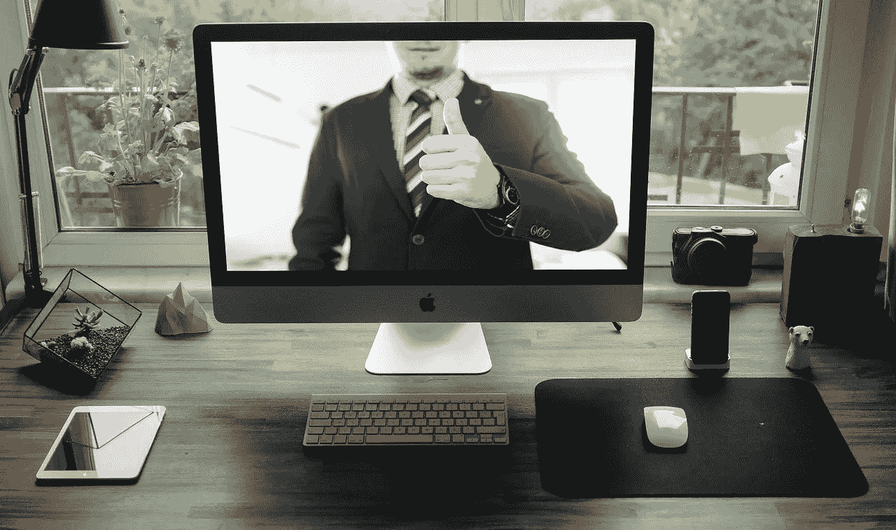

# 疫情回归正常的陷阱

> 原文：<https://medium.datadriveninvestor.com/the-trap-of-getting-back-to-normal-in-the-pandemic-b350713448cf?source=collection_archive---------12----------------------->

随着绝大多数公司急于重新开业，他们陷入了“回归正常”的陷阱。他们没有意识到，由于许多州过早重新开放，我们正再次进入一个限制浪潮的时期。事实上，一些提前开放的州已经[重新实施了一些限制](https://www.politico.com/news/2020/06/26/austin-texas-mayor-steve-adler-coronavirus-341016)，这表明[正如我在疫情开始时预测的那样](https://www.linkedin.com/pulse/one-huge-mistake-everybody-makes-covid-19-coronavirus/)，我们将面临限制和关闭的浪潮，需要更加关注虚拟互动。

我们需要认识到，新冠肺炎疫情已经打乱了公司和组织——无论大小——的运作方式。组织必须找到一种方法让[在这种新的不正常](https://disasteravoidanceexperts.com/adapt)中生存和发展，所以领导团队定期进行现实检查是很重要的。要做到这一点，我们需要理解现在发生的事情和疫情开始时发生的事情之间的相似之处。

以 Tim 为例，他是德克萨斯州一家 90 人初创科技公司的首席财务官，该公司提供人力资源和薪资软件，以及其他商业后台软件。不幸的是，该公司的领导团队，包括蒂姆，相信了埃隆·马斯克在三月份淡化冠状病毒的声明。

由于高管层认为疫情没什么大不了的，很快就会过去，他们没有采取必要的预防措施和准备，结果在停工发生时处境不妙。他们不得不求助于非常基本的业务连续性计划，该计划没有考虑像疫情这样大规模的问题。他们认为事情很快就会“正常化”，因此推迟做出重大决策，例如将所有运营转移到虚拟环境中。

 [## 机器人——商业视角|数据驱动的投资者

### 一个晴朗的日子，你和你的小孩在公园散步，突然你注意到一个身体…

www.datadriveninvestor.com](https://www.datadriveninvestor.com/2020/08/19/robotics-a-business-perspective/) 

在通过我最近举办的关于组织如何适应疫情带来的变化的网上研讨会了解到我的工作后，Tim 决定联系我进行咨询。当他打电话给我时，他的公司已经陷入了内部团队冲突和服务中断，导致许多客户的软件出现问题，一些主要客户甚至威胁要取消。很明显，该公司需要帮助摆脱困境——而且要快。

# 认识并面对这种新的异常

当我在 Zoom 上与蒂姆、该公司的首席执行官和首席运营官会面时——此时我已经将之前面对面和虚拟的混合咨询转移到了所有虚拟的咨询——我告诉他们，为了让他们的公司在新的新冠肺炎现实中生存下去，他们需要了解一些基本要点。

首先，如果我们不面对事实，我们将一事无成。我们需要承认，新冠肺炎从根本上扰乱了我们的世界，在 2020 年 2 月和 3 月的短短几周内就将其颠倒过来。遗憾的是，它不会消失；相信它会让我们深陷这场混乱，使美国成为世界上死亡人数最多的国家之一。

然而，你可能想知道，为什么埃隆·马斯克——[甚至一些政治领袖](https://www.businessinsider.com/times-world-leaders-downplayed-the-coronavirus-threat-2020-4#brazils-president-jair-bolsonaro-has-repeatedly-downplayed-the-coronavirus-by-calling-it-a-measly-cold-and-questioning-the-merits-of-social-distancing-measures-that-scientists-have-found-successfully-limit-the-spread-of-the-virus-8)——淡化新冠肺炎·疫情？这并不是说这样做对这些领导人有个人好处。当他们被证明是错误的时候，他们彻底地被羞辱了，这伤害了他们的信誉。

原因源于三个因素的结合:病毒本身的性质、政治和商业领袖先前存在的信念和计划，以及我们都倾向于犯的危险判断错误，认知神经科学家和行为经济学家称之为认知偏差。

# 认知偏差和冠状病毒

那么什么是认知偏差呢？许多专家对做出快速直觉决定的商业领袖赞不绝口:关于他们公司的方向，关于是否推出新产品，关于雇佣哪个候选人。可悲的是，跟着感觉走经常会给我们的职业和个人生活带来毁灭性的结果。

想想 Equifax 数据泄露丑闻。2017 年 5 月，黑客从消费者信用报告公司 Equifax 窃取了超过 1.48 亿人的信用信息，利用了该公司应该知道需要修复的安全漏洞，众议院监督委员会 2018 年 12 月的一份国会报告称，数据泄露“完全可以预防”。更糟糕的是，Equifax C-suite 决定隐瞒该事件几个月。进行掩盖的灾难性决定(后来不可避免地被发现)严重损害了 Equifax 的声誉，导致该公司股票持续大幅下跌，并导致首席执行官和其他一些高管因无能而被迫离职。

如何看待[波音公司领导层不顾公司内部众所周知的一系列安全问题，仓促生产 737 Max 飞机的灾难性决策？事实上，一名波音飞行员在 2016 年给一名同事的消息中说，“这架飞机是由小丑设计的，而小丑又受到猴子的监督。”波音公司的领导层没有被公司内部的这种担忧所吓倒，继续生产，在审批过程中偷工减料。故事以两起致命的坠机事件结束，造成 346 人死亡，737 Max 停飞，波音公司在疫情之前损失了超过 250 亿美元的市值，波音董事会解雇了首席执行官。](https://www.reuters.com/article/us-boeing-737max/u-s-faa-chief-to-testify-at-senate-hearing-on-boeing-737-max-idUSKBN2392YZ)

别搞错了:上述每个案例都是公司高层领导凭直觉做出的损害股东利益的决策的例证。这些杰出公司高层领导的例子并不是一个孤立的例子:LeadershipIQ.com 在[进行的一项为期四年的研究采访了 1087 名董事会成员，他们来自 286 个迫使首席执行官下台的各种组织。研究发现，超过 20%的首席执行官因否认现实而被解雇，这意味着他们拒绝承认有关公司业绩的负面事实。其他研究表明，各个层次的专业人士都有否认商业环境中令人不快的事实的倾向。可悲的是，只是跟着感觉走经常会给我们的决策和领导计划带来毁灭性的结果。](https://www.leadershipiq.com/blogs/leadershipiq/35353153-why-the-ceo-gets-fired-change-management-and-more)

粗略来说，我们有两个思维体系。因对行为经济学的研究而获得诺贝尔奖的丹尼尔·卡内曼称之为系统 1 和系统 2。我更喜欢自动驾驶系统和故意系统这两个术语，我相信这两个术语更清楚地描述了这些系统。

自动驾驶系统对应于我们的情绪和直觉，其认知过程以杏仁核为中心，杏仁核是我们大脑中较老的部分。这个系统指导我们的日常习惯，帮助我们做出快速决策，并通过冻结、战斗或逃跑压力反应对危险的生死状况做出即时反应。虽然直觉和情绪产生的快速判断通常感觉“真实”,因为它们快速而有力，但它们有时会以系统和可预测的方式将我们引向错误。

意向系统反映了我们的理性思维，并以前额皮质为中心，前额皮质是大脑中最近进化的部分。这种思维系统帮助我们处理更复杂的心理活动，如管理个人和群体关系、逻辑推理、概率思维以及学习新的信息和思维及行为模式。

虽然自动系统不需要有意识的努力就能发挥作用，但有意系统需要

刻意努力打开，精神上很累。幸运的是，通过足够的动机和适当的训练，我们可以学会使用有意系统来解决我们容易犯系统性和可预测性错误的情况。

科学家称这些为[精神盲点](https://disasteravoidanceexperts.com/products/never-go-with-your-gut-how-pioneering-leaders-make-the-best-decisions-and-avoid-business-disasters/)认知偏差。其中一个是常态偏差，这导致 Tim 和他的领导团队的同事们在这次疫情中错误地做出了决定。

# 处理常态偏差

[常态偏差](https://www.jstage.jst.go.jp/article/jjesp/48/2/48_2_137/_article/-char/en)指的是这样一个事实，即我们的自动驾驶系统让我们觉得未来，至少在未来几年的中短期内，会以与过去大致相同的方式运行:正常。因此，我们往往会大大低估灾难袭击我们的可能性和影响。

这种偏见导致个人、企业和政府无法为灾难的可能性和影响做好应有的准备，特别是像流行病这样缓慢移动的火车事故。

有鉴于此，对付新冠肺炎的唯一方法就是找到疫苗。开发一种疫苗通常需要 10 年或更长时间，因为审批过程需要大量的财务成本和安全法规。幸运的是，政府、市场和慈善力量已经联合起来，将大量资金用于开发疫苗，并将审批程序标准降至确保安全性和有效性所需的最低限度。

尽管有一百多个组织发起了开发疫苗的项目，有几个已经

创造了一个可行的原型，这种疫苗将需要几个月的时间进行人体试验。首先，我们将进行为期几个月的试验，以评估疫苗是否有不可接受的副作用(在常规、非紧急情况下，这一阶段通常为 1-2 年)。然后，我们需要持续几个月的更多试验来测试疫苗是否真的有效(通常是 2-4 年)。然后，政府机构必须审查试验数据以确认有效性，这又需要几个月的时间(通常是 2-4 年)。最后，我们需要看看正在开发并通过试验的众多疫苗中，哪一种能提供最大效力和最小副作用的最佳组合。

根据顶级疫苗专家的说法，这是这个过程中不可操之过急的一步

通过砸钱或专业知识来解决。如果我们要把一些东西注入全世界数十亿人的臂弯，我们需要把它做好。

现在，如果一种疫苗显示出很大的希望，那么那些处于最高风险和最大影响的人，比如防护设备不足地区的医务工作者，可能会作为一种实验措施接种疫苗。对他们来说，风险可能是值得的；此外，他们的医疗培训将有助于确保他们能够给予真正的知情同意。但那不是大规模疫苗接种。

在理想的情况下，如果前几个疫苗中的一个成功通过了

试验证明非常有效，没有任何不可接受的副作用——这是一个很大的假设——我们可能在 2021 年夏天拥有一种被批准广泛使用的疫苗。

然后呢？嗯，我们需要大规模生产疫苗，至少为更脆弱的人群接种疫苗，最终覆盖所有人。仅仅为 1 亿易受感染的美国人生产足够的疫苗需要几个月的时间。你还有分发疫苗和给人们接种疫苗的障碍，以及处理反 vaxxer 的情绪，所以还要几个月。这让我们以高度乐观的时间表进入 2022 年初。

鉴于所有疫苗中只有很小一部分通过了试验，这是由于

不可接受的副作用或不足的有效性，我们不应该期望我们会如此幸运。更现实的是，可能要到 2023-24 年我们才能获得足够安全有效的疫苗。

如果宇宙决定向我们伸出中指，我们可能永远也找不到有效的新冠肺炎疫苗。毕竟，我们没有完全有效的流感疫苗。我们拥有的是一种弱疫苗，在降低患流感的可能性以及降低流感的严重程度方面，平均只有 40%的有效性。这是因为流感病毒变异很快。到目前为止，似乎这种新型冠状病毒幸运地没有，所以我们很可能会逃离中指的场景，但我们还不能排除它。

这些信息是从 2020 年 2 月开始的。然而，常态偏差使得它非常

我们很难想象我们的世界会如此迅速地颠倒过来。在 2020 年初，对于政治和商业领袖以及普通公民来说，甚至开始想象直到 2022 年初，我们才能——以令人难以置信的运气——期待与新冠肺炎打交道，更现实的是 2024-25 年，都是非常不舒服的。尽管最好的科学专家已经对此做出了明确的声明。

甚至从我第一次与蒂姆、公司的首席执行官和首席运营官进行电话会谈时，就可以清楚地看出，他们的领导团队已经受到了常态偏见的影响。幸运的是，最近的研究向我们展示了如何有效地应对这种危险的判断错误。

对于常态偏见，关键是要理解陷入其中的危险，并承认你这样做给自己和公司带来的痛苦。然后，您需要现实地考虑长期结果，并为解决重大中断可能性的现实场景做好计划。

然而，直到第二次咨询电话，他们才承认(实际上有点不情愿)，他们已经屈服于这个精神盲点。这种拒绝承认现实的态度与我向他们展示的事实的真实性关系不大，而是他们最初不愿意放弃自己的“直觉”。

在与他们讨论了以上几点后，他们承认是时候面对未来了。是时候让他们的公司为比他们预期的更大的破坏做好准备了。我们使用了[“保护你的未来”技术](https://disasteravoidanceexperts.com/10-steps-for-strategic-planning-to-defend-your-future/)来帮助他们为各种潜在的未来做计划。我们决定，虽然他们会希望最好的，但他们会做最坏的打算，这是解决常态偏见的明智策略。

# 适应新异常的道路

随着疫情的爆发，绝大多数公司和其他组织转向他们现有的紧急业务连续性计划，然后随着疫情的继续，简单地继续该计划。

然而，至少可以说，在疫情最少的两年里继续采取紧急措施是不明智的。在事情开始恢复正常之前，业务连续性计划意味着一周或两周，如果它是一个真正好的计划，最多一个月(我告诉你这一点是因为我曾帮助企业和非营利组织设计了许多业务连续性计划)。

不幸的是，我们不会回到疫情“正常”的原状。永远不会。

你认为，即使在最乐观的情况下，仅仅两年更严格或更宽松的关闭和社会距离的浪潮，我们的社会将永远是一样的吗？当然不是。让我们记住，我们不应该计划最乐观的情况。俗话说，抱最好的希望，做最坏的打算。所以假设 5 年而不是 2 年。

公司需要适应未来几个月，而不是未来几年。你的紧急措施也没用。你需要接受当前的现实，即将到来的限制浪潮是新的异常，而不是暂时的紧急情况。这意味着，如果你想让你的公司、非营利组织或其他组织在这些困难时期生存和发展，就要从根本上改变你的商业模式。

这将包括长期、认真地审视你的内部和外部业务模式，并仔细检查推动你的业务的因素。这还需要修改，或者在某些情况下，甚至彻底修改你的日常运作和业务连续性计划。

# 不再挣扎，而是欣欣向荣

当我最后一次在 2020 年 6 月底与蒂姆交谈时，他告诉我，他与首席执行官和首席运营官一起，决定与领导团队的其他成员分享他们的调查结果和我们在教练会议上讨论的要点。这是一次艰难的谈话，因为公司里的冲突越来越多，相互指责。

然而，在意识到鉴于形势的紧迫性，玩指责游戏没有多大意义后，高管们决定全力以赴，正面解决问题。在概述了问题和潜在的解决方案后，他们最终得到了广泛的支持，去做需要做的事情，以推动他们的公司走向复苏。

领导团队迅速解决了内部冲突，这是解决所有其他问题的必要的第一步。

他们将更多精力放在向虚拟化的长期过渡上。他们最大限度地减少了物理足迹，办公室里只有几个人负责必要的文书工作和财务。

蒂姆与首席执行官和首席运营官以及 IT 副总裁一起，确保对公司的政策和流程进行快速、有效的更改，以便运营符合向虚拟化的过渡。

在内部冲突和系统得到解决后，领导团队专注于联系那些因服务中断而威胁取消服务的客户。该公司的技术和客户服务团队——当时终于再次全面投入运营——加紧安抚不安的情绪，并提供出色的支持，从服务恢复一直到提供免费的额外大规模软件培训。由于这些努力，大部分取消都得以避免，尽管有两个较小的客户取消了。

Tim 告诉我，他和领导团队对他们所做的改变感到满意。他还向我表示，当 6 月中旬得克萨斯州的新冠肺炎病例数量开始增加时，他有多高兴，这促使重开过程暂停，最终导致 6 月下旬在 T2 再次关闭。

# 结论

在疫情的混乱时期，保持敏捷和弹性是非常重要的。请记住，即使你的公司在疫情开始时未能做出最佳决策，你仍然可以通过对抗和防范认知偏见来[引导它回到正确的道路上。](https://disasteravoidanceexperts.com/adapt/)

# 关键外卖

> 通过保护自己免受心理盲点(如常态偏见)的影响，你的公司可以在疫情的新异常中生存和发展。——>[*点击推文*](https://twitter.com/intent/tweet?url=https%3A%2F%2Fdisasteravoidanceexperts.com%2F%3Fp%3D6197&text=Your%20company%20can%20survive%20and%20thrive%20in%20the%20new%20abnormal%20of%20the%20pandemic%20by%20protecting%20yourself%20from%20mental%20blindspots%20such%20as%20the%20normalcy%20bias.&via=Dr_gleb_tsipursky&related=Dr_gleb_tsipursky)

# 需要考虑的问题(请在下面分享您的答案)

*   你的领导团队在疫情开始的时候做了错误的决定吗？你现在想把事情做好吗？
*   你在哪里可以更好地对抗常态偏见？
*   根据阅读这篇文章，你将采取哪些后续步骤？

图片来源: [Pixabay](https://pixabay.com/photos/online-meeting-virtual-skype-zoom-5059828/)

**Bio** :国际公认的思想领袖，被称为灾难规避专家，[Gleb Tsipursky](https://disasteravoidanceexperts.com/glebtsipursky/)博士的使命是通过制定最有效的决策策略来保护领导者免受被称为认知偏差的危险判断错误的影响。作为一名畅销书作家，他最著名的作品是《T4》*《永远不要跟着感觉走:先锋领导者如何做出最佳决策并避免商业灾难* (职业出版社，2019 年)、《我们之间的盲点:如何克服无意识的认知偏见并建立更好的关系 (《新先驱》，2020 年)和《韧性:适应并计划新冠肺炎冠状病毒疫情 (《变革者图书》，2020 年)他发表了 550 多篇文章，接受了 450 多个知名媒体的采访，如[*Inc .*](https://www.inc.com/entrepreneurs-organization/a-behavioral-scientist-explains-why-your-swot-analysis-is-dangerously-flawed.html)[*企业家*](https://www.entrepreneur.com/article/348115)[*CBS 新闻*](https://www.cbsnews.com/video/study-says-taking-a-small-break-from-facebook-might-be-good-for-your-mental-health/)[*时代*](http://time.com/4257876/wounded-warrior-project-scandal/)[*商业内幕*](https://www.businessinsider.com/disaster-expert-companies-should-face-coronavirus-with-pessimism-2020-3)[*政府官员*](http://www.govexec.com/excellence/promising-practices/2017/03/heres-why-your-gut-instinct-wrong-work-and-how-know-when-it-isnt/136104/)[他的专业知识来自于作为](https://disasteravoidanceexperts.com/NeverGut/)[避灾专家](http://disasteravoidanceexperts.com/)的 CEO，20 多年的[咨询](https://disasteravoidanceexperts.com/consulting/)、[辅导](https://disasteravoidanceexperts.com/coaching/)、[演讲和培训](https://disasteravoidanceexperts.com/speaking/)。这也源于[作为一名行为经济学家和认知神经科学家在学术界超过 15 年的](http://disasteravoidanceexperts.com/research)。通过 Gleb[at]DisasterAvoidanceExperts[dot]com、Twitter[@ Gleb _ tsipursky](https://twitter.com/Gleb_Tsipursky)、insta gram[@ dr _ Gleb _ tsipursky](https://www.instagram.com/dr_gleb_tsipursky/)、 [LinkedIn](https://www.linkedin.com/in/dr-gleb-tsipursky/) 联系他，注册他的免费[明智决策者课程](https://disasteravoidanceexperts.com/newsletter/)。

…

*原载于* [*避灾专家*](https://disasteravoidanceexperts.com/the-trap-of-getting-back-to-normal-in-the-pandemic/)

## 访问专家视图— [订阅 DDI 英特尔](https://datadriveninvestor.com/ddi-intel)