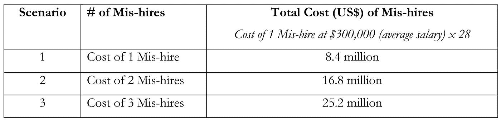
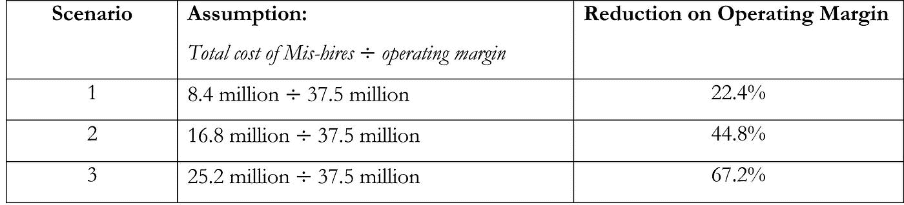

# 让错误的人做这项工作的真正代价

> 原文：<https://medium.datadriveninvestor.com/the-true-cost-of-having-the-wrong-person-in-the-job-b28de3159681?source=collection_archive---------21----------------------->

sparkChief & Co.

内部和外部招聘错误发生的频率比人们想象的要高。不幸的是，很大一部分招聘决定是招聘经理的“直觉”或快速填补空缺的强大压力的结果。当合格的候选人少之又少时，管理人员必须从不一定具备行为或硬技能(如知识或实践经验)的人才库中进行选择。有时，人力资源部门、直线经理或两者都可能发现自己被候选人的外表、与管理层的明显密切关系和面试技巧所愚弄，或者被迫考虑同事的推荐，而没有深入了解潜在的职位适合性。

许多领导者无法理解雇佣和留住那些要么不具备必要资质、行为能力和经验，要么不愿意用可接受的工作换取薪水的人的真正成本。这种成本往往被忽视，只会对组织造成长期损害，危及其未来的生存和成功。

# 短期估计

一篇关于雇佣成本的文章[1]提到了一个昂贵的雇佣错误——“错误雇佣”的成本，即无意识地回避、否认和/或容忍表现不佳或冷漠的员工。位置级别越高，这种误差的成本以指数方式增加得越快。文章中引用的 Topgrading，Inc .的创始人 Brad Smart 认为误招的潜在成本为:

*   基本工资低于 100，000 美元的员工工资的 14 倍
*   收入在 100，000 美元至 250，000 美元之间的员工的 28 倍工资

除了应对寻找新的合格员工的挑战的典型直接和间接成本(如招聘、面试、背景调查、最初几个月的生产力损失等)，雇主还需要考虑长期的机会成本——例如，不合格的服务；消极抵抗导致员工士气低落，其他员工表现不佳；错过最后期限；客户对产品质量、客户服务、因脱离和/或对公司失去信任/信心而导致的创新不足不满意；不幸的是，错过了销售机会。

# 长期财务影响

假设一个业务部门年收入为 2.5 亿美元，利润率为 15%。由 12 名全球/地区领导者领导，平均每人花费 300，000 美元，错误地为团队雇佣一名领导者的影响对业务部门来说确实是毁灭性的。两次误招会是个大问题。三会造成长期伤害。

使用此数据作为示例计算的基础，业务影响变得更加清晰。

因此，对于一个年收入为 2.5 亿美元、运营利润率为 15%的业务部门(或 250，000，000 x 15% = 37，500，000 美元)，误招的潜在财务影响可能相当于运营利润率下降 67%。

使用相同的三种情景，对公司营业利润率的假设影响如下。

考虑到在这项业务中投入的精力和资产，这一结果对组织的底线产生了巨大影响。不仅是领导团队，股东也应该非常关注对利润和增长产生不利影响的情况。股东最不希望的事情就是拿他们投资回报的百分比冒险，这是不可接受的。更重要的是，高管们最不希望看到的是，由于他们对企业的无能和低效管理，他们自己反过来在寻找新的工作。

**成本透明是关键**

换句话说，从实际数字来看，错误雇佣的财务影响是一个非常清晰、令人不安且令人信服的故事。如今，许多组织面临的一个严重问题是，实际成本缺乏透明度，或者很少或根本没有尝试寻找真实的影响。

不透明会引发大量隐性成本，表现为浪费资源、财务支出和所有利益相关方(从员工到领导团队到股东)的时间损失。不管是不是隐藏的，当我们一次又一次地继续支付这些费用时，我们所有人都要为此付出代价。

*[1]丹尼斯·科克兰(Denise Corcoran)，授权 Business.com，“招聘失误的惊人成本”(2013 年 10 月 30 日)。*