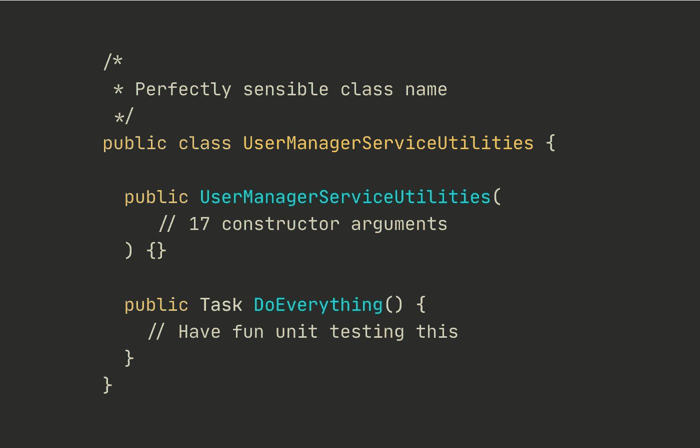

# “服务”类是什么意思？

> 原文：<https://medium.datadriveninvestor.com/the-true-meaning-of-service-and-manager-class-names-d09a08731fd9?source=collection_archive---------0----------------------->

## 更好的软件开发

## 我敢肯定，你从来没有看过一个叫做“某些服务”的类，并且马上就知道它到底是关于什么的。

说实话，我们都很困惑。

经过多年的专业开发，涉水通过大量的代码，有一点是显而易见的。开发人员不擅长给事物命名。

作为一名开发新手，我知道每当你在野外遇到`SomeService`或`WhateverManager`类——或者更好一点，`WhatevsManagerService`——时，你会感到不知所措、困惑或者直接困惑。

## 类名就像职位

含糊不清。

业务开发者？是啊，你是个销售员。社交媒体忍者？你可能参加了一个为期 3 周的课程，学习如何在 Instagram 上发布猫咪照片，并制定了一个“恶心”的策略。软件开发者？你还不如做一只代码猴。谁知道你被分配了哪些职责。

这是有区别的。职位和工作角色。我们有时(经常)喜欢让我们的头衔比我们的角色更花哨。

上课也是一样。

## 服务类别

任何带后缀`Service`的东西基本上都是逻辑垃圾站。添加到应用程序中的任何新特性最终总是在某个“服务”类中实现。

一个服务类需要大量的构造函数参数，这使得测试非常困难。不得不测试新方法`GetUserCount()`？当然，我们需要模仿 7 个完全不相关的类来实例化服务类是完全有意义的。

如果`GetUserCount()`只依赖于服务类中的一个构造函数参数，那么将它移到自己的类中。这样，您现在有了一个只有一个构造函数参数的非常简单的类。

当然，有了`GetUserCount`类就没那么酷了。但至少你知道它到底是干什么的。

测试变得轻而易举。

## 经理课程

你可能遇到了一个`UserManager`。它管理用户。不管那是什么意思。

像服务类一样，它们也是逻辑垃圾箱。但是有一点小小的不同。如果服务类是一个普通的垃圾垃圾箱，那么管理器类就像一个纸板垃圾箱。更专业化。

在处理单元测试和服务类时，你会面临同样的问题。在做最小的操作之前，你需要模仿很多次。

## 实用程序和助手类

“我们基本上不知道把这个放在哪里，所以这里有一个`WatevsUtils`类”。

这些都烦的要命。关于这个没有太多要说的了。

## 那么，你应该怎么做呢？

简单。给出与职责相匹配的适当名称。命名一个类`GetUser`并只有一个方法没有什么不好。很简单。每个人都知道它是干什么的。单元测试很容易。

停止代码膨胀并简化这些类。一个简单的方法。

**Nicklas Millard** 是一名软件开发工程师，供职于一家发展最快的银行，负责构建关键金融服务基础设施。

此前，他是 Big4 的高级技术顾问，为商业客户和政府机构开发软件。

> [新的 YouTube 频道(@Nicklas Millard)](https://www.youtube.com/channel/UCaUy83EAkVdXsZjF3xGSvMw)
> 
> *连接上* [*LinkedIn*](https://www.linkedin.com/in/nicklasmillard/)

 [## 没有 If-Else 的更好的软件

### 5 种替换 If-Else 的方法。从初级到高级的例子

medium.com](https://medium.com/swlh/5-ways-to-replace-if-else-statements-857c0ff19357)  [## 从垃圾到固体的重构

### 提高你的代码质量，简单的方法。

medium.com](https://medium.com/swlh/refactoring-from-trash-to-solid-74b10005ccd3)  [## 没有开关的工厂模式，应该这样做

### 我创建易于扩展的工厂类的方法，无需 switch 和 if-else 等逻辑语句

medium.com](https://medium.com/swlh/factory-pattern-without-switch-this-is-how-it-should-be-done-cd895e356f44) 

**访问专家视图—** [**订阅 DDI 英特尔**](https://datadriveninvestor.com/ddi-intel)