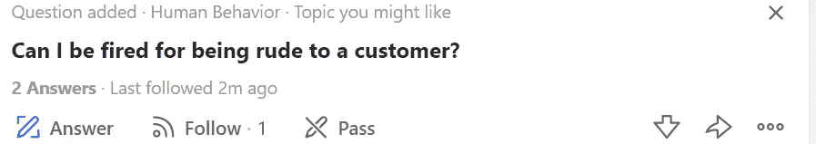

# 你生命中“最重要”的关系的真相

> 原文：<https://medium.datadriveninvestor.com/the-truth-about-the-most-important-relationship-in-your-life-c588b8a30c4e?source=collection_archive---------26----------------------->

Photo by [Priscilla Du Preez](https://unsplash.com/@priscilladupreez?utm_source=medium&utm_medium=referral) on [Unsplash](https://unsplash.com?utm_source=medium&utm_medium=referral)

如果我告诉你，对于普通人来说，他们成年生活中最大的关系是完全随意的另一方？

任何时候，你都可以结束这段关系。你没资格反击。你没有理由解释为什么不应该切断联系。再多的争吵也不能让你们保持这种关系。也不知道为什么会结束。也许你会看到它的到来，但很可能你不会。这完全不受你的控制。

如果这是一段浪漫的关系，你们中的许多人会称之为有毒或虐待。如果这是友谊，你会说他们根本不是真正的朋友。

然而，我说的是你和你的雇主的关系。

如果你猜不到这一点，那么这就是正常和可怕的。

当然，有些法律会阻止雇主直接解雇你，但是如果他们真的想让你离开，这家价值十亿美元的公司会找到办法的。也许这将是一个下岗代替。任何时候，你的雇主都可能发现你的工作不再被需要了。

 [## 良好的生活是习惯的形成|数据驱动的投资者

### 过度思考是过度紧张。仅仅几个简单的习惯就会在一天中产生巨大的影响。那是…

www.datadriveninvestor.com](https://www.datadriveninvestor.com/2020/01/17/a-good-life-is-habit-forming/) 

我们忘记了一切都可以很快被夺走。我们的薪水，我们的生活方式，也许还有你拥有的一切。

> 如果他们想让你走，你他妈的就走。

过去 20 年来，我看到一些公司切断了与每周工作 60 小时的员工的联系。是的，他们得到了一笔不错的遣散费，但是他们失去了他们所知道的一切。

当你的生活围绕着你每天朝九晚五所做的事情转，然后突然被夺走，这可能是你经历的最艰难的分手。

有些人把自己的个人身份和工作地点联系在一起。

*“我在华尔街的 XYZ 银行工作”*

*“我是 Airbnb 的软件工程师”*

2007 年，许多银行与员工断绝关系，许多银行不复存在。2020 年，最大的科技巨头之一 Airbnb 裁员近 25%。这些人是你能找到的最聪明的人，他们的身份和自我价值都被剥夺了。

你认为它不会发生在你身上，但它可能会发生，它总是会发生。

我今天在 Quora 上，有人问:

而我的回应是: ***地狱是的*** 。你也可能因为不礼貌而被解雇。如果他们想让你走，你就走。

所以，下一次你每周工作 80 个小时，为了工作而不去看孩子的足球比赛时，想想这个- *哪种关系更有可能持续下去？*

## 访问专家视图— [订阅 DDI 英特尔](https://datadriveninvestor.com/ddi-intel)