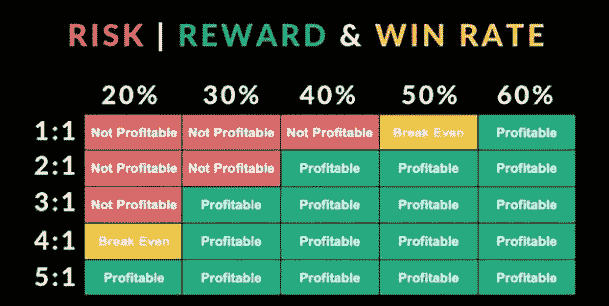

# 投资者受到两种不可避免的结果的束缚

> 原文：<https://medium.datadriveninvestor.com/the-truth-about-trading-the-stock-markets-and-how-to-overcome-it-c366b2743f54?source=collection_archive---------25----------------------->

## 和他们战斗只会让事情变得更糟。

Photo by [Joshua Rawson-Harris](https://unsplash.com/@joshrh19?utm_source=medium&utm_medium=referral) on [Unsplash](https://unsplash.com?utm_source=medium&utm_medium=referral)

你听说过试图预测市场的人最后都变穷了。

您已经了解了如何在您的帐户中存入 10 万美元。

从 100 万美元开始。

你甚至听说过一个不幸的故事，一个[小孩](https://www.forbes.com/sites/sergeiklebnikov/2020/06/17/20-year-old-robinhood-customer-dies-by-suicide-after-seeing-a-730000-negative-balance/?sh=73531b7c1638)因为一个简单的错误而结束了自己的生命。除此之外，还有那些闻所未闻的故事，人们失去他们的家园，因为他们在错误的一方交易。

> 事实是:市场是不可预测的。

任何告诉你他们能预测市场的人都是胡说八道，你应该离他们越远越好。即使是专业人士或吉姆·西蒙斯也无法预测市场。

他们所能做的和擅长的是，他们能够从过去汲取某些模式，并利用这些数据来指导他们未来的决策。

趋势在变。首席执行官会变。市场情绪会发生变化。公司来来去去。投资银行和对冲基金来来去去。流动性变稀变浓。波动性忽高忽低。然而，股市的基本面没有改变，也永远不会改变。

市场有高峰和低谷的唯一原因是因为[人类的情感](https://medium.com/datadriveninvestor/4-most-powerful-emotions-that-drive-the-stock-market-and-how-to-overcome-them-6bcf30ded602)。我们都容易受到恐惧、贪婪和急躁的伤害。除非你是连环杀手。甚至是算法，因为它们是由人类编程的。

而人性不会改变。不管未来是反乌托邦还是香格里拉，我们的情感是建立在我们内心的，是为了让我们成为人类。这意味着驱动股市的基本面不会改变。这意味着当你成为股票市场的参与者时，某些事情是有保证的。

# 你会输的

到目前为止，历史上还没有哪个投资者或交易者没有亏损过。嗯，除了那些一生只从事一种行业的人。

不管你如何避免，你都会有[亏损的交易](https://medium.com/datadriveninvestor/3-lessons-that-you-cannot-run-from-in-the-stock-markets-c6c5d0757843)。沃伦·巴菲特、杰西·利弗莫尔、保罗·都铎·琼斯、乔治·索罗斯和埃德·塞科塔都承受了相当大的损失，但他们仍然是有史以来最好的交易者之一。

事实上，世界上最好的交易者只有大约 70%的胜率。有些人甚至认为他们只有 30%的胜率，但仍然可以赚很多钱。

我们不是完美的机器人。我们是人类。这意味着我们会不时地犯错误，只有两种情况会发生。

#1 —你立即接受损失。第二，你持有仓位，希望价格会回到你的进场价格。有时，你会很幸运，股票确实回来了，但如果没有回来，你就面临股票跌至 0 美元的风险，最终你会失去一切。你有多大把握你买的股票不会跌到 0 美元？

关键是，我们都会时不时地犯错误，因为我们并不完美。这没关系，因为你越是试图避免失败，你最终就越是不得不接受失败。

## 相反，应该关注什么:

胜率其实没有任何意义。你的回报风险比才是最重要的。

如果你的策略有 5:1 的回报比，这意味着你可以连续 4 次犯傻，但最终仍然盈利。一个赢家将抹去你 5%的损失。

这样做 1000 次，你将很难仍然无利可图。

然而，这种理论是建立在绝对基础上的。这意味着你的交易要么以 1 个单位的亏损结束，要么以 5 个单位的盈利结束。

换句话说，这意味着你必须非常自律才能让交易成功。如果你在任何时候决定提前退出，不管是小亏还是小赢，都会危及你充分实现高回报风险比策略收益最大化的能力。

这可能不是每个交易者的最佳选择，因为有些人更喜欢高胜率，低风险回报比。因此，找到你觉得舒服的最佳点，并确保数据证明了这一点。

Source: [fcsapi](https://fcsapi.com/)

# 双方都会有很好的论据

让我们简化交易的核心。

当你进入一个位置，只有 3 种结果。

1.  股票对你有利。
2.  股票对你不利。
3.  股票价格保持不变。

这个市场有成千上万的参与者。在这些屏幕和算法的背后，是渴望从市场中攫取一大笔钱并把它装进自己口袋的人。

这些人中没有一个是完全一样的。他们会以不同的方式解读这条新闻。他们会使用不同的技术分析工具，做出不同的解读。有些人会考虑公司的基本面，而有些人只分析技术。排列是无穷无尽的。

鉴于这一点，再加上我们有 Twitter 这样的社交媒体，交易者可以一直在线，你会听到双方的观点。他们会尽可能地让自己的论点有说服力，因为如果有另一个交易者在同一边进行交易，这对他们有利。

## 取而代之的是:

当你第一次开始你的交易之旅时，你会被诱惑跟随你的导师的提示，因为你认为他们可能比你更有经验。你根本不应该这么做。

相反，跟踪他们的警报，看看他们为什么在某个价位买入。这会让你受益更多，因为你会从这个过程中学到更多。

但是一旦你熬过了第一年，并且学会了你在市场中需要知道的所有基础知识，是时候关掉社交媒体了。

举例来说，如果你认为某只股票将在某一天回调，但你的导师似乎看好这只股票，并建立了多头头寸。在这一点上，你会对是否坚持自己的想法感到困惑和无所适从。

如果你不给自己倾听自己的机会，你永远也不会找到最适合自己的方法。现实是，别人怎么想并不重要，除非他们能推动市场。你的想法更重要，因为直觉和学习过程将带你走向成功。

# 最后的想法

不要试图对抗或回避这些最终会以某种方式发生的事情。这样做只会让你退步，伤害你的学习曲线。

1.  你会输的。不要关注胜率，而是关注**回报风险比**。
2.  社会上有很多噪音和观点。让他们闭嘴。**反而听从自己的直觉**。

每个人都会经历这种痛苦。没什么好羞愧的。相信你自己和这个过程。迎接这些挑战，你将超越你的同龄人。

*嘿，既然你来了，为什么不加入我的* [***邮件列表***](https://marcuschan.ck.page/76504d9d12)**来看看你收件箱里偶尔出现的酷故事或者考虑一下* [***成为会员***](http://xn--74h/) *来阅读我所有的故事！☺**