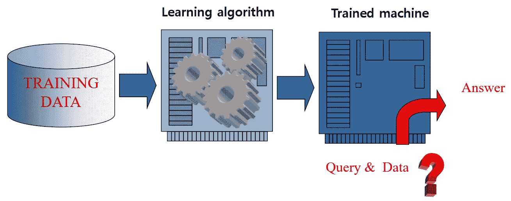
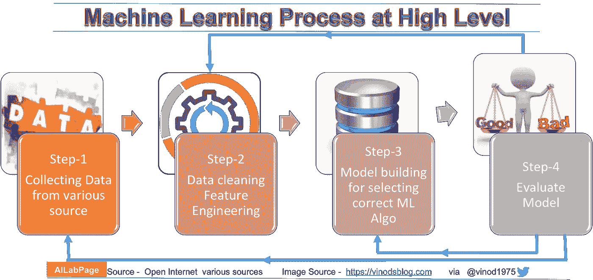
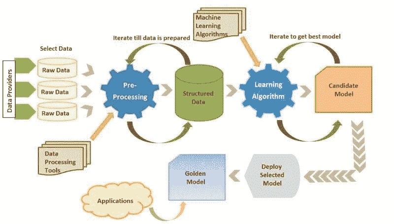
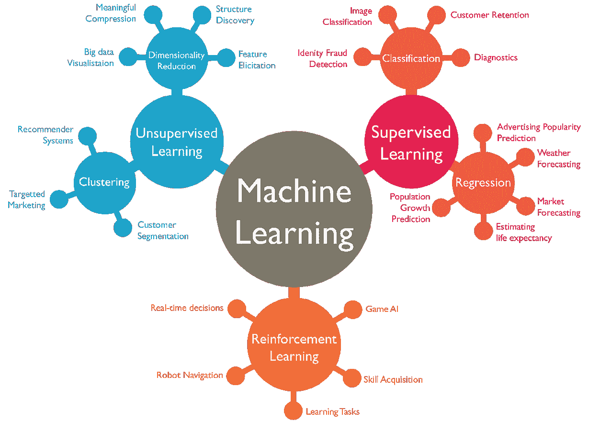
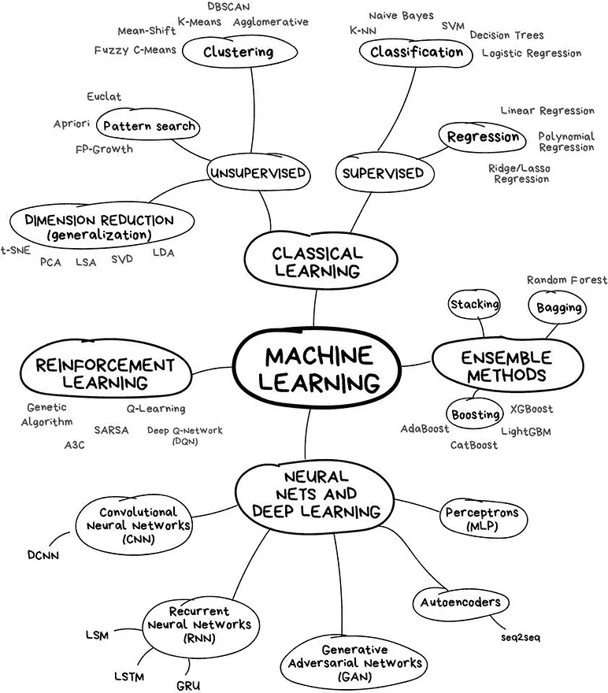
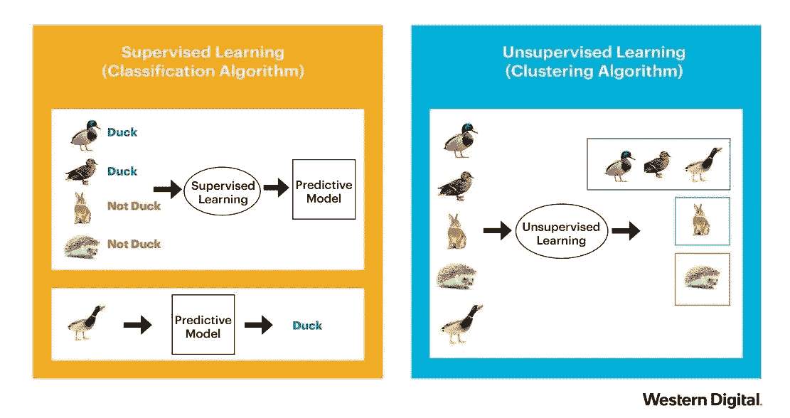
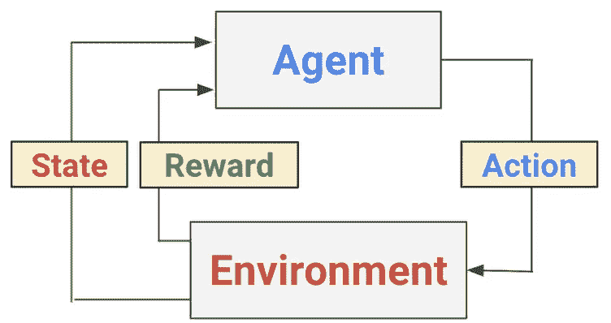
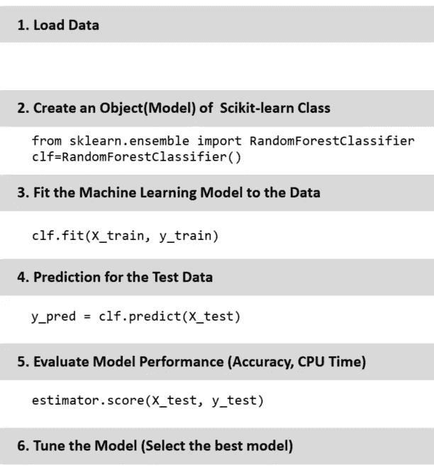

# 机器学习的类型和程序

> 原文：<https://medium.datadriveninvestor.com/the-types-and-procedure-of-machine-learning-8ba691c3ddf?source=collection_archive---------6----------------------->

他的故事是韩国仁荷大学研究生课程的一部分。我已经发布了几个教程，大家可以跟着学: [**Part-1**](https://towardsdatascience.com/machine-learning-and-data-analysis-inha-university-part-1-be288b619fb5?source=friends_link&sk=583ba29a0766ad36bc993cddc642b11f) **，**[**Part-2**](https://towardsdatascience.com/machine-learning-and-data-analysis-inha-university-part-2-3fb599732021?source=friends_link&sk=80523165c66560e46f907da4c8af0d95)**，**[**Part-3**](https://towardsdatascience.com/machine-learning-and-data-analysis-inha-university-part-3-51cb64c10901?source=friends_link&sk=a735571ab8f7bc418703fc3147eb6ecb)**，** [**Part-4**](https://towardsdatascience.com/machine-learning-and-data-analysis-inha-university-part-4-67aa1aa9c95d?source=friends_link&sk=9f1a2d1a77df1e9019cfea70b9de7edb) 来获得用 Python 进行机器学习的入门思路。也可以跟着我的一些其他教程:Python 库像 [**matplotlib**](https://towardsdatascience.com/visualization-library-in-python-matplotlib-470a2e631d73) ，**[**Numpy&Python**](https://towardsdatascience.com/top-python-libraries-numpy-pandas-8299b567d955)*Python 里面的面向对象编程( [**OOP**](https://towardsdatascience.com/python-oop-corey-schafer-datacamp-be6b0b3cafc6) )应该是 [**Part-5**](https://towardsdatascience.com/python-oop-corey-schafer-datacamp-be6b0b3cafc6) 。这是很长的一段时间，我已经从仁荷大学毕业了。所以现在我会尽可能快地结束我的旅程。因此，不再拖延，让我们集中在这个标题“机器学习(ML)的程序”。***

***那么，**什么是机器学习？** 人工智能系统通过从数据中提取模式进行学习的能力被称为机器学习。
“机器学习”是一种从例子和经验中学习的想法，无需明确编程。您不必编写代码，而是向通用算法提供数据，它会根据给定的数据构建逻辑。***

******

***Steps in designing a learning system***

***ML 基本上是很少或没有人工干预的自动学习。它包括给计算机编程，让它们从可用的输入中学习。机器学习的主要目的是探索和构建可以从以前的数据中学习的算法，并对新的输入数据进行预测，正如我们在上图中可以观察到的那样。学习算法改善了获得更高准确度答案所需的经验。***

*****ML 能做什么？**
分类、聚类、归类、模式识别
时间序列预测、回归、趋势分析
异常检测、决策制定***

*****ML
的应用**网络搜索、语言处理
生物、金融、机器人
信息提取、预测
社交网络的数据挖掘
机器人***

******

***Process of Machine learning***

***通常，任何算法的机器学习过程都将遵循从各种来源收集数据、使用特征工程进行数据分析、选择正确的 ML 算法以及最终评估模型的步骤，如上图所示。***

******

***Do’s for machine learning.***

***根据上图，我们必须从多个来源收集数据，使用数据处理工具预处理数据集并生成结构化数据，然后根据数据分析应用学习算法，并在迭代过程中形成候选模型，在应用程序中部署该模型将是任何预定问题的最终目标。就像，由于冠状病毒(新冠肺炎)正在全球传播，人们倾向于通过分析可用的数据集来分析和预测未来的结果。您可以查看这篇文章[来可视化和预测新冠肺炎数据集。](https://medium.com/@armanruet/coronavirus-covid-19-data-visualization-and-prediction-in-south-korea-b897fadcdaa1)***

************

***Types of machine learning algorithms.***

***如上图所示，机器学习可以分为几种方式，但整体机器学习分为以下几类:***

******监督学习**:在监督学习中，训练数据包括期望输出，从标记数据中学习。例如垃圾邮件分类。监督学习分为两种:**回归**和**分类**。**回归**像天气预报一样估算连续值。流行的回归算法有线性回归、多项式回归、决策树等。**分类**确定一个独特的类，可以是离散值、布尔或类别，例如身份欺诈检测。流行的分类算法有支持向量机(SVM)、K 近邻(KNN)、朴素贝叶斯等。
**无监督学习**:在无监督学习中，训练数据不包括期望的输出，即我们需要发现未标记数据中的结构。例如文档聚类。流行的无监督学习类型是聚类和降维。无监督学习中最流行的算法有 K-means、PCA(主成分分析)、t-SNE 等。***

******

***Supervised (Label) and Unsupervised (No label) Learning.***

******强化学习**:强化=奖励&反馈(迭代)。一个计算机程序将与一个动态环境交互，在这个环境中它必须执行一个特定的目标(比如驾驶一辆汽车)。当程序在问题空间中导航时，它会得到奖励和惩罚方面的反馈。**学习**:利用这个反馈，训练机器做出具体的决策。机器学习暴露在一个环境中，在这个环境中，它使用试错法不断地训练自己。q 学习是最流行的强化学习算法之一。***

******

***Steps in the reinforcement learning algorithm***

***强化学习的过程通过下图描述。每个智能体将在每个状态下采取行动，并与环境互动，这将导致奖励。机器人导航和自动驾驶汽车是强化学习应用最受欢迎的例子。***

***最后，机器学习算法涉及的步骤是:***

1.  ***问题陈述(定义问题)***
2.  ***数据收集(准备数据)***
3.  ***数据处理和特征工程***
4.  ***选择模型***
5.  ***培养***
6.  ***评估算法***
7.  ***算法的利用***

***首先，我们需要描述问题的特征。需要理解问题的重要性及其具有挑战性的方面。然后我们需要收集数据。根据问题的不同，我们可能会得到一个可用的数据集，或者需要自己制作数据集。下一步应该是数据分析和特征工程。我们需要将数据可视化，以进行一些特征工程，并考虑适当的算法，以获得我们选择模型的预期结果。之后，我们需要训练我们的数据，评估我们的算法。我们可能需要调整超参数来获得满意的结果。一旦模型被开发和优化，它就可以被部署到系统中。***

*** [## DDI 编辑推荐:5 本让你从新手变成专家的机器学习书籍|数据驱动…

### 机器学习行业的蓬勃发展重新引起了人们对人工智能的兴趣

www.datadriveninvestor.com](https://www.datadriveninvestor.com/2019/03/03/editors-pick-5-machine-learning-books/) 

众所周知，scikit-learning 是最流行的机器学习算法库之一。scikit-learn 的一般程序是:

General Procedure of Scikit-learn

非常感谢您阅读这篇文章。非常感谢任何形式的批评和/或建议。我还是一个 ML 和数据科学的新手学习。如果你想合作学习和实践人工智能，那么你是最受欢迎的。详情可以访问我的个人资料。希望继续写机器学习周刊。

以前的文章:

[**Part-1**](https://towardsdatascience.com/machine-learning-and-data-analysis-inha-university-part-1-be288b619fb5?source=friends_link&sk=583ba29a0766ad36bc993cddc642b11f)**:**python 基础及安装
[**Part-2**](https://towardsdatascience.com/machine-learning-and-data-analysis-inha-university-part-2-3fb599732021?source=friends_link&sk=80523165c66560e46f907da4c8af0d95)**:**第二章:Python 数据结构—数据类型
[**Part-3**](https://towardsdatascience.com/machine-learning-and-data-analysis-inha-university-part-3-51cb64c10901?source=friends_link&sk=a735571ab8f7bc418703fc3147eb6ecb)**:**Python 中的控制语句(循环)
[**Part:4**](https://towardsdatascience.com/machine-learning-and-data-analysis-inha-university-part-4-67aa1aa9c95d?source=friends_link&sk=9f1a2d1a77df1e9019cfea70b9de7edb)**:**Python 函数【T34***