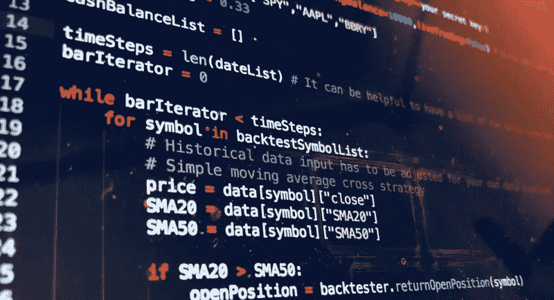
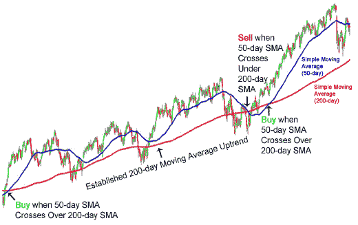

# 自动交易算法的类型

> 原文：<https://medium.datadriveninvestor.com/the-types-of-automated-trading-algorithms-228d537254a8?source=collection_archive---------0----------------------->

最近，随着数据工程和科学方法的进步，灵活的编程语言如 Python 的激增极大地增加了算法交易方法的受欢迎程度和可及性，无论是在专业金融机构还是在 T2 的零售爱好者中。

在这篇文章中，我将尝试概述和解释不同类型的算法及其用途。我将在以后的文章中更详细地研究不同的类型，并发布如何开始使用 Python 的指南，敬请关注！

# 什么是算法交易？

在我们深入讨论之前，让我们先确定算法交易的定义，因为这个术语可能有多种含义，取决于你问的是谁。

根据 [Investopedia 的定义](https://www.investopedia.com/terms/a/algorithmictrading.asp#:~:text=Algorithmic%20trading%20is%20a%20process,to%20the%20market%20over%20time.):算法交易是使用基于过程和规则的算法来运用策略执行交易。这可以是优化执行交易条件(例如，以人类不可能的速度做出反应)，也可以是基于各种量化策略启动交易(例如，配对交易)。

算法是用于解决问题或完成任务的一组指令。每个计算机化的设备都使用算法来执行其功能。

因此，这个术语是相对开放的，包括任何使用一套定义好的规则来交易工具的东西，这开始解释这个术语的一些混淆或可互换性。

现在我们已经解决了这个问题，让我们来关注不同的类型:

# **交易执行算法**

当你持有大量证券(比如价值 10 亿美元的 AMZN 股票)时，你很难找到交易的另一方愿意以市场价格甚至接近市场价格购买整批证券的买家；你卖出这么多股票的行为改变了股票的买/卖动态，导致市场大幅下跌。为了减轻这一点，在其他类似的“滑点”效应中，交易者和机构使用交易执行算法。

> *以后想看这个故事？保存在* [*日记账*](https://usejournal.com/?utm_source=medium.com&utm_medium=blog&utm_campaign=noteworthy&utm_content=eid7) *。*

基本思想是根据可用的流动性，系统地将一个大订单分割成许多小订单。

三种最常用的交易执行算法是**时间加权平均价格**(TWAP)**成交量加权平均价格** (VWAP)和**价值百分比** (PoV)。

我将在以后的文章中介绍这些类型的算法。

# **策略实现算法**

这些是大多数人在考虑算法交易时的设想和参考。

旨在处理实时(或批量)市场数据，并创建由**交易执行算法**执行的交易信号。这可能涉及当超过某些预先指定的容差水平时自动重新平衡投资组合，搜索套利机会，基于新闻情绪分析创建交易信号，以及从技术分析产生交易信号。

An example of the trading instructions produced from a strategy implementation algorithm using **Moving Average Crossovers**.

这些算法主要被散户、对冲基金、资产管理公司和自营交易者使用。

我将在下一篇文章中介绍主要的策略类型以及使用 Backtrader 和 Python 实现一种策略。

# **隐身/游戏算法**

如果你打不过他们，就加入他们！这些算法旨在利用当大量头寸被填补时引起的价格变动(通常通过**交易执行算法** ) 以及检测和超越其他算法策略。

由于它们从更大和更突出的策略的信号中获取信息的性质，这些算法在小的[大写](https://en.wikipedia.org/wiki/Financial_capital)大小时最有效。

另一种现已过时的方法是，交易员使用流动性检测算法，通过发出小订单，寻找大订单可能存在的地方，来破译匹配引擎中是否存在大订单。当一个小订单被快速完成后，后面很可能会有一个大订单。

鉴于交易执行时间的进步以及交易执行算法和暗池的进步，这些算法现在很大程度上已经过时。

# **电子做市商**

传统上，[做市商](https://en.wikipedia.org/wiki/Market_maker)会通过买卖资产在市场上提供流动性，通过买卖价差从中分一杯羹。

交易算法提供了做市商曾经扮演的角色。这已经演变成了所谓的被动回扣套利。

在大多数投资银行和零售投资平台的大量使用中(如 [plus500](https://www.plus500.co.uk/) 或 [Trading212](https://www.trading212.com/) ，这是他们如何提出他们的定价)，这些算法允许提高效率，减少延迟和利差。

# 结论

算法交易的增长意味着它现在负责全球交易所的大部分交易，并被一些最大和最成功的对冲基金使用，包括[复兴科技](https://www.rentec.com/Home.action?index=true)和[两个适马](https://www.twosigma.com/)。

虽然关于这一主题的书面材料和视频内容不断增加，但对于初学者甚至金融专业人士来说，这仍然是一个难以访问和完全理解的主题，许多人将其视为“黑箱”。

希望这个系列能帮助你开始(或温习)一个令人着迷且不断发展的话题。

📝将这个故事保存在[期刊](https://usejournal.com/?utm_source=medium.com&utm_medium=noteworthy_blog&utm_campaign=tech&utm_content=guest_post_read_later_text)中。

👩‍💻每周日早上醒来，你的收件箱里会有本周最值得关注的科技新闻。[阅读科技简讯](https://usejournal.com/newsletter/noteworthy-in-tech/?utm_source=medium.com&utm_medium=noteworthy_blog&utm_campaign=tech&utm_content=guest_post_text)中值得注意的内容。