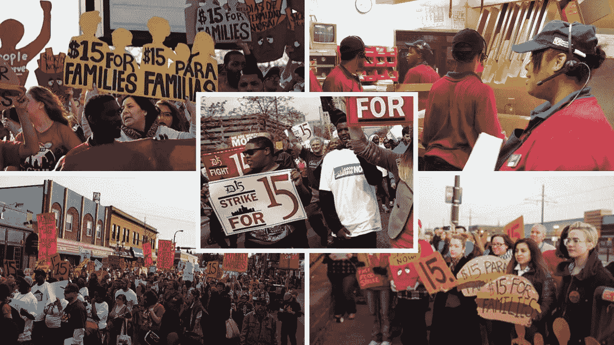

# 15 美元最低工资的暴政。

> 原文：<https://medium.datadriveninvestor.com/the-tyranny-of-the-15-dollar-minimum-wage-aba643b5d835?source=collection_archive---------13----------------------->

## 政府不能通过人为提高最低工资来推动经济增长。

这是进步人士“戴上帽子”的咒语之一。他们声称，我们需要将最低工资提高到一个能够“提升所有船只”的水平，一个能够让所有人摆脱贫困的水平。

因此，他们提议将最低工资水平提高一个很高的水平——美国目前的目标是每小时 15 美元，而在韩国，现任总统希望将最低工资提高到每小时 10，000 韩元(按今天的汇率计算，略高于 8.5 美元)。论点是每个人都将受益——低工资工人将能够赚更多的钱，这将“渗透”到经济中，导致经济增长。

这是一个受欢迎的政治竞选平台。它赢得了很多选票，尤其是来自那些低收入者的选票，他们在当今世界经济中占年轻工人的大多数。就韩国总统文在寅而言，它甚至帮助他登上了总统宝座。

只有一个小问题——由提高最低工资推动的显著经济增长的承诺并没有实现。在美国不会，在韩国更不会。

美国不断提高最低工资的趋势已经持续了一段时间，足够经济研究人员收集数据并对高最低工资的影响进行一些初步研究。他们并不令人鼓舞。

 [## 经济就是包容人|数据驱动的投资者

### 建模，数据，最重要的是，人 Tayo Oyedeji 博士在他的食谱中混合了所有这些成分，为一个…

www.datadriveninvestor.com](https://www.datadriveninvestor.com/2019/03/06/economy-is-all-about-including-people/) 

加州大学洛杉矶分校的一个小组研究了对餐饮业(最低工资雇主的最大群体之一)的影响，发现在三年内，最低工资从 6.75 美元增加到 10.50 美元导致该行业的就业减少了 20%。

[华盛顿大学经济学家做的另一项研究发现，由于雇主减少工作时间，13 美元的最低工资导致低收入者每月净损失 125 美元。](https://www.google.com/url?sa=t&rct=j&q=&esrc=s&source=web&cd=2&cad=rja&uact=8&ved=2ahUKEwim6NTNvIfnAhW8JaYKHRfzD7MQFjABegQIBhAB&url=http%3A%2F%2Fwww.nber.org%2Fpapers%2Fw23532&usg=AOvVaw2KrRYApct4AUTs0V3DVAhi)

“宜居”最低工资的支持者在整个辩论中忽略了一个重要的现实；企业不盈利就无法继续经营。如果你是一家拥有大量客户的大企业，你可以支付更高的工资，因为你的业务量几乎可以确保你仍然可以盈利。然而，同样的经济概念不适用于小型甚至中型企业，尤其是餐饮业。

许多年前，我是一家全国连锁快餐店的助理经理。作为助理经理，我最大的工作之一是做餐馆的非正式会计；我维护这些书。想象一下，当我看到餐馆里最大的一笔开销不是食物的成本，而是劳动力的成本时，我幼小的心灵有多么惊讶。我也很惊讶地看到扣除食品、劳动力和公用事业费用后的利润率有多低。如果我们一个月的营业利润超过 5 %,那我们就非常幸运了——我们通常赚得更少，尤其是在淡季。

这是几年前的事了，当时最低工资确实难以维持生活。1973 年，我在快餐业的最后一年，最低工资是每小时 3 美元。即使在那时，餐馆也几乎没有盈利。

大约 46 年后，美国的通货膨胀率增加了 450 %,然而最低工资增加到 15 美元意味着最低工资超过了通货膨胀率。这意味着服务业的利润率变得更低了。对于一家没有那么多生意的餐馆，老板们只有两种选择；1)关闭业务，因为运营不再有利可图，或者 2)以某种方式降低成本——这意味着要么在食品数量或质量上偷工减料，要么减少员工的工作时间。

但有一件事政客们一直忽视:资本主义国家没有法律强迫任何人继续做生意。

任何企业的主要目的都不是让人们有工作。在资本主义社会，任何企业的主要目的都是为其所有者提供利润。大公司必须盈利才能给股东带来价值；小企业的存在是为了给他们的所有者提供足够的利润，让他们通过投资过上舒适的生活。所有者自己经营许多小企业，代理经理或管理团队经营其他企业。无论是哪种情况，所有者都期望他们的投资有合理的回报。

如果经营一个特定的小企业的成本变得太高，所有者不再能获得合理的利润，他们中的大多数人会做最合乎逻辑的事情:关闭商店，把钱投资到其他地方。企业主做出理性的决策；如果他们可以通过投资低风险债券或 CDs 获得更高的投资回报率，他们为什么要投资大量“血汗资产”来经营一家不盈利的企业呢？

他们不会的。

这里还有一个要考虑的因素。如果工资上涨，企业主首先要做的就是将成本转嫁给消费者。就餐馆而言，外出就餐的价格上涨了。在某些时候，外出就餐的成本超过了获得的任何情感价值，人们选择在家吃饭。餐馆亏损，无力维持同等水平的人员配备。结果，那些本应受益于合理工资的人最终却受到了最大的伤害。

韩国年轻人失业率的上升证实了这一观点。韩国总统文在寅上任时承诺，他提高最低工资将让更多的钱进入年轻人的口袋，从而增加经济中的消费者支出。这个想法是，这些年轻人更多的消费支出将推动一轮经济增长。

那从未发生过。

在文在寅执政的这些年里，随着全国最低工资水平的攀升，年轻人失业率飙升。截至 2019 年 12 月，青年失业率从 2017 年的 7%攀升至 10%以上。许多支持登月的经济学家认为结构性问题在起作用。尽管如此，其他经济学家指出，最低工资上涨到不可持续的水平是青年失业率上升的主要原因之一，尽管政府多次试图为年轻人创造就业机会。

这些事实反驳了进步政府政客想要我们相信的东西；政府可以通过创造就业来创造繁荣的神话。现实呢？政府不创造就业机会。我重复一遍。政府不创造就业机会。

只有私营行业创造就业机会。

政府只是制造了创造就业的假象。我问:创造这些政府职位的资金从哪里来？

它来自纳税人。政府创造就业仅仅是财富的转移，而不是财富的创造。

唯一真正的财富创造是在私营部门创造出有益于社会一个或多个阶层的产品或服务时产生的。作为出售这些产品或服务的回报，私营部门行业获得收入。如果收入高于生产产品或服务所用的劳动力、机器和原材料的成本，这些公司就能获得利润，而利润可以用来扩大公司规模。如果有足够多的公司这样做，经济就会增长，这就是创造就业的方式。除了在这种情况下，市场力量决定工资，而不是政府。

高而不可持续的最低工资的另一个问题是，它没有为员工提供改善自我的激励。当我拿着最低工资在几家餐馆工作时，我对我的收入不满意。低收入促使我想办法接受培训和教育，以找到一份收入更高的工作。如果我每小时挣 10 美元(而不是现在的 3 美元)，我不确定我是否会有动力为自己做得更好。

鉴于不可持续的高最低工资的所有现实，我很难支持给低技能、低收入工人每小时 15 美元，只是为了让他们有更好的生活水平。他们的工作很辛苦，工作条件也很糟糕。我明白了。但是，解决他们困境的办法不是给他们提供更高的工资，让他们继续从事低技能的工作。

与其武断地将最低工资提高到小企业无法承受的人为水平，我认为解决方案在于为人们离开这些低技能岗位提供激励。这可能包括激励他们进入当地社区大学或当地职业学校，在那里他们可以提高自己的技能水平以获得高薪工作。这是一个历史悠久的现实，为人们提供了摆脱贫困的途径。

高中毕业后，在接下来的四年里，我不停地从一份低薪工作跳槽到另一份工作。22 岁时，我离开了最低工资跑步机，因为我对生活在贫困线以下，拿着蹩脚的最低工资，没有技能的工作深感不满。我的动力是找到一种方法来学习一门手艺并获得大学教育。然后，我成为了一名空军军官，获得了几项信息技术认证，获得了几个研究生学位，并在 IT 行业的每个阶段度过了 26 年——这是我在空军时从未想过的事情。

所有这些积极的事情发生是因为我不愿意接受贫困线以下的最低工资。但是我想知道？如果我的最低工资很高——比如说 1973 年相当于今天的每小时 15 美元，我会不会不开心到改变自己的生活？老实说。大概不会。

这是一个悖论。我们确实需要建立一个最低工资标准，让人们在一定程度上有尊严地生存。但我们不能让它上升到对小企业产生负面影响，伤害它旨在保护的工人的地步。我还认为，人为设定的过高最低工资，对劳动力提高技能和获得更好职位的激励很小。

我的结论？政治领导人和立法者需要“放弃”这些不可持续的高最低工资水平。它们会适得其反，并不能提供支持者所宣称的好处。我们必须确保人们获得足够高的工资来养家糊口，但与此同时，由于我们错误的立法，我们无法承受在城外经营小企业的代价。我们需要确保我们的工资结构鼓励经济增长，而不是抑制经济增长。15 美元的最低工资达不到这个目标。