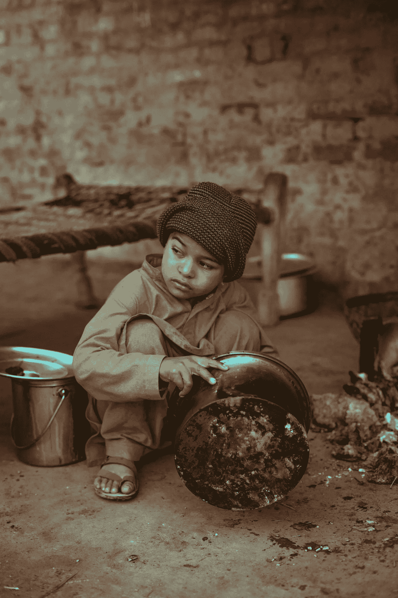

# 疫情揭露的资本主义丑陋真相

> 原文：<https://medium.datadriveninvestor.com/the-ugly-truth-about-capitalism-that-the-pandemic-reveals-f5d005e172e3?source=collection_archive---------4----------------------->

## 我们需要更少的我们所拥有的，更多的我们所需要的

Photo by [Muhammad Muzamil](https://unsplash.com/@gr8muzamil?utm_source=unsplash&utm_medium=referral&utm_content=creditCopyText) on [Unsplash](https://unsplash.com/s/photos/rich-poor-divide?utm_source=unsplash&utm_medium=referral&utm_content=creditCopyText)

简单地说，资本主义就是将利润再投资到企业中，以进一步扩张。

但它远不止于此——它代表了这种永无止境的发展热情，代表了取得成功和比昨天做得更好的热情。我们在不断的竞争中超越自己，如果不是别人的话。为了获得更高的分数，更高的利润，更大的房子，甚至更大的车。在没有任人唯亲、游说和权力斗争之前，这没什么不对。

> “在 2009 年，世界上最富有的 380 个人的财富总和相当于底层一半人的财富。2018 年，只有 26 名亿万富翁拥有底层 50%的财富。”

在这场激烈的竞争中，我们很少问自己——我们想走多远？我们还想赚多少钱？什么时候才算真正够了？如果你今天拥有一辆本田，你下一步想拥有一辆宝马，下一步想拥有一辆劳斯莱斯。

我知道这是老生常谈，但也是令人不安的事实。

> 人类的需求永无止境，或者说人类的贪婪永无止境。

人类的头脑被配置成**担忧**。当你获得晋升时，你欣喜若狂，因为你为此付出了努力，你沉浸在这份荣耀中，并为此庆祝几天。但是随着你适应新的角色，这种情绪会慢慢消失，你的思想会逐渐开始为下一个职位做准备。

我们大多数人不都是这样吗？我们愿意称自己为**进步的、有远见的**和**自由主义者。**

 [## 如果资本主义失败了，那么还有什么选择呢？数据驱动的投资者

### 在当前政治领域的修辞之旅中，我们都可以面对面地接触到流行词汇，如…

www.datadriveninvestor.com](https://www.datadriveninvestor.com/2020/03/16/if-capitalism-is-a-failure-then-what-is-the-alternative/) 

# 是吗？

也许作为个人，我们是这样，但作为一个社会和一个种族，我们还远远没有达到平衡。我们比我们的祖父母承受了更多的压力。

*   我们可能比我们的父母一生中挣得多得多，但是在平衡我们的个人生活和职业生活方面，我们做得很差。最糟糕的是，尽管我们承认这一点，但我们并没有采取什么措施来改变这一进程。
*   我们可能拥有最好的医疗保健系统、疫苗和治疗手段，但我们也有有史以来发病率最高的糖尿病、心血管疾病、抑郁症。到底该怪谁呢？
*   我们可能有最好的网速和一百多种不同的社交媒体，但我们渴望友谊和更深刻的生活意义。
*   我们可能拥有迄今为止最先进的自动化技术，但我们比以往任何时候都更加忙碌——我永远无法理解这个难题。
*   我们可能拥有最好的基础设施，但你可能会问代价是什么——污染的天空、不干净的河流、不断减少的森林覆盖和日益灭绝的动物物种。

# 无止境选择的难题，低满意度

你知道吗，2015 年东京有超过 [148，582](http://www.worldcitiescultureforum.com/data/number-of-restaurants) 家餐厅。如果你决定每天出去吃两次，你需要 204 年才能完全探索东京。我猜很多这种探索可能需要在天堂或地狱*(对我们中的一些人来说，也许是这样)。*

今天，这种选择在地球上的实物商品上呈指数级增长——你会发现这些商品的众多选择很容易获得，或者更容易获得，只需点击一个按钮。

今天，商品和服务只是交易的一部分。随着我们的世界变得比以往任何时候都更加虚拟，我们这个时代最大的商品就是信息。毫无疑问，当今世界市值排名前五的公司都是科技公司。

我们拥有的内容比我们一生所能消费的还要多。让你了解一下每天上传内容的海量——每分钟有超过 300 个小时的视频上传到 YouTube，一天大约有 432000 个小时。因此，即使是 ***如果你一整天都不停地看，你也需要 49 年才能完成上传到 YouTube****(2020 年 4 月的一个晴天)*

这只是一个平台，现在想象一下其他平台的类似数据上传。毫无疑问，我们不断受到信息的轰炸，从电子邮件通知到弹出窗口到新闻频道，所有这些都提供了比历史上任何时候都多得多的内容。

有一天，当我开车穿过空荡荡的街道时(由于封锁)，我丈夫和我进行了一次有趣的谈话。他问我，

> "经济活动的减少会对我们的生活方式产生什么影响？"

假设没有失业，政府支出没有增加，公共活动没有限制，那么字面上假设所有其他变量不变，如果我们要评估较少的选择和减少的经济活动对我们的生活方式和生活选择的影响，会是什么？

例如，我们有 50 家餐馆可供选择，而不是 500 家；我们有四种麦片，而不是 40 或 10 份一流的报纸，而不是 100 份平庸的宣传报纸？

## 冒着把事情过分简化的风险，以下是我的观点。

如果我们放慢了脚步，我们的工作时间会更短，产出会更低，选择会更少，收入会更低，经济增长率也会更低。但我们也会有更多的时间和家人在一起，有更多的时间去锻炼，去追求工作之外的激情，比以往任何时候都更少的决定去让生活更加满足、稳定和安全。

## 等等，我们不是去过一次吗(不久前)？

不信问你爸妈或者爷爷奶奶。他们偶尔在外面吃东西；他们比我们更瘦，但更强壮，生活方式也更健康。

生活的确很简单。

## 但信贷让资本主义得以繁荣。

如果我们回到过去，当这一切，事实上，成为现实时，理解我们是如何走到这一步的就不会让我们惊讶了。

不久前，甚至在几十年前的近代历史中，我们也处于这种境地——第一家发行纸币的银行只是在 17 世纪晚期。大约 200 年前。甚至信贷的概念也相对较新。在那之前，君主政体不理解再投资、利润分享和增长的概念。只要能满足群众的基本需求，他们就心满意足了。

但是在疫情的情况下会发生什么呢？那么谁会投资研究冠状病毒疫苗呢？

没有信贷，我们将无法投资任何研究实验室或突破性发明。如果没有信贷，穷人将永远无法建造自己的房子，直到她攒够了钱。没有增长和选择，商品的质量也会受到影响。

也许资本主义毕竟不是我们故事中邪恶的恶棍。

是我们无脑的自私欲望主导了这个世界。

# 我们什么时候才会满足？

我们什么时候说过我们结束了，或者我们已经受够了。

当东京拥有 20 万家餐馆时，它会感到满意吗？或者当我们在 YouTube 上每分钟上传 500 小时的内容时，我们会感到满意吗？

假设我们已经完成了这个阶段，这两个行业的进入壁垒使得任何新的参与者都很难进入，那么会发生什么？

创新可能会消亡，自由市场的原则会消亡，社会经济秩序会被打乱。

## 那么，我们是不是在说，资本主义对于保持系统运转至关重要？

是的，资本主义对于向前发展、创造就业机会、促进研究和发展以及总体而言促进人类繁荣至关重要。

然而，我们可以改变的是我们成长的速度——我们可能很快就会耗尽精力(无论是字面上还是比喻上)。)

# 这里列出了一些关于我们作为一个人类集体能够和应该做些什么的想法

1.  停止奔跑，停止超越彼此。合作，有效和优化地利用时间，让这个世界变得更美好。
2.  我们需要花更多的时间和精力来缩小贫富差距。我们需要向富人征收比现在更多的税来重新分配收入。
3.  企业应该专注于为所有人创造价值，而不仅仅是股东。他们应该有更多的社会目标，而不仅仅是经济目标。
4.  我们需要更强有力的政府法规和行业协会/机构来监管已经饱和的行业，即服务部门，并促进绿色技术、创新和教育。
5.  我们应该使获得必要的基础设施成为这个星球上每个人的权利。从本质上说，清洁的水、纯净的空气、附近的公园和花园、适当的道路和人行道应该是穷人中最穷的人可以使用的。
6.  作为一个社会，我们应该有更多的监管锁定期来缓解压力——就像排毒一样，但更系统化一点，以产生更重大的社会和生态影响。
7.  我们还应该想办法从一些非必要行业中剔除脂肪，让事情变得更简单、更精简。

## 如果我有创造性的自由来进一步延伸这一点——我们需要一个新的世界秩序。

我们需要提升我们的宪法、法律、政策和课程。

我们不仅仅需要更新的法律；我们需要围绕更具侵入性的技术带来的潜在未来问题制定新的立法(想想当富人比穷人更容易获得 CRISPR 时会发生什么)。我们需要使伦理学和道德科学成为主流学科。或者，我们需要赋予一个人成年后选择宗教的权利。或者想一个能给这个星球带来和平的宗教的替代品。

我们离这个新的世界秩序还很远，但我们需要从某个地方开始。让我们从寻找资本主义心态的替代品开始。疫情已经给当今世界的大多数经济体踩了刹车。这给了我们重新思考和重新开始的时间。