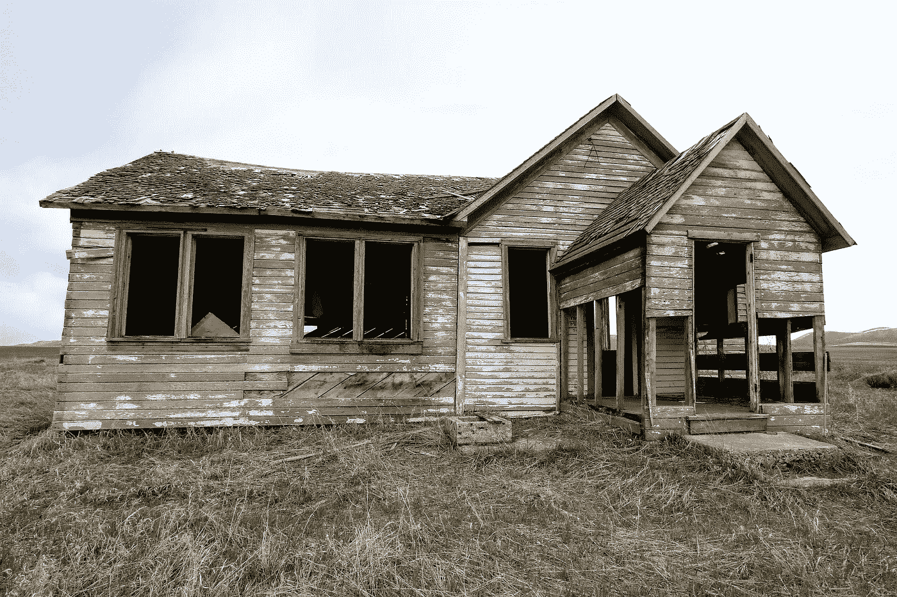
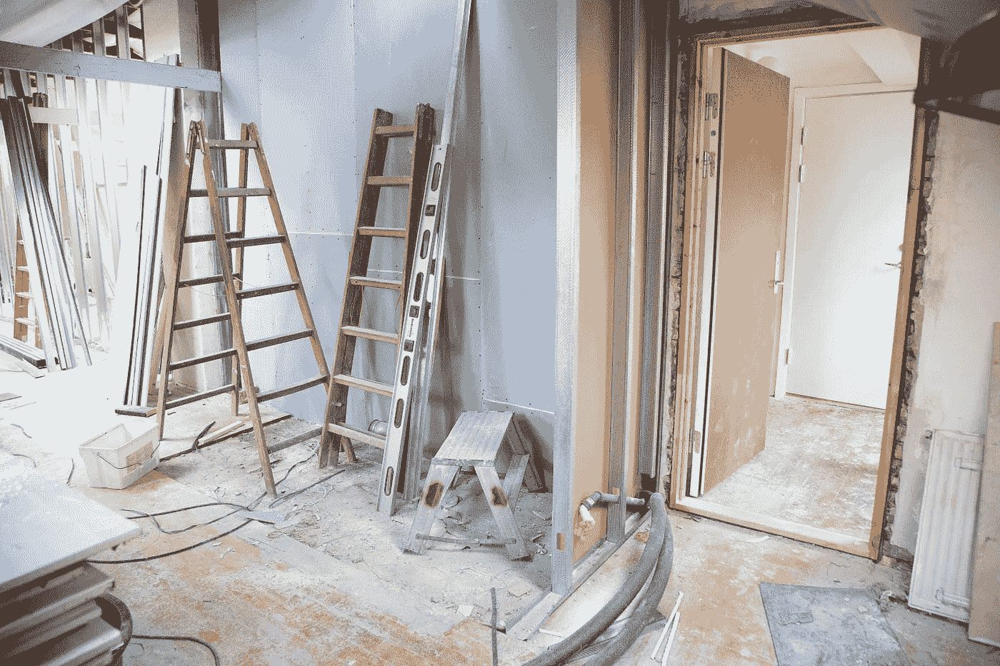
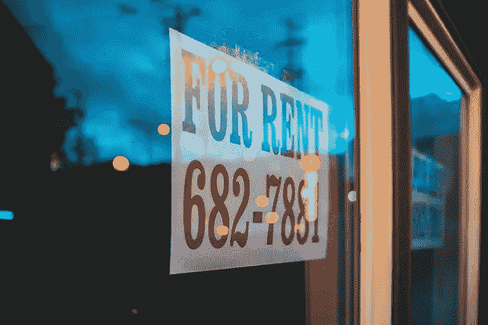
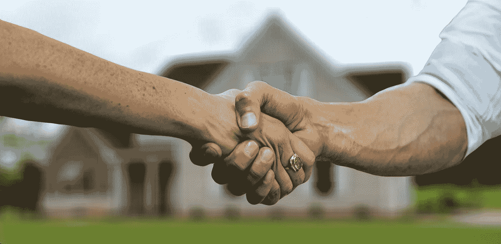

# 房地产投资的丑陋真相

> 原文：<https://medium.datadriveninvestor.com/the-ugly-truth-about-real-estate-investing-4541d17d5141?source=collection_archive---------2----------------------->

## 4 常见问题及处理方法

Image by [Trenna Sonnenschein](https://pixabay.com/users/4064462-4064462/?utm_source=link-attribution&utm_medium=referral&utm_campaign=image&utm_content=2096649) from [Pixabay](https://pixabay.com/?utm_source=link-attribution&utm_medium=referral&utm_campaign=image&utm_content=2096649)

房地产是积累财富的好方法。在过去的十年里，我一直是一名房地产投资者，并利用它以高回报率增加我的净值，并从我的租户那里获得每月的现金流。

很容易想象这条致富之路是由黄金铺成的。然而， ***现实是，通往财富的道路大多是由艰苦的工作和需要你的坚韧和聪明才智去克服的问题铺成的。***

投资房地产不是“快速致富计划”。积累足够的股本和现金流来享受你的劳动成果可能需要数年时间。在此期间，你将努力寻找、购买和管理你的财产。可以预料，问题会出现。

投资房地产时，有些事情可能会出错。 ***在建立和管理我的七个出租房组合时，我看到了许多:*** 大修、租户问题、空房和负现金流是最常见的需要解决的问题。

如果你没有承诺，当事情变得艰难时，很容易放弃。然而，通过长期投资和看透事物，我已经实现了财务安全的目标，并在财务自由方面取得了良好的进展。

> 你处理问题的方式会决定你为自己和家人创造财富的努力成败。

## 大修

屋顶需要更换，地基需要移动，空调坏了——如果你拥有房产，不管有多长时间，你都会经历大修，需要你的精力和金钱去修理。我的房产在我拥有期间需要新的热水器、新的空调设备、管道维修、新地毯、新油漆、新门等等。

你可以做几件事来避免和/或准备这些主要开支:

*   **购买前一定要检查房产** —一个好的检查员会在尽职调查期间发现问题，让你做出明智的决定；他们可能会发现地基有问题，或者发现一些隐藏的水渍/霉菌。你可以利用这些信息来协商降价，以帮助支付维修费用，或者在损失可能造成经济损失的情况下完全离开房产
*   **不要在预防性维护上吝啬** —在管理物业时，尽可能降低成本是正常的，但随着时间的推移，你会发现，从长远来看，通过支付预防性维护费用，你可以为自己节省一些钱；在德克萨斯州的夏天，空调总是出故障，所以我确保每年在天气变得太热之前做一次检查，这有助于延长空调的寿命
*   拥有一笔储备基金 —当你拥有财产时，你就拥有了一家企业；重要的是，你要有一笔储备基金来帮助支付任何不可预见的维修费用，否则你会发现自己陷入现金短缺，这可能会迫使你做出糟糕的财务决策

Photo by [Rene Asmussen](https://www.pexels.com/@reneasmussen?utm_content=attributionCopyText&utm_medium=referral&utm_source=pexels) from [Pexels](https://www.pexels.com/photo/house-renovation-3990359/?utm_content=attributionCopyText&utm_medium=referral&utm_source=pexels)

## **租客问题**

人几乎总是既是解决方案又是问题。 ***你的租客就是你的客户，你的企业就是为他们服务的。如此对待他们并牢记在心是很重要的。***

绝大多数的房客都会是好顾客，他们会支付租金并照看你的财产。然而，一些租户不遵守租赁协议，让您头疼，并产生意想不到的费用。我遇到过迟交租金的租户，在有效租赁期间搬走并停止付款的租户，以及造成的损失超过保证金所能支付的租户。

以下是一些避免租户问题并在问题出现时处理它们的方法:

*   **良好的筛选流程** —任何问题的最佳解决方案都是一开始就避免；对潜在租户进行严格的筛选将有助于你找到好的租户，他们会为你支付账单并照看好你的房子——做背景调查、信用调查、就业证明，并打电话给他们以前的房东，确保他们
*   **良好的租赁协议** —签订一份可靠的租赁协议非常重要，这份协议既要对租户公平，又要保护你作为房东的利益；各州的法律各不相同，所以你必须研究什么是适合你工作的地方
*   **不付租金** —一些租户将难以支付租金，作为房东，你需要公平、一致地处理拖欠的租金；你应该制定一个遵循州法律的逾期租金政策，并在每种情况下都遵循它——不要与不同的租户达成不同的口头协议，因为这可能会让你面临诉讼；收取滞纳金，以鼓励租户按时付款，如果他们不按要求的日期付款，将被驱逐；请注意，新冠肺炎期间的驱逐已经发生了变化，帮助租户不会无家可归是一个重要的考虑因素，但请记住平等公平地对待所有租户
*   **租户受损** —作为房东，我遇到的最大问题之一是租户搬走，留给我的维修费用超过了他们的保证金；我不得不更换闻起来像尿味的新地毯，重新粉刷一年前粉刷过的房子，还有其他意想不到的开销；使用你能从安全押金中得到的(总是检查州法律)并要求承租人支付剩余部分；如果他们不遵守，那么你可以把你的要求交给一个讨债机构，它会帮你拿到一大笔钱

## 空缺额

空房子是负债，不是资产。它不会让你赚到钱，但你仍然要向银行付款。这是你作为房东要承担的风险， ***你的工作是确保你的单元尽可能保持满，以提高你的结果。***

以下是一些关于管理职位空缺的想法:

*   **留住你的房客**——这应该是不言而喻的，但许多人忘记了这一点；留住你现在的房客比把他们换出去并拥有一个空房子要便宜，所以让他们开心，当他们坏了的时候修理东西，并且公平对待租金上涨(每年超过 3%可能会导致他们搬到别处)；让它成为双赢
*   **营销** —这不应该是一个惊喜，但获得一个新租户主要是一项营销工作；你需要用漂亮的图片和详细的描述来宣传你的租赁；你需要确保租赁代理可以随时进入房产，这样他们就可以在短时间内随时展示
*   周转时间——房客搬走后总有工作要做，即使他们很好地保护了你的财产；东西磨损了，需要更换，墙壁变脏了，等等。；确保你积极主动地在房客搬走后尽快检查房间，以便在尽可能短的时间内准备好出租；你不会想推销一个还没准备好入住的单元，因为那样会吓跑代理商和房客，所以赶快准备好
*   **价格**——仔细留意你要的房子租金；很容易要求高租金，希望有人会搬进来，但要明白这将减缓这一过程，并导致你的财产空置更长时间；通常最好要求略低于其他类似物业的合理租金；如果一栋房子闲置一个月，你可能会烧掉你一年的现金流，所以最好把租金减少 100 美元，尽快卖掉

Photo by [Erik Mclean](https://unsplash.com/@introspectivedsgn?utm_source=medium&utm_medium=referral) on [Unsplash](https://unsplash.com?utm_source=medium&utm_medium=referral)

## **负现金流**

我们租出去的第一处房产是我们搬走时一直居住和保留的联排别墅。它不是作为租赁购买的，虽然它的位置很好，但它比较旧，过时了，而且有趣的 2/2 设计使它在市场上不受租房者的欢迎。

此外，这座城市的财产税和保险成本很高，这有助于侵蚀现金流。起初我不知道自己在做什么，我认为即使月现金流为负也没问题，因为我在积累资产，但随着时间的推移 ***我已经坚定地相信，每笔租赁都必须产生正现金流才能被视为成功，即使每月只有 100 美元*** 。

> 如果你今天失业了，租金会帮助你还是伤害你？

为了改善你的现金流，考虑以下几点:

*   **在购买前算好数字**——如果你购买的是投资性房地产，在购买前了解这些数字至关重要；保守你的估计，以确保你有一些回旋余地，以防租金下降或费用增加；避免购买不能确定正现金流的房产——这很难做到，但对你的成功至关重要
*   **使用更大的首付** —这将降低你的整体回报，但如果你绝对找不到一个让你想投资的地方产生正现金流的房产，你可以考虑支付更大的首付，这将降低你的偿债成本，改善你的现金流；你不想被困在一个意外的失业和一个需要你每个月往里面存钱的房子里(也叫鳄鱼，因为它会把你生吞活剥！);在我看来，债务只有在 100%由他人支付的情况下才是谨慎的，所以把负现金流资产留给那些愿意失去所有资产的投机者吧
*   **抗议你的财产税**——这在一些州比其他州更重要，但在像德克萨斯这样财产税非常高的地方，这可以决定你现金流的成败；我使用法律服务来抗议每年对我所有财产征收的财产税——他们收取他们为我存的钱的一部分，所以如果他们不存任何东西，他们就拿不到钱
*   **必要时出售**——最后，如果你最终拥有一处无法使用的房产，考虑卖掉它，然后用所得购买一处更好的；我们仍然拥有我们的第一栋联排别墅，它在我们的投资组合中表现平平——我们在新冠肺炎打击并摧毁该地区市场之前将它放在市场上出售，所以我们不得不将其作为出租，但计划是出售它，以将我们的股票转移到表现更好的投资中

## 摘要

即使房地产是一个伟大的方式来建立财富，有无数的问题要克服。提前了解这些问题并做好准备是很重要的，这样当它们出现时你就可以更好地管理它们。

如果你在精神上和经济上做好了处理重大维修、租户问题、空房和可能出现的潜在负现金流的准备，那么你已经成功了一半。

> 坚韧不拔地解决问题是任何投资者最重要的品质之一，尤其是在房地产领域，这对积累财富至关重要。

让我知道你在房地产投资中遇到了什么问题，以及你是如何克服这些问题的。

Image by [Gerd Altmann](https://pixabay.com/users/geralt-9301/?utm_source=link-attribution&utm_medium=referral&utm_campaign=image&utm_content=3347053) from [Pixabay](https://pixabay.com/?utm_source=link-attribution&utm_medium=referral&utm_campaign=image&utm_content=3347053)

## [点击这里获得我的新电子书《积累财富的内幕指南》的免费样本](https://buildingarks.gumroad.com/l/rykij)

image by author

# 建造方舟

在职业生涯早期，我遵循传统的理财建议，努力积累财富，之后我开始学习投资。十多年后，我在经济上有了保障，并通过房地产和股票市场朝着完全财务独立的方向努力。我已经成功地建造了我的金融方舟，帮助我度过任何可能到来的风暴。

我创建了 [Building Arks](https://buildingarks.medium.com/about-building-arks-fa2edcf2f584) 来帮助像你这样忙碌的专业人士忽略主流建议，建立真正的财富。

Image by [jeffjacobs1990](https://pixabay.com/users/jeffjacobs1990-7438739/) on pixabay

如果你想在我每次发布新故事时收到邮件通知，你可以在这里加入我的邮件列表[。](https://buildingarks.medium.com/subscribe)

***想开始通过在媒介上写作赚取额外收入？我第一年挣了 6000 多美元。加入这里成为会员，每月只需 5 美元。我将免费为你赚取一部分订阅费，你可以无限制地阅读像我这样的作者的数千篇文章，还可以开始自己的写作事业。***

## 资源

你可能会发现以下关于房地产投资的文章很有帮助:

 [## 如何(以及为什么)开始涉足房地产

### 最重要的第一步。

medium.com](https://medium.com/money-clip/how-and-why-to-get-started-in-real-estate-8a2e4e0ab50)  [## 积累财富的秘密

### 当我通过寻求价值购买投资性房地产时，我如何产生权益。

medium.com](https://medium.com/datadriveninvestor/the-secret-to-building-wealth-cab646114422)  [## 我如何在一个月内赚了 10 万美元

### 可能性是无穷无尽的，但你必须开始！

medium.com](https://medium.com/makingofamillionaire/how-i-made-100k-in-real-estate-in-one-month-5a233ad0f0ef) 

*我与列出的任何网站都没有关系，也没有从任何合作伙伴或我的文章推荐中赚钱。我不是律师，会计师，或注册理财规划师。所有材料都是基于我的知识和经验，出于提供信息的目的而真诚呈现的。它无意取代专业建议。在做出任何法律、税务或财务决定之前，你都应该向专家咨询。*