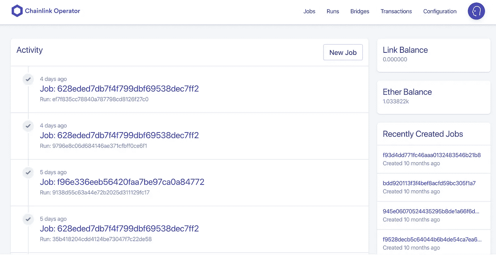

# (过时)运行链节节点的最终指南

> 原文：<https://medium.datadriveninvestor.com/the-ultimate-guide-to-running-a-chainlink-node-a7f2c3ff4eb1?source=collection_archive---------0----------------------->

## 如何在 GCP 上设置一个简单的 Chainlink 节点，需要的技术要求，业务要求，以及运行节点时需要知道的一切

Image from [Author](https://alphachain.io).

# 过时的

这篇文章目前已经过时，并且计划随着 OCR 的稳定推出而更新。

[运行一个 Chainlink 节点](https://docs.chain.link/docs/running-a-chainlink-node)与建立一个 [ETH 节点](https://medium.com/@przemekthomann/setup-ethereum-development-environment-in-5-minutes-51336c013fdb)或 [BTC 节点](https://www.investopedia.com/news/running-full-bitcoin-node-investors/)是不同的，因为 Chainlink 节点有几个根本不同的概念。

在本文中，我们将回顾:

1.  技术要求
2.  业务需求
3.  我应该运行一个链接节点吗？
4.  最后，一个关于如何设置一个链接节点的指南(GCP 简单设置)

作为 2019 年 11 月以来的节点运营商，当我们用 [Alpha Vantage](https://www.alphavantage.co/) 建立我们的第一个节点时，我们很兴奋，我们确保发布了关于它的[推文](https://twitter.com/alpha_vantage/status/1195568590017191937?s=20)，因为我们太兴奋了。

A little suspense for the Alpha Vantage Chainlink Node.

[Chainlink Node reputation](https://reputation.link/) site by [Secure Data Links](https://www.securedatalinks.com/)

现在，除了 [Alpha Chain](https://alphachain.io/) 之外，你可以看到我们已经运行这个节点很长一段时间了，并且是信誉网站上 10 大最佳响应节点之一。

请随时参考这篇文章，并加入[节点-操作符不一致](https://discord.gg/Wq6z5HB)以获得更多支持。

运行一个节点是一次激动人心的经历，但是有很多事情要考虑，并且有很多事情要做。希望这篇文章能帮助你决定运行一个是否适合你，如果适合，我们也给你一些步骤，让你在 GCP 上快速建立一个！如果你不知道 Chainlink 如何工作，我建议你在继续之前观看 [Chainlink oracle 视频](https://www.youtube.com/watch?v=ZJfkNzyO7-U)或阅读 [Chainlink 博客](https://blog.chain.link/oracles-the-key-to-unlocking-smart-contracts/)。

# 技术要求

## DevOps

运行 chainlink 节点不同于其他验证器节点。一定要技术化吗？没有…但是你可能应该有，或者在你的团队中有可以帮助解决技术问题的人。要让你的节点运行起来，你需要采取大量的安全措施，并不要求你是网络安全专家，但了解 DevOps 是非常关键的。以下是一些需要考虑的概念:

*   HTTPS 和 HTTP 端口
*   安全 SQL 连接
*   秘密管理
*   高可用性
*   灾难恢复

我觉得很多其他的任务都可以归结为“DevOps”(尽管，这在今天是一个很有内涵的术语……)

现在，我不希望这阻止任何人运行节点，因为所有这些部分都可以学习，但肯定有很多移动部分要考虑。

## 主动监控

您需要准备一些监控部件，以确保您的节点:

1.  完全由 ETH 资助
2.  不会错过不应该错过的工作
3.  API 订阅没有停止
4.  虚拟机/docker/数据库运行良好
5.  其他 DevOps 监控产品

有很多好的解决方案，如 [Datadog](https://www.datadoghq.com/) 和 [Pagerduty](https://www.pagerduty.com/) ，可以帮助确保您的监控是强大的，并且当出现问题时，您可以得到通知。这也意味着，当事情出错时，你必须扑上去解决它。为什么？因为名声。

Image from Reputation.link

基本上，每次你的工作错过一个请求，或者离线，或者返回坏数据，每个人都知道。您不希望有一个表现不佳的节点，因为在区块链上，一切都会被记录下来。如果你的名声不好，人们不会使用你的节点。

这是进入下一个片段的完美的继续。

# 业务需求

这是一个重要的部分，也是与其他服务的主要区别。

我是不是用技术方面处理不好的人把人吓跑了？还是你跳过了那部分？不管怎样，我很高兴你还在读书。

经营一个连锁节点是一项数字业务。由于智能合同需要来自多样化来源的数据，它们需要使用许多*不同的*节点来保持分散性。这对你来说很好，因为智能合同被激励使用许多节点尽可能保持分散，包括你的节点！当节点运营商成功地将数据交付给智能合约时，他们将在 LINK 中获得报酬。智能合约开发者可以选择他们的节点网络，但是你必须证明*为什么*他们应该在他们的 dApps 中使用你的节点。您的正常运行时间长吗？你是一个诚实的节点吗？你有唯一的数据吗？这就是拥有大量商业和营销技能发挥作用的地方。您还必须很好地处理所有其他节点，因为节点越多，系统就越安全。击败竞争对手实际上会让您的情况变得更糟，因为没有人会只信任一个节点！

> 你通过运行一个节点来销售服务。您的服务是保护来自真实世界的数据到区块链。如果你通往真实世界的管道坏了，工程师会为实际上在别处工作的管道买单。

在技术要求中，我提到缺少工作是不好的，这就是为什么它是不好的。当你错过一个任务或者你的节点关闭时，工程师现在不太可能使用你的节点，因为他们认为给你发送一个任务是浪费他们的链接，或者更糟的是，他们会为坏数据付钱给你。像 [market.link](https://market.link/) 和 [reputation.link](https://reputation.link/) 这样的节点列表服务是目前帮助显示节点运行情况的一些服务，但是任何人都可以构建第三方服务来报告节点运行情况。很多人会问“好了，我有一个节点，现在呢？”，而答案是“太好了，该找点工作了”。一个新的节点就像一个大学毕业生，你现在必须以某种方式开始工作，并找到一份工作(或许多工作)。

[market.link](https://market.link/) homepage

在 market.link 上列出你的节点是一个很好的起点。然后，您可以继续寻找希望在其智能合约中使用外部数据的客户。BTC、瑞士联邦理工学院和其他验证节点刚刚起步，并立即开始赚钱。链环不是这样的。Chainlink 为您提供了一个成为商业巨头的机会，并为您带来一个全新的智能合约数据管道生态系统。

## 价格源

现在，更大的一块将有**右团队**。不过，价格提要是一个完全不同的概念。

1.  全天候覆盖
2.  多个团队成员(不能是一个人的团队)
3.  运营区块链基础设施超过 1 年
4.  明确 DevOps 专业知识
5.  启用安全最佳实践
6.  足够的 ETH 或相应的资产，以确保隐含的赌注
7.  testnet 的声誉和正常运行时间

Chainlink 的用户拥有数十亿美元的安全保障。这些用户需要确保他们拥有最高质量的数据提供者。价值数十亿美元的大客户绝不会选择与任何表现不佳的供应商合作。

# 我应该运行一个链接节点吗？

是啊！

但是让我解释一下为什么。

如果您想:

*   了解大量关于 devops、Chainlink 和新时代区块链生态系统的信息
*   成为连接现实世界和智能合约的管道的一部分
*   拥有一家数字企业，被动地获得报酬
*   将自定义数据导入区块链

那么你应该 100%运行一个链接节点。

但是，如果您想:

*   将坏数据带到区块链
*   懒得学习如何监控您的节点
*   以任何方式怀有恶意

那就不要跑节点了。我这么说不仅仅是因为我不想在《锁链世界》里看到坏演员，我这么说是为了保护你。如果你不能监控你的节点，你的声誉会受到打击，你会浪费很多时间找不到工作，因为人们会看到你的声誉。

在 2020 年的[黑色星期四](https://blog.kaiko.com/crypto-black-thursday-under-the-microscope-a86770df5c29#:~:text=On%20Thursday%20March%2012th%2C%20which,in%20less%20than%20a%20day.)期间，当天然气价格疯狂上涨时，全球的节点运营商不得不放弃他们正在做的事情，以确保他们的节点工作事务得到处理，一些节点需要 6 个多小时才能恢复在线。随着我们看到与智能合同相关的所有事物的增加，这些节点将获得更多的价值。

如果你不能被信任去管理价值 60 亿美元的人们的钱，那么你可能不应该运行一个节点。

# 我需要运行一个链接节点吗？

号码

许多工程师认为他们需要运行一个 chainlink 节点来将数据放入他们的智能合同中，实际上正好相反。对于大多数项目来说，如果您让节点操作者专注于节点操作，那么您可以专注于开发智能合约，这实际上会更好。你的智能合同将需要许多独立的节点，而不仅仅是你自己！如果您构建了一个[外部适配器](https://docs.chain.link/docs/external-adapters)或者需要一些定制数据，您通常可以让节点操作者为您移植数据。一定要问在 [#ask-a-node-operator 不和。](https://discord.gg/FSVmJ9p)

否则，您可以查看 [market.link](https://market.link/) 开始将外链数据连接到您的智能合约中。

Entertaining video on everything written above

好吧…对于那些等待的人…这是你一直在寻找的东西。

# 如何设置链环节点(GCP 简单设置)

Chainlink 团队有运行 Chainlink Node 的[精彩文档](https://docs.chain.link/docs/running-a-chainlink-node)，可以随意从那里开始学习你需要的所有原始信息，因为这将非常具体到 GCP。**本指南将** **不包含通过安全审核的所有方面，**只是让您入门的参考。然而，GCP 平台包含了确保安全所需的一切。我有一个视频在这篇文章的结尾，如果你想看我一步一步地和你建立这个。

## 1.获得 GCP 的免费账户

[Google Cloud Platform](https://cloud.google.com/) free account

[谷歌云平台(GCP)](https://cloud.google.com/) 是一套基于云的基础设施、开发者工具、API、数据分析和机器学习。我们需要它的时候它超载了。但是，我们只需要它的云基础架构部分。我们只是需要它来:

*   成为我们的链接节点的服务器
*   托管数据库
*   额外学分:主机外部适配器

然而，你可以使用任何云或非云平台，比如 AWS、Azure，甚至是本地平台。您可以获得 300 美元的免费积分和长达 3 个月的 GCP 免费使用权。

## 2.设置您的虚拟机

1.  进入“计算引擎”->“虚拟机实例”->“创建”
2.  给它一个名字
3.  将“机器类型”更改为具有 8 GB 内存的 2 vCPU
4.  在“启动光盘”下，点击“更改”并选择你的 linux 版本(我选择了“Ubuntu，18.04 LTS，带有 10 GB 内存的 SSD 永久光盘”)

Image from Author

5.勾选“允许 HTTP 流量”和“允许 HTTPS 流量”。

6.点击“创建”

就是这样！现在，您已经设置好了一个 linux 系统。

## 3.设置您的数据库

1.  点击左上角的小汉堡图标->进入“SQL”
2.  选择“创建实例”
3.  选择 Postgres
4.  再次点击左上角的小汉堡图标->进入“APIs &服务”->库
5.  查找“服务网络 api”
6.  点击“启用”
7.  回到您的数据库实例设置
8.  给它一个名字
9.  在“配置选项”中，取消选中“公共 IP”并选中“私有 IP”->“启用服务网络 API”
10.  点击“创建”->等待…
11.  点击“用户”并添加用户名和密码
12.  点击“数据库”，添加一个数据库名称，然后点击创建

## 4.[安装谷歌云 SDK](https://cloud.google.com/sdk/install)

您需要在您的本地机器上这样做。[文档在这里](https://cloud.google.com/sdk/install)。我用的是苹果电脑，所以我用了:

[Link to the cloud SDK installer for MacOS](https://cloud.google.com/sdk/docs/downloads-interactive)

## 4.ssh 隧道进入您的虚拟机 linux 机器

安装后运行`gcloud auth login`。然后使用
`gcloud compute — project “project_id” ssh — zone “zone” “vm_name” — -L 6688:localhost:6688`通过 SSH 隧道进入您的虚拟机

`project_id`将是你的项目的 ID，你可以点击“我的项目”并复制 ID 下的内容。`zone`是你虚拟机的区域，你可以通过`Compute Engine`->-`VM instances`复制你虚拟机的`zone`下的内容找到，然后`vm_name`就是你刚做的虚拟机的名字。

## 5.遵循链接文档

在您继续之前，选择一个您想要运行它的测试网。你选择哪一个并不重要，只要保持一致。对于这个，假设你选了`Ropsten`。Chainlink 文档比我解释得更好，所以从现在开始请随意跟随它们。如果你在阅读这些文件时需要帮助，请继续阅读。

当 ssh 通过隧道进入 VM 时，运行:`curl -sSL [https://get.docker.com/](https://get.docker.com/) | sh sudo usermod -aG docker $USER exit`。这将带您离开您的 ssh 隧道，因此只需返回 ssh(运行与步骤 4 相同的命令)。

运行:`mkdir ~/.chainlink-ropsten`

跑:`echo “ROOT=/chainlink LOG_LEVEL=debug ETH_CHAIN_ID=3 MIN_OUTGOING_CONFIRMATIONS=2 LINK_CONTRACT_ADDRESS=0x20fE562d797A42Dcb3399062AE9546cd06f63280 CHAINLINK_TLS_PORT=0 SECURE_COOKIES=false GAS_UPDATER_ENABLED=true ALLOW_ORIGINS=*” > ~/.chainlink-ropsten/.env`

通过注册 [fiews](https://fiews.io/) 获得一个 ropsten ETH_URL(免费)。然后在“端点”下选择以 wss 开头的 Ropsten URL，并在下面的命令中用`CHANGEME`替换它，然后运行它。

`echo “ETH_URL=CHANGEME” >> ~/.chainlink-ropsten/.env`

对于您的远程数据库 URL，在下面的命令中，将$ `USERNAME`设置为您在数据库中创建的用户名。将`$PASSWORD`替换为您的数据库密码(如果您的密码有特殊字符，[检查一下](https://www.urlencoder.io/learn/))。用您的数据库的 IP 地址替换$ `SERVER`(您可以在创建数据库的 SQL 选项卡中找到它)。用`5432`替换`$PORT`，用您创建的数据库的名称替换`$DATABASE`。然后运行以下命令:

`echo “DATABASE_URL=postgresql://$USERNAME:$PASSWORD@$SERVER:$PORT/$DATABASE” >> ~/.chainlink-ropsten/.env`

然后启动链环节点:`cd ~/.chainlink-ropsten && docker run -p 6688:6688 -v ~/.chainlink-ropsten:/chainlink -it — env-file=.env smartcontract/chainlink local n`

当你第一次需要继续时，你会被提示输入密码，然后你会被提示输入 API 电子邮件和密码。

## 6.进入 Chainlink 节点 GUI

进入 [http://localhost:6688](http://localhost:6688/) 输入刚刚创建的 API 邮箱和密码，就可以进去了！

Chainlink node GUI

你不会看到任何工作运行像图片，但你会在！如果你想看视频，请点击这里:

Look at all that purple

要了解更多信息，请务必查看 [chain.link](https://chain.link/) ，加入 discord，或在 twitter 上关注我们！

*免责声明:我是 Chainlink 的开发者拥护者，也是 Alpha Chain Inc .的创始人兼首席执行官*

**访问专家视图—** [**订阅 DDI 英特尔**](https://datadriveninvestor.com/ddi-intel)