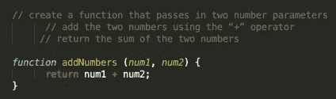
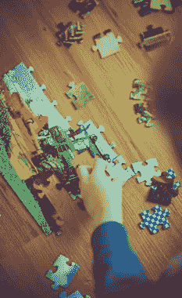

# 解决任何编程问题的终极指南，不管它有多复杂！

> 原文：<https://medium.datadriveninvestor.com/the-ultimate-guide-to-solve-any-programming-problem-regardless-of-its-complexity-cf6c675d3531?source=collection_archive---------4----------------------->

Photo by [Fotis Fotopoulos](https://unsplash.com/@ffstop?utm_source=unsplash&utm_medium=referral&utm_content=creditCopyText) on [Unsplash](https://unsplash.com/s/photos/programming?utm_source=unsplash&utm_medium=referral&utm_content=creditCopyText)

编程很有趣，但是，如果你用错误的方法解决问题，它可能是一场噩梦。

***三个*** 步骤有效解决 ***任何*** 编程问题:

1.  明白；理解
2.  计划
3.  情绪完全失控

养成用这种方式解决你遇到的每一个问题的习惯，这样，当你真的遇到那些复杂的问题时，你就能自信地克服它们。

## 1.明白；理解

在你开始解决一个问题之前，确保你完全理解你被要求做什么。我知道“理解”看起来像是常识，但有时我们会因为太兴奋而忽略了这个重要的步骤。

当你不知道别人对你的期望时，完成一项任务是极其困难的。这就是误解变成大混乱的原因。

想象一下，如果你想让一只狗做一些新的事情，而没有先训练它去做，它会试着猜测你想要什么，并做一些随意的动作，因为它甚至不知道从哪里开始。

当我们试图编码一个问题的解决方案时，当我们不确定结果应该是什么的时候，类似的困惑就会发生。

 [## 软件开发过程:如何选择正确的过程？数据驱动的投资者

### 软件是任何企业组织成功的生命线。没有软件的帮助，一个…

www.datadriveninvestor.com](https://www.datadriveninvestor.com/2020/01/16/software-development-process-how-to-pick-the-right-process/) 

那么，你怎么知道你什么时候真正达成了谅解呢？当你能够用自己的话解释问题和预期结果时。

***帮助创建理解的提示*** :

*   写下来
*   涂鸦吧
*   大声读出问题
*   试着大声解释一下

> **想出适合自己的，每个人都不一样。**

## 2.计划

一旦你明白了问题，下一步的 ***有效的*** 问题解决就是规划。不要在没有计划的情况下就开始编写解决方案。

这就像写一篇研究论文，你不会只是打开一个 word 文档就开始打字，而没有首先考虑你将纳入哪些想法、事实或参考资料。

我的意思是，你可以这样做，它可能会工作，但我可以向你保证，这个策略将导致你最终投入更多的时间和精力，如果你花时间来计划/组织你的想法。

编程也是如此，编程需要组织。不要只是希望你会找到一个方法，为一个计划，以确保你会。

不提前计划会变成试错，你最终会尝试多种事情，直到你走运……这是解决问题的最好方法。如果你在开始编码之前花一点额外的时间来计划你的解决方案，你会更好。

***规划解决方案的技巧:***

写下你需要采取的具体步骤，以便找到解决方案。在编程中这样做的一个有用的方法是使用**注释！**

考虑这个简单的例子:

*“编写一个接受两个数并返回其和的函数”*

问自己一个好问题是“如果我有两个数字，为了得到传递给函数的任何数字的和，我需要采取什么必要的步骤？”

你在下面看到的评论是我执行这个计划的一步一步的计划。

JavaScript Code

## 3.分解问题

这是**巨大的**！不要只看一个问题，试图一下子解决整个问题。这不仅令人生畏，而且令人沮丧。

Photo by [Markus Spiske](https://unsplash.com/@markusspiske?utm_source=unsplash&utm_medium=referral&utm_content=creditCopyText) on [Unsplash](https://unsplash.com/s/photos/jigsaw-puzzle?utm_source=unsplash&utm_medium=referral&utm_content=creditCopyText)

想象一下，如果有人给你一个拼图，让你完成它。你不会只是把所有的拼图拼起来，然后试着一次把它们拼起来。

你会从一幅作品开始，然后继续到下一幅，下一幅，再下一幅，直到最后你完成了这幅令人惊叹的作品。

编程也是如此。养成将问题分解成更小的问题子集的习惯。从问题的一部分开始，然后继续下一个问题，下一个问题，直到你最终解决了整个问题。

如果你试图一下子解决整个问题，你会发疯的，所以不要这样做。

***分解一道题的小技巧:***

从解决你已经知道如何解决的子问题开始，重复这样做，直到你解决了所有的子问题，然后把它们连接起来，得到你的最终解决方案。

最后，练习！！！！！**练习练习练习！！！！**

如果你想成为一个优秀的问题解决者，你必须解决很多问题。

你解决的问题越多，你就会变得越好，你遇到的问题越多，你就越能在下次遇到类似问题时找到解决方法。

> “这个国家的每个人都应该学会给电脑编程，因为它教会你思考。”—史蒂夫·乔布斯

编程改变了你接近世界的方式。

我有信心解决任何摆在我面前的问题，因为我会编程。我能够想出一个解决方案，并据此制定计划。感觉像是超能力。

编程让世界转动……嗯，它让我的世界转动；)