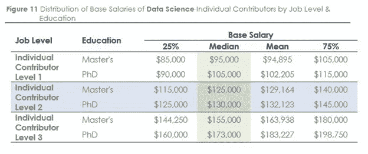
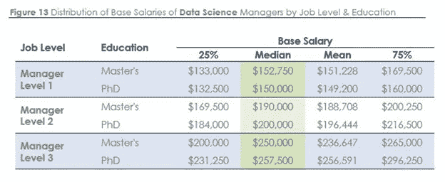

# 2021 年转变数据科学职业的终极指南

> 原文：<https://medium.datadriveninvestor.com/the-ultimate-guide-to-transform-data-science-careers-in-2021-f36324c9ef9?source=collection_archive---------4----------------------->

尽管经历了新冠肺炎全球疫情混乱的一年，数据科学仍然是一个蓬勃发展的领域。

> 美国劳工统计局发现数据科学工作技能急剧增长。一项预测表明，到 2026 年， [***数据科学产业***](https://www.dasca.org/) *可能会增长 28%。*

在绝望的时刻，只有一件事由于互联网和电子设备的使用而激增——产生更多的数据。在疫情袭击之前，世界上每天产生 25 万亿字节的数据。你现在可以想象疫情中产生的数据量。随着人们适应远程工作，全球多种数字设备的使用将继续以极快的速度增长。

由于结构化和非结构化数据的大规模增长，涉及人工智能(AI)和机器学习的数据科学和相关技术正在经历急剧增长。因此，根据 Glassdoor 的数据，数据科学家的角色连续三年在美国排名第一，并将在可预见的未来继续保持这一地位。

**你需要知道的迷人数据科学预测**—

*   在过去十年中，大数据和分析统治了该行业的主要部分。
*   根据这份名为[投资美国数据科学和分析人才:行动案例](https://www.bhef.com/news-events/releases/bhef-report-recommends-eight-actions-closing-data-science-and-analytics-skills)的报告，2021 年，美国约 70%的企业可能更喜欢拥有数据技能的候选人。
*   报告称，对拥有数据科学和分析技能的毕业生的需求和增长将继续上升。
*   世界经济论坛[预测，数据科学家和分析师将成为 2022 年的头号新兴职业。](https://www.weforum.org/agenda/2018/09/future-of-jobs-2018-things-to-know/)
*   美国劳工统计局的一份报告称，由于对数据科学技能的需求增加，到 2026 年，数据科学领域将有大约 1150 万个职位空缺。

随着世界开始适应新常态，现在是个人带着目标和丰厚的薪水提升技能的绝佳时机。

**数据科学职业仍然是一个选择:作为数据科学家的薪酬**

数据科学家被吹捧为科技行业薪酬最高的职业之一。

以下是你作为一名 [**数据科学专业人员**](https://www.cio.com/article/3222879/15-data-science-certifications-that-will-pay-off.html) 的收入:

第一级——每年 95，500 美元

第二级——每年 125，000 美元

第三级——每年 155，000 美元

*Image source: Burtch Works Survey*

作为一名经理，你的年薪中值可能从第一级的 150，750 美元到第三级的 250，000 美元不等(来源:[博奇公司](https://www.burtchworks.com/big-data-analyst-salary/big-data-career-tips/))。

*Image source: Burtch Works Survey*

随着数据生成速度的加快，对该领域专家的需求不会很快停止。

仍然不确定要学什么:我们已经帮你搞定了

疫情疫情迫使企业重新调整战略，以实现更好的业务增长。随着数字采用的激增，对数据科学、人工智能和机器学习技能的需求最终会上升。

现在是数据科学家提升技能以找到更好工作的理想时机。随着自动化成为大多数企业的主流，数据科学家将需要缩小他们对**数据科学行业**至关重要的关键技能的关注。

👉**使用 Python 的数据科学** — Python 一直是数据科学家最喜欢的工具。随着 TPAs、FPGAs 和 GPU 等高性能计算平台的崛起，Python 在数据科学中的应用将变得更加突出。

👉**自然语言处理(NLP)** —企业正蓬勃发展，从多个来源收集更多数据，以提高客户服务。对于希望使用新时代客户关系管理工具的公司来说，NLP 可能是一个完美的工具。

👉**数据可视化** —随着分析对公司的吸引力越来越大，对数据可视化的需求也将上升。使用图形和图表讲故事可以帮助企业领导人做出更好的决策。

👉**地理空间技术** —在疫情期间，地理空间技术被证明是公司和政府的救星。使用这种技术，专家可以很容易地绘制疾病爆发的地图，并跟踪世界各地的感染地区。随着我们看到越来越多的人从事像数据驱动决策这样的过程，通过地理空间技术收集的每一个数据对于更好的规划都将变得更加有用。

👉计算机视觉——在新冠肺炎危机之后，计算机视觉将会获得更多的关注。这项技术甚至可以帮助从大量图像中识别模式。这在医学领域可能是有用的。计算机视觉已经在城市中用于通过视频监控来监视市民。医生也可以利用这项技术从放射图像中检测出异常。

不要忘记，当你开始数据科学的**职业生涯时，基础知识将保持不变——数学、统计、线性代数、微积分、机器学习和数据争论。**

随着越来越多的公司将数据科学和分析作为其业务预测和创收的核心，数据科学仍将是一个热门领域。

尽管 2020 年似乎是一场影响整个教育行业的噩梦，但它却是在线教育的福音。

在这个世界为生存而挣扎，数据科学技能不断上升的时候，为什么不走少有人走的路呢？

 [## 一瞬间学会数据科学！？数据驱动的投资者

### 在我之前的职业生涯中，我是一名训练有素的古典钢琴家。还记得那些声称你可以…

www.datadriveninvestor.com](https://www.datadriveninvestor.com/2020/07/23/learn-data-science-in-a-flash/) 

# **以非传统方式学习 it:立即获得数据科学认证**

随着数据成为管理疫情业务的关键因素，每个行业都对数据科学家有着巨大的需求。尽管有需求，但找到一名专家是一项艰巨的任务。这也是公司现在寻找拥有高级数据科学技能的专业人士的主要原因之一。因此，数据专业人员通过数据科学认证提升自己的技能以在行业中保持相关性变得至关重要。

# 以下是 2021 年的一些**最佳数据科学认证**，供你选择:

# #1.**美国数据科学委员会(DASCA)**

DASCA 的 [**高级数据科学家(SDS)认证计划**](https://www.dasca.org/data-science-certifications/senior-data-scientist) 是业界最优秀的在线计划之一，具有全球意义。该认证计划专门为希望成为现代数据科学家伟大先驱的专家提供高级数据科学技能。

SDS 认证计划经常被定位于世界顶级的第三方、供应商中立认证，涵盖适用于现实任务的技能。

**SDS 认证计划非常灵活，原因如下:**

*   拥有数学、统计学、计算机科学、应用科学、金融、工程、管理和经济学学士学位的候选人，以及在数据科学、商业分析、商业智能和计算方面至少五年的工作经验的候选人都有资格。
*   拥有数学、统计学、计算机科学、应用科学、金融、工程、管理和经济学硕士学位的候选人，以及在数据科学、商业分析、商业智能和计算方面至少四年的工作经验，也可以申请该计划。

该计划的核心重点是让您能够领导与商业智能相关的关键职能，并解决大数据和分析中的现实问题。

# #2.**戴尔 EMC**

戴尔 EMC 提供了 [**数据科学家计划(EMCDS)**](https://education.dellemc.com/content/emc/en-us/home/certification-overview/find-exam/data-science-associate.html) 。该路线涵盖两个计划，数据科学助理认证和数据科学专家认证。

助理级认证计划帮助您获得数据科学和分析方面的技能。完成助理级别后，您可以直接晋升到专家级别。专家级计划涵盖的主题涉及高级分析方法、可视化、HBase、Pig、Hive 和 Hadoop。

# #3. **IBM**

[IBM 提供的数据科学专业证书课程](https://www.coursera.org/professional-certificates/ibm-data-science#courses)包含 9 门数据科学课程。参加本课程将帮助您掌握数据科学方法论、开源工具、机器学习、SQL、数据库、Python 编程和数据可视化。

IBM 数据科学课程非常灵活，通常需要大约三个月的时间来完成。

认证不仅能提供证明相关技能的认证，还能提供强大的领域知识，这对在疫情时代生存至关重要。

# 你期待新的一年有一个新的开始吗？现在是转行的时候了！

**访问专家视图—** [**订阅 DDI 英特尔**](https://datadriveninvestor.com/ddi-intel)