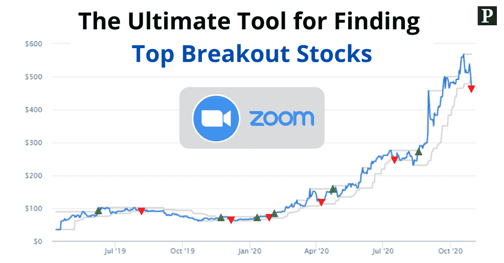
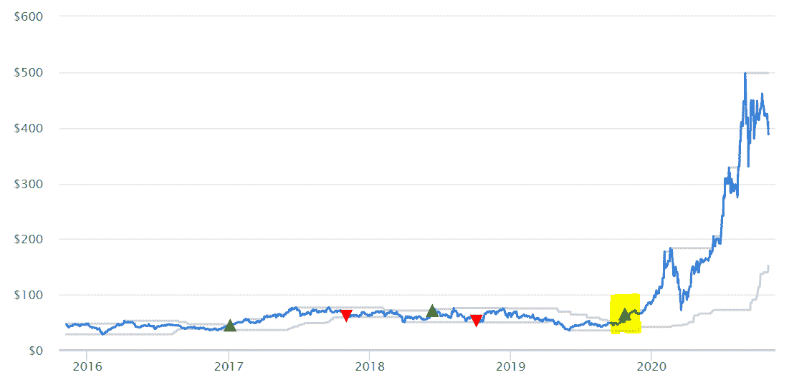
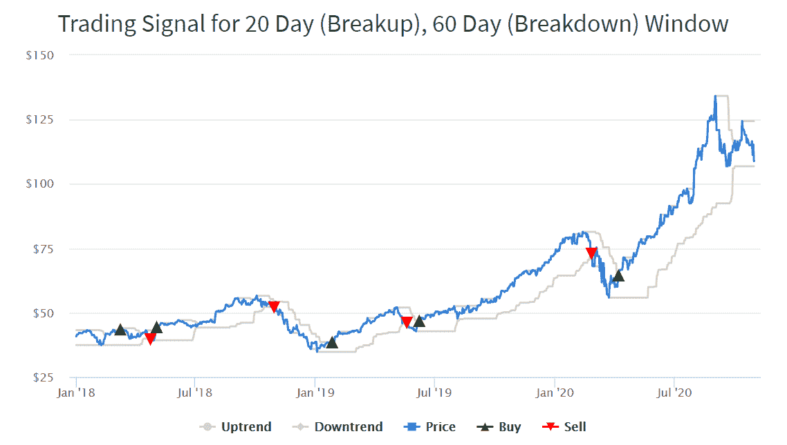
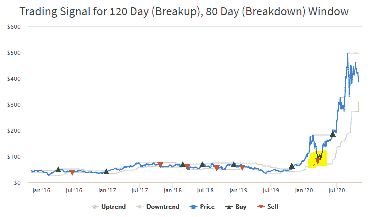
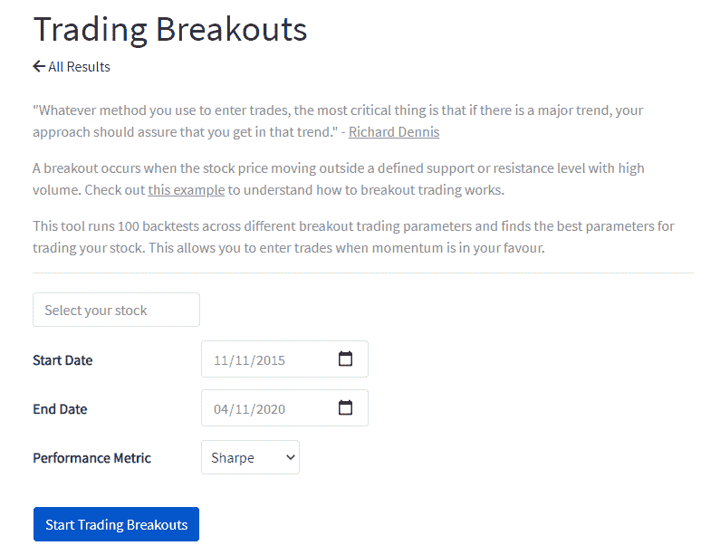
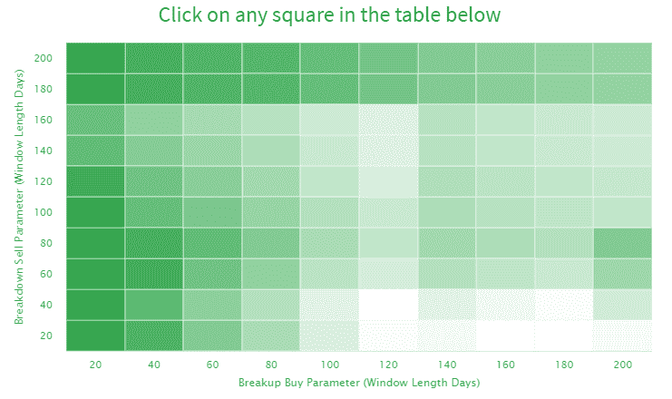
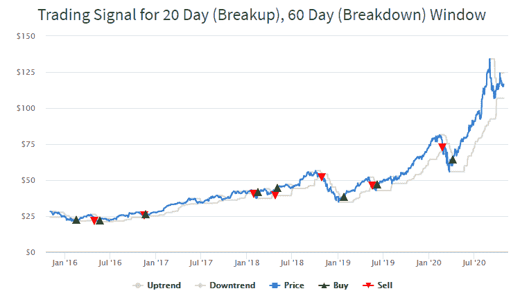
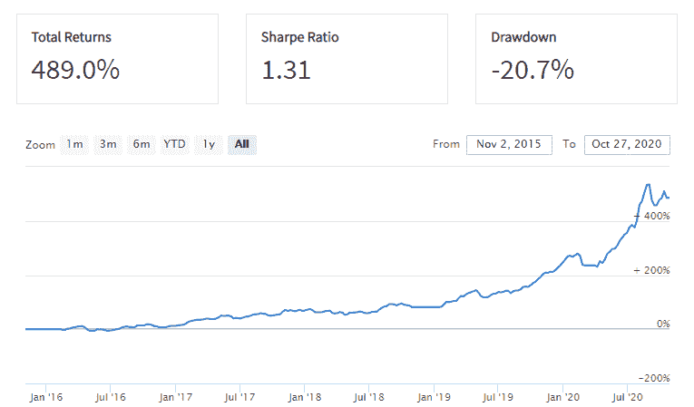

# 寻找顶级突破股票的终极工具

> 原文：<https://medium.datadriveninvestor.com/the-ultimate-tool-for-finding-top-breakout-stocks-97d21dfeb2a2?source=collection_archive---------0----------------------->

[https://pyinvesting.com/](https://pyinvesting.com/)

计算机化系统交易背后的[市场奇才](https://www.amazon.com/Market-Wizards-Interviews-Top-Traders-ebook/dp/B006X50OPW)之一埃德·塞科塔，在 12 年间将 5000 美元变成了 1500 万美元。

他非常相信趋势跟踪，当势头对他有利时，他使用突破交易系统进场交易。

无论你是做日内交易还是波动交易，使用一个可靠的突破交易系统可以显著提高你交易的风险报酬率，并从长远来看增加你的交易利润。

在这篇文章中，我将介绍一个工具，我建立来帮助你识别具有爆炸势头的顶级突破股票。

# 什么是股票的突破？

当股票价格突破阻力位或突破支撑位时，股票突破就发生了。突破发生后，价格往往会继续以强劲的势头前进。

下面的例子显示，特斯拉在 2019 年 11 月突破了 140 天的高点(以黄色突出显示)，一年后从 65 美元飙升至近 400 美元。

[https://pyinvesting.com/](https://pyinvesting.com/)

你可以把股票价格想象成一个乒乓球，在玻璃地板(支撑位)和玻璃天花板(阻力位)之间来回跳动。

当球碰到地板时，它会从地板上反弹回来，起到支撑的作用。当球碰到天花板时，它会从天花板上反弹回来，从而产生阻力。

然而，如果这个乒乓球在飞行中突然变成了保龄球，会发生什么呢？

如果保龄球落向地板，它会穿过玻璃地板，玻璃地板对保龄球的巨大动量几乎没有支撑。类似地，如果保龄球飞向天花板，它将穿过阻力可以忽略不计的玻璃天花板。

就股票而言，当投资者因正面收益发布而兴奋时，这种热情为股价突破阻力位并飙升至新高提供了动力。

相反，当投资者因新冠肺炎等公共卫生危机而开始恐慌时，整个市场的普遍恐惧会导致股价突破其支撑位。

作为突破交易者或日内交易者，你的目标是在突破发生时发现突破，这样你就可以买入突破阻力位的股票，做空突破支撑位的股票。

# 你如何交易突破？

机械趋势跟踪交易系统的规则非常简单。

1.  当价格突破过去 n 天的高点时，做多。
2.  当价格跌破过去 m 天的低点时做空。

过去 n 天的最高价作为阻力位。如果股票价格能够突破这个高价，它反映了强劲的上升势头。这是一个强有力的指标，证实了向上突破的趋势。

相反，过去 m 天的最低价作为支撑位。如果股票价格能够跌破其低价，这是一个强有力的指标，证实了下跌趋势的突破。

我们来看看苹果。下面的图表显示了苹果(蓝线)的价格，夹在两条灰线之间，作为通道。

蓝线上方的灰线是基于过去 20 天高点的阻力位。蓝线下面的灰线是基于过去 60 天低点的支撑位。

绿色箭头是当价格触及顶部灰色线时做多的指标。红色箭头是当价格触及底部灰色线时做空股票的信号。

[https://pyinvesting.com/](https://pyinvesting.com/)

最大的问题是我们应该使用什么样的回顾期？

在理查德·丹尼斯的指导下，海龟交易者用短期和长期回顾期进行系统交易。

系统 1 是基于 20 天突破的短期系统，而系统 2 是基于 55 天突破的长期系统。

虽然这套系统交易的规则对海龟交易者来说利润很高，但是回溯测试的结果显示，当多年后同样的规则被使用时，策略没有以前成功了。

有两个可能的原因导致该策略在多年后表现不佳。

1.  回望期的突破参数固定在 20 天和 55 天。这是一个问题，因为不同的工具有不同的趋势。一些工具有短期趋势，而其他工具有长期趋势。这些趋势也可能随着时间的推移而改变，因此在整个历史中使用静态回顾期是没有意义的。
2.  20 天的分手参数与 20 天的细分参数相同。没有理由假设这些参数应该是相同的，因为在一种情况下，我们希望进入一个长期交易，而在另一种情况下，我们试图做空市场。

# 为什么选择正确的指标来确认突破很重要？

选择错误的股票突破信号，不能正确捕捉趋势，会对你的策略表现不利。

这是因为，如果一只股票处于长期上升趋势，而我们使用的是短期回顾期，那么由于股票价格的波动性，我们很有可能会被拉锯。

例如，如果我们对 Tesla 使用 120 天的分解期和 80 天的分解期，下图显示，在下面用黄色突出显示的部分会出现不良交易。该系统在 2020 年 3 月发出卖出信号，预计股票将进入下跌趋势。然而，股票在那之后不久就反弹了，导致交易系统错过了 Covid 崩溃后的复苏。如果使用长期分解参数，卖出信号就不会触发，因为灰线会更低，因此会有更大的波动空间。

[https://pyinvesting.com/](https://pyinvesting.com/)

在决定突破参数时，交易者通常会使用[平均真实范围](https://www.investopedia.com/terms/a/atr.asp) (ATR)来衡量股票价格的波动性，这是对给定时间段内市场波动性的衡量。

然而，这种方法也是主观的。你可以选择不同的 ATR 倍数来设置你的止损。对于短期趋势，将止损设置在 1 倍 ATR 可能更合适，而对于长期趋势，将止损设置在 2 倍 ATR 可能更好，以避免因波动而被拉锯。

我们如何去除这种主观的交易方法，转而依靠数据分析来选择最佳突破参数？

# 寻找最佳的股票突破信号

最好的方法是[用不同的突破参数回测你的交易策略](https://pyinvesting.com/blog/18/how-to-backtest-a-trading-strategy-even-if-you-cant-code/)。这使我们能够计算出哪些突破参数是最有利可图的，并且能够产生具有最高风险报酬率的交易。

为了帮助你，我创建了一个工具，使用不同的分解和崩溃参数运行 100 个[回溯测试](https://pyinvesting.com/blog/12/heres-why-every-investor-should-backtest-their-investment-strategy/)。这是你如何使用它。

首先前往 https://pyinvesting.com/trading-breakouts/。

[https://pyinvesting.com/](https://pyinvesting.com/)

填写下表，说明你感兴趣的股票。在这个例子中，我们将看看苹果公司。

接下来选择优化的开始和结束日期。默认情况下，开始日期选择为 5 年前，结束日期设置为今天。

选择您希望用来确定最佳突破交易参数的绩效指标。默认情况下，使用夏普比率，它允许我们找出哪些突破参数导致我们交易策略的最高风险调整回报。

最后点击蓝色按钮开始交易突破。

[https://pyinvesting.com/](https://pyinvesting.com/)

结果将显示一个热图，其中每个方块代表使用特定突破参数运行回溯测试的结果。方块越绿，基于我们选择的性能指标(夏普比率)的性能越好。

结果表明，夏普比率通常随着分手回望期变短而提高。另一方面，分解参数在影响交易策略的表现方面没有明确的模式。

如果您单击任何方块，它将显示使用相应参数的回溯测试结果。例如，以下是 20 天分手和 60 天分手窗口的结果。基于这些参数，交易系统产生的最新信号是 4 月份的买入信号，当时市场从 Covid 崩溃中反弹并进入上升趋势。

[https://pyinvesting.com/](https://pyinvesting.com/)

向下滚动我们可以看到使用 20 天分解和 60 天分解参数的交易苹果的利润和损失(P&L ),以及总回报、夏普比率和最大亏损等业绩数字。

[https://pyinvesting.com/](https://pyinvesting.com/)

# 结论

如果我们能抓住一个主要趋势，突破交易会非常有利可图。然而，找到最好的股票突破信号是至关重要的，因为它可以防止我们被价格波动所左右。我们讨论了如何通过使用不同的参数进行多次回溯测试，找到突破交易策略的最佳参数，从而提高风险报酬率。

现在前往 https://pyinvesting.com/trading-breakouts/，找出今天你最喜欢的股票的最佳交易系统。

祝你投资愉快，并祝你好运。