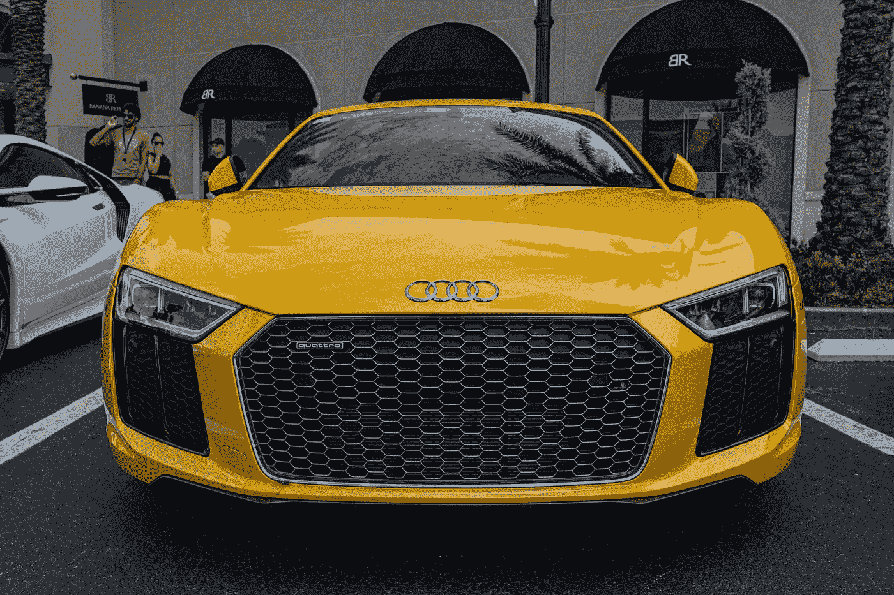
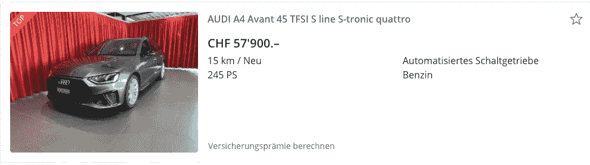
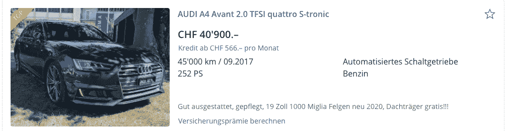
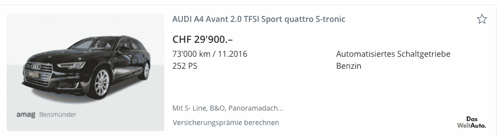
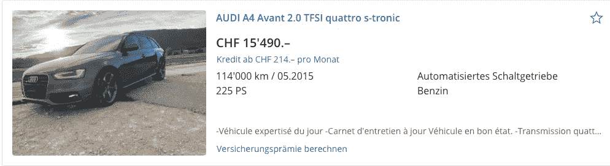
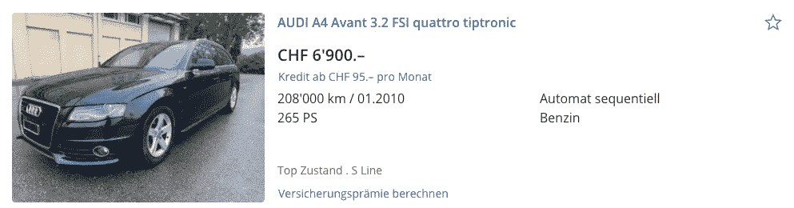

# 拥有一辆汽车被低估的成本

> 原文：<https://medium.datadriveninvestor.com/the-under-estimated-costs-of-owning-a-car-1ce8fc780594?source=collection_archive---------9----------------------->

## 买车不仅仅是支付车价，还有很多相关的成本，我们经常忽略甚至没有考虑到这一点。在这篇文章中，我分解了拥有一辆车的成本，如果你想拥有一辆车，你将重新评估你将如何选择一辆车。

Photo by [Brian Lundquist](https://unsplash.com/@bwl667?utm_source=unsplash&utm_medium=referral&utm_content=creditCopyText) on [Unsplash](https://unsplash.com/s/photos/buy-a-car?utm_source=unsplash&utm_medium=referral&utm_content=creditCopyText)

当我说一辆 Mini Cooper 值 50000 美元时，你认为这辆车值 50000 美元，还是你认为这辆车值 80000 美元？我们大多数人都认为这辆车的价格和它的标签一样。

事实上，汽车的价格远不止这些。当你选择买车时，不要只看价格标签，用一个简单的公式:

**购买价格 x 2 =拥有一辆汽车的实际成本**

原因如下。

# 1.折旧成本

汽车是一种贬值的资产。从你拥有它的那一刻起，它每一天、每一个月都在贬值。曾经有人告诉我，除了烧钱浪费钱，还有一个更快的办法，就是买新车。这就是为什么大多数百万富翁选择购买二手车，根据来自 [<【隔壁的百万富翁>](https://amzn.to/3n1FFsI) 的研究，这是一本很棒的书，我推荐大家阅读！当你购买一辆汽车时，计算每月的折旧成本，并将其与公共交通、优步等替代方案进行比较。问问自己，拥有一辆车真的值得吗？

让我们来看看一辆全新的奥迪 A4 的价格:57900 瑞士法郎(65050 美元)。

我们来看一辆二手奥迪 A4 行驶 45,000KM，车龄 3 年后的价格:40900 瑞士法郎。它比原价低 30%。质量差别大吗？号码

再来看另一辆奥迪 A4，行驶 7.3 万公里，车龄 4 年后的价格:2.99 万瑞士法郎。差不多是原价的五折。质量差别大吗？可能有一点。差价值不值得差价？你决定吧。对于大多数讲道理的人来说，并不是。

我们再来看另一辆奥迪 A4，行驶 11.4 万公里，车龄 5.5 年后的价格:15490 瑞士法郎。几乎比原价低了 73%。质量差别大吗？号码

从第 0 年到第 3 年，折旧为 17，000 瑞士法郎。如果您购买新车，平均每年损失 5700 瑞士法郎，每月 475 瑞士法郎。

从第 0 年到第 4 年，折旧为 28，000 瑞士法郎。如果你购买新车，平均每年损失 7000 瑞士法郎，每月 583 瑞士法郎。

从第 0 年到第 5.5 年，折旧为 42，410 瑞士法郎。如果您购买新车，平均每年损失 7710 瑞士法郎，每月 643 瑞士法郎。

在支付购买费用后，你的汽车价值每个月都会下降。想象一下，你买了这辆车，你损失了车上的折旧金额，现在你觉得这辆车更贵了吗？

计算是基于二手车的市场价格，所以折旧值是已知的。如果几年后你要卖掉你的车，如果有人想买的话，你只能以极低的价格出售。

所以你在选车买的时候，不要只看购买价格，想想你每个月字面上损失的月折旧值。当你买新车时，你的车比你买二手车时贬值更多。

在更好的场景下，如果你真的需要一辆车，并且你认为奥迪 A4 是最好的选择。当你买一辆二手车时，在这种情况下，车龄为 5 年，你的经济状况会好得多。如果你在使用 5 年后卖掉它，它仍然值几千美元。

我发现了一辆类似的汽车，在使用 10 年、行驶 208，000 公里后，价格为 6，900 瑞士法郎。

如果以此为基准，买买一辆 5 年车龄的车，折旧值为 15490-6900 瑞士法郎= 8590 瑞士法郎。年折旧为 1718 瑞士法郎，月折旧为 142 瑞士法郎。与您购买新车相比，您的年折旧额为(57，900-6900 瑞士法郎)/10 = 5100 瑞士法郎，或每月 425 瑞士法郎。

 [## 如何在不牺牲孩子或财务的情况下安全理智地离婚|数据驱动…

### 在美国，七月是以孩子为中心的离婚月。作为 cdfaⓡ的专业人士，我可以向你保证，从长远来看…

www.datadriveninvestor.com](https://www.datadriveninvestor.com/2020/07/28/how-to-divorce-safely-and-sanely-without-sacrificing-your-children-or-your-finances/) 

# 2.保险费用

在瑞士，车越新，保险越贵。每年花费超过 1000 瑞士法郎，最终每个月超过 100 到 300 瑞士法郎。把每月的保险费用加到购车款中。实际费用取决于车和你的驾驶历史。

假设成本:1500 瑞士法郎/年

# 3.道路税成本

在一些国家，无论何时使用国道，都需要付费。你用得越多，付的钱就越多。估计一下你开车长途旅行要花多少钱，把它加到成本里。在其他国家，这可能是每年的固定费用。

假设成本:40 瑞士法郎/年

# 4.停车费用

当你乘坐公共交通工具时，你为博览会付钱，就是这样。当你开车时，大多数时候，你需要支付停车费。在城市，停车费可能高达每小时 5 美元。如果你开车上班，办公室没有免费停车，你可能要付一百多的停车费。

假设成本:600 瑞士法郎/年

# 5.修理费用

谁也不能保证汽车不会受到损坏。它可能小到划痕，大到凹痕，甚至更糟。每次汽车被送到修车厂，保险费用就会上涨。由于门上的凹痕，我多花了 1200 瑞士法郎的保险费。这一部分不应该被遗忘。

假设成本:400 瑞士法郎/年

# 6.维护成本

这包括轮胎的更换，从冬天到夏天或者相反，以及每隔几年就要进行的汽车保养。这些是每年都会发生的成本。别忘了在车价上加几百。对，洗车。你怎么能忘记呢？如果你每月进行一次大扫除，每年可能要花费 300 瑞士法郎。

假设成本:450 瑞士法郎/年

# 7.车库空间

如果你没有自己的车库空间，你需要在你住的楼里租一个停车场。可能低于或高于每月 100 英镑。在香港和纽约等一些城市，每月可能要花费数百美元。

假设成本 1，800 瑞士法郎/年

# 8.罚款

不要忘了把你可能因为超时停车、超速或闯红灯而收到的罚款计算在内(是的，都是我干的)。即使是无意的，也有可能发生。罚款金额大，以百为单位。所以，如果你在为汽车做预算，又会增加几百美元的成本。

假设成本 300 瑞士法郎/年

# 9.燃料

当你买一辆耗油量大的汽车时，它会比一辆小型汽车贵 50%。如果每天正常上下班 30km，一周 30 天。您每月将行驶 900 公里，大约在 126 瑞士法郎至 200 瑞士法郎/月之间。然后你可能会在一年中做一些公路旅行或者开车去拜访你的亲戚。

假设成本 2000 瑞士法郎/年

# 10.交通税

在瑞士，每辆车还有交通税。你的车引擎功率越大，你付的税就越多。具体数额取决于你的居住地，但你可以考虑每年 600 瑞士法郎。

假设成本 600 瑞士法郎/年

# 11.检查

当你的车有几年的车龄时，你需要把它送到一个控制过程，在那里检查汽车，以确保它不是道路危险，你仍然可以驾驶它。确切的费用因你居住的地方而异，但一般来说，你可以估算出 600 瑞士法郎的费用。

假设成本 600 瑞士法郎/年

总的来说，不包括购买价格的汽车相关费用约为 6，490 瑞士法郎。

# 拥有一辆汽车的实际成本是购买价格的两倍

如果您使用汽车 10 年，让我们保持简单，10 年的估计费用将是 64，900 瑞士法郎。

如果你买了一辆新车，使用 10 年，以 6900 瑞士法郎出售，折旧的成本是 51000 瑞士法郎。其他费用 64900 瑞士法郎。总成本是购买价格的两倍多。您将在 10 年内为该车支付 115，900 瑞士法郎，平均每月 965 瑞士法郎。你每个月使用公共交通甚至偶尔乘坐优步的花费是多少？可能每月不到 965 瑞士法郎。

拥有一辆车有很多好处，尤其是一辆全新的车。汽车提供便利，有时节省你的时间，但它的成本是不可忽略的。所以当你决定购买一辆汽车时，不要只看价格标签，要考虑与之相关的所有费用，尤其是折旧。然后根据自己的财务和个人情况做出明智的判断。

**进入专家视角—** [**订阅 DDI 英特尔**](https://datadriveninvestor.com/ddi-intel)