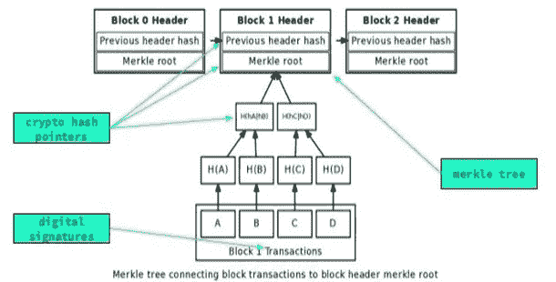

# 区块链底层技术及其在 SCM 上的实现

> 原文：<https://medium.datadriveninvestor.com/the-underlying-technologies-of-blockchain-and-implementation-on-the-scm-5808df76ecd6?source=collection_archive---------10----------------------->

注:本文根据我在德蒙特福特大学的研究论文撰写，题目是“区块链上的供应链管理”。

> 我从一些文章中看到，人们正在抛弃区块链。这与缺乏监管、环境成本和复杂性有关，但不限于此。尽管如此，我仍然相信这项技术，并试图通过这篇文章让人们了解这项技术有多强大。

Photo by [Pascal Bernardon](https://unsplash.com/@pbernardon?utm_source=unsplash&utm_medium=referral&utm_content=creditCopyText) on [Unsplash](https://unsplash.com/?utm_source=unsplash&utm_medium=referral&utm_content=creditCopyText)

**温柔介绍**
[区块链技术](https://medium.com/@kevianda/blockchain-technology-428f64341f93?source=friends_link&sk=755ce8c3e904421bec4a1eeba7331e67) ( *阅读第一篇*)，定义为没有中心实体的账本。因此，在区块链上进行的交易(以块的形式表示)必须通过网络中大多数参与者的一致同意来验证。

在我的第一篇文章中，我已经向几个行业介绍了区块链的采用，例如医疗保健和供应链管理(SCM) (Wüst & Gervais，2018；Tripoli & Schmidhuber，2018；Siyal 等人，2019)。在医疗保健领域，基本上，它可以用于合并患者的临床记录，并以实时方式显示。此外，信息技术最有用的应用之一是对供应链管理，因为它可以提高效率，透明度和信任。但是，在进入这一部分之前，我们需要首先了解基础知识。我意识到，在我的第一篇文章中，我没有具体解释所有的底层技术。因此，我将在下一部分简要解释这些概念。

*   **哈希函数，**将输入作为任意长的消息字符串，然后将其映射到固定 k 长度消息的函数(ISO，2016)。散列函数对区块链很重要，因为它是区块链体系结构的支柱，以确保事务的不变性。
*   **Merkle Trees** ，这是一种数据结构，其中每个叶子节点包含一个数据块的散列。在区块链中，它们对于证明数据的完整性及其效率至关重要。它之所以有效，是因为树的结构映射了大量的事务，并将这些事务放在一个块中(Merkle 根)。举例来说(见图 Merkle 树)，假设有四个交易。每两个事务被单独散列，结果被存储在每个叶节点中。然后，每个结果被再次散列，因此将有两对散列函数。这两对然后再次散列，直到成为一个根树称为 Merkle 根。Merkle 根与块头和最后一个块的先前散列一起放入块中。每个街区都是相互连接的，因此有了区块链。

Merkle Trees (Kozliner, 2017)

*   **数字签名**，说到数字签名，我们首先要了解一下非对称加密(又名公钥加密)。基本上，非对称加密是一种由公开密钥和私有密钥组成的算法，公开密钥对每个人都是可见的，私有密钥只对所有者可用。你可能想知道数字签名、非对称加密和区块链之间的关系。是的，数字签名是不对称加密的应用。它是一种在消息或文档中提供真实性和完整性的技术。根据区块链的概念，用户的公钥是他们的区块链钱包(如比特币或以太坊地址)，每个人都可以看到。这个概念中的私钥用于对交易进行数字签名，以确保特定的交易确实是由发送者生成的，并且安全地存储在加密钱包中。

 [## 数字货币、区块链和货币的未来|数据驱动的投资者

### “区块链”、“加密货币”、“令牌化”，以及现在的“央行数字货币”已经成为…

www.datadriveninvestor.com](https://www.datadriveninvestor.com/2020/02/18/digital-currencies-blockchain-and-the-future-of-money/) 

**共识机制**
既然我们已经涉及了一些基本原理。您可能会想，当区块链网络拓扑中没有中心机构时，验证过程是如何进行的呢？答案是共识机制，这是一种通过等待网络中大多数实体的确认来达成一致的机制。这种机制也是防止欺诈交易的答案(Kubilay 等人，2018 年)。有许多协商一致机制。然而，本文只涉及拜占庭容错(BFT)、工作证明(PoW)和利益证明(PoS)。

拜占庭容错协议(BFT)是一种尽管某些节点可能被篡改但仍能达成共识的协议。明确地说，1/3 的节点同时被破坏(郑等，2017)。我们也可以说，BFT 并没有完全去中心化，因为它有一个“领导者”给予网络中其他实体读写事务的访问权限。

另一种共识机制被称为工作证明(PoW ),由著名的加密货币比特币实现。当有人试图解决一个所谓的“数学问题”或人们称之为难题时，POW 就会起作用，以便向链中添加新的块。问题的解决基本上是他们所做的事情的证据或证明。因此，你在成功地解决难题之后得到证明。注意，这个难题是 SHA-256 输出的代码，用户试图通过添加一个名为 nonce 的新字段来找到一定数量的前导零。同样，这种机制也有几个问题。他们最大的问题是确认速度慢，每秒只有 7 笔交易，还有能耗问题(Arabaci，2018)。

PoW 的替代方案是利益证明(PoS ),它来自于利益的概念。人们投入的资金越多，他们选择增加新区块的变化就越大(Yaga 等人，2008)。这就是 PoS 不需要昂贵的计算资源的原因，因此能够解决来自 PoW 的能量问题。

以下是这些共识的一些实际实现:

*   BFT:瑞波、科达、定额组
*   PoW:比特币
*   位置:卡尔达诺

我们已经设法解决了一些技术问题。现在，是时候转向金融交易以外的对区块链有利的方面了。

**面向供应链管理的区块链。**
我先从 SCM 的定义说起。这是从一个业务职能到另一个业务职能的战略，提升了商品、服务和信息对客户的价值(扬维尔-詹姆斯，2012)。供应链管理的主要目标是增加价值或最大化供应链中的所有流程，以向客户提供最好的产品或服务(Shukla 等人，2011)。供应链管理的重点是管理实体间的关系，为最终客户提供产品或服务的最佳价值，它显然强调合作，如果不是沟通的话。但是，传统的供应链管理有许多局限性。这方面的一个例子是牛鞭效应:一种信息不准确、缺乏透明度以及生产和实时信息之间缺乏同步的现象(Aprile & Garavelli，2007)。但是，关键的部分是传统的供应链管理仍然依赖于一个集中的系统。现在，如果中心节点受到攻击，比如说数据泄露，那么它会影响到 SCM 中的其他进程。

区块链在解决之前提到的一些问题方面发挥了作用。通过提供端到端的可见性，可以在 SCM 中使用区块链的透明性，以在成员之间共享安全的信息，并且将达到 SCM 中每个过程的可追溯性。我知道它仍然有点模糊，所以，这里是一些以区块链为基地的供应链管理的显著例子

*   [VeChainThor](https://www.vechain.org/) :在温控(冷链)物流中，如海鲜或冷冻食品，需要保温和冷冻包装时，区块链和物联网的集成。物联网传感器用于实时跟踪产品的关键湿度、温度和位置等信息。信息被上传到 VeChainThor 区块链，这对所有 SCM 成员都是显而易见的。
*   [安布罗斯](https://ambrosus.com/):它之前在以太坊上，集成了物联网设备来记录信息。然而，在 2019 年 4 月，他们发布了自己的区块链网络和令牌，能够连接到以太坊主网络。安布罗斯建造了一个令牌桥，作为以太坊主网络的连接器，能够将 AMB 令牌转移到以太坊，反之亦然。

在区块链的供应链管理中有很多可能性。事实上，研究人员仍在努力寻找这种情景的最佳方式。更不用说其他可能从区块链技术中获益的行业了。总之，区块链仍然显示出一些有前途的特点，因为它被认为是颠覆性的技术，可能会扰乱人们的生活(当然是以好的方式)，类似于互联网。

**参考文献**

阿普里尔，d .和加拉维利，2007 年。*减少牛鞭效应:供应链柔性的影响。*巴里，第 19 届国际生产研究会议。

阿拉巴奇，o，2018。区块链共识机制:自然灾害的案例。

ISO，2016。*信息技术。瑞士专利申请号 ISO/IEC 10118-1:2016。*

扬维尔詹姆斯，上午，2012 年。供应链和供应链管理新论:定义和理论视角。*国际商务研究，* 5(1)。

Kozliner，e .，2017。*默克尔树游戏攻略。*【在线】见:[https://hacker noon . com/merkle-tree-introduction-4c 44250 e2da 7](https://hackernoon.com/merkle-tree-introduction-4c44250e2da7)【2019 年 3 月 21 日获取】。

Kubilay，M. Y .，Kiraz，M. S .和 Mantar，H. A .，2018。Certledger:基于区块链的证书透明的 PKI 新模型。

舒克拉，R. K .，加尔格，d .和阿加瓦尔，a .，2011 年。供应链的理解:一个文献综述。*国际工程科学与技术杂志，* 3(3)，第 2059–2071 页。

Siyal，a .等人，2019 年。区块链技术在医学和保健中的应用:挑战和前景。*密码学，* 3(1)。

的黎波里，m .和 Schmidhuber，j .，2018 年。区块链在农业食品行业应用的新兴机遇。

Wüst，k .和 Gervais，a .，2018 年。*你需要区块链吗？。* Zug，2018 密码谷区块链技术大会(CVCBT)。

Yaga，d .，Mell，p .，Roby，n .和 Scarfone，k .，2008 年。*区块链技术概述，* s.l .:美国国家标准与技术研究院。

郑，z 等，2017。区块链技术概述:架构、共识和未来趋势。