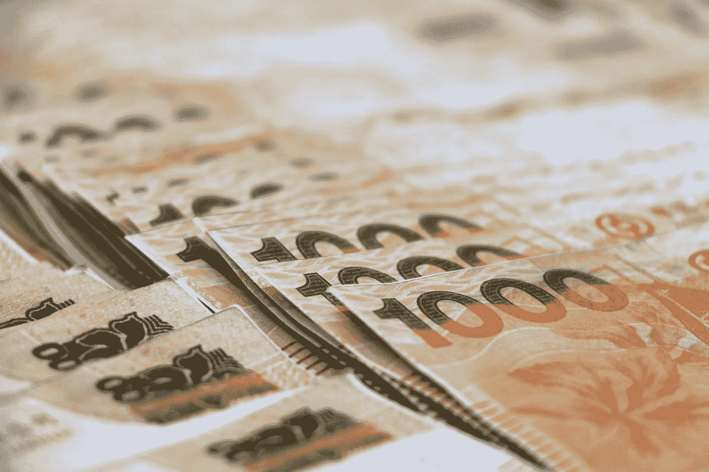

# 被低估的技能——金融知识

> 原文：<https://medium.datadriveninvestor.com/the-underrated-skill-financial-literacy-1e917bcde00?source=collection_archive---------21----------------------->

> 学历很重要，金融教育也很重要。它们都很重要，但学校却忘记了其中一个——罗伯特·清崎

Photo by [Icons8 team](https://unsplash.com/@icons8?utm_source=medium&utm_medium=referral) on [Unsplash](https://unsplash.com?utm_source=medium&utm_medium=referral)

在大多数文化中，谈论金钱是一种耻辱。与过去不同，在当今时代，金钱变得像水一样滋养灵魂，像食物一样不可或缺，是维持生命的必要条件。

到目前为止，我认为很少有人对我的假设感到沮丧。夸张地谈论它会让所有的目光都敬畏地转向那个人。

掌握财务知识是一项重要的生活技能。然而，它经常处于模糊的视野之下。它被缩小了。无论年龄、文化和财务背景如何，每个人都应该掌握财务知识。

# 什么是金融素养？

Photo by [Kelly Sikkema](https://unsplash.com/@kellysikkema?utm_source=medium&utm_medium=referral) on [Unsplash](https://unsplash.com?utm_source=medium&utm_medium=referral)

为了自己的财务健康而巧妙地赚钱、预算、储蓄、投资、获取收益和保持金钱的能力被称为**“财务素养”**。

我们中的一些人可能仍然觉得这是生活中微不足道的一面。我们就事论事吧。

# 为什么要金融素养？

阅读以下案例，了解财务知识对每个人至关重要，直到他们生命的最后一口气。

**场景 1:**

Photo by [Chris Benson](https://unsplash.com/@lordmaui?utm_source=medium&utm_medium=referral) on [Unsplash](https://unsplash.com?utm_source=medium&utm_medium=referral)

*你是一个 45 岁的男人，努力工作养家，你强烈希望给你的孩子最好的教育。然而，你没有一个适当的 SIP(系统投资计划)计划或银行账户中的储蓄来资助你孩子的教育，把一切都花在不必要的开支和炫耀的小玩意上。你不是让你的孩子失去了一个探索世界一流教育标准的机会吗？*

**场景二:**

Photo by [Tuva Mathilde Løland](https://unsplash.com/@tuvaloland?utm_source=medium&utm_medium=referral) on [Unsplash](https://unsplash.com?utm_source=medium&utm_medium=referral)

你有一份高薪工作，在二三十岁时挥霍金钱。你有一个生病的妻子，她正在努力生活，而你没有足够的钱来支持她的治疗，这将花费巨大的金额。你既没有任何应急基金，也没有以她的名义支付任何健康保险。你淹没在无助的海洋中，痛哭流涕，看着你妻子的健康状况迅速恶化。

**情景三:**

Photo by [Mykyta Martynenko](https://unsplash.com/@cooper301?utm_source=medium&utm_medium=referral) on [Unsplash](https://unsplash.com?utm_source=medium&utm_medium=referral)

在你工作的几年里，你没有注意参加任何退休基金计划，你把每一分钱都花在娱乐和负债上。你建造了一栋奢华的房子，拥有一支超豪华的高端车队。在你年老的时候，你破产了，挣扎着维持生活。

**情景四:**

Photo by [Vitaly Taranov](https://unsplash.com/@gooner?utm_source=medium&utm_medium=referral) on [Unsplash](https://unsplash.com?utm_source=medium&utm_medium=referral)

你可以选择将至少 20%的收入存入定期存款，但你却将钱花在了自己的时尚和爱好上。你太过冲动购物，一时冲动买下脑海中闪现的所有东西。你用完了你的现金储备，你缺少日常开支的钱。

**情景五:**

Photo by [Melinda Gimpel](https://unsplash.com/@melindagimpel?utm_source=medium&utm_medium=referral) on [Unsplash](https://unsplash.com?utm_source=medium&utm_medium=referral)

*因为你每个月都会收到一大笔薪水，所以你开始购买每一个进入市场的新产品，并且通过 EMIs 和贷款购买所有东西。最终，你陷入了可怕的困境，背负着堆积如山的排放管理信息、超出你所借本金的巨额利息以及不断上涨的信用卡账单。*

**场景 6:**

Photo by [Scott Graham](https://unsplash.com/@homajob?utm_source=medium&utm_medium=referral) on [Unsplash](https://unsplash.com?utm_source=medium&utm_medium=referral)

你从祖先那里继承了很多财富。然而，你家里的一个贪婪的人编造了关于未知费用、罚款和对你的资产或财产收费的故事。你相信他或她。他们伪造了你的签名，没收了你所有的资产，让你陷入困境。

**场景 7:**

Photo by [Adam Nowakowski](https://unsplash.com/@adamaszczos?utm_source=medium&utm_medium=referral) on [Unsplash](https://unsplash.com?utm_source=medium&utm_medium=referral)

当你听说你的同行通过投资股票获得了巨额利润时，你被交易所诱惑。然而，你不知道阿尔法和贝塔关于股票和股份，你得出结论投资你的血汗钱在股票上。你收到陌生联系人发来的关于投资的随机短信，天真地给他们汇钱，让他们代你交易。几天后，你所有的投资都化为乌有。

**场景 8:**

Photo by [Sharon McCutcheon](https://unsplash.com/@sharonmccutcheon?utm_source=medium&utm_medium=referral) on [Unsplash](https://unsplash.com?utm_source=medium&utm_medium=referral)

*有许多与金融相关的术语。大多数你听了无数遍，但从来没有注意去了解它们的意思。阿尔伯特·爱因斯坦曾经说过，“宇宙中最有力的工具是复利”。你通过一个随机的人的引导把钱投了复利，却不知道单利和复利的区别。代表你投资的人拿走了投资本金的复利，诈骗者以单利支付给你。*

浏览了几个例子后，事实是“金融知识是人类生存不可或缺的”。 大萧条如何激励人们走向财务安全，柯维德·疫情强调了知道如何赚钱的重要性。

现在！做好准备，掌握财务知识，实现财务自由。遵循以下步骤，释放你的力量，征服从业余爱好者到有能力处理财务的追求。

*   **赚钱**

当你不知道产生收入的各种方式时，赚钱是一项艰巨的任务。当今世界有无数种赚钱的方法，缺少的是关于各种收入类型的知识，你必然要承担的风险，以及你可以从中享受的额外津贴。下面我们来探究几个。

***主动收入***

Photo by [Andrew Neel](https://unsplash.com/@andrewtneel?utm_source=medium&utm_medium=referral) on [Unsplash](https://unsplash.com?utm_source=medium&utm_medium=referral)

从事某项工作或经营某项业务所产生的收入可被标记为**“主动收入”**。工作(任务)和收入(金钱)是相互关联的。你工作，你收获。你停止工作，你停止赚钱。

这是大部分人口的主要收入来源。大多数人热衷于工作，并在很大程度上从他们的工作或业务中获得收入，他们没有调整他们的思想来探索各种其他的收入来源。积极收入的例子包括在一家知名软件公司做全职员工，或者在当地或全球范围内经营一家企业。

***被动收入***

Photo by [Cedar Aran](https://unsplash.com/@clacino?utm_source=medium&utm_medium=referral) on [Unsplash](https://unsplash.com?utm_source=medium&utm_medium=referral)

需要你付出微不足道或最小的努力来赚钱的收入被称为**“被动收入”**。然而，这并不意味着你不需要投入哪怕是一毛钱或饲料。要从被动收入流中获得稳定的收入，需要坚持不懈的努力，在某些情况下，可能是初期阶段的前期投资。

***利息收入***

Photo by [Macau Photo Agency](https://unsplash.com/@macauphotoagency?utm_source=medium&utm_medium=referral) on [Unsplash](https://unsplash.com?utm_source=medium&utm_medium=referral)

你把钱放在某个地方定期收到的奖励。这笔钱在一定的时间间隔内支付，可以是每月、每季度、每半年或每年支付一次，称为**“利息收入】**。收入来自于你借给别人的钱，或者你在银行的定期存款或储蓄账户，或者你存入的政府债券。考虑到所涉及的有限的下行风险，回报的金额是公平的。最重要的是，投入的资金有保障。

***股息收入***

Photo by [Jp Valery](https://unsplash.com/@jpvalery?utm_source=medium&utm_medium=referral) on [Unsplash](https://unsplash.com?utm_source=medium&utm_medium=referral)

以每股为基础向股东支付的现金被称为**“股息收入】**。它通常在公司盈利时支付，也不是强制要求公司每年支付股息。股息可以在一年中的任何时候支付。如果在财政年度支付股息，则称为“中期股息”。如果在财政年度结束时支付股息，则称为“*末期股息*”。

***租金收入***

Photo by [Alex Block](https://unsplash.com/@alexblock?utm_source=medium&utm_medium=referral) on [Unsplash](https://unsplash.com?utm_source=medium&utm_medium=referral)

你因出租或出租你的房子或商业空间或空地而收到的钱被称为“租金收入”。

***版税收入***

Photo by [Alec Favale](https://unsplash.com/@alecfavale?utm_source=medium&utm_medium=referral) on [Unsplash](https://unsplash.com?utm_source=medium&utm_medium=referral)

版税收入是指允许他人使用你的财产或物品而获得的收入。特许权使用费是为专利、版权作品、自然资源或特许权的使用而支付的。版税金额通常是所产生收入的百分比。

例如，你开始了你的特许经营，人们可以用你的特许经营的名义做生意。他们必须为每月产生的收入支付 25%的版税。

***资本收益收入***

Photo by [Alexander Schimmeck](https://unsplash.com/@alschim?utm_source=medium&utm_medium=referral) on [Unsplash](https://unsplash.com?utm_source=medium&utm_medium=referral)

资本收益收入是从出售房地产、投资或个人财产中获得的利润。

X 先生在 2018 年以 300，000 美元购买了一块海滨土地，现在在 2021 年，他以 5，50，000 美元出售了这块土地。因此，他获得了 250，000 美元的资本收益。

*   **预算**

预算是财务管理中最重要的因素。

Photo by [Kelly Sikkema](https://unsplash.com/@kellysikkema?utm_source=medium&utm_medium=referral) on [Unsplash](https://unsplash.com?utm_source=medium&utm_medium=referral)

每个人心中都应该有一个特定的数字，并且应该能够将他们的支出控制在设定的限度内。

创建支出或预算的思维导图是不值得的。使用财务应用程序、电子表格或日志来记录所有费用。用眼睛看到费用和想象并在心里计算费用是完全不同的。有一个预算，并努力坚持支出的阈值，以确保良好的财务健康。

*   **保存**

Photo by [Michael Longmire](https://unsplash.com/@f7photo?utm_source=medium&utm_medium=referral) on [Unsplash](https://unsplash.com?utm_source=medium&utm_medium=referral)

至少把你月收入的 20-30%存起来。问题从来不会敲你的门，给你时间开始与它们战斗。应急基金是至关重要的，它是成功撕开乌云的战斗者，让你看到希望的曙光。

你的大部分现金储备会因为你不知不觉地放纵自己的挥霍而耗尽。渴望成为一个有意识的消费者，不要感情用事，不要冲动购物。需求和欲望之间应该有一条细微的分界线。

例如，你有一个在线演示文稿要发表，你需要一件正式的白衬衫。打算买一件非品牌白衬衫一次性使用是一种需要。想买一件路易·菲力浦衬衫是一种欲望。

*   **投资**

Photo by [MayoFi](https://unsplash.com/@mayofi?utm_source=medium&utm_medium=referral) on [Unsplash](https://unsplash.com?utm_source=medium&utm_medium=referral)

投资是一生的事情。你不能说你会在某项资产上获利，然后懒洋洋地躺在沙发上嚼薯片，把钱浪费在短期的享乐上。在某个时候，你会花光所有的钱，努力让收支平衡。有几项投资需要考虑。有无数可供选择的投资，你可能会不知如何选择你的投资组合。你可能听说过股票、定期存款、公寓、土地或黄金投资。让我通过各种参数来阐明它们。

***股权***

股权包括购买上市公司的股票。没有资本担保，但回报可能非常诱人。资本的内在风险很高。

***固定收益工具***

固定收益工具包括投资银行定期存款、政府或私人公司发行的债券。有资本担保，但回报有限。这项投资的下跌风险有限。

***房地产***

房地产涉及买卖土地(地块、农田)、商业空间或住宅建筑。有资金保障，回报通常很大。房地产的两个收入来源是资产的租金收入或房地产本身的资本增值。

***贵金属***

投资黄金和白银可以通过珠宝或交易所交易基金(ETF)或政府发行的黄金债券的形式进行。这是最安全的投资选择。投资黄金有各种方式，如实物金条、黄金交易所交易基金、黄金期货合约、黄金矿业股票和黄金流动公司。这些选择各有利弊。考虑到他们想要的回报和风险偏好，投资于他们认为合适的地方是个人的选择。

*   **收获利益**

Photo by [STIL](https://unsplash.com/@stilclassics?utm_source=medium&utm_medium=referral) on [Unsplash](https://unsplash.com?utm_source=medium&utm_medium=referral)

直到现在，你可能会觉得自己被束缚住了，生活受到了限制。不能享受生活还有什么乐趣？用你从投资中获得的部分回报，以你希望的方式花钱，而不影响你的本金。

金钱和财富是两种不同的东西。是啊！他们确实是不同的。金钱是一种你会花掉的东西，它会随着时间的流逝而消失，就像夏天里池塘里的水一样。财富就像你头顶水箱里的储备水。

*   **维护货币**

Photo by [Macau Photo Agency](https://unsplash.com/@macauphotoagency?utm_source=medium&utm_medium=referral) on [Unsplash](https://unsplash.com?utm_source=medium&utm_medium=referral)

就像你身体的所有器官都需要运转才能生存一样，你需要时刻警惕你的财务状况以维持金钱。如果你放弃赚钱、预算、储蓄或投资，你会赔钱，你的财务健康也会受到影响。因此，它会让你的生活变得颠簸，就像高速公路上的巡航一样！

# 外卖

打破那些将你锁在黑暗中，不知道财务的深度和广度的无知之门，走向从门缝中伸出的光线，欢迎你微笑，欢笑，过着充满和平与幸福的生活。