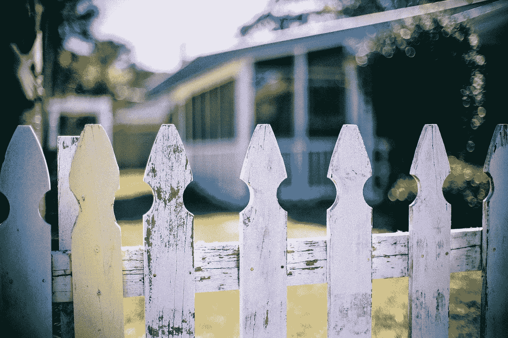

# 意想不到的邻居

> 原文：<https://medium.datadriveninvestor.com/the-unexpected-neighbour-c1d8beea0b05?source=collection_archive---------16----------------------->

我们搬进新房子还不到两个月，在狭小的卧室里住了 13 年后，我们最终决定搬出去。

新房子多了一个房间，这是我第一次有自己的房间，之前我睡在地板上，最终买了一张小床来安慰自己。我们喜欢这里的氛围，房东也是善良的人，现在一切都很好。

由于我们住在市中心，这里的房子相互之间非常拥挤。你可以直接跳到邻居家，把他们吓得屁滚尿流。

从阳台往外看，我们可以看到我们对面邻居的房子。我很想和他们搭讪，但似乎从来没有发生过。不过，在我们的老房子里，我们和邻居没有太多的互动，因为这是一个新的地方，我试图保持良好的关系。

 [## 自然中的创新:改变企业的生活史战略方法|数据驱动…

### 在我们这个时代，每个人都以谷歌、亚马逊或苹果为例谈论创新。在这些会谈中，创新…

www.datadriveninvestor.com](https://www.datadriveninvestor.com/2020/11/20/innovation-in-nature-a-life-history-strategy-approach-to-change-your-business/) 

日子一天天过去，我开始注意到一个 22 岁左右的小伙子住在那里，他和我年龄不一样。我试图抓住机会和他交谈，但这只是一场球赛。

从我自己的角度来看，我建立了一个形象，认为他是一个自私和愤世嫉俗的家伙。人们说不要以貌取人，我也陷入了同样的陷阱。我有这种预先判断人的态度，事先和 80%的时间，它走对了，但不是这次。

今天，由于龙卷风的问题，整条街都停电了。我坐在外面继续我每天的看书，享受着外面清新潮湿的空气。

突然，那个家伙从他的房子里出来，假装享受新鲜的微风。

我现在很自我，犹豫着要不要出现和开始一段对话，希望他能提出一个。令人惊讶的是他做到了。这是我内心的怪异时刻，我对他的谎言被证明是胡说八道。

然后我们开始了一个多小时的谈话，这是我做梦也没想到的。我们聊了科技，聊了人工智能，聊了足球，聊了所有我觉得他不会的可能。这是一种快乐，同时也感觉到我的预判起了作用。

这件事给了我一些教训，这是我必须自己解决的问题。我们生活中的每一件小事都可以给我们宝贵的教训，但前提是我们愿意接受自己的错误。

那是我意想不到的邻居的故事，你有吗？

## 访问专家视图— [订阅 DDI 英特尔](https://datadriveninvestor.com/ddi-intel)