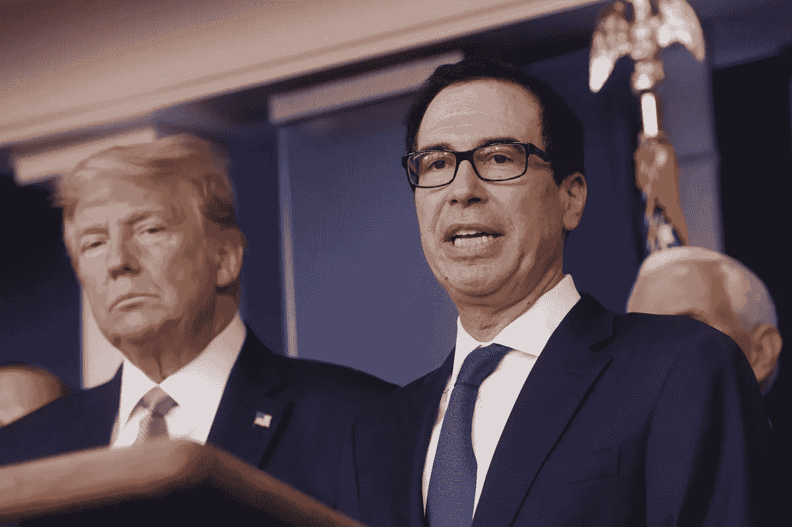

# 美国即将直接向其公民转移资金

> 原文：<https://medium.datadriveninvestor.com/the-united-states-is-about-to-directly-transfer-money-to-its-citizens-a9d9ee0c53b4?source=collection_archive---------22----------------------->

## 自下而上刺激需求的经济刺激

[Trump (left) and United States Secretary of the Treasury Steven Mnuchin (Right)](https://www.scmp.com/news/world/united-states-canada/article/3075649/coronavirus-white-house-stimulus-plan-offset)

由于 COVID-19 造成的隔离和恐惧导致了经济衰退，导致了恐慌性购买和产品需求的下降。由于这一点，以及越来越少的雇员去工厂和公司生产产品的事实，由于企业在这一时期削减成本，失业率缓慢上升。为了稳定经济，世界各国政府都宣布了一揽子援助计划、延期征税和其他支持计划。

在美国，将资金从政府直接转移到公民手中以刺激需求的想法越来越受欢迎。这个过程在 21 世纪发生过两次。第一次是在 2001 年，第二次是在 2008 年经济衰退期间。寄支票而不限制支出的意义在于，个人在当地消费，从而为经济提供必要的提振，并帮助缓冲经济衰退的影响。西北大学的 Jonathan Parker 得出结论，2008 年经济衰退期间出台的刺激计划有助于缓冲经济衰退的影响，但不足以避免严重的衰退。

 [## 保护主义、政治和经济动荡|数据驱动的投资者

### 美国股市昨日出现 400 多点的大幅反转，为未来的事情发出了警告信号。市场…

www.datadriveninvestor.com](https://www.datadriveninvestor.com/2018/06/28/protectionism-politics-economic-turmoil/) 

这一次，美国将面临类似的挑战。政府可以直接把钱转给个人，但是，他们不能让他们出去(或上网)买东西。即使当人们使用钱的时候，他们也只是为了基本的东西，比如食物、还债、存钱等等。然而，为了让经济复苏，phones、汽车、旅游和燃料(人们在基本需求得到满足后购买的东西)等产品的销售必须恢复到原来的水平。这将是一个棘手的问题。然而，当整个经济面临“维持运转”的严峻任务时，突然增加每个人银行账户中的资本可能会维持运转。