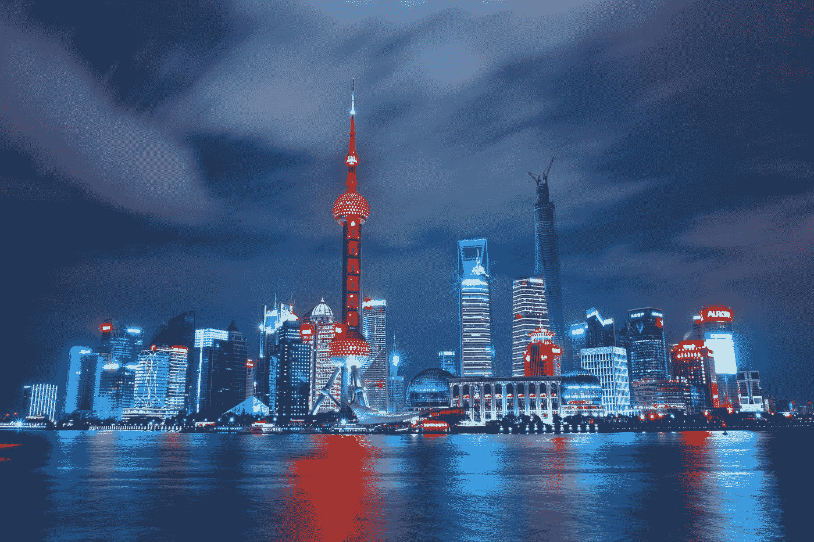

# 美国对中国…预测结果如何？

> 原文：<https://medium.datadriveninvestor.com/the-united-states-vs-china-whats-the-prognosis-5be8c139bd14?source=collection_archive---------14----------------------->

## 美国注定要成为失败者吗？

Shanghai at night. Photo by [Li Yang](https://unsplash.com/@ly0ns?utm_source=medium&utm_medium=referral) on [Unsplash](https://unsplash.com?utm_source=medium&utm_medium=referral)

早在 20 世纪 90 年代初，当我还是一个年轻得多的人，在华盛顿担任国会工作人员时，我目睹了一场听证会，这场听证会至今仍历历在目。在一个清晨的会议上，我老板所在的委员会听取了美国竞争力专家的意见。在听到一个又一个目击者说美国注定要落后于日本后，其中一名成员用语言表达了我们许多人当时的感受:“今天早上醒来时，我心情非常好。”

那天早上，我们带着沮丧和气馁离开了听证室。当然，我们无法知道将要发生什么。1991 年听证会后的几个月内，美国在许多方面掀起了一场革命，其破坏性不亚于印刷机的发明。这个时代的互联网和技术革命将启动美国历史上最长的经济扩张，直到 2019 年 7 月，从 1991 年到 2000 年，美国国内生产总值(GDP)几乎翻了一番，平均增长率为 3.85%。

与此同时，日本进入了以通货紧缩压力为特征的长期衰退。即使是现在，日本经济仍未恢复到上世纪七八十年代的水平。

对于那些像我一样记得那个时代的老人来说，那是一个可怕的时代。我记得福特汽车公司的广告宣传他们对“质量是第一位的”的承诺，因为美国汽车制造商试图阻止日本汽车的冲击。1985 年，美国三大汽车制造商，通用、福特和克莱斯勒，控制了 73%的美国汽车市场。现在，他们努力在我们国家销售 35%的汽车，比通用汽车曾经控制的比例要小得多。

虽然汽车行业已经被泛太平洋竞争所改变，但世界经济已经被美国领导的技术革命所改变。正如任何此类经济变革一样，赢家和输家已经产生。在某些方面，导致特朗普主义崛起的美国白人工人阶级的挫败感始于那个时代。然而，平均而言，美国在 20 世纪 90 年代的繁荣程度是几十年来从未有过的。

Now it is the United States that is struggling to regain that economic mojo. And rather than Japan, we now look at China with trepidation. With a [population](https://www.worldometers.info/world-population/population-by-country/) four and a third times the size of ours, and a [growth rate](https://www.everycrsreport.com/reports/RL33534.html#_Toc12530837) that has not dropped below 6 percent since 1991, we have good reason for concern. In this world where power derives from economic strength, the size of China’s economy is [projected](https://www.cnbc.com/2020/12/26/china-set-to-surpass-us-as-worlds-biggest-economy-by-2028-says-report.html) to eclipse our own in just seven years.

China is feeling strong. Its leader, Xi Jinping has [acted aggressively](https://news.yahoo.com/coming-global-backlash-against-china-113024712.html), bullying its neighbors, embezzling from foreign firms, and projecting strength into remote regions such as sub-Saharan Africa. And with Trump’s largely successful efforts to abdicate American global leadership, he has created a vacuum that has allowed China to step in.

And yet, I can’t help but feel like I’ve been here before. The predictions of American economic decline were overstated in 1991, maybe they will be again. That is my hope.

当然，我们有一些必须解决的问题。自大萧条以来，我们对教育资金，尤其是 T2 高等教育资金的冲击有增无减。与此同时，我们使移民来 T4 变得更加困难，收入不平等达到了几乎空前的高度，我们允许产业在少数公司的控制下进行整合。通过这种方式，我们在相对于其他国家的竞争优势方面步履蹒跚:我们的高等教育体系、移民将他们的精力和想法带到这里的能力、我们允许各种背景的人参与我们经济的意愿，以及我们市场的活力。这些因素结合在一起，创造了世界上其他任何地方都无法比拟的创新和创造力水平。

然而，通过我们的政策，我们正在放弃这些优势。这些趋势产生了一个令人不安的结果。在这里，在企业家资本主义的故乡，企业家精神一直在稳步下降，从 1978 年到 2011 年下降了大约 50%

 [## 利用区块链构建可持续循环经济|数据驱动投资者

### 自从工业革命开始以来，全世界都关注产品的生产和消费。很少或…

www.datadriveninvestor.com](https://www.datadriveninvestor.com/2020/11/17/building-sustainable-circular-economy-with-blockchain/) 

与中国的潜在弱点相比，美国的这些潜在优势尤其强大。2014 年，*哈佛商业评论*发表了一篇[的文章](https://hbr.org/2014/03/why-china-cant-innovate)，题为《为什么中国不能创新》这篇文章的主旨是，中国几十年的研究和技术投资未能产生美国历史上存在的那种活力。作者认为，这种缺陷的原因是政府没有能力放开权力杠杆，从而允许创新蓬勃发展。请记住，政府向私人活动开放互联网(这在很大程度上要感谢阿尔·戈尔)推动了美国上一个时期的非凡创新和增长。中国不会允许这种情况发生。

我们到处都能看到中国社会压制创新的铁腕证据。Xi 进行了名副其实的恐怖统治，[清洗了 150 多万政府官员、军事领导人和政党精英。任何通过自己的努力变得富有和成功的人都成为目标。看看中国最重要的企业家之一马云身上发生了什么。](https://news.yahoo.com/coming-global-backlash-against-china-113024712.html)

两国的分歧不仅仅是政策上的分歧。根据他在 IBM 不同部门工作的经验，荷兰社会学家海尔特·霍夫斯泰德确定了定义国家文化的六个维度。中国和美国在个性与集体主义、长期取向、放纵与克制以及权力距离等维度上表现出巨大差异。换句话说，在美国，我们的文化尊重人们独立行事，注重产生短期效果，行动而不是思考，尊重所有人，不管他们的立场如何。然而，中国在所有这四个维度上都采取了相反的立场。

我在收音机里听到了这样一个例子。NPR 市场节目采访了前美联储主席本·伯南克和前财政部长蒂姆·盖纳和汉克·保尔森。主人问他的客人是否可以直呼其名而不是头衔。三个人都欣然同意。这是美国式低动力距离理想的一个例子。在大多数其他国家，拥有如此显赫背景的人会希望别人称呼他们的头衔，以反映他们认为应得的尊重。但不是在这里。这是不同文化的一个例子。

进一步举这个例子，那么，在美国，看门人可以带着想法去找 CEO。事实上，管理学者亨利·明茨伯格指出，大约 40%的美国战略思想来自公司内部的运作，而不是由领导层设计的。中国和其他国家的实力差距更大，它们将自己封闭在这种创造性投入之外。

这些差异肯定会带来负面影响。最近的 covid 危机为我们提供了一个恰当的例子。虽然中国能够扭转经济和文化的颓势，迅速隔离病毒，但美国却犹豫不决，争论不休，把简单的戴口罩变成了政治声明。这是我们痴迷于独立而非集体主义的负面后果。与此同时，正是这种独立性，在某种程度上，允许创新和创造力蓬勃发展。我们尊重破坏规则的人，我们“想法不同”这些都不是中国的价值观。

有人认为 Xi 的强硬行动代表了中国面临人口危机的最后一搏，就像日本一样(见海伦·罗利的书，*反弹:中国的侵略如何适得其反*)。更重要的是，Xi 已经将刺激创新作为 T4 的优先事项。但你不能强加创新；它来自一种重视来自意想不到的来源的自由思想的文化。

如果我们作为一个国家能够解决我们的挑战，重振我们的经济，没有什么可以阻止我们。但如果我们继续踩着自己的优势蹒跚前行，中国也没什么好怕的。

**访问专家视图—** [**订阅 DDI 英特尔**](https://datadriveninvestor.com/ddi-intel)