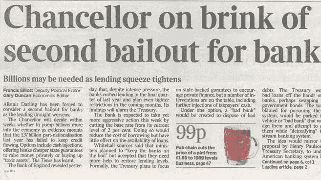

# 华尔街和区块链不太可能的联姻

> 原文：<https://medium.datadriveninvestor.com/the-unlikely-marriage-between-wall-street-and-blockchain-df067453ebb8?source=collection_archive---------24----------------------->

## **曾经势不两立的金融机构和区块链现在比以往任何时候都更需要对方**

在大萧条的余波中，中本聪发布了代码，展示了一个分散的、点对点的货币收发系统，在这个过程中彻底改变了金融。这个新系统的核心是被称为区块链的底层技术，这种新系统为他称为比特币的数字货币提供了动力，这是一种分布式的数字账本，将由其社区而不是银行来维护。

区块链的起源是对银行及其支持的系统的反抗。在第一个比特币区块——包括使用这种新货币进行的第一笔交易的数字分类账条目——中，Satoshi 写道:“泰晤士报 03/1/2009 财政大臣处于对银行的第二次救助的边缘。”这是 Satoshi 的说法，即区块链将不得不存在于大银行的控制之外，因为它旨在纠正他们创造的系统的不平等。

随着时间的推移，区块链成功地将金融从中央集权制推向了分权模式。金融去中心化是一个雄心勃勃的项目，似乎与几十年来指导传统金融机构的原则形成了鲜明对比，这些原则赋予它们对影响全球市场的总体决策的控制权。然而，在华尔街和区块链生态系统之间零和竞争的背后，隐藏着一个交叉点，可以利用这个交叉点推动金融业向前发展，从而让所有相关方共同受益。

The Time headline included in the first Bitcoin block

# 为什么区块链需要华尔街

如果你从事金融工作，你第一次听说区块链很可能是在 2017 年。当时，比特币的价格正在飙升，似乎区块链正在接管世界。每个人都在写区块链会如何颠覆工业，永远改变我们做生意的方式。然而，区块链的声誉很快就被加密货币炒作周期中最糟糕的部分所破坏:ICO 爆炸。当泡沫破裂时，散户投资者损失了数百万美元，所有一度流行的加密货币都开始贬值。

在接下来的几年里，全行业的自我反省让投资者得出结论，在项目甚至没有一个可用产品的情况下，就对项目进行数千万甚至数亿美元的估值是愚蠢的。

与此同时，加密货币的低价格导致区块链转移了华尔街的注意力。它不再“性感”了。

The bull is back! Will this time be sustainable?

现在，空气中又有了 2017 年的盛传，原因是 DeFi。DeFi 是“分散金融”的缩写，指的是公共区块链网络上不断增长的金融服务部门。除了储蓄、贷款和交易等传统服务，DeFi 还催生了一类全新的应用，如自动做市商、合成资产和流动性池。该领域最近出现了爆炸式增长，在不到 3 个月的时间里，其持有的基金数量翻了两番。像 Syenthix、Compound、Aave 和向往金融这样的项目正在成为行业宠儿，就像 2017 年的 ICO 国王一样。

然而，这些平台仍然局限于早期采用者、密码分析师和技术修补者的利基市场。根据来自 dApp Radar 的数据，他们每个人都有 1000 到 4000 的周活跃用户，离大规模采用还差得很远。即使是区块链的以太坊(DeFi 的大部分总部所在地)，其账户数量也只有花旗银行的一半。

一个完整的应用网络甚至比不上一家银行，这就是为什么区块链现在需要华尔街。为了确保这一次会有所不同，确保这一次分散发展的结果将是可持续的增长，而不仅仅是一个疯狂的牛市和随之而来的崩盘，区块链和 DeFi 必须寻求华尔街的合作。

在概念层面上，一个真正去中心化的体系似乎无法与掌控全球金融的强大的中央集权政府共存，这使得华尔街和区块链在本质上不相容。然而，在实践中，权力下放并不是二元的。相反，去中心化的范围从比特币和其他加密货币一直延伸到完全集中的传统金融。

# 华尔街为什么需要区块链

顾客，尤其是千禧一代，不信任华尔街。事实上，根据脸书的一项调查，只有 8%的千禧一代信任金融机构。越来越多的年轻消费者选择从金融科技领域购买金融服务，银行面临着保持优势的艰苦斗争。

风险很高。在被称为“巨大财富转移”的过程中，千禧一代将在未来 25 年继承 68 万亿美元。

进入区块链

区块链在金融方面的核心价值主张可以分为三大类:

**透明度:**金融产品或服务执行过程中涉及的每一项行动——无论是发放贷款、交易衍生品还是起草保险合同——都可以在分布式账本上处理，供所有相关方核实。这使得参与欺诈活动变得更加困难。

**自动化协作:**与建立业务关系相关的法律和管理任务现在可以通过智能合同实现自动化，使商业合作变得即时和可信。此外，智能合约可以通过使自动执行合约在满足某些预设条件时立即清算来规避交易对手风险。

**包容性:**“为没有银行账户的人提供银行服务”已经成为区块链业内许多人的口头禅，他们将这项技术的开放性视为一个机会，可以创造一种无需许可的替代传统金融的方式，这种方式更具包容性、透明度和弹性。

谈到 legacy finance 和区块链之间的关系，怀疑正让位于合作，合作正慢慢取代蔑视。例如，摩根大通现在接受加密货币交易所作为客户，从[比特币基地和双子星](https://www.forbes.com/sites/colinharper/2020/05/12/jp-morgan-opens-accounts-for-bitcoin-exchanges--coinbase-and-gemini-up-first/#231a92614026)开始，并继续朝着推出自己的 JPM 硬币的方向发展。就在一年前，他们的首席执行官称比特币是“比郁金香球根更糟糕的欺诈”。

# **从暗网到会议室**

区块链最初是一个地下运动，目标是将货币和国家分离，并减少银行在真正去中心化的金融系统中的作用。尽管围绕这一领域的技术和监管都已成熟，但鸿沟两边的某些利益相关者仍专注于不可逾越的文化和技术鸿沟，将两个世界分隔开来。

然而，呼吁合作的声音越来越大，因为华尔街和区块链行业都开始意识到，建立融洽的关系可能对双方都有利。通过靠近两者之间的中心交汇点，华尔街可以找到一个蓬勃发展的金融创新生态系统，而区块链公司则刺激一些急需的产品被采用。这是双赢的局面。

***我知道你对此有意见。为什么不发表评论，我们可以说唱？关注我的***[***Twitter***](https://twitter.com/TimmyCheeky)***也一样，我经常在那里厚颜无耻。***