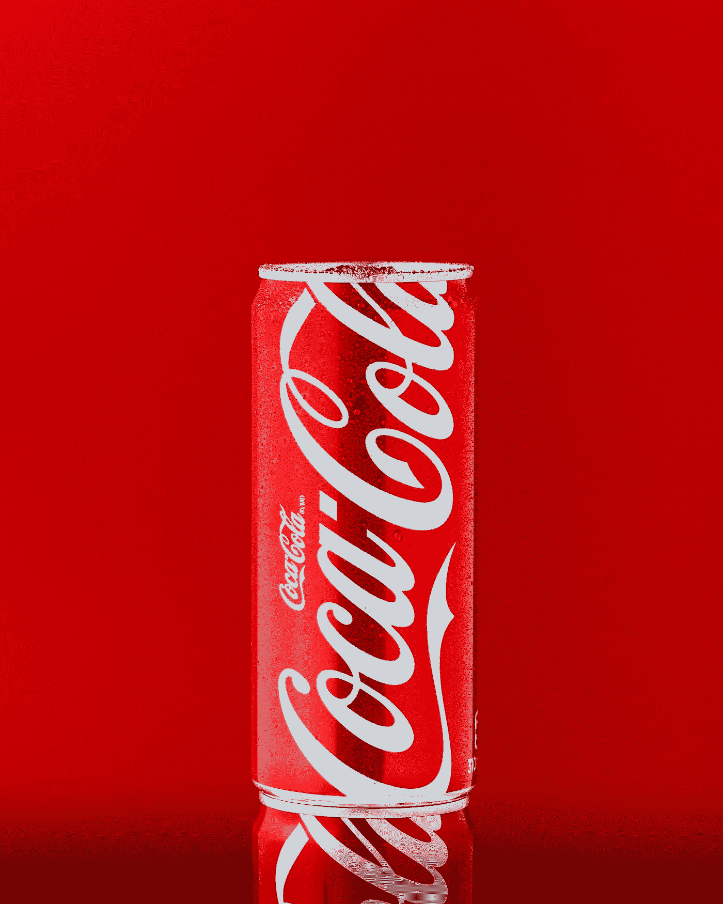
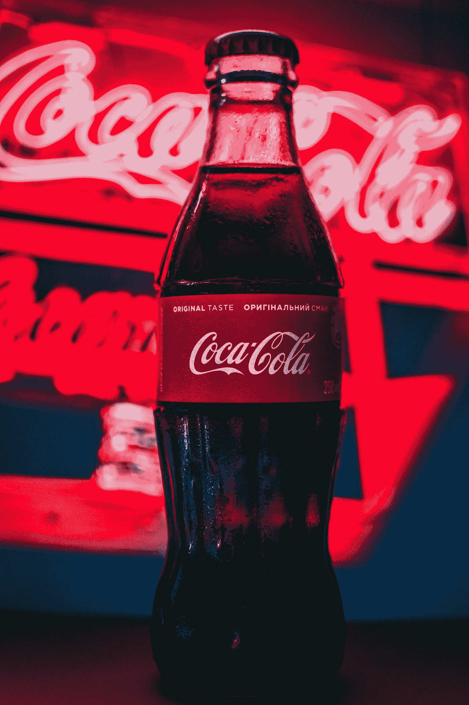
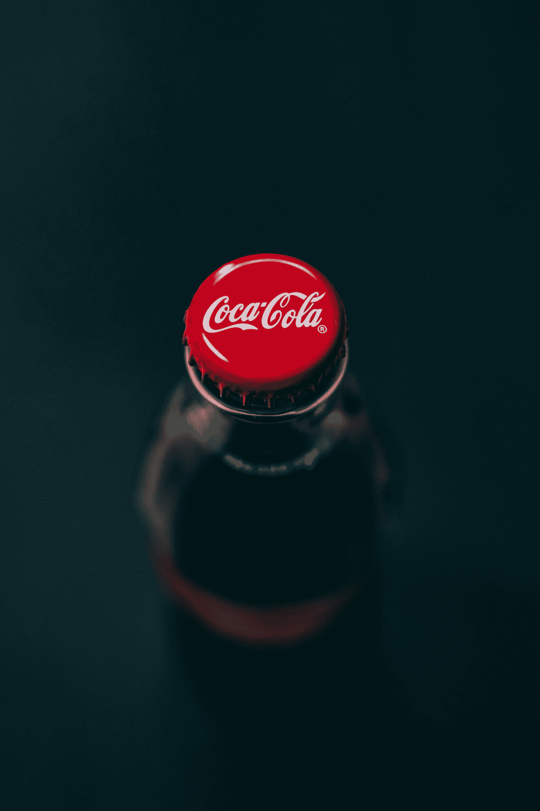

# 可口可乐不为人知的成功故事

> 原文：<https://medium.datadriveninvestor.com/the-untold-story-of-coca-colas-success-6e5873392548?source=collection_archive---------0----------------------->

Photo by [Mae Mu](https://unsplash.com/@picoftasty?utm_source=medium&utm_medium=referral) on [Unsplash](https://unsplash.com?utm_source=medium&utm_medium=referral)

我们都知道可口可乐是什么，我们对这个术语有多熟悉。每当我们在外面喝软饮料时，95%的时间都是这家饮料公司的饮料。

它在 20 世纪末变得如此普及，以至于在软件巨头和基于在线产品的公司发明之前，它统治了全球市场几十年。

但你知道这一切是如何开始的吗？它从来都不是它本来的样子。你看到了这家公司的成功，但从未回顾过它的历史。所以，如果你想知道这个软饮料巨头的激动人心的故事，请耐心地坐着，通读这篇有趣的文章。

# 起源:软饮料巨头的诞生

Photo by [Taras Chernus](https://unsplash.com/@chernus_tr?utm_source=medium&utm_medium=referral) on [Unsplash](https://unsplash.com?utm_source=medium&utm_medium=referral)

“可口可乐”——这个词来源于 19 世纪晚期用来制作可乐的两种原始成分，分别是:*古柯叶*和*可乐果*(一种咖啡因的来源)。

佐治亚州哥伦布市的约翰·斯蒂思·彭伯顿最初打算将它作为一种**专利药**，并将其作为**药用饮料**出售。1886 年 5 月 8 日，可口可乐首次在佐治亚州亚特兰大的雅各布药店出售，最初售价为 5 美分一杯。

那段时间，美国人相信碳酸水有益健康，彭伯顿声称他的新饮料可以治愈许多疾病，包括吗啡成瘾、消化不良、神经紊乱、头痛和阳痿。

彭伯顿的簿记员弗兰克·M·鲁宾逊被认为是命名的产品和创造其标志。约翰离开罗宾逊独自制造、推广和销售可口可乐。

 [## 您的企业今天需要虚拟现实营销的 3 个原因|数据驱动的投资者

### 新冠肺炎是并将继续是一个前所未有的全球性事件，将医疗保健系统和全球经济带到…

www.datadriveninvestor.com](https://www.datadriveninvestor.com/2020/04/09/3-reasons-why-your-business-needs-vr-marketing-today/) 

1889 年，美国商人阿萨·格里戈斯·坎德勒从彭伯顿的继承人手中购买了可口可乐的配方和品牌，目的是做广告并将其作为饮料销售给老客户。

1892 年，坎德勒在亚特兰大正式成立可口可乐公司。在坎德勒先生的领导下，可口可乐的销售范围扩大到亚特兰大以外的冷饮柜。到 1895 年，可口可乐在美国的每个州都有销售。

可口可乐的第一个广告写着“可口可乐”。好吃！清爽！令人振奋！振奋人心！”截至 1948 年，可口可乐已经占据了大约 60%的市场份额。1919 年，该公司被出售给欧内斯特伍德拉夫的佐治亚信托公司。到 1984 年，由于新的竞争对手百事可乐的出现，可口可乐公司的市场份额下降到 21.8%。

过去 130 年来，将可口可乐从亚特兰大一家小药店的创业饮料转变为世界上最知名品牌之一的 10 大商业决策:

# **1886 年至 20 世纪 40 年代:可乐换镍**

可口可乐最早的领导人认为他们的产品应该是人们买得起的，而且随处可得。为了实现这一目标，该公司在近 70 年的时间里将可口可乐的价格保持在 5 美分或 1 美分。

尽管受到两次世界大战和大萧条的影响，该公司坚持认为，通过使可口可乐成为每个人都能负担得起的饮料，可以最大限度地提高其产品的试用和接受度。

这种稳定的价格有助于增加消费者对产品的需求，这反过来又导致装瓶厂购买更多的糖浆来生产产品。

# **1894 年:样本券的发明**

尽管可口可乐是一种味道很好的产品，但它的存在并不为美国东南部以外的许多消费者所知。

为了解决这个问题，阿萨·g·坎德勒(Asa G. Candler)于 1888 年从发明家约翰·彭伯顿(John Pemberton)手中购买了可口可乐的配方，**开始向任何想尝一口可乐的人发放免费样品券**。

从 1894 年到 1913 年，超过 850 万张优惠券被兑换成免费的可口可乐。到这个时候，每九个美国人中就有一个尝试过可口可乐。

# 1899 年:可口可乐系统的诞生

随着饮料行业在 19 世纪末经历了一个巨大变化和竞争的时代，坎德勒专注于扩大分销。通过更广泛地出售可口可乐的装瓶权，他的目标是为他的产品创造全国性的需求。

1899 年，坎德勒以 1 美元的价格将可口可乐的装瓶权卖给了田纳西州查塔努加的三位企业家本杰明·f·托马斯、约瑟夫·b·怀特黑德和约翰·勒普顿，形成了今天广为人知的可口可乐系统。

可口可乐公司和全球 250 多家装瓶厂之间的特许合作伙伴关系，这一系统使可口可乐的覆盖范围远远超出了坎德勒的想象——现在已在 200 多个国家销售。

# **1915 年:推出标志性的“轮廓”瓶**

几乎就在推出之后，可口可乐就面临着大量试图模仿其成功的“模仿者”。

为了应对这一问题，可口可乐公司要求玻璃公司创造一种新的瓶子设计，这种设计如此独特，以至于当它在地上破碎或在黑暗中触摸时可以被识别出来。

1915 年，受可可豆荚形状的启发，Root Glass 公司创造了现在被称为**的轮廓瓶**，以区别于其同行。现已超过 100 岁，轮廓瓶已成为一个著名的和立即识别的图标在世界各地。

# **20 世纪 40 年代:战时的可口可乐**

在第二次世界大战期间，可口可乐公司总裁罗伯特·伍德拉夫认为，每个美国军人都应该有一瓶五美分的可乐，不管他们在哪里，也不管公司要花多少钱。

一群被称为技术观察员的雇员被美国军队派遣去建立、监督和监测装瓶厂的运作，这些装瓶厂将可口可乐分发给海外的美国军队。

伍德拉夫在美国历史上这一关键时期的远见卓识，通过将产品引入不同的市场，帮助可口可乐成为一家全球性公司。除了其全球影响之外，该法案还在美国的军队和家庭中灌输了一定程度的品牌忠诚度，他们对该产品的热爱和支持持续了几代人。

# **多样化:美汁源、雪碧、TaB 和 Fresca**

1960 年**收购美汁源公司**标志着该公司在碳酸饮料之外的第一次冒险。在此次收购时，美汁源占了美国果汁类销售额的三分之一，并因其产品质量而闻名。

这项投资是可口可乐在接下来的几年中扩大其产品组合并使其多样化的关键一步。在成功收购美汁源之后，在接下来的几年里，可口可乐推出了雪碧，这是该公司的第一款柠檬酸橙汁饮料； **TaB，其第一款减肥饮料**；以及无糖柑橘饮料 Fresca。

从那时起，可口可乐公司已经发展到提供 3800 多种饮料，种类繁多。仅在 2015 年，该公司就推出了 600 多款新产品。

# **1982:健怡可乐**

Photo by [Taras Chernus](https://unsplash.com/@chernus_tr?utm_source=medium&utm_medium=referral) on [Unsplash](https://unsplash.com?utm_source=medium&utm_medium=referral)

20 世纪 70 年代末，可口可乐开始开发一种新的饮料，这种饮料将重新点燃可乐的销售，并满足消费者对低热量饮料日益增长的需求。

1982 年，**公司大张旗鼓地推出了** **健怡可乐**作为可口可乐商标的首次延伸。尽管最初有人担心新的减肥饮料会削弱这一商标，但在减肥可乐上市一年内，它就成为了美国顶级的无糖饮料。

健怡可乐的推出是该公司的一个重要里程碑，因为它开启了一个新的时期，促使该公司冒险推出独特的新饮料，以满足客户不断变化的需求。

# **1985:新可乐**

为了重振可乐市场，1985 年，可口可乐公司从市场上撤下了其旗舰产品，推出了新的可乐，**这标志着 99 年来第一次改变配方**。

尽管新可乐的推出最初被认为是本世纪最大的商业失误，但一些分析家认为这是营销天才的偶然一击。

在负面的媒体报道、抗议、信件、电话和消费者试图在橱柜里装满尽可能多的原味可乐中，可口可乐品牌和消费者之间的情感联系被发现了。

时任总裁兼首席运营官的唐·基奥(Don Keough)在新闻发布会上宣布回归原可乐配方时表示，“对原可乐的热情让公司大吃一惊。”在恢复可口可乐经典的原始配方后，它重新成为美国领先的软饮料。

# **20 世纪 90 年代末至 21 世纪初:成为一家全面的饮料公司**

在 20 世纪 90 年代末，可口可乐开始谈论从一个主要的起泡饮料公司转变为一个“全面的饮料公司”。

许多早期产品的推出迅速占领了不断增长的非碳酸饮料消费市场，尤其是在美国市场。

**Dasani** 于 1999 年作为公司的主要美国水品牌推出，随后于 2001 年推出 Simply juices、 **Gold Peak** teas，并于 2007 年收购了维生素水和 **smartwater** 。今天，这些品牌都在该公司的 21 个品牌之列，每个品牌每年的零售额都超过 10 亿美元。

# **现在和未来:紧跟消费趋势**

今天，随着世界各地的消费者不断要求新的和令人兴奋的饮料选择，该公司正在寻找新的方法，通过在快速增长的饮料品牌中占据所有权地位来利用日益增长的趋势。2007 年，可口可乐北美公司成立了**风险投资和新兴品牌(VEB)** 部门，以寻找和确定公司可以加入其投资组合的下一代十亿美元品牌。

VEB 作为部分风险投资家和部分品牌孵化器，收购或投资了包括**诚实茶、** **济科、Suja** 和**核心力量**在内的品牌。

# 结论

在美国以外，该公司还继续收购或投资品牌，以应对全球消费者现在可以获得的饮料选择的激增。

最近宣布的全球收购或投资包括拉丁美洲的 AdeS 品牌；Chi 有限公司，一家成功的西非乳制品和果汁饮料生产商；中国 Culliangwang 是一家以高品质农业资源为原料生产植物蛋白饮料的制造商。

**访问专家视图—** [**订阅 DDI 英特尔**](https://datadriveninvestor.com/ddi-intel)