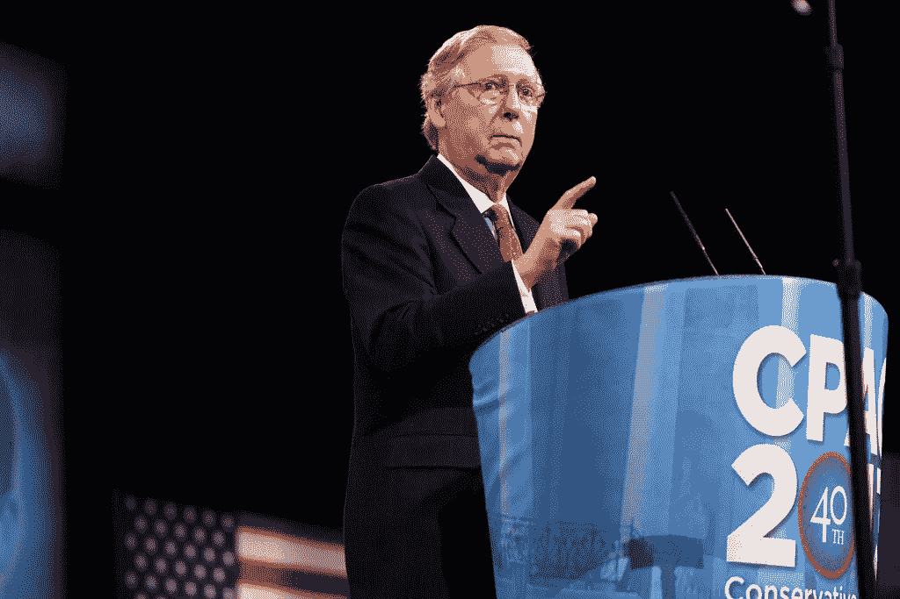
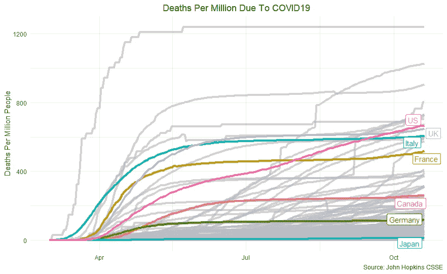
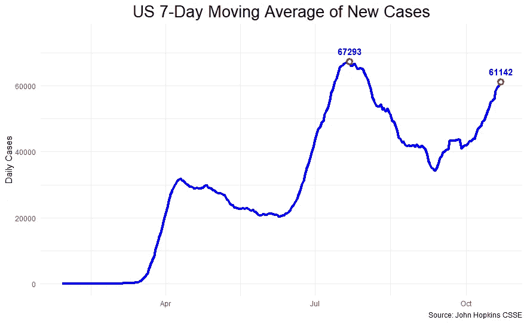
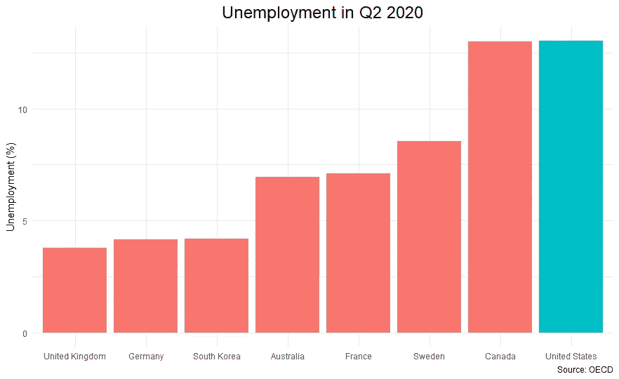
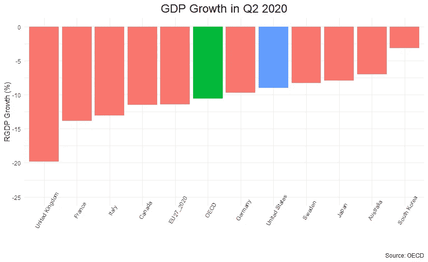
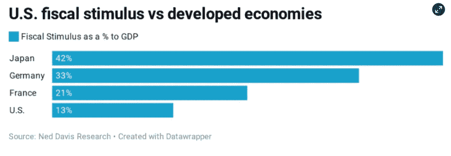

# 美国的 COVID 反应是一场灾难

> 原文：<https://medium.datadriveninvestor.com/the-us-covid-response-has-been-a-disaster-b549b768960d?source=collection_archive---------9----------------------->

## 与其他国家相比，美国的反应在各方面都是失败的

今天，美国在新冠肺炎确诊病例(超过 850 万)和新冠肺炎死亡病例(约 23 万)方面都领先于世界，而且情况只会越来越糟。这是一场令人震惊的悲剧，可悲的是，这在很大程度上是可以避免的。

在疫情的早期阶段，许多国家都措手不及。病毒首先传播到毫无准备的欧洲国家，像意大利这样的地方是受打击最严重的。当这些国家采取严格的封锁措施来遏制疫情时，医院已经人满为患。死亡人数在早期迅速攀升。

在此后的时间里，大多数国家制定了坚实的政策来遏制这种蔓延。死亡曲线变平了，形势看起来更加可控了。

在美国没有。虽然大多数主要国家持平，但美国的死亡人数继续稳步上升。Anthony Fuaci [博士直言不讳地说出了他对形势的感受:](https://www.cnbc.com/2020/08/13/dr-fauci-on-us-coronavirus-outbreak-im-not-pleased-with-how-things-are-going.html)

> 我对事情的进展不满意。

最终，美国的人均收入将超过几乎所有发达国家。

在 G7 国家中，美国的百万人口死亡率最高。

[9 月份的一项分析](https://voxeu.org/article/us-excess-mortality-rate-covid-19-substantially-worse-europe-s)利用超额死亡人数估计，如果美国成功地将 COVID 水平保持在欧洲的水平，近 60，000 人的生命将得以挽救。随着疫情一拖再拖，死亡人数继续上升，这个数字还在继续上升。

## 疫情局势继续恶化

美国的疫情继续恶化，每日新增病例再次攀升。七日移动平均线距离七月份的历史高点只有几千点。

由于疫苗的时间表不确定，在长期解决方案到来之前，可能会有更多的人死亡。

## 苦苦挣扎的经济

虽然专家们很少争论美国在遏制病毒的努力中处理不当，但可以提出一个(有问题的)论点，即这是拯救经济的必要牺牲。

不幸的是，政策制定者也没能实现这个目标。美国第二季度的失业率几乎高于所有其他国家:

值得注意的是，在第二季度，美国的失业率与加拿大相似，同时也记录了高得多的死亡率(两国之间的死亡率差距自那时起持续增长)。

看 GDP，成绩只是稍微好一点。尽管经合组织作为一个整体(由 37 个主要发达国家组成的集团)季度 GDP 下降了 10.5%，但美国下降了 9%——也仅略好于德国(德国成功地保持了令人印象深刻的低死亡率)。

取决于你如何衡量，美国经济表现一直处于中等至糟糕状态。对于一个完全未能控制病毒本身损害的国家来说，这是一个相当令人失望的结果。

这是一个不小的部分，因为美国在部署财政刺激方面没有其他大多数国家积极。危机期间，美联储一再呼吁出台更多刺激措施，但迄今为止，反应甚微。

当世界各地的发达国家大规模部署援助时，美国却陷入了政治争吵。

不幸的是，对美国人来说，在不久的将来，这种情况不太可能改变。