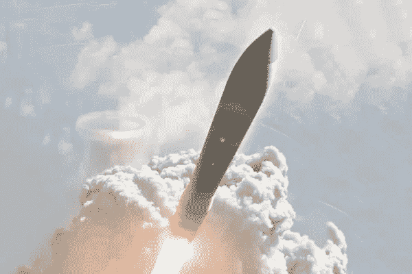
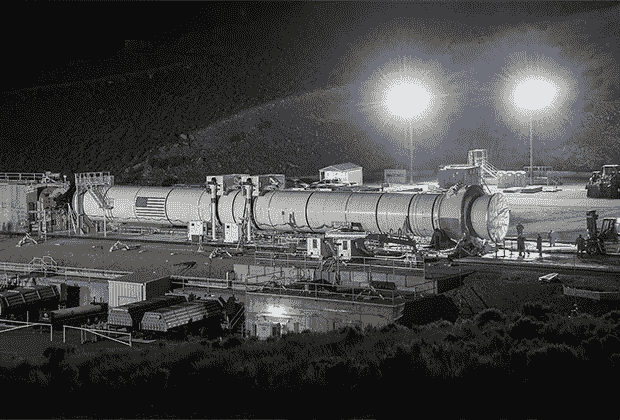
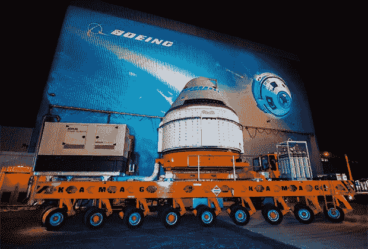

# 美国想重返月球。是什么阻止了他们？

> 原文：<https://medium.datadriveninvestor.com/the-us-wants-to-go-back-to-the-moon-what-s-preventing-them-36ba4a0232cf?source=collection_archive---------17----------------------->

## BDSS 在过去一年的主要失败可以被认为是 7 月拒绝参与美国空军陆基战略威慑计划的投标

oeing 被认为是世界领先的航空航天公司之一。然而，美国公司近年来的现状却不尽如人意。由于波音 MAX passenger 737 出现问题，商业航空公司波音商用飞机(BCA)的收入在 2019 年第三季度比 2018 年同期下降了 41.2%，达到 82 亿美元。生产军用和航天飞机的波音防务航天&安全(BDSS)公司的业务也不尽如人意，尽管其收入与前一时期相比略有增长。

Image: Boeing

# 战略遗漏

BDSS 在过去一年的主要失败是在 7 月份拒绝参与美国空军地基战略威慑招标的现有条款，该招标涉及从 2027 年开始逐步更换所有 450 枚美国洲际弹道导弹。陆基 LGM-30G 民兵 III。原因是该公司无法形成比竞争中的另一家获胜申请人美国诺斯罗普·格鲁曼公司更有利可图的经济报价，因为后者在 2018 年 6 月成功收购了 ATK 轨道公司，该公司在美国固体推进剂火箭发动机市场(TTRD)占据领先地位。

 [## 幸福的算法？数据驱动的投资者

### 从一开始，我们就认为技术正在使我们的生活变得更好、更快、更容易和更实用。社交媒体…

www.datadriveninvestor.com](https://www.datadriveninvestor.com/2019/03/08/an-algorithm-for-happiness/) 

根据波音公司的说法，“目前的收购方式没有为公平竞争提供公平的竞争环境。”该公司得到保证，从轨道 ATK 公司(目前是诺斯罗普·格鲁曼创新系统公司的一个部门)获得 TTRD，如果它赢得了投标，可能是一个承包商，在竞争条件下是不可能的。华盛顿不理解波音公司提出的解决问题的方案——购买 TTRD 作为“政府供应的设备”。

值得注意的是，波音公司是民兵 III LGM-30G 的主要开发者和制造商，这是美国核三位一体地面组件的基础。因此，该公司损失了至少 850 亿美元，而这笔钱本可以从开发、发射和维修 GBSD 导弹中获得。

# 超重型机箱

在 BDSS 的领导下(通过波音和洛克希德·马丁的合资企业联合发射联盟(ULA))创建了近十年，太空发射系统(SLS)超重型导弹经常面临成本超支和延迟，即使美国预算每年为一种有前途的退出方式拨款约 20 亿美元。

美国航天局认为，波音公司没有足够的技术专家从事 SLS 第一级(中央单元)的工作。针对这一意见，该公司认为，航天局经常改变对运载工具设计的要求，导致需要修订过时的技术解决方案。

SLS launch vehicle side accelerator
Photo: Bill Ingalls/NASA/AP

美国财务法庭也对波音和美国国家航空航天局不满。在 2019 年 6 月发表的一份报告中，监管机构指责航天局增加了开发 SLS 的成本，该公司因超重型导弹的工作而获得了额外的报酬。根据首席监察员办公室 11 月发布的一份报告，一次性发射 SLS 的成本实际上将为 20 亿美元，与美国 SpaceX 公司的猎鹰重型超重型导弹(9000 万美元起)相比，这很难用该载体的任何突出技术特征来解释。

# 明星病

首席检查员办公室 11 月份的报告包含了 NASA 和波音公司互动的另一个有趣的特征。监管机构的报告指出，作为商业机组人员运输能力(CCtCap)计划的一部分，该计划涉及由私营公司制造载人飞船，将宇航员送到近地轨道，该机构向该公司支付了 2.87 亿美元，这不是波音公司继续参与该项目的最后理由。

> 这样的资金没有提供给 SpaceX，SpaceX 是 CCtCap 的另一个参与者，这一点尤其奇怪，因为波音公司获得了 48.2 亿美元的参与该计划，而 3.14 获得了 SpaceX 的 10 亿美元。

Starliner spacecraft
Photo: NASA/Globallookpress.com

根据监管机构的说法，波音 Starliner 飞船上一个座位的成本将为 9000 万美元，而 SpaceX Crew Dragon 的成本仅为 5500 万美元。与此同时，与第一架飞机不同，第二架飞机已经(在无人驾驶模式下)执行了一次前往国际空间站(ISS)的任务，而 Starliner 首次飞往地球轨道的飞行计划于 12 月进行。根据首席检察员办公室的一份报告，它还将与“龙”号机组人员一起，比 Starliner 更早飞往国际空间站。在评论监管机构的报告时，波音公司不同意其航天器上空间的具体价格，但以竞争为由拒绝说出其具体价值。

# 旧的优点

针对首席检查员办公室的一份报告，波音公司指责其竞争对手 SpaceX。波音公司表示:“Starliner 由市场上最可靠的运载工具交付，这是一种经过改装的 Atlas V 火箭，可以为在这一领域有实际经验的人提供安全的太空飞行。”它还指出，该公司开始开发航天器的时间比“其竞争对手”(SpaceX)晚得多，后者的载人飞船(Crew Dragon)是基于一艘货运飞船(Dragon)，后者的开发也是由美国宇航局资助的。

根据美国评论员的说法，波音公司实际上没有为载人任务优化导弹的经验，半个多世纪前的最后一项此类工作是由马丁·玛丽埃塔公司(在洛克希德·马丁公司成立后已不复存在)的专家进行的，他们将 LGM-25C-泰坦 II ICBM 用于双子星座项目。

> 主要依靠公共秩序手段生存的 BDSS 分部的这种声明是一个典型的例子，表明垄断无法在市场竞争条件下存在，以及需要从事社会领域而不是商业，特别是要在其平台上保持一定水平的雇员就业。

这里值得注意的是美国物理学家乔治·索尔斯(George Sowers)的推文，他几年前在 ULA 领导了一个研究小组，该小组主要研究轨道加油，该公司认为这是对 SLS 发展的威胁，因为科学家提出的解决方案允许现有载体探索远程空间。“波音公司大发雷霆，试图解雇我。感谢我的 CEO，他为我挺身而出。但我们甚至被禁止谈论它，”——在推特专家上写道。

在他看来，如果几年前 ULA 同意可重复使用的低温上面级火箭先进低温进化级(ACES)的概念，波音公司和洛克希德·马丁公司现在将是这种技术的世界垄断者。