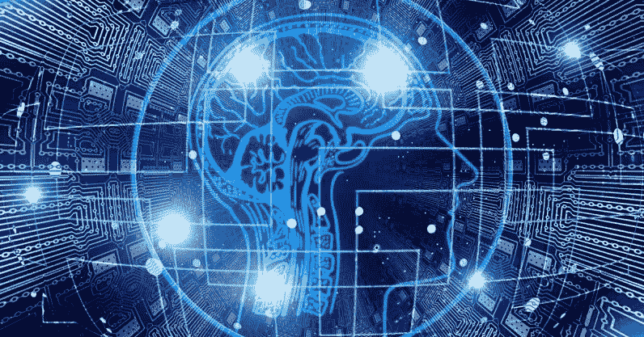

# 人工智能的使用案例

> 原文：<https://medium.datadriveninvestor.com/the-use-cases-of-ai-e3676f821d23?source=collection_archive---------9----------------------->

人工智能在哪里会有最大的好处？

人工智能是当今最有前途的技术之一，部分原因是它几乎可以在任何地方实现。然而，围绕这一主题存在争议和偏执。因此，在进入用例之前，必须描述基础知识。

**什么是 AI？**

基本定义是计算机科学的一个分支，它构建了具有“类人”智能的机器。它也是计算机使用的多种方法/技术的总称。有不同的方法来训练学习算法:

*   监督学习:所有数据都被标记，算法学习从输入数据预测输出。
*   无监督学习:所有数据都是未标记的，算法从输入数据中学习固有结构。
*   强化学习:给算法设定一个目标，让它通过试错来学习。

更多信息，请观看下面的视频或参考我的来源。

**怎么用？**

如前所述，人工智能有许多用途。当然，有一些用例比其他用例更重要。以下是人工智能最具潜在影响力的一些应用:

**医疗保健:**全球最重要的行业之一。然而，无论医疗水平如何，错误和误诊仍然会发生。这就是人工智能的用武之地。一个程序可以用来评估病人的健康状况，并根据他们的症状确定诊断。这方面的一个例子是谷歌 DeepMind 的人工智能系统，用于分析患者的眼病。它对眼睛进行 3D 扫描，通过识别常见模式来确定最可能的疾病。

但不止于此！人工智能还可能用于确定未来可能的疾病，因为它将有数百万个数据集可供学习。

现在，由于人工智能可以确定你可能患有的疾病，他们也可以个性化你的药物。今天，大多数人接受药物治疗取决于他们被诊断出的疾病，而不是他们的具体特征。这可能对一些人有效，但对另一些人无效，甚至会导致死亡。人工智能程序可以使用患者的基因组来确定哪种药物对他们最有效，从而消除了评估的需要。

 [## 挑战你对人工智能和社会看法的 4 本书|数据驱动的投资者

### 深度学习、像人类一样思考的机器人、人工智能、神经网络——这些技术引发了…

www.datadriveninvestor.com](https://www.datadriveninvestor.com/2019/02/28/4-books-on-ai/) 

农业:人工智能可能产生影响的另一个有希望的方式是在农业领域。它有多种潜在用途，从监测作物和土壤健康到有能力管理土地的机器人。通过图像识别，人工智能可以识别植物或土壤中的缺陷/营养缺乏。目前有适用于此的应用程序；Plantix 就是一个例子。当输入一张图片时，应用程序将确定什么是错误的，并列出你可以采取的预防措施。还有更高级的用途，包括无人机和/或机器人。它们可以用来评估植物和土壤，记录收成和牲畜，甚至照料庄稼。DJI 无人机已经被用于计算农田里的牲畜数量(更多信息请点击)。

**供应链:**这个部分和其他部分有点不同，因为它不是一个特定的领域。但是，绝对是 AI 最大的应用之一。人工智能可以应用于供应链的多个部分:

在[制造](https://www.cio.com/article/3309058/5-ways-industrial-ai-is-revolutionizing-manufacturing.html)中，人工智能可以用于质量保证和优化。有了监督学习，在分销中，它可以用来预测消费者需求。在零售业，它可以用于[客户服务](https://www.ibm.com/watson/ai-customer-service)。我确信在供应链中有更多的领域可以实现人工智能，但这一部分是宽泛的，以显示它有多大的潜力。

这方面的一个例子是 [IBM Sterling 供应链](https://www.ibm.com/supply-chain?cm_mmc=OSocial_Twitter-_-Watson+Supply+Chain_Watson+Supply+Chain-_-WW_WW-_-Sterling+landing+page&cm_mmca1=000020LU&cm_mmca2=10012655&social_post=3021397590&linkId=80242997)，这是一个连接到供应商生态系统的开放式集成平台。它利用人工智能和区块链来有效地发挥作用，并可以在不同类型的管理中实施。

**游戏:**在游戏中，有多种玩法:单人、多人或与电脑对战。与 CPU 对战时，需要一定程度的智能，计算机才能玩得好。对于一些桌游或者简单的游戏，电脑不需要改编或者学习就可以编码。但是，有些游戏比较复杂。这就是人工智能，特别是强化学习算法的用武之地。DeepMind 的 AlphaGo 计算机程序就是一个例子，它学习了围棋。是的，围棋是一种棋盘游戏，但它是公认的最难的棋盘游戏之一，如果不是最难的话。AlphaGo 接着击败了(前)职业围棋选手 Lee Sedol，这被认为是迄今为止人工智能领域最伟大的成就之一。

Of course, someone had to place the stones for the computer!

也有单人游戏(战斗、赛车、角色扮演等。)需要某种人工智能。深度强化学习能够提供更逼真/真实的对手，因为它从过去的错误中学习。

**市场营销:**市场营销是今天人工智能被应用的主要领域之一。您可能知道，在线广告的显示取决于您的在线活动(您搜索、点击和分享的内容)。有了人工智能，这个过程可以优化和自动化。这可以用来推荐视频，产品，服务，你的名字。这已经在网上使用(购物，Youtube)，并且有望在个性化和有效性方面得到改善。

**结论**

AI 有*吨*的潜力。除了上面列出的那些，还有成百上千的用例。太令人兴奋了。

因为这是一项很有前途的新兴技术，所以多了解一下这个话题是个好主意。有很多公司都在研究 AI: Google，IBM，OpenAI 等。目前有许多实现人工智能的例子，但这项技术的潜在未来是惊人的。

感谢阅读！我是一名大学生，对新兴技术、编码、工程等充满热情。可以关注我或者在 [LinkedIn](https://www.linkedin.com/in/noah-do-rego/) 上联系我。