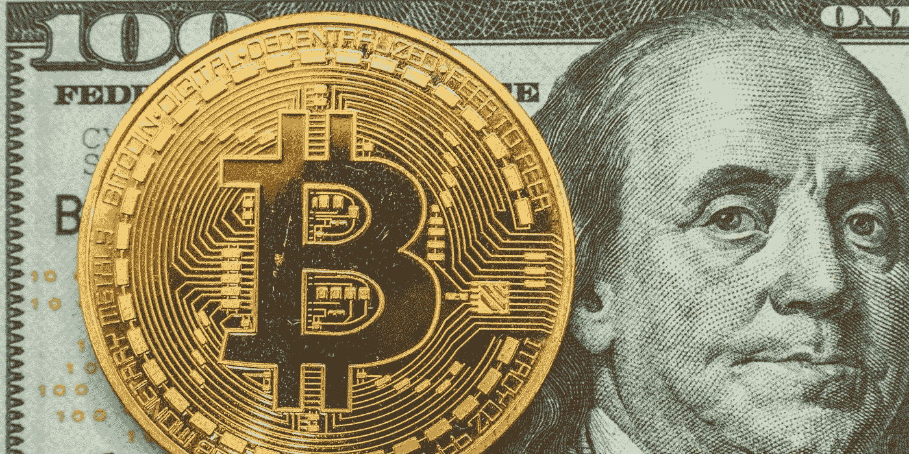
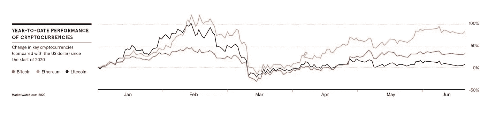

# 新冠肺炎时代加密货币的价值之争

> 原文：<https://medium.datadriveninvestor.com/the-value-debate-of-cryptocurrencies-in-the-covid-19-era-41e3a9874ad?source=collection_archive---------13----------------------->

What is more valuable? A limited supply of virtual currency, or an unlimited supply of printed paper?

## 关于比特币以及其他加密货币在一个动荡不安的市场中的重要性的讨论将继续升温。

大约三年前，高盛(Goldman Sachs)被认为在考虑推出比特币交易平台，此举可能会让加密货币合法化。在那之前，他们通常被视为投机者、罪犯和书呆子的权限。

这是比特币辉煌时代的开始。它的价值在 2017 年底飙升，达到了略低于 2 万美元的历史新高。它被誉为天堂，被许多人视为新的黄金。

2018 年第一季度，比特币泡沫破裂，几乎在一夜之间失去了大部分价值。投资者争先恐后地寻求安全，这种痛苦的混乱局面得到了不幸的结局；比特币和黄金之间的比较似乎被误导了。事实证明，加密货币市场的波动性对许多人来说太大，难以应对。

 [## 加密货币行业是死是活？数据驱动的投资者

### 九月初，我们在 X-Order 内部就代币市场的未来进行了一场辩论。有趣的是，我们的观点是…

www.datadriveninvestor.com](https://www.datadriveninvestor.com/2019/12/12/will-the-cryptocurrency-industry-be-dead-or-alive/) 

快进到 2020 年 3 月中旬，随着全球股票经历了几十年来最具挑战性的交易期，比特币的价值在一天内上涨了 26%，这是 7 年来最大的涨幅。自那以后，金价开始回升，事实上，到 2020 年夏季，金价表现超过了黄金。然而，它的波动性比过去 12 个月要高得多，它就像一个繁忙的过山车，在黄金稳步攀升的同时出现了波动和崩溃。

# 加密货币的波动性

高盛(Goldman Sachs)在 5 月份给客户的一次演示中，一反几年前的情绪，明确建议不要购买比特币，尽管这种加密货币的波动性可能会给导向型交易员带来动力。

其他人也对加密货币作为一种可行的投资工具的实际价值表示怀疑，特别是在金融危机时期和考虑到极端的价格波动。最近的暴跌让一些基金无所适从。加密货币对冲基金 Adaptive Capital 在 5 月份永远停止了运营，理由是与这种不稳定气氛相关的风险超过了任何可能的好处。

Markets.com 的首席行业分析师 Neil Wilson 称加密货币不是法定货币的可行替代品。因为它们没有被定义为政府发行的货币，也没有实际商品的支持，因此存在几个缺点。

今年 4 月，荷兰莱顿学院的学者发表的一份报告警告称，如果加密托管机构破产，缺乏法律清晰度将对投资者构成威胁。专家们总结说:“目前缺乏明确和普遍接受的法规来应对加密托管人破产带来的合法机会。”

但对于每一个怀疑论者来说，似乎都有一个狂热分子在质疑加密货币的分散化动态，这种加密货币供应有限，可以很好地对冲当前的地缘政治紧张局势、恶性通货膨胀和金融政策的影响。

# 数字货币游戏

总部位于纽约的加密货币交易所和虚拟资产托管机构 Gemini 的董事总经理朱利安·索耶(Julian Sawyer)表示，从长远来看，专注于加密的重要性及其一系列可能的用途至关重要。

“加密货币和区块链技术不会成为时尚，因为它们将在我们的未来发挥重要作用，”他说。“新冠肺炎已经动摇了全球经济气候。金融服务行业和个人正在重新评估个人理财的概念，以及如何在一场前所未有的全球经济动荡中保护自己免受财务困难的影响。”

Sawyer 是 Starling Bank 的联合创始人，他表示，股票市场的低利率和普遍较高的波动性推动了更多人参与加密市场和区块链技术，这是一个倾向于继续的方向。他说，随着需求的增长，市场将会成熟并成长，比如帮助客户解决互联网安全和隐私方面的问题。

比特币和以太坊是目前市值最大的加密货币，尽管其他货币也在快速崛起。基本注意力令牌(BAT)的特征是“实用令牌”而不是货币，旨在通过区块链平台在持有者、出版商和广告商之间进行交换，以了解和监控人们如何参与在线内容。兰花是一种加密货币，可以用来购买额外的互联网保护带宽。另一个有前途的加密项目是 Chainlink，这是一个致力于弥合现实世界应用程序上自动执行的智能合同和区块链之间差距的平台。

“随着这些用例的发展，加密货币将在交易和投机之外有更多的长期可行性，”Sawyer 说。

加密货币汽车交易平台 Auto Coin Cars 的首席执行官穆斯坦萨·伊克巴尔(Mustansar Iqbal)也表示，尽管存在波动，但加密货币作为一种资产类别，已经开始比过去更具弹性。

“与 2018 年的上一次下跌相比，这次危机期间出现的下跌要小得多，”他表示。当时比特币跌至 3100 美元左右的市值，需要几个月时间才能恢复。到 2018 年 6 月，比特币的交易价格约为 9700 美元。

“加密货币资产仍然是公众的一个可靠选择，”伊克巴尔肯定地说，“因此也可以合理地归类为长期的实用选择。”

# 测试密码市场的极限

虽然全球股市在 3 月份暴跌，但加密货币的交易量却在飙升。使加密货币交易所成为 2020 年上半年的真正赢家。

几乎所有平台的加密货币交易量的一致数据很难衡量。尽管如此，根据 CoinDesk 网站的数据，总部位于美国的加密货币交易所比特币基地是全球最受欢迎的加密货币零售商，该交易所在 3 月中旬股市暴跌时报告了创纪录的交易量。

与此同时，Cointelegraph 网站报道称，加密货币交易所遭遇了有史以来最大规模的比特币流入。据报道，以太币和其他所谓的替代币的交易量大幅增加，如 Chainlink、Tezos、XRP、莱特币，甚至比特币现金。

尽管交易量的快速流入同样暴露了支撑电子加密交易的基础设施中的几个漏洞。Gemini 经历了短暂的停机，而总部位于塞舌尔的 BitMEX(杠杆衍生品交易的关键平台)也因不活跃程度显著上升而短时间关闭。

底线是如何在一个被新冠肺炎疫情颠覆的世界里确定比特币和其他加密货币的价值和安全性。加密货币领域的交易量和市值的显著增长表明了对传统金融系统的信任缺失。私人和私人机构正在意识到，保护他们财富价值的唯一方法是从中央银行和政府手中拿走权力，把它放在他们自己的手中。区块链技术和加密货币正好允许这一点，考虑到在大流行后的不确定未来，法定货币的价值也值得怀疑。

*感谢您阅读我的文章，它最初发表在我的个人网站***。如果你想联系我，或者如果有你想让我报道的话题，请给我发电子邮件到 thesparkblog@renatozamagna.com。**

## *访问专家视图— [订阅 DDI 英特尔](https://datadriveninvestor.com/ddi-intel)*