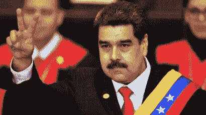
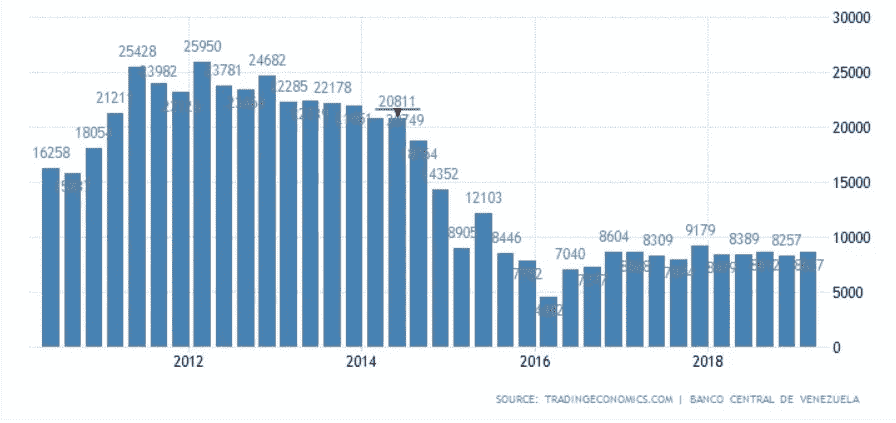

# 委内瑞拉石油工业及其整体经济正在崩溃

> 原文：<https://medium.datadriveninvestor.com/the-venezuelan-oil-industry-and-its-economy-as-a-whole-is-collapsing-144f4bf4883d?source=collection_archive---------19----------------------->

## 在伊朗、俄罗斯和古巴的帮助下，它仍然掌权

[Nicolás Maduro at his second swearing in ceremony](https://www.bbc.com/news/world-46821653)

路透社获得的文件显示，委内瑞拉国有石油公司 PDVSA 石油公司计划将其国有资产私有化，以提高产量。这是在新冠肺炎病毒的背景下发生的，该病毒导致石油需求急剧下降，此外，由于俄罗斯和中国之间发起的价格战，石油输出国组织国家的石油产量增加。

[Venezuelan Exports by Year](https://tradingeconomics.com/venezuela/exports)

这是对乌戈·查韦斯(委内瑞拉前总统)倡导的社会主义政策的又一次打击。查韦斯和马杜罗政府的经济政策导致该国的福利和社会政策严重依赖石油价格。90%的国家出口原油或精炼石油。这种严重的依赖、经济管理不善以及缺乏管理 PDVSA 的专业知识或动力导致了经济的瘫痪。这家国有公司的管理不善达到了顶点，实际上是军方在和少将·曼努埃尔·奎维多一起经营这家石油公司。正如路透社[亚历山德拉·乌尔默](https://www.reuters.com/journalists/alexandra-ulmer)和[玛丽安娜·帕拉加](https://www.reuters.com/journalists/marianna-parraga)在 2018 年报道的那样，

> “手持 AK-47 步枪的士兵，根据防止在货单上作弊的命令，现在登上油轮陪同货物检查员，骚扰外国船长和船员。”

当胡安·瓜伊多宣布自己为总统并获得包括美国在内的一些国家的承认时，委内瑞拉的政治局势达到了顶峰。然而，瓜伊多为委内瑞拉带来的希望和变化的最初迹象已经消失，因为马杜罗设法继续掌权，军方仍支持他。马杜罗也得到了古巴和俄罗斯的支持。据《外交政策》报道，据克雷格·费勒(美国南方司令部司令)称，俄罗斯在委内瑞拉有数百名驻军。它还帮助该国避免了美国的大部分制裁，并(与古巴一起)提供贷款和后勤支持，以保持政府的权力。事实上，国务卿迈克·蓬佩奥在接受美国有线电视新闻网采访时表示，

> “我们观察了一整天，已经很久没有人见过马杜罗了。他在停机坪上有一架飞机，据我们所知，他准备今天早上离开，俄罗斯人表示他应该留下。他正前往哈瓦那。

在所有这些压力中，石油需求的下降导致 PDVSA 重新评估其公司结构。在路透社获得的一份文件中，规划部门向 PDVSA 提出了一系列建议。其中包括:

1.  将 PDVSA 在几个油田的股份从 60%降至 50.1%，并允许私营公司经营炼油厂。
2.  降低汽油补贴
3.  退出其参与的非石油业务，并出售其在整个拉丁美洲拥有的补贴股份
4.  提议创建一家名为 PDVSA 俄罗斯的公司，该公司将控制荷兰 PDVSA 部分拥有的欧洲炼油厂 Nynas AB
5.  持有 Citgo (PDVSA 在美国的炼油子公司，由于美国的制裁而被反对派控制

这些私有化措施将意味着不在乎美国制裁的企业将能够直接参与委内瑞拉的事务——这对俄罗斯来说是一个巨大的好处，因为它吞并了克里米亚，俄罗斯经济的一部分已经受到制裁。

在政治上，马杜罗仍然掌握着权力，因为他能够在俄罗斯和古巴的帮助下集中权力。然而，PDVSA 的私有化是一个信号，随着通货膨胀达到新高，委内瑞拉经济将越来越难以稳定。由于病毒和不断下滑的经济状况，委内瑞拉正计划[向联合国出售其在英国银行持有的部分](https://www.kitco.com/news/2020-04-30/Venezuela-now-wants-to-sell-its-BOE-stored-gold-to-the-U-N-for-coronavirus-relief-reports.html)黄金，以筹集资金应对疫情。该州银行里大约有 31 吨黄金[。然而，该银行与欧洲、美国和加拿大的大部分国家一样，拒绝承认马杜罗是该国的合法领导人，因此拒绝让其直接获得黄金。然而，向联合国出售一部分似乎仍然可行。到目前为止，委内瑞拉政府已经搜查了自己的黄金储备，并向伊朗出售了大约 9 吨黄金，以支撑其石油工业。](https://www.kitco.com/news/2020-04-30/Venezuela-now-wants-to-sell-its-BOE-stored-gold-to-the-U-N-for-coronavirus-relief-reports.html)

 [## 现金为王，比我们想象的更强大|数据驱动的投资者

### 2020 年 3 月 12 日，在川普总统宣布新冠肺炎进入国家紧急状态的前夕，纽约时报报道…

www.datadriveninvestor.com](https://www.datadriveninvestor.com/2020/03/26/cash-is-king-more-potent-than-we-think/) 

全球经济放缓、油价暴跌、与日俱增的政治和经济管理不善威胁着整个委内瑞拉的稳定。最终，尼古拉斯·马杜罗可能会搭乘飞机离开这个国家，但委内瑞拉人民将继续受苦。