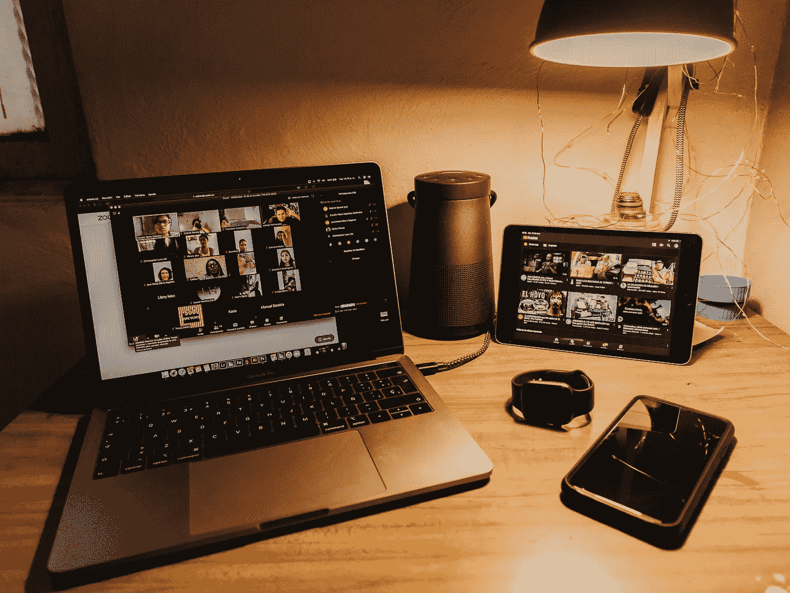

# 视频会议的斗争是真实的

> 原文：<https://medium.datadriveninvestor.com/the-video-conferencing-struggle-is-real-6c017fa3362a?source=collection_archive---------24----------------------->

别做让自己难堪的事就行。

Photo by [Gabriel Benois](https://unsplash.com/@gabrielbenois?utm_source=unsplash&utm_medium=referral&utm_content=creditCopyText) on [Unsplash](https://unsplash.com/s/photos/zoom?utm_source=unsplash&utm_medium=referral&utm_content=creditCopyText)

随着越来越多的工作场所转向远程办公，我们都陷入了如何驾驭数字化工作的困境。会议、采访、社交活动和网络活动现在已经完全转移到网上，这意味着我们中的许多人现在参加更多的视频电话会议。

如果您没有丰富的在线协作经验，可能需要一些时间来适应——尤其是如果您的整个团队现在都在远程工作。

我职业生涯的大部分时间都在为会议和演示营造氛围。这已经成为一种竞争优势。我已经掌握了有力握手和专注眼神交流的艺术。我学会了利用我低沉的声音和体型。我可以通过轻微的面部表情或适时的叹息来巧妙地操纵讨论或谈判的轨迹。

我的大部分影响来自于能够“在房间里工作”但是这种能力并不一定转化为虚拟房间。也许有些人已经在网上磨练了如何做到这一点，但我们其余的人只是试图不显得愚蠢。

 [## 认知计算——一套被广泛认为是……

### 作为它的用户，我们已经习惯了科技。这些天几乎没有什么是司空见惯的…

www.datadriveninvestor.com](https://www.datadriveninvestor.com/2020/02/19/cognitive-computing-a-skill-set-widely-considered-to-be-the-most-vital-manifestation-of-artificial-intelligence/) 

但是，像其他人一样，我正在调整。我工作的公司，像无数其他公司一样，由于冠状病毒疫情，突然被推入基于网络的合作的深水区。我们目前对所有会议都使用缩放，除非他们需要现场讨论来解决问题。

有成长的烦恼，但我们都在进化。对许多人来说，这些会议是他们在家庭之外唯一的人际互动。因此，即使是坚定的内向者也愿意适应和提高他们的视频会议敏锐度。

在解决当前常态的问题时，一些有益的做法可以帮助你在视频会议中保持适当的礼仪和专业精神。我承认这些都不是开创性的。但是考虑它们可以让你免于尴尬——这是我们大多数人所渴望的。

# **技术**

确保通过更新来维护您的视频会议软件的最新版本，无论是您自己还是通过您的 IT 部门。不要让一个重要的会议因为软件故障或不合时宜的更新而推迟。

了解顾客或员工是否接受录音功能(如果你决定使用的话)。目前，我的公司取消了记录大多数会议的选项，因为许多公共部门的客户反对。

如果可能的话，使用密码来提高会议的安全性。是的，有些讨厌的混蛋除了在你的会议上随意捣乱之外无事可做。

事先弄清楚你要会见的人是否可以接受并参加使用你的特定视频会议平台的会议。这减少了不得不浪费时间突然用不同的程序重新安排会议的机会。

# **做好准备**

提前几分钟加入，检查您的设备和网络连接。

参加在线会议时使用您的公司名称。这将有助于确保正确的人参加会议。

如果你正在主持一个会议，并注意到一个名字没有登记，最佳做法是结束会议并开始一个新的会议(当然，适当地将这传达给应该出席的与会者)。这应该会自动更改会议 ID 并保护您免受入侵者的攻击。

Photo by [Nathan Dumlao](https://unsplash.com/@nate_dumlao?utm_source=unsplash&utm_medium=referral&utm_content=creditCopyText) on [Unsplash](https://unsplash.com/s/photos/zoom?utm_source=unsplash&utm_medium=referral&utm_content=creditCopyText)

# **检查你的环境**

除非因会议规模而另有指示，否则请打开相机。

如果您没有相机，请联系您的 IT 部门或自己购买一台。这是一项值得的投资，尤其是因为我们似乎可能会在这种远程工作的情况下工作一段时间。在这个社交距离越来越远的时代，使用相机会让会议变得更加私人化。这是一个小小的接触，可能会积极影响客户对你的反应。

最佳的照明和最小的背景噪音可以让你看起来和听起来都很专业。

将自己放在网络摄像头的中央，面向前方，记得进行(虚拟的)眼神交流。

保持你的专业背景。从墙上移除任何俗气的海报或有争议的艺术品。

避免在会议中使用有趣的滤镜或背景滤镜。与你的团队共度虚拟快乐时光是一回事，但在重要会议上使用古怪的图片会显得俗气和业余。

# **为你的一天着装**

像面对面会议一样对待视频会议。

穿得像你在办公室或参加客户会议时一样。会议结束后，你可以换回睡衣或休闲服。

别忘了带上微笑。

# **一般最佳实践**

不发言时让自己静音，有助于减少所有与会者的背景噪音，尤其是大型会议。

开会时不要一心多用。这包括习惯性地检查你的智能手机。要守纪律。向参与者展示你参与并投入到对话中。

尽量让所有参与者都参与进来，尤其是那些话不多的人。询问他们是否有什么想补充的——即使他们没有，也应该留下积极的印象。

如果你有一个功能，如变焦中的“举手”功能，请尝试使用它。这有助于减少参与者之间的相互指责。

充分利用你公司正在使用的视频会议平台——这是你目前给员工和客户留下印象的最好方法。

在你成为在线协作的专家之前，先尝试一下，跟踪什么有效(什么无效)，尽你所能不显得愚蠢。相信我——如果你打破它，那就是我们都在努力做的。

阿德里安·s·波特是一名作家、工程师、顾问和演说家。他写诗歌、短篇小说和各种主题的文章，包括创造力和个人成长。他是诗集[和散文集](https://www.amazon.com/Everything-Wrong-Feels-Adrian-Potter/dp/109519061X/ref=sr_1_4?qid=1560264651&refinements=p_27%3AAdrian+S.+Potter&s=books&sr=1-4&text=Adrian+S.+Potter)[的作者。在](https://e2857002-6118-41be-9746-64261e36cacb.filesusr.com/ugd/21d2c2_03522f10c7c84340a05a8d03a97e1642.pdf)[http://adrianspotter.com/](http://adrianspotter.com/)在线拜访他。

# 附加文字

[说出需要说的话](https://medium.com/datadriveninvestor/say-what-needs-to-be-said-d948299aefbe?source=friends_link&sk=003a7d7db7ec1812932f58bf0eb9b21a)

[有效写作事项](https://medium.com/datadriveninvestor/effective-writing-matters-cfbf913c60f7?source=friends_link&sk=1920db62b8c3f54c18e165e852fbb9a8)

[攻克电子邮件难题](https://medium.com/datadriveninvestor/conquer-your-email-conundrum-81a90ede73dc?source=friends_link&sk=230fac8199073fbbf602c452bc1748db)