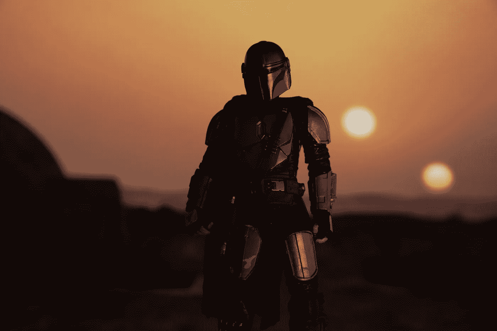

# 曼达洛人的视觉效果是沉浸式讲故事的未来

> 原文：<https://medium.datadriveninvestor.com/the-visual-effects-of-the-mandalorian-is-the-future-of-immersive-story-telling-8bd0ace6d781?source=collection_archive---------19----------------------->

## 任何足够先进的技术都和魔法没什么区别。这也适用于电影制作。

Photo by [Michael Marais](https://unsplash.com/@michael_marais?utm_source=unsplash&utm_medium=referral&utm_content=creditCopyText) on [Unsplash](https://unsplash.com/s/photos/the-mandalorian?utm_source=unsplash&utm_medium=referral&utm_content=creditCopyText)

所以我要坦白一件事。在《曼达洛人》上映之前，我从未看过任何星球大战电影。我所有的朋友都不断恳求我观看，但我没有放弃。*还不要恨我* …我只是害怕沉迷于*星球大战粉丝*。但随后，*迪士尼+宣布* [***其在《星球大战》特许经营***](https://disneyplusoriginals.disney.com/show/the-mandalorian) 中的第一个真人系列，以及压倒性的反响让我看了它的预告片。这是我看过的最棒的预告片之一，我无法阻止自己在圣诞节假期里狂看第一季和第二季的所有剧集。每个人都称赞该系列的演员阵容、音乐配乐和导演，但没有人谈论由一家名为 [**工业之光&魔法**](https://www.ilmxlab.com/) 的公司开发的视觉效果，这家公司的创始人不是别人，正是 [**乔治·卢卡斯**](https://en.wikipedia.org/wiki/George_Lucas) 。

工业光魔，或 ILM，四十年来一直在创造视觉效果，但直到他们引入了**舞台技术**，这**本质上融合了虚拟背景和真人动作**，并利用 LED 屏幕上显示的实时渲染虚拟场景，他们才改变了 VFX 游戏。那有多酷？

为了实现这种身临其境的效果，ILM 从头开始建造了一个巨大的弯曲全景 LED 环绕屏幕，允许在 Epic Games 的 [**【虚幻引擎**](https://www.unrealengine.com/en-US/)**游戏开发引擎中创建的虚拟环境在背景中投影，同时演员在摄像机前表演，以及在前景中使用爆破手、光剑和飞车等道具的实际效果。**

****

**Photo by [Michael Marais](https://unsplash.com/@michael_marais?utm_source=unsplash&utm_medium=referral&utm_content=creditCopyText) on [Unsplash](https://unsplash.com/s/photos/the-mandalorian?utm_source=unsplash&utm_medium=referral&utm_content=creditCopyText)**

******，**该系列的导演、编剧和执行制片人在拍摄《丛林之书》**[**【狮子王】**](https://www.imdb.com/title/tt6105098/) 等电影时遇到了灯光、阴影形成等问题，因此有了用这种方式制作的想法。这种方法允许演员在为摄像机内的 VFX 镜头进行录制时，直接观看他们的场景并与之互动，而不是仅仅依赖绿色或蓝色的屏幕。法夫罗在一段幕后视频中表示，这种方法肯定会改变电影制作的未来。******

****The Virtual Production of The Mandalorian****

****嗯，这种突破性的技术不仅节省了时间，而且在紧张的拍摄期限内花费了更少的钱，包括重拍、场地确定等等。你需要做的就是使用虚幻引擎渲染设计场景来模拟周围的环境，你就可以开始了。****

****博彩业已经在蓬勃发展。[截至 2018 年，视频游戏在全球范围内每年产生 1349 亿美元的销售额](https://en.wikipedia.org/wiki/Video_game_industry)。20 年前谁能预料到这一点？随着像虚幻引擎这样的游戏引擎被迪士尼+最赚钱的系列之一广泛使用，我确信电影制作的未来将受到这种虚拟制作的严重影响，而这只是许多突破的开始。****

*****就是这条路！*****

**** [## 阿尔法折叠和 GPT -激进的技术颠覆将如何影响我们的未来|数据驱动…

### 2019 年，我写了如果你关心 AI，你需要关注的前 10 个人。最近有两个机构提到…

www.datadriveninvestor.com](https://www.datadriveninvestor.com/2021/01/07/alpha-fold-and-gpt-how-radical-technology-disruptions-will-affect-our-future/) 

**访问专家视图—** [**订阅 DDI 英特尔**](https://datadriveninvestor.com/ddi-intel)****