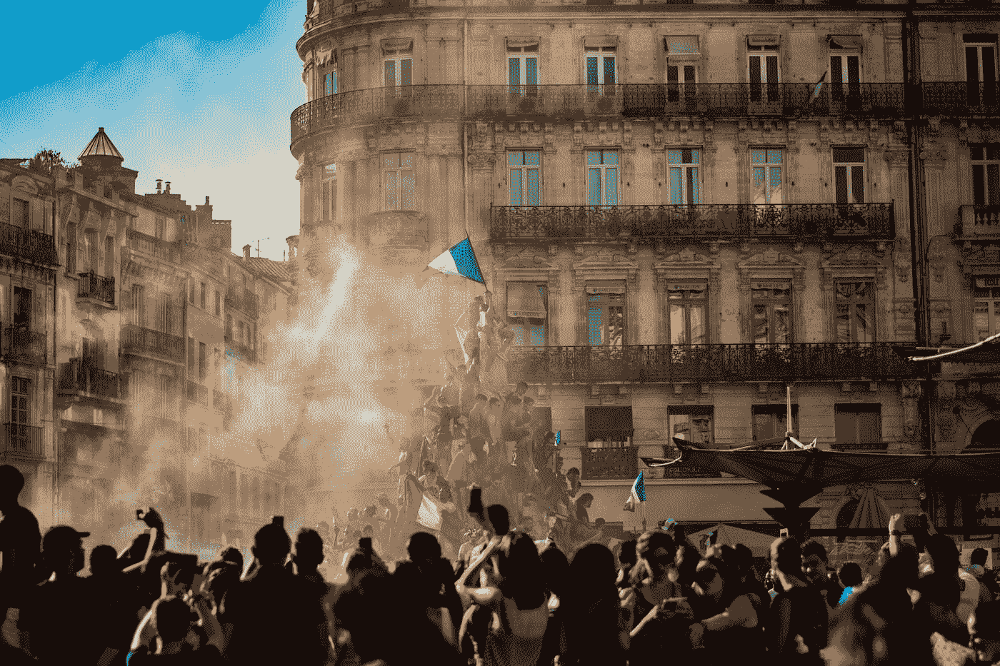

# 华尔街的反叛已经开始

> 原文：<https://medium.datadriveninvestor.com/the-wall-street-rebellion-has-begun-c2cabad16410?source=collection_archive---------8----------------------->

Photo by [Pierre Herman](https://unsplash.com/@lepipotron?utm_source=medium&utm_medium=referral) on [Unsplash](https://unsplash.com?utm_source=medium&utm_medium=referral)

## “我们喜欢股票！我们喜欢这只股票！”

> 对于婴儿潮一代和/或接近那个年龄的人来说，现在正在关注这些“千禧一代的博客帖子”:你意识到，即使你没有受到 08 年崩盘的不利影响，你的孩子或许孙子也很可能受到影响？我们不是敌人，我们是同一战线的。[ [通过 Reddit](https://www.reddit.com/r/wallstreetbets/comments/l6omry/an_open_letter_to_melvin_capital_cnbc_boomers_and/)

我读 r/WallStreetBets，觉得很搞笑，这不是什么秘密。这些散户投资者正在压垮大型对冲基金，对此我忍不住笑了。

他们为什么这么做？有些人是为了 lulz，但有些人是为了报复。这是主街对华尔街的反击。人民正在奋起反抗！

> 致梅尔文资本:你代表了那段时间我所厌恶的一切。你是一家公司，通过利用一家公司并操纵市场和媒体来赚钱。你的继续存在是一个尖锐的提醒，那些在 08 年危机期间负责这么多困难的人没有受到惩罚。

以上节选自[大学/索隆](https://www.reddit.com/user/ssauronn/)是令人心酸的。2008 年金融危机期间，他还是个青少年，目睹了这场大屠杀对每天辛勤工作的人们造成的影响。**主街被操了**，而且不是以一种好的方式。

> 你知道学校食堂番茄酱包做的西红柿汤尝起来是什么味道吗？我的朋友们会发现的。

我记得后来的破坏。人们睡在车里，邻居搬去和家人住在一起。关于美国梦的一切都在我眼前破灭了，这也是我当时支持茶党的原因(我现在不支持他们了，**他们是疯子！**)

华尔街没有因此受到任何惩罚，只有少数人进了监狱。直到今天，这件事仍然让我愤怒。

> “我不知道。我不知道，姚一奇。他们会责怪移民和穷人。”

我记得这就像昨天一样。华尔街高管用纳税人的钱给自己支付了数百万美元的奖金。然后，他们指责贪婪的老师想要额外的五分钱来生存。

人们没有忘记这一点，它已经印在我们的孩子身上。我也没有，这是错误的。

> 我把我的积蓄投入了 GME，用我的信用卡支付了这个月的房租，把我的房租投入了更多的 GME(对于 WSB 的人来说，我不建议这样做)。我拿着。对我来说这是个人问题，对数百万人来说也是如此。你可以在下班后把 GME 的价格降到 120 美元，**我哪儿也不去**。你可以为我持有的数千个 reddit 机器人付费。你可以让每个主流媒体妖魔化我们，我不在乎。我**尽我所能让你痛苦。**

通常情况下，情绪是散户/投资者的死亡，但如果有一群志同道合的人呢？站在错误的一边是很可怕的。

华尔街的反叛开始了，这是真正的占领华尔街运动。

带路[u/ssauron](https://www.reddit.com/user/ssauronn/)和 [r/WallStreetBets](https://www.reddit.com/r/wallstreetbets/) 。

**跟我来这里**

 [## 每当托马斯·奥特发表文章时，就收到一封电子邮件。

### 编辑描述

medium.thomasott.io](https://medium.thomasott.io/subscribe)