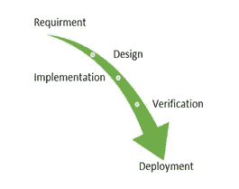
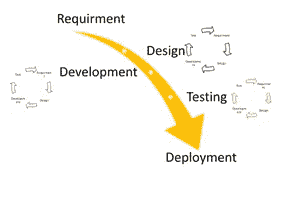
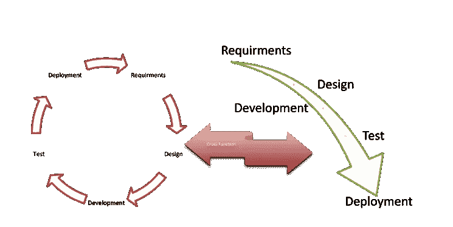

# 瀑布项目管理方法

> 原文：<https://medium.datadriveninvestor.com/the-waterfall-project-management-methodology-4d45c2025010?source=collection_archive---------5----------------------->

## 它在医疗实践中的应用

Photo by [Octavian Dan](https://unsplash.com/@octadan?utm_source=medium&utm_medium=referral) on [Unsplash](https://unsplash.com?utm_source=medium&utm_medium=referral)

今天，医疗实践变得越来越复杂和多元化，因此大多数医生都在努力跟上系统的需求。当代基于价值的报销模式给医生的日常临床工作带来了额外的负担，有些甚至到了辞职、倦怠甚至自杀的程度。

管理负担并不是医疗保健所独有的；然而，医学界和卫生行业作为一个整体，在采用新的实践模式方面远远落后于其他行业。这种滞后的原因是另一个讨论的主题；然而，它是准确的，令人担忧。虽然实践改革的拖延和负担的增加在美国更为明显，但作为相互关联的全球倡议的一部分，它也正在扩展到世界其他地区。

大型医疗保健系统已经开始实施更现代的管理策略，但独立的医疗实践与企业网络顶层的医疗实践还远未同步。但是——[医师也必须换](https://medium.com/datadriveninvestor/changing-role-of-physicians-in-21st-century-healthcare-2beb26188d07)！！！

Figure 1

近一个世纪以来，其他行业已经设计、实施了项目管理方法来克服一些过程障碍，并变得高效和多产。如前所述，大型医疗保健系统已经在其运营中采用并塑造了其中的一些工具。由于现代医疗保健系统很难区分小型和大型医疗实践，可以说独立医生肯定会从某种形式的项目管理手段中受益。

在我之前的文章中，我试图列出一些最常见的项目管理方法及其在医疗实践中的效用。在这篇文章中，我想详细介绍一种最传统的工具，即所谓的“瀑布”项目管理方法。

## 瀑布模式是基于活动的项目分解。

瀑布方法是关于将项目功能分解成连续的线性但有序的阶段。每个特定阶段都依赖于前一步的可交付成果，并与职责的专门化相匹配。这种方法对于工程角度的特定领域是理想的，如图 1 所示。

正如许多其他项目管理工具一样，一些行业，例如软件开发，不是迭代和灵活的方法，在这些行业中，进展是单向流动的。因此，像瀑布一样的“向下”计划从概念阶段通过启动、分析、设计、构建、测试、部署和维护来驱动项目。

 [## 为了主流的利益和反叛的少数人的利益而进行的个性支配

### 医生与患者代理的一瞥

medium.com](https://medium.com/datadriveninvestor/the-sway-of-individuality-for-the-benefit-of-mainstream-and-sake-of-rebellious-minority-20e70b5c8d0f) 

我们最初在制造业和建筑业中引入了瀑布方法。深刻结构化的物理环境表明，在开发过程中，设计修改很快就变得非常昂贵。在最初介绍软件开发的时候，对于基于知识的创造性工作，没有明确的困境。

## 瀑布方法的历史

在 1956 年 6 月 29 日的数字计算机高级编程方法大会上，Herbert D. Benington 支持最早公认的描述软件工程中上述阶段使用的瀑布技术。1983 年，这篇文章再版，由贝宁顿作序，证明这些阶段是根据任务的详细说明有意识地组织起来的，并指出这个过程不是严格按照自上而下的顺序实施的，而是依赖于一个原型。

## 顾名思义，瀑布模型遵循特定的向下流动顺序

瀑布模型的第一份被认可的报告经常被引用为 Winston W. Royce 在 1970 年的一篇论文，尽管 Royce 在那篇文章中没有使用瀑布这个术语。在 Royce 的原始瀑布模型中，遵循的阶段是:

●产品规格文件中的系统**要求**

● **分析**最终得出模型、方案和商业规则

● **系统架构图下的设计**

●开发、演示和集成

● **测试**，包括系统发现和消除错误

● **整套系统的安装、迁移、支持和维护的操作**

总而言之，瀑布方法声明——只有当前一个阶段被评审和验证时，才应该移动下一个阶段。

美国国防部在 1985 年实施了瀑布方法，称为 **DOD-STD-2167A** 。后者仍然是他们与软件开发承包商合作的标准，它规定“承包商应该实现一个软件开发周期，该周期包含软件需求分析、初步设计、详细设计、编码、单元测试、集成和测试的六个阶段。”

## 瀑布方案的支持论据

在项目交付周期的早期花费时间可以降低后期的成本。换句话说，在早期阶段遇到的问题，包括需求规格，比在过程的后期发现的同样的 bug 更容易修复。对于瀑布方法来说，这是非常正确的。

在标准实践中，瀑布方法以项目时间表结束，20–40%的时间用于前两个阶段，30–40%的时间用于第三个阶段，其余的时间用于测试和执行。实际的项目组织需要非常系统化。大多数大中型项目将包括一套全面的程序和控制，管理项目的每一个过程。此外，瀑布模型强调文档，如需求文档和设计文档。在不太理想的设计和文档场景中，如果团队成员在项目结束前退出，知识可能会丢失；因此，对于一个项目来说，从损失中恢复过来可能是一个挑战。

如果存在一个充分工作的设计文档，新的团队成员甚至全新的团队都可以通过研究报告来熟悉自己。

瀑布模型呈现结构化的方法；模型本身通过离散的、易于理解和解释的阶段线性发展，因此易于理解。它还提供了开发过程中容易识别的里程碑。由于这个原因，瀑布模型在许多软件工程教科书和课程中被用作开发模型的开始例子。据称，瀑布模型可以适用于需求和范围是静态的，产品本身是稳定的和持久的，并且技术得到清晰认可的项目。

## 瀑布图在医学实践中的应用

在医疗保健领域，许多人都熟悉瀑布方法，并在日常活动中自如地使用它。这对于渴望观察从开始到结束以 Gant 图表组织的一系列任务的医疗保健主管来说是非常准确的，提供了项目的可视化摘要。

使用瀑布方法，管理层可以看到事件的时间线，因此对每个项目阶段需要多长时间有一个很好的感觉。瀑布式项目管理有效地沟通了整个项目范围、任务和时间表，但是它也有其特殊的缺陷。

## 瀑布方法论批判

并不是瀑布的每个客户在看到工作产品或解决方案之前都可以理解他们的需求，因此可能会频繁地改变他们的需求，导致重新设计、重新开发、重新测试和增加费用。

设计者在设计一个特性时可能没有注意到即将到来的复杂性，在这种情况下，修改设计比坚持一个没有考虑任何新发现的限制、规范或谜团的模型更健康。

组织可以通过雇佣系统分析师来检查现有的手动系统，分析它们做什么以及我们如何替代它们，来努力解决健壮的消费者需求的短缺。尽管如此，在实践中，很难在系统分析和开发之间保持严格的分离。这是因为实现任何非平凡的系统几乎不可避免地会出现系统分析师没有意识到的问题和边缘情况。

瀑布项目管理在完成大规模计划方面有着明显的记录，但是这些项目经常超出预算并且落后于计划。利益相关者也可能对结果不满意，因为他们通常没有密切参与过程，并且直到项目结束才观察到最终结果。

随着医疗系统的经济压力越来越大，现在比以往任何时候都更需要利益相关者在整个过程中的持续参与和反馈，从而更快地交付结果。这就是为什么过程改进团队可以采用精益方法，例如敏捷项目管理，来实现快速、高质量的结果。

## 医疗保健中的劣势瀑布

瀑布是一种僵化的方法，其根源深深植根于制造业和建筑业等行业，这些行业的僵化源于需求。例如，建筑商不能在安装干墙之前粉刷房间。然而，对于其他应用程序的瀑布式解释，比如软件开发或者过程改进项目，比如医疗保健，刚性经常是具有挑战性的。从敏捷性和效率两方面来看，它都可能会延迟项目。

在医疗保健流程改进项目中，如果只使用瀑布方法，那么从开始到结束坚持一个连续的、一步一步的项目会很有挑战性。大多数改进项目都是迭代的，使用**计划、执行、研究、行动(PDSA)循环**的迭代。PDSA 循环允许团队预先重复、强调和展示进展，结果更好，客户对最终结果更满意。

 [## 现代个体医疗实践需要的不仅仅是技术

### 围绕医疗保健的官僚主义和不断增加的行政负担对任何医学专家来说都不陌生…

medium.com。](https://medium.com/datadriveninvestor/the-modern-day-solo-medical-practice-needs-more-than-just-a-technology-ed5a23bfcf13) 

## 修正的瀑布模型可能更适合医疗实践。

为了应对公认的“经典”瀑布方法的困境，各种行业已经修改了版本或者将它们与其他方法混合。特定的模型可能会对“纯”瀑布方法提出一些或所有的批评。这些模型涵盖了微软的史蒂夫·麦康奈尔称之为“改良瀑布”的快速开发模型，或者是 T2 的彼得·德格雷斯的“生鱼片模型”，即阶段重叠的瀑布模型。今天还有许多其他瀑布的修改版本，这不在本文的讨论范围之内。

## 医疗实践中可能的混合模式

由于瀑布方法的严格本质，这个项目管理工具，以其简单的格式，在原型医疗实践中具有有限的效用。然而，如果与一种或多种其他方法(如敏捷和精益方案)相结合，它会有很大的用处。总之，无论使用哪种方法，都不如在合理的预算内按时获得高质量的结果重要。并且——不管使用什么方法，任何项目管理工具最终都会起作用，只要用户坚持使用它，并确保团队理解并适应该方法。

## 选择正确的方法组合是关键

当试图为医疗实践选择合适的方法时，必须考虑几个因素。

1.  是否提前确定了所有的时间表、资源和预算
2.  客户熟悉什么方法，他们目前使用什么(如果他们使用)
3.  项目经理喜欢什么，客户喜欢什么类型的方法也很重要

## 瀑布和敏捷混合:

[敏捷是灵活的，可以适应](https://medium.com/@Adamtabriz/3e68c6853c60?source=friends_link&sk=5f78d1ad823278103b8200b14916e3f4)短的时间表或者期限不断变化的情况。对于医疗保健等项目来说，它是一个可靠的工具，在这些项目中，需求在不断发展，而规范会发生意想不到的变化。敏捷比其他方法有更高的最终用户满意度，因为他们在整个过程中都看到了项目的发展。但是预算审批非常复杂，因为它具有不稳定性和不间断性，没有确定的完成日期。这就是为什么不是每个程序都适合这种方法。

另一方面，正如前面所讨论的，当时间线、资源和资金被预先确定时，瀑布图表现得最好。

由于其悠久的历史，大多数顾客都熟悉瀑布项目管理方法。因为最终用户通常在项目结束前看不到结果，所以最终用户的满意度比敏捷低。

瀑布通常需要在项目完成后进行优化，但是它包含了清晰的结果。范围窃取可能成本高昂，并会对时间表产生负面影响。

Photo by [Mille Sanders](https://unsplash.com/@millesanders?utm_source=medium&utm_medium=referral) on [Unsplash](https://unsplash.com?utm_source=medium&utm_medium=referral)

## 杂交方法中的界面管理资源

一个“接口项目”将自觉地适合瀑布方法。因为，如果我们看一个传统的接口项目，我们通常有接口的资金和资源以及具体的预期时间表。

为了澄清，接口仅仅被定义为从事特定项目的实体之间的关联点——例如，致力于改善糖尿病患者健康结果的不同部门、领域或技能。

一个接口项目可以属于组件之间的**物理**交互；可以是系统间的**功能**需求，也可以是**分包商/供应商**之间的交互。在医疗保健和医疗实践等特定行业中，接口项目可能指的是一个**组织方案**，其中信息在学科之间交换，**知识/信息**在各方之间交换，甚至**资源在设备、材料和人员机构之间的依赖点之间共享**。

 [## 医疗保健行业的精益项目管理|数据驱动的投资者

### 有一个分类的项目管理程序制定了许多业务，可以属于一个…

www.datadriveninvestor.com。](https://www.datadriveninvestor.com/2020/07/02/lean-project-management-in-healthcare/) 

由于界面会对项目的成本和进度产生不良影响，界面管理通常是管理界面和降低这些风险的方法。然而，不利的一面是，随着各种实体的数量和项目范围的增加，与接口相关的风险也在增加，例如帮助确保各种接口子系统之间的适当通信和透明性。

## 医疗实践应用的典型项目管理场景

让我们假设一家医疗机构正在计划实现一项新的服务。该机构已将三个医生合作伙伴纳入这一新计划，以实现现代化并提供最先进的服务。但是，他们现有的电子健康记录系统(EHR)不提供他们需要的必要工作流和患者记录的最佳使用，因此需要进行大量的集成工作，包括以下内容:

涉及设计和构建新系统的 EHR 优化和工作流变更引入了 EHR 要求的接口、带有接口的新第三方应用程序和 API ( [应用程序接口](https://en.wikipedia.org/wiki/Application_programming_interface))。

Fig. 2

改革诊所还必须为临床工作人员获取上述所有内容的一个门户视图。最重要的是，客户没有固定的时间表、不断变化的需求，也没有为他们的转型分配预算。

医疗实践利用了瀑布，但由于不断的范围变化和展开的需求而失败。然后也尝试了敏捷，但没有成功，因为他们的员工不熟悉后一种方法。在这种情况下，这种医疗实践可能会受益于综合方法。在这种情况下，计划、设计、构建、测试和部署步骤可以使用瀑布方案。然后，人们可以将每个提到的步骤放入敏捷冲刺/或称为“捆绑包”的快速胜利中(图 2)使用这种方法，项目管理员每个月都会推出一个工作流、EHR 功能和集成包，这使得临床工作人员能够在整个过程中为项目管理提供必要的输入和反馈，并定期观察进度。如果临床团队遇到某个问题，管理人员将在随后的包中解决它。

Figure 3

正如你所看到的，尽管敏捷和瀑布方法各自都失败了，但是基于客户的需求和资源结合后两者，混合项目管理计划最终创建了一个系统，其结果是巨大的成功。此外，临床工作人员现在正在观察进展，并感到被理解。图 3、4 和 5 展示了另外三个瀑布/敏捷混合场景。

Figure 4

# 最好的项目管理工具是解决特定需求的工具。

项目管理不再是科技行业的专利。在所有的挑战和频繁的医疗监管要求中，传统而简单的临床工作似乎无法维持 21 世纪的医疗实践。一个有效的项目管理工具过去是，现在是，而且在未来几年将会更加方便。更不用说，患者的期望在上升，技术在手边，每个行业，无论大小，都依赖于某种形式的项目管理方法。

只要每个人都遵循和坚持，任何项目管理方法都是有益和高效的。最后，这种方法对于在预算范围内按时交付高质量的结果来说是微不足道的，但是为一个项目选择最合适的方法将有助于医疗实践所有者的及时性和保持资源量入为出的能力。

[本文最初发表于《数据驱动投资者》](https://www.datadriveninvestor.com/2020/07/20/the-waterfall-project-management-methodology/)

 [## 披露和解决方案

### 它不会阻止医生进行防御性医疗

medium.com](https://medium.com/illumination/disclosure-and-resolution-program-3359724216c2) 

**访问专家视图—** [**订阅 DDI 英特尔**](https://datadriveninvestor.com/ddi-intel)