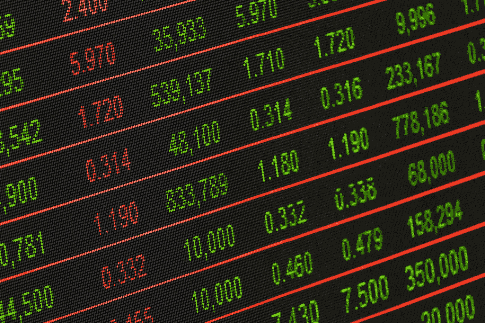

# 我们衡量经济的方式确保了它对我们不利

> 原文：<https://medium.datadriveninvestor.com/the-way-we-measure-the-economy-ensures-it-is-rigged-against-us-af84fa7d1156?source=collection_archive---------13----------------------->

[Stock Exchange Board](https://www.pexels.com/photo/stock-exchange-board-210607/) by [Pixabay](https://www.pexels.com/@pixabay) (www.pexels.com)

自 2008 年金融危机以来，世界已经敏锐地意识到困扰着 99%人类的经济不公。这些不公正包括总体收入不平等、实际工资停滞不前和就业无保障，仅举几例。考虑到这些问题，大多数人都会正确地认为，自 2008 年以来，美国经济一直很严峻。

然而，根据大多数官方经济表现指标，大多数西方经济体理应在 2008 年金融危机后实现创纪录增长。除了危机后的直接衰退和最近 2019 年底/2020 年初的经济低迷，世界经历了几十年来最长的持续经济增长期。比如，根据世界银行的数据，美国 GDP 在 2009 年至 2018 年间增长了 22%。此外，根据国家统计局的数据，2010 年至 2019 年，英国国内生产总值增长了约 18%。

 [## 另一场精心策划的全球经济危机正在逼近？如果我们的数据经济可以帮助它|数据…

### 我们的 DApp 的开发，称为 DECENTR，目前正与我们的 R&D 同步进行，作为我们即将到来的…

www.datadriveninvestor.com](https://www.datadriveninvestor.com/2019/03/06/another-engineered-global-economic-crisis-looming-not-if-our-data-economy-can-help-it/) 

如果你在美国或英国读这篇文章，你会不会觉得自己生活在一个像上面统计数据显示的那样繁荣的国家？很可能不是。我们如何调和统计上的经济成功和真实的经济低迷之间的差异(或者借用美国的词汇，华尔街和主街之间的财富差异)？

要做到这一点，我们应该好好看看政府和媒体如何衡量经济，以及经济如何增长/收缩。我们应该特别评估最广泛使用和报道的经济指标:国内生产总值(GDP)。

**什么是 GDP？**

根据英格兰银行的说法，GDP 是衡量一个国家在一段时间内(通常是一个季度或一年)经济规模和健康程度的指标。有三种方法可以衡量这一点:

*   生产的商品和服务的总价值(“产出”)；
*   每个人的收入；
*   或者全国每个人都花了多少钱。

第三种方法——国家总支出——是最常用的方法。用这种方法计算的支出例子有家庭和个人购买食品、企业投资新设备、政府在基础设施上的支出等。

因此，当一个国家的个人和实体增加他们的总支出时，国家经济就增长了。从表面上看，这似乎是衡量经济表现的明智方式。然而，这忽略了这种测量方法的许多明显的缺点。

**GDP 的问题**

GDP 最明显的缺点是，它没有显示全国人口的支出和收入是如何平均分配的。这意味着，一个由寡头控制的社会可以表现为拥有健康增长的经济，即使 99%的支出和收入被 1%的超级富豪所囤积。

其次，GDP 没有反映支出决策如何对更广泛的社会产生负面影响(这些被称为外部性)。这是因为衡量支出的财务方面是一项明确而客观的任务。你只需将所有花费在合格活动上的钱加起来，例如，那个人上个月在食物上花了多少钱，买这栋楼花了多少钱等等。我知道现实中需要做的工作比这多得多，但这是基本原则。相比之下，外部性通常很难确定一个客观的货币价值。例如，我们知道气候变化正在造成巨大破坏，但世界尚未就这种破坏给人类带来的普遍货币成本达成一致。因此，国内生产总值在最好的情况下刺激了为社会提供有限实际利益的活动(例如，如果一个独裁者用税收建造了 100 座自己的雕像)，或者在最坏的情况下，使危害社会的活动合法化(例如，一家国防制造商通过出售武器获得收入，这些武器随后被用于实施种族灭绝)。

综上所述，国内生产总值依赖于客观衡量事物的货币价值，忽略了有益于社会但不产生收入的活动。例如，国内生产总值不能反映一个年轻人照顾老人或生病的亲属所做的工作。

此外，根据一个国家的人口规模，GDP 可能会产生误导。一个国家可以有很大的 GDP 总量，但也可能有巨大的人口。这意味着普通人的收入不足。经常使用的更准确的衡量标准是人均国内生产总值(国内生产总值除以人口)，尽管这仍然存在上述缺点

**国内生产总值如何负面影响经济政策**

也许政府和政策制定者最重要的工作是确保经济运行良好。到了选举时间，经济状况和前景通常是决定竞选成败的因素(英国退出欧盟除外)。

为了完成这项工作，管理经济的个人和机构依赖于统计数据，其中 GDP 可能是最重要的。这些统计数据既用于衡量他们政策的效果，也作为向公众和市场证明他们的政策正在发挥作用的证据。它们本质上是政府经济记录的关键绩效指标。这是有道理的。没有详细的信息，你无法管理和评估像经济这样复杂的东西。

不幸的是，KPI 有演变成绩效激励的习惯。当它们应用于庞大的机构时，尤其如此，例如那些管理经济的机构，即政府财政部、智库和中央银行。这些机构面临着向公众和市场展示其经济理念成功的压力。如果做不到这一点，这些机构中的个人将会受到选举失败和职业前景黯淡的惩罚。

结果，这些机构在管理经济时，变得过度专注于实现统计 GDP 目标，而忘记了经济的根本目的:让普通人过上体面的生活。

这是 HBO 传奇系列《火线》(The Wire)的主题之一(尽管该剧更多地涉及刑事司法和教育，而非经济)。巴尔的摩警察局的领导层过于专注于满足政客们设定的任意查封、逮捕和起诉目标，以至于他们忽视了该市的毒品交易仍在增长的事实。事实上，他们仍然没有意识到这样一个事实，即他们为实现这些目标而采用的过度策略导致他们本应保护的当地社区对执法部门产生了更多的敌意。

这些不正当的激励和 GDP 衡量的性质导致经济政策制定者实施比大多数其他考虑因素更重要的增加经济支出的解决方案。这不成比例地有利于富人和大公司。这些实体已经拥有更大的购买力，因此最有能力改善国家的国内生产总值统计数据。政策制定者寻求帮助巨富和商业利益的解决方案包括:

*   彻底放松管制，例如废除格拉斯-斯蒂格尔法案
*   降低社会最富有人群的税率
*   鼓励不计后果的掠夺性贷款
*   剥夺工人的权利
*   让投资银行自由支配，并在它们陷入困境时为它们纾困

这些政策显然产生了负面的社会影响，并长期加剧了不平等。然而，这些外部性没有被考虑到国内生产总值和当权者使用的大多数措施中。

有什么办法？

到目前为止，你可能认为我想完全放弃使用 GDP。实际上，我认为 GDP 可以作为一个国家经济健康的有用指标。它不可能是唯一或最重要的指标。政府、媒体和更广泛的社会在如何衡量经济方面需要更加细致入微。这意味着使用一系列经济指标来衡量经济的所有定性和定量方面，并在判断经济表现时给予它们或多或少的同等考虑。一种国民经济仪表板。

在这一点上，有必要记住，管理我们经济命运的人广泛使用其他经济指标，如通货膨胀率、失业率、股票市场指数和国家货币价值。虽然这些指标中的大部分都很重要，并且肯定应该包含在仪表板中，但是它们的计算方式需要彻底改革。

例如，英国的 CPI 通胀率没有考虑住房成本。考虑到房租/抵押贷款是中产阶级和工薪阶层家庭每月最大的支出，这似乎削弱了 CPI 对普通人的相关性。如果住房成本不会被纳入通货膨胀率，那么仪表板至少应该包括一个单独的指标，以反映住房成本。衡量失业的方式应该调整，以确保政府不能通过调整谁被算作失业者来有利地篡改统计数据。关于股票市场指数——我认为不应该把它当作衡量经济如何影响现实生活的标准。

仪表板还应包括考虑到非货币因素的新指标。例如，可以强调基尼系数来显示一个国家的收入在人口中的平均分布。类似于世界幸福指数的东西可以用来评估人们如何看待他们的生活质量。专家们还应该编制衡量全球环境健康的指数，以及这些指数如何影响日常生活(说起来容易做起来难)。

我们还应该注意到，衡量经济表现的方式并不是一个理应增长的经济没有惠及社会大多数人的唯一或最重要的原因。政治腐败、企业支持的媒体的偏见以及国家课程中缺乏经济意识等问题，肯定会对经济如何被操纵以对抗普通人产生更直接的影响。

除了调整政府衡量经济表现的方式，让民众更加了解经济的运行方式并要求领导人承担更多责任也是至关重要的。他们需要提醒当权者，经济是为人民服务的，而不是相反。