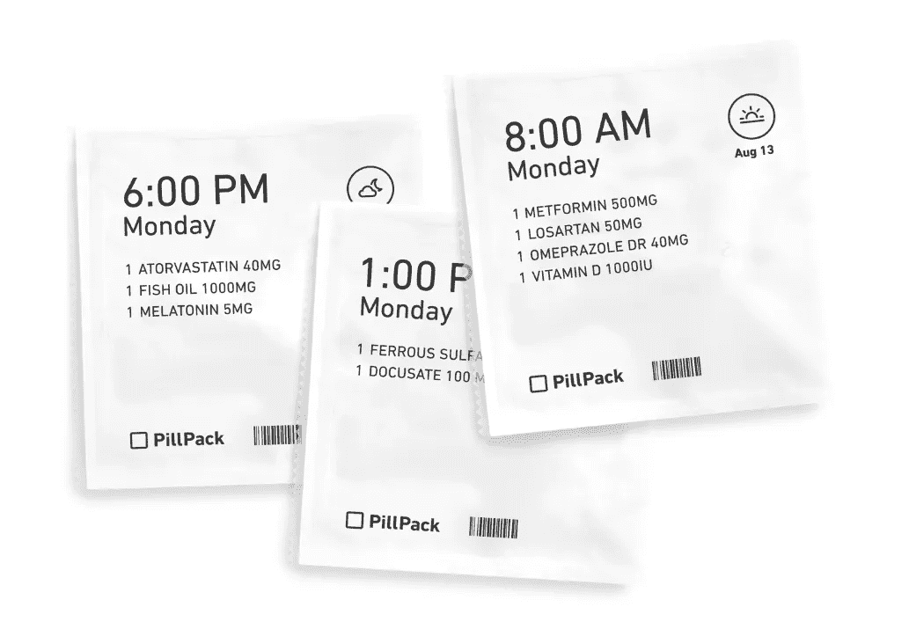
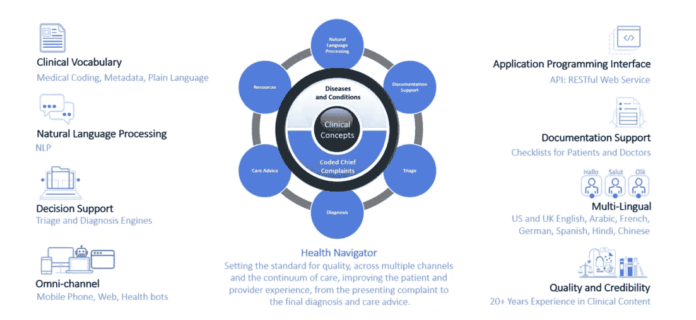
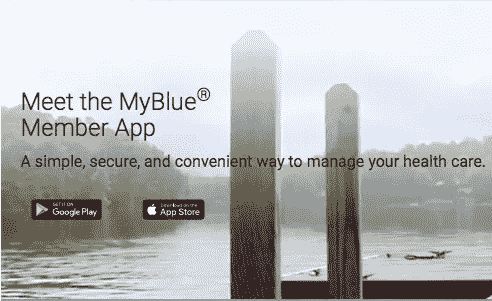
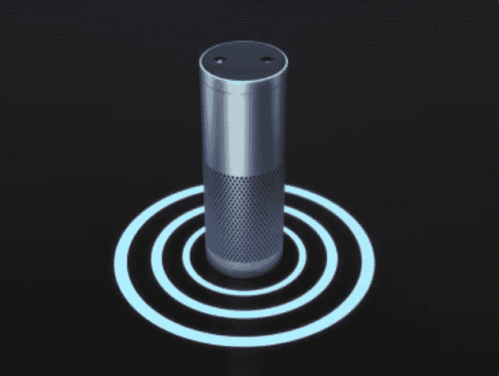
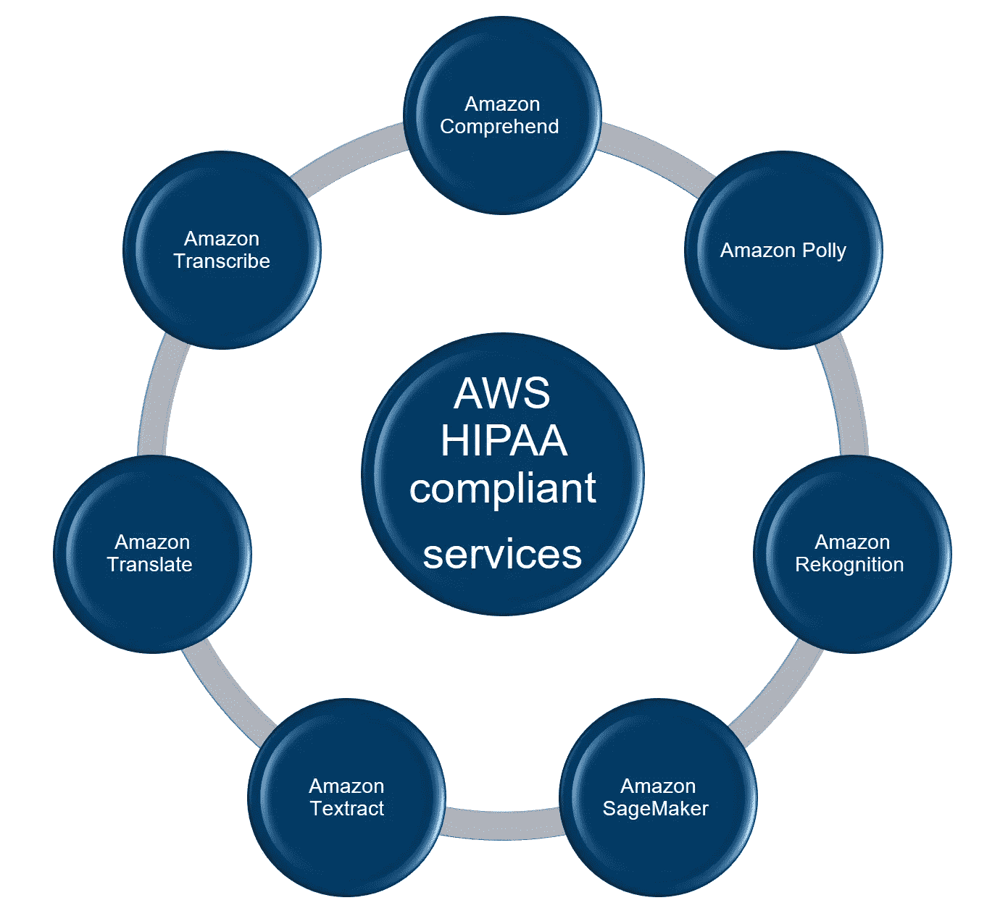
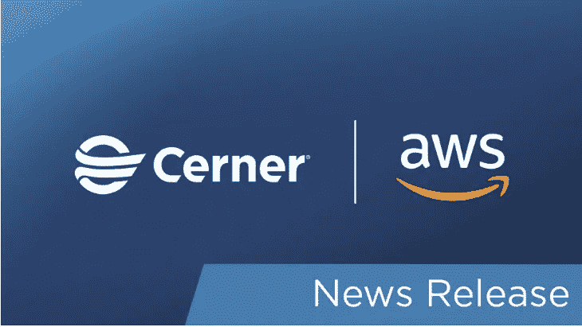
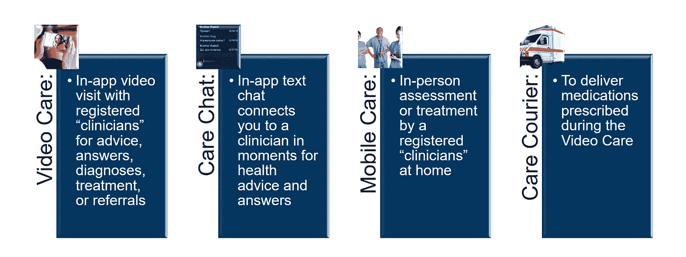

# “健康关怀”新路径:亚马逊颠覆、诱惑和征服医疗保健和保险组织的数字战略透视。

> 原文：<https://medium.datadriveninvestor.com/the-wellcare-new-trail-8f354fd78c19?source=collection_archive---------13----------------------->

我们看待健康和财富方式正在发生一场革命。一个以患者为中心的颠覆性医疗保健服务，作为潜在的驱动力，将使这种颠覆产生一个新的生态系统: [**“健康护理”**](https://www.linkedin.com/pulse/birth-wellcare-long-term-digital-strategy-pharma-flavio-aliberti/)【1】。

在这个阶段，没有一家公司有资源和能力来处理整个 **wellcare 产品** : *产品选择、研发& D、临床试验、健康设备、扩大规模、制造、下游加工、包装、品牌和营销、支付方式、私人财富管理、收入服务数字基础设施(人工智能、ML、云兼容服务)、物理基础设施(医院、诊所、实验室)、员工(医生、科学家、临床医生)以及最后但同样重要的以患者为中心的范式*。

对于传统的保险和医疗保健提供商来说，构建这一服务将是一件棘手的事情，他们需要找到自己的发展模式，*围绕新的数字机遇改变他们的思维模式，联合和重塑他们的服务。*

与此同时，以患者为中心的范式是科技巨头的一个很好的切入点，这些巨头手头有现金，接近客户，有“先锋”心态，可以抓住机会进入全球每年价值 7 万亿美元的行业，每年增长 5.5%，到 2027 年仅在美国就将达到近 6 万亿美元。

 [## 与其他电子商务平台相比，亚马逊的优质运输选项如何|数据驱动…

### 在线购物在总销售额中所占的比例持续增长，各大零售商和平台都在寻求…

www.datadriveninvestor.com](https://www.datadriveninvestor.com/2019/12/12/how-do-amazons-premium-shipping-options-compare-to-other-ecommerce-platforms/) 

这就是谷歌的情况，它在 2019 年 9 月与医学最负盛名的品牌之一[梅奥诊所](https://www.statnews.com/2019/09/10/google-mayo-clinic-partnership-patient-data/)【2】签署了合作伙伴关系，将患者数据存储在云中，并使用人工智能和其他技术来开发产品，以改善护理。同样，[苹果在 IOS 上创建了 research kit](https://www.apple.com/healthcare/)【3】，这是一个开源框架，使研究人员更容易招募参与者，获取知情同意，并更频繁地收集医疗信息，而不仅仅是在定期访问期间。此外，脸书[在 2019 年 10 月推出了“预防性健康”](https://preventivehealth.facebook.com/)【4】，这是社交媒体平台上的一个新工具，它将人们与健康资源和领先健康组织的检查建议联系起来。

尽管所有这些都非常有前途，但与亚马逊正在做的事情相比，这些都是“小步前进”:在 [AWS re: invent 2019](https://reinvent.awsevents.com/2019.html) [5]之后，亚马逊在这个方向上旨在转变医疗保健的领导作用几乎没有怀疑的余地。

在截至 12 月 4 日的 5 天内，亚马逊推出了 75 项新服务，其中几项强烈关注生命科学，并与过去 18 个月部署的 M&A 战略非常契合，以便在真正以患者为中心的范式下为客户提供强大的医疗保健服务。

在这篇短文中，我们将列出亚马逊 M&A 战略的关键要素，强调新的健康护理产品是如何形成的。

# 战略背景:亚马逊对健康护理的雄心。

亚马逊是世界上最大的科技机构之一，净销售额为 2329 亿美元，61.33 万名员工在 2017 年创造了 101 亿美元的净收入。*基础设施在云中的主导地位、强大的物流服务、高性能计算、极具颠覆性的创新周期以及与客户的亲密关系是打入新市场的关键要素。*

在过去的 18 个月中，亚马逊利用其在基础设施、物流、计算和患者接近度方面的竞争优势，不断进入医疗保健系统:

M&A 亚马逊在过去 18 个月的战略已经围绕三个方向明确制定:

*   *医疗保健机构的收购；*
*   *提高服务的合规性，以在高度监管的市场中获得牵引力；*
*   *试点受控计划*。

# 快速证明事实

# 1.医疗保健组织的收购

**网上药店**:2018 年 9 月——亚马逊以 7.53 亿美元收购网上药店[药丸包](https://www.pillpack.com/)【6】，提供端到端服务，直接在家管理*医院最佳实践患者的药物假设*。PillPack 服务包括(无需额外费用)药房支持(白天或晚上)、自动配药(在患者需要之前)和免费送货上门(就在门口)。患者只需支付标准的 30 天共付额或自付费用(根据保险计划)。Pillpack 已经在美国的大多数保险计划中使用。

**在线诊断**:2019 年 10 月——亚马逊收购[health navigator](https://www.healthnavigator.com/)【7】，提供在线症状检查。目的是“[消除旅行和等待时间](https://www.cnbc.com/2019/10/23/amazon-acquires-digital-health-start-up-health-navigator.html) [8]，通过实时聊天或视频将员工及其家庭成员与医生或执业护士联系起来，并选择注册护士提供的现场跟进服务，范围从免疫接种到即时链球菌咽喉检测”。

**支付者应用集成**:2019 年 12 月——pill pack(亚马逊在线药店)首次推出了与支付者应用的直接集成[my blue](https://myblue.bluecrossma.com/myblue-app-mobile)【9】，保险公司的受益人可以*订购、支付药物并免费到家领取药物*。这将允许会员将他们的处方转换为 PillPack，而不必重新输入他们的保险详情或药物清单。

# 2.提高服务的合规性，以在高度监管的市场中获得牵引力

**Alexa for health care**:2018 年 10 月，亚马逊为其新版本的虚拟助手 Alexa 申请了专利，该助手可以自动分析语音，识别疾病或情绪的迹象。根据亚马逊的说法，有了这个功能，Alexa 将能够跟踪情绪，[为这些情绪建议“活动”](https://www.telegraph.co.uk/technology/2018/10/09/amazon-patents-new-alexa-feature-knows-offers-medicine/) [10]。

在 2019 年 4 月，[六项新的 Alexa 医疗保健技能](https://developer.amazon.com/blogs/alexa/post/ff33dbc7-6cf5-4db8-b203-99144a251a21/introducing-new-alexa-healthcare-skills) [11]来自行业领先的医疗保健提供商、付款人、药房福利经理和数字健康教练公司，已被添加到 HIPAA-eligible 环境服务中。

**用于医疗保健的机器学习和人工智能**:2019 年 12 月—[Cerner](https://www.cerner.com/blog/machine-learning-is-transforming-health-care)[12]正在进行的 AWS 工作，以及[亚马逊 SageMaker](https://aws.amazon.com/sagemaker/) [13]的使用，使研究人员能够查询匿名的患者数据，以建立复杂的模型和算法，从而导致[更早地检测到充血性心力衰竭](https://arxiv.org/abs/1902.02443) [14]。他们最近宣布了一项计划[，以减少患者再次入院和记录患者就诊的时间](https://www.cerner.com/blog/cerner-aws-work-to-reduce-patient-re-admissions-and-time-spent-documenting-patient-visits)【15】。

**ML 合规**:2019 年 10 月—亚马逊网络服务达到 7 机器学习 [HIPAA 合规](https://aws.amazon.com/compliance/hipaa-compliance/)医疗保健和生命科学合格服务。通过这些服务，医疗保健提供商可以使用符合流程的人工智能工具来处理受保护的健康信息文档。Aculab 和 Zocdoc 是两家已经在使用这些服务的公司。

借助 AWS，可以构建存储、处理和传输敏感健康相关信息的应用程序，同时遵守联邦风险和授权管理计划 [(FedRAMP)](https://aws.amazon.com/compliance/fedramp/)

# 3.专属倡议试点

**员工医疗保健计划**:2019 年 9 月— [亚马逊关爱](https://amazon.care)【20】是一项针对西雅图地区的亚马逊员工及其家人试行的福利，为西雅图地区的亚马逊员工及其家人提供建议、答案、诊断、治疗或护士和医生的转诊服务。目前，这项服务的重点是紧急问题、预防性健康咨询、避孕和性传播感染(STI)检测等性健康服务以及一般健康问题。

天堂医疗保健公司(Heaven health care):2018 年 1 月——亚马逊、摩根大通和伯克希尔·哈撒韦(Berkshire Hathaway)的非营利性合资企业，旨在降低 120 万员工的医疗保健成本，让他们更健康。摩根大通在 19 年 10 月开始测试。 [Heaven Healthcare](https://havenhealthcare.com) 旨在利用“*数据和技术的力量来推动更好的激励、更好的患者体验和更好的系统*”。

# 接下来会发生什么？

如果我们的假设是正确的，亚马逊将在未来 24 个月内:

*   收购公司并在内部开发服务，以提供保险服务，特别是针对金融稳定的服务；
*   通过在临床试验中提供服务，利用客户数据增加在 R&D 的渗透率；
*   向其他部门/国家的联盟推广和扩大试点专属倡议

预测未来 2 到 5 年将会发生什么非常具有挑战性，并且强烈依赖于保健生态系统的发展方式。亚马逊很有可能会继续努力围绕 R&D 医疗保健(药物发现、健康设备、预防和预测)创建新标准，简化支付并创建版税和其他收入机制，以在经济上吸引客户。

# 结论

健康护理可能会比预期来得早。

最重要的是，在过去的 18 个月中，亚马逊部署了 M&A 战略，明确进入医疗保健领域，并围绕以病人为中心的新范式重塑产品。谷歌、苹果和脸书等其他科技巨头也开始在医疗保健领域寻找机会，通过利用他们的“客户群”和数字产品来采取行动。

**亚马逊之路:一条从医疗保健到健康护理的道路**

为了加入这场由数字力量推动的全球医疗改革，生命科学和保险公司可以效仿亚马逊 M&A 的做法，但如果它们不想被自己世界的破坏方向所困扰，就需要迅速改变陀螺仪。

wellcare 生态系统将大于其各部分的总和，并将需要个人和社区之间互动的新方式，因此在继续购买专利的同时，传统参与者也应该**迅速开始克服思维**、**商业模式和技术**方面的内部障碍，利用数字化浪潮，更接近客户/患者。

__________________________________________________________________________

免责声明:本文中的观点或意见是个人的，仅属于文章作者，不代表作者在专业或个人能力方面可能或可能不相关的人、机构或组织的观点或意见，除非明确声明。

__________________________________________________________________________

[1][https://www . LinkedIn . com/pulse/birth-well care-long-term-digital-strategy-pharma-flavio-aliberti/](https://www.linkedin.com/pulse/birth-wellcare-long-term-digital-strategy-pharma-flavio-aliberti/)2020/01/02 9:20 CEST 检索

[2]【https://www.apple.com/healthcare/】检索于 2020/01/02 9:20 CEST

[3]https://preventivehealth.facebook.com检索于 2020/01/02 9:20 CEST

[4][https://reinvent.awsevents.com/2019.html](https://reinvent.awsevents.com/2019.html)2020/01/02 9:20 CEST 检索

[5][https://www.pillpack.com](https://www.pillpack.com)检索于 2020/01/02 9:20 CEST

[6][https://www.healthnavigator.com](https://www.healthnavigator.com)2020/01/02 9:20 CEST 检索

[7][https://www . CNBC . com/2019/10/23/Amazon-acquisites-digital-health-start-up-health-navigator . html](https://www.cnbc.com/2019/10/23/amazon-acquires-digital-health-start-up-health-navigator.html)2020/01/02 9:20 CEST 检索

[8][https://myblue.bluecrossma.com/myblue-app-mobile](https://myblue.bluecrossma.com/myblue-app-mobile)检索于 2020/01/02 9:20 CEST

[9][https://www . telegraph . co . uk/technology/2018/10/09/Amazon-patents-new-Alexa-feature-knows-offers-medicine/](https://www.telegraph.co.uk/technology/2018/10/09/amazon-patents-new-alexa-feature-knows-offers-medicine/)检索于 2020/01/02 9:20 CEST

[10][https://developer . Amazon . com/blogs/Alexa/post/ff 33 DBC 7-6 cf 5-4d b8-b203-99144 a 251 a 21/introducing-new-Alexa-health care-skills](https://developer.amazon.com/blogs/alexa/post/ff33dbc7-6cf5-4db8-b203-99144a251a21/introducing-new-alexa-healthcare-skills)2020/01/02 9:20 CEST 检索

[11][https://developer . Amazon . com/blogs/Alexa/post/ff 33 DBC 7-6 cf 5-4d b8-b203-99144 a 251 a 21/introducing-new-Alexa-health care-skills](https://developer.amazon.com/blogs/alexa/post/ff33dbc7-6cf5-4db8-b203-99144a251a21/introducing-new-alexa-healthcare-skills)2020/01/05 9:20 CEST 检索

[12][https://www . cerner . com/blog/machine-learning-is-transforming-health-care](https://www.cerner.com/blog/machine-learning-is-transforming-health-care)

[13][https://aws.amazon.com/sagemaker/](https://aws.amazon.com/sagemaker/)检索于 2020/01/05 8:15 CEST

[14]https://arxiv.org/abs/1902.02443检索于 2020/01/05 8:15 CEST

[15][https://www . cerner . com/blog/cerner-AWS-work-to-reduce-patient-re-admissions-and-time-speed-documentation-patient-visits](https://www.cerner.com/blog/cerner-aws-work-to-reduce-patient-re-admissions-and-time-spent-documenting-patient-visits)检索于 2020/01/05 8:15 CEST

[16][https://aws.amazon.com/compliance/hipaa-compliance/](https://aws.amazon.com/compliance/hipaa-compliance/)2020/01/05 8:20 CEST 检索

[17][https://www.aculab.com/](https://www.aculab.com/)检索于 2020/01/05 8:20 CEST

[18][https://www.zocdoc.com/](https://www.zocdoc.com/)检索于 2020/01/05 8:20 CEST

[19][https://aws.amazon.com/compliance/fedramp/](https://aws.amazon.com/compliance/fedramp/)检索于 2020/01/05 8:20 CEST

[20][https://amazon.care/](https://amazon.care/)检索于 2020/01/05 8:20 CEST

[21][https://havenhealthcare.com/](https://havenhealthcare.com/)检索于 2020/01/05 8:20 CEST

*原载于 https://www.linkedin.com***。**