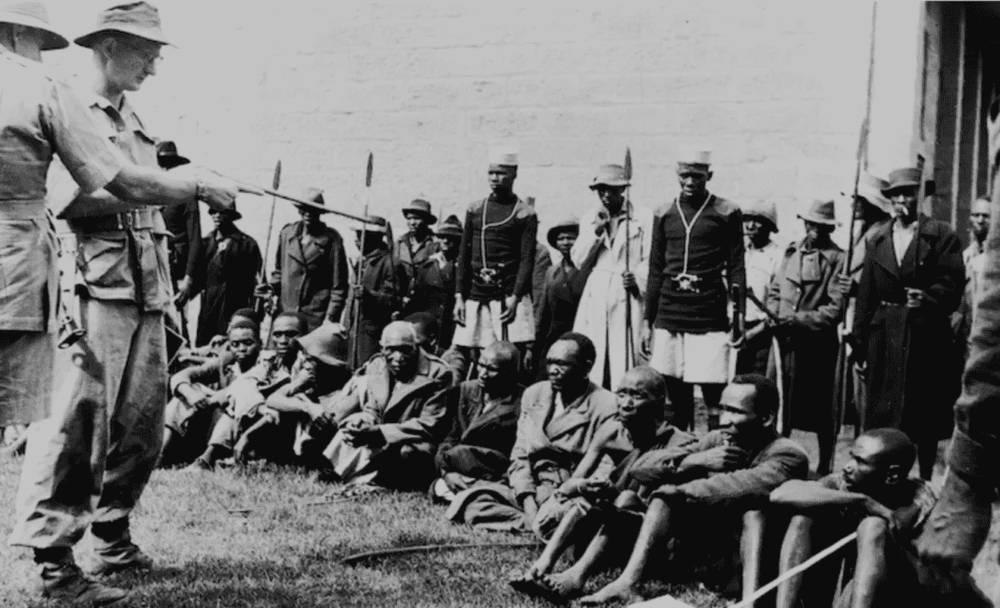
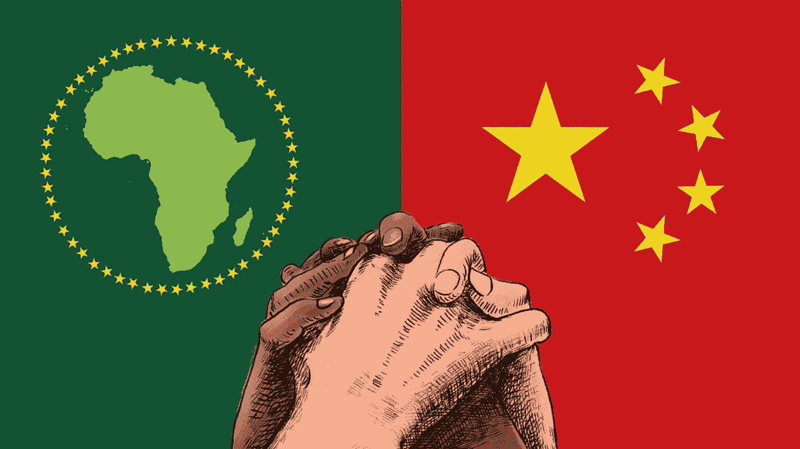

# 西方:被非洲抛弃的情人

> 原文：<https://medium.datadriveninvestor.com/the-west-africas-jilted-lover-29728d92c0e6?source=collection_archive---------19----------------------->

就像大多数有毒的、单方面的关系一样，西方世界非常羡慕非洲与中国建立更好的关系。西方与非洲的关系跨越了 600 年，既痛苦又充满敌意。非洲与西方关系的开始是强有力的，非洲受到了强有力的讨好；充其量，被诱骗进入这种怪诞的关系。这种关系当然首先产生了奴隶制，然后产生了殖民主义，并以新殖民主义的形式发展到成年。

无可辩驳的是，这种关系的痛苦至今仍能感受到，尤其是前法国殖民地，它们仍在向法国偿还殖民债务，并将 50%的货币——非洲金融共同体法郎——存入法国央行。这些前法国殖民地甚至无法控制自己的货币。你可能会问为什么这种关系至今依然存在；一个字——恐吓。当几内亚拒绝在独立后立即屈服于法国的主张时，作为一种惩罚措施，法国摧毁了建筑物，投毒并烧毁了粮食储备，撤出了公务员，并将其称为“没有养老金的离婚”——没有赡养费的离婚。这意味着非洲人应该感谢殖民统治。这仅仅是西方和非洲之间持续了几个世纪的虐待的一小部分。

几个事件加在一起，将非洲推向了新超级大国中国的怀抱。中国准备在谈判桌上平等对待非洲。尽管围绕中国贷款存在争议，但与西方贷款不同的是，中国贷款有一些直接的实施方式。鉴于中国的新丝绸之路——一带一路，港口、桥梁、公路、火车、房地产和电力基础设施正在建设中。中国意识到，为了进一步巩固权力，它必须带动其他国家。

这反过来让西方对失去他们以前的傀儡感到焦虑，就像被抛弃的情人一样，他们求助于宣传。像新殖民主义者一样给中国起不同的名字，指责他们通过贷款引诱非洲陷入债务陷阱:这些指控是他们应得的。一些国家，比如美国，已经在埃塞俄比亚投资了 50 亿美元来对抗中国的影响。

 [## 阿根廷-对美国和中国的警告|数据驱动的投资者

### 人们可能会问，为什么北美繁荣昌盛，而拉丁美洲却远远落在后面。毕竟，关于…

www.datadriveninvestor.com](https://www.datadriveninvestor.com/2020/02/17/argentina-a-warning-to-the-united-states-and-china/) 

然而，非洲必须小心对待它的新情人，并记住“天下没有免费的午餐”这句话仍然有一定的道理。作为与中国打交道的一个例子，斯里兰卡因为无力偿还债务，不得不取消一个港口的赎回权，以支持中国。

**进入专家视角—** [**订阅 DDI 英特尔**](https://datadriveninvestor.com/ddi-intel)