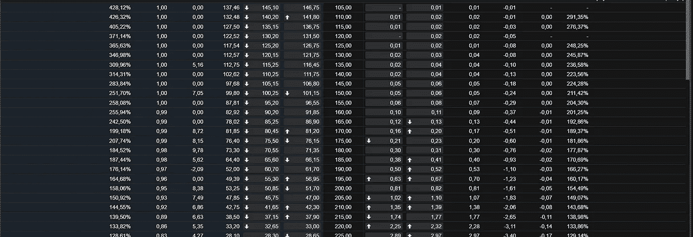

# 车轮投资策略。

> 原文：<https://medium.datadriveninvestor.com/the-wheel-investment-strategy-335b6b532ff5?source=collection_archive---------2----------------------->

假设我们已经通过[规则#1 投资模板](https://medium.com/datadriveninvestor/the-rule-1-of-long-term-investing-5e34c5702e49?source=your_stories_page---------------------------)分析了一家公司，并且我们理解[我们可以做的基本期权交易](https://medium.com/datadriveninvestor/the-four-basic-options-trades-and-their-risk-profile-85539985e323?source=your_stories_page---------------------------)，那么车轮投资策略就是我们下一步要采取的逻辑步骤。

Photo by [Jon Cartagena](https://unsplash.com/@cartega?utm_source=unsplash&utm_medium=referral&utm_content=creditCopyText) on [Unsplash](https://unsplash.com/s/photos/wheel?utm_source=unsplash&utm_medium=referral&utm_content=creditCopyText)

# 准备

## 车轮战略的第一步。

新手或价值投资者需要掌握的第一个交易策略是轮盘策略。

先决条件是基本面分析知识，股票和商业估值，以及现有的基本期权交易。

我们现在将通过例子来检验这个策略。假设我们要分析 XYZ 公司。我们是它的忠实粉丝，我们有兴趣收购它的一部分。

根据“规则#1 ”,我们首先检查过去十年的平均销售增长率、ROIC、每股收益、现金流增长率和自由现金流增长率。如果数字是正确的，我们继续检查公司的领导层，他们是如何思考的，以及给股东的信。如果信息是积极的，那么我们计算 15%的安全边际。完成上述所有计算后，我们可以去查看公司股票当前的交易价格。我们假设 XYZ 公司的股票交易价格是 210 美元，我们 15%的安全边际是 105 美元。

有了这些常数，我们需要继续实施车轮战略。

 [## 投资区块链前要问的三个简单问题(也是一个困难的问题)|数据…

### 现在是了解区块链的最佳时机。不同货币之间的增长率，比如…

www.datadriveninvestor.com](https://www.datadriveninvestor.com/2020/03/12/three-simple-questions-and-one-difficult-one-to-ask-before-investing-in-a-blockchain/) 

# 轮盘策略

## 车轮战略的第二步。

在我们知道我们的数字之后，我们就可以以我们的安全边际价格购买一个超值的看涨期权。

在上面的例子中，我们需要以 105 美元的价格买入一个近期(从几周到一个月)的看涨期权。

Screenshot from the Saxo Bank Pro trading platform.

通过出售一份现金担保期权合约，我们有义务进入这种特定股票的多头头寸，100 份股票合约的价格为 105 美元。总成本 10.500 美元。

Screenshot from the Saxo Bank Pro trading platform.

如果期权不被行使，我们将获得 14.685 美元的溢价。如果我们仍然想购买 XYZ 的 100 股股票，那么我们收到的溢价将使成本最小化。

更具分析性的是，在当前 210 美元的价格下，100 只股票将花费 21.000 美元。(210 美元 X100 = 100 股股票的 21.000 美元成本)。因此，在我们收到溢价后，我们的总投资成本将是 100 只股票的成本减去收到的溢价。(21.000 美元-14.685 美元= 6.315 美元总投资成本。)

## 车轮战略的第三步。

万一期权被行使，我们就拥有 100 股 XYZ 股票。现在，我们可以开始出售进一步的 OTM 备兑买入期权合约。我们得到溢价，如果期权被行使，我们有义务出售我们的 100 股 XYZ 股票，因此我们失去了它们，所以我们重新开始“车轮”。

如果我们在轮盘策略的第二步中购买的期权没有被执行，我们就继续卖出更多的期权合约，这样我们就能获得溢价。

# 步骤回顾

1.  喜欢这家公司，不介意拥有它的股票。
2.  计算这家公司的基本面，对其股票进行估值。
3.  以我们的安全边际价格卖出价外备兑买入期权。
4.  如果行使，我们现在拥有股票。
5.  如果没有，我们得到了支付的保费。
6.  如果行使，进一步卖出 OTM 备兑看涨期权
7.  重复

# 额外注释

当我听到关于车轮策略的 Option Alpha 播客时，我听到 MACDDaddy 说他会出售成长股的期权合约，成长股指的是产生正现金流并引领行业的股票，或股息股，指的是支付股息并更成熟的公司的股票。

一些人在社交媒体上写道，“没有动力”的股票，指的是目前正在跟随趋势或动力的股票。不管这个模糊概念的定义是什么，麦克达德都不会在动量股上实施轮子策略。

最后，我们需要提到的是，车轮策略可以变成更复杂的策略。例如，我们可以写差价或铁鹰，而不是备兑看涨期权。开始时，虽然如果我们遵循这个简单的模式会很好。

*来源*

1.  【https://optionstradingiq.com/the-wheel-strategy/ 号
2.  采访期权阿尔法成员麦克达德&“车轮卖出”期权策略——节目# 107——【https://www.youtube.com/watch?v=CLXiuPrqo0g 

免责声明:

为了投资这些市场，你必须意识到风险并愿意接受它们。不要用你输不起的钱去交易。本文包含的信息仅用于教育目的，不作为任何特定投资的建议。在任何市场交易都有很高的风险，可能不适合所有的投资者。

## 访问专家视图— [订阅 DDI 英特尔](https://datadriveninvestor.com/ddi-intel)