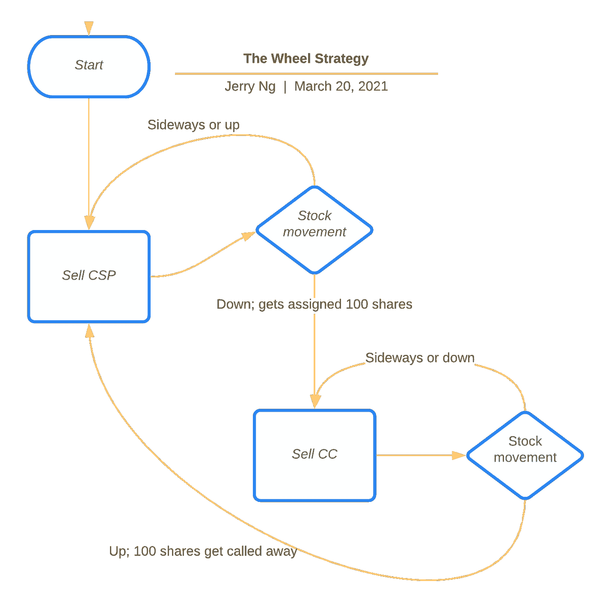

# 轮盘选择策略

> 原文：<https://medium.datadriveninvestor.com/the-wheel-strategy-99e16b9540b2?source=collection_archive---------0----------------------->

## 对臭名昭著的西塔帮三倍收入策略的简明扼要的解释

Photo by [Kosta Bratsos](https://unsplash.com/@kbvisual?utm_source=medium&utm_medium=referral) on [Unsplash](https://unsplash.com?utm_source=medium&utm_medium=referral)

T *何轮*是一种相对简单的期权交易策略，你反复卖出 [*现金担保看跌期权*](https://www.optionseducation.org/strategies/all-strategies/cash-secured-put) (CSP)到**收取期权费**。

如果你被指派，你将持有并卖出被指派股票的 [*备兑看涨期权*](https://www.investopedia.com/articles/optioninvestor/08/covered-call.asp) (CC)。如果你的股票被赎回，你就回去卖 CSP。冲洗并重复。

这篇文章的目标是更详细地阐明*轮子*是什么，并解释在运行*轮子*时可以使用的一些技巧和策略。

如果你在了解期权交易之前就来到了这里，我在这里写了一篇简短的文章，用通俗的语言解释了期权的基础知识:

 [## 期权 101——如何开始期权交易

### 在短短 5 分钟内阅读期权交易的基础知识和例子

medium.datadriveninvestor.com](/options-101-how-to-start-options-trading-fb9a7da3017a) 

## 放弃

> 本博客中所写的信息是基于我个人的观点和经验，它不应该被认为是专业的金融投资建议。在没有首先评估你自己的个人和财务状况，或者没有咨询财务专家的情况下，千万不要使用这些想法和策略。随着我的学习和知识的积累，我的想法和观点也会时不时的改变。这篇博文的作者对本网站内容的任何错误或遗漏不承担任何责任或义务。

# 为什么？为什么？为什么？

Photo by [Emily Morter](https://unsplash.com/@emilymorter?utm_source=medium&utm_medium=referral) on [Unsplash](https://unsplash.com?utm_source=medium&utm_medium=referral)

虽然持续投资类似指数基金(或指数 ETF)的策略很棒，但我想做得更好。

通过利用*轮子*，人们可以尝试模仿这种策略，在此基础上收取保险费。

一般来说，*轮*可以被视为*买入并持有*策略的改进版，主要有两个原因:

1.  它降低了你喜欢的股票(强烈偏好指数 ETF)的成本基础
2.  它在股票增值(如果股票被转让)的基础上收取期权费

***轮子*是产生**半** - **被动收益**的伟大策略，与许多其他期权策略相比**风险**更低。**

**依我拙见，在指数 ETF 上使用这种策略必然不会比购买并持有指数 ETF 风险更高。**

**以下是我最喜欢的一些交易所交易基金:**

** [## 2021 年投资最佳 ETF

### 在不到 5 分钟的时间里，阅读美国股票市场长期投资基金的总结

medium.com](https://medium.com/datadriveninvestor/the-best-etfs-in-2021-for-investment-1c2f0216e110) 

# 战略

The Wheel Strategy Flow Chart

就像世界上的许多其他事情一样，同样的策略也有不同的版本。对于初学者来说，这里有一些相对保守的提示或可以使用的*轮*的设置:

*   人们必须**愿意长期持有基础资产。！！)**
*   寻找主要的**指数 ETF**(即 [SPY](https://etfdb.com/etf/SPY/) 、 [QQQ](https://etfdb.com/etf/QQQ/) 、 [ARKK](https://etfdb.com/etf/ARKK/) 等。)
*   卖出距离到期日大约有**30-45**天的合约( **DTE)** ，因为随着时间衰减曲线开始加速，它提供了很好的溢价
*   寻找有 70%的赔钱概率(OTM)或大约 0.30%赔钱概率(T21)的合同
*   如果你被分配了一只股票，卖出一只****执行价高于其成本基础**的备兑买入期权**
*   **在 **50%** 回报或 **21 DTE** 时获利**

**需要注意的一点是，人们可能更喜欢惠灵[间谍](https://etfdb.com/etf/SPY/)而不是 [VOO](https://etfdb.com/etf/VOO/) ，因为间谍的交易量明显更大，这意味着更好的买卖价差。**

## **调整和定制**

**一旦你熟悉了这个策略，你就可以根据你的风险承受能力来调整这个策略，比如——卖出一只股票，以 ATM 的价格卖出 T34，以更短的 DTE 卖出期权，等等。**

**如果你想更保守，你可以瞄准更远的 OTM；瞄准更近的自动柜员机，以便更具攻击性。不过，在*轮*的两端卖出 OTM 可能不是一个坏主意，因为它可以在下跌时给你下行保护，同时也在上涨时给你上行保护。**

> **记住，如果你不愿意在卖出备兑买入期权的同时买入并持有标的，那就去别处看看。**

## **获利回吐**

**这里大致的思路是**拿** **利润在** **50%** 。如果基本面朝着你的方向发展，这往往会产生更大的美元/日回报。**

**例如，想想这个——如果你在 45 天合约的 10 天内获得 50%的回报，那么再持有 35 天来获得 50%的溢价收益就没有什么意义了。为了避免**时间风险**，只需平仓并收取保证金，以释放抵押品进行下一次卖出。**

**除此之外，经 *TastyTrade 回溯测试，与持有至到期相比，50%利润的平仓空头头寸已被证明增加了利润和总体 P&L 的可能性。***

## **逃避分配(有争议)**

**有些版本的*车轮*策略认为，应该通过一遍又一遍地销售 CSP 或**滚动信贷**来避免分配。它认为*轮子*策略的目标是收取溢价，而不是被分配股票。**

**另一方面，也有相反的观点——如果我们长期看好股票或 ETF，我们接受股票所有权应该没有任何问题。事实上，我们的回报可能会因股票升值和期权溢价收益而增加。**

**我将让你来决定。**

# **不利方面**

****

**Photo by [Khara Woods](https://unsplash.com/@kharaoke?utm_source=medium&utm_medium=referral) on [Unsplash](https://unsplash.com?utm_source=medium&utm_medium=referral)**

## **资本密集型**

**对于我们大多数人来说，SPY 或 QQQ 等主要指数 ETF 的启动*是极其资本密集型的。***

**在我写这篇文章的时候，QQQ 的价格是 300 美元，这意味着你需要 30，000 美元来启动。我知道你可能在想什么——利润。稍后我会多解释一点。**

## **价格急剧下降**

**这种策略的最大风险是当卖出一只价格下跌很多的股票的看跌期权时。最糟糕的情况是，当股票在公开市场上跌破执行价后，我们将被迫以执行价购买股票——因此，我们首先必须愿意长期持有该股票的 T21。**

**这也意味着，如果基础资产对你不利，你通常希望持有到到期，并收取 100%的溢价。然而，这并不比直接持有股票风险更大。**

**话虽如此，不要在任何一只股票上交易超过你购买力的 5%到 10%可能是一个好主意，以避免来自这只股票的消息或运动吹爆你的账户。这也是一个好主意，保持 50%的购买力用于安全，并利用任何市场下跌。**

# **警告**

****

**Photo by [Mikael Seegen](https://unsplash.com/@mikael_seegen?utm_source=medium&utm_medium=referral) on [Unsplash](https://unsplash.com?utm_source=medium&utm_medium=referral)**

## **认为这能让你快速致富**

**这不像交易那样性感或刺激。就是**无聊**。**

**如果你认为你会很快得到回报，那你就错了。这种策略需要适当的股票和耐心，才能带来稳定可靠的收入，因此，指数 ETF 应运而生。**

## **使用保证金**

**从技术上来说，你可以利用保证金来做*车轮*，以最大化回报或增加你的交易规模。但是，不应该提倡这样的策略，尤其是如果你没有经验，因为它可能会在一次糟糕的交易中毁掉你的账户，同时还会有 T4 追加保证金的风险。**

## **警惕高 IV 股票**

**如果你倾向于选择规模较小的 ETF，如 [XLF](https://etfdb.com/etf/XLF/) ，你可能会发现你的回报并没有那么高。很平淡很无聊但是更安全。**

**另一方面，虽然抛售一些高 IV 股票可以获得更好的回报，但你需要注意的是，它们有很好的理由拥有高 IV——它们的价格会受到高波动性的影响。**工作到不行。****

**我更喜欢持有资产负债表稳健、基本面强劲、更稳定的股票，或者主要指数 ETF。**

# **结束语**

**你需要注意的是，这些策略只能作为一般的指导方针。调整并找到一个适合你风险偏好的策略，并据此随机应变，你会成功的。永远永远记得**管理你的风险**并时刻意识到它们**永远不要自满**。**

**另一个值得注意的是，当你运行*轮子*的时候，你可能想要咨询你的税务顾问，因为它**可能比常规的买入并持有**要少得多，这取决于你来自哪里。**

**那里有更多的资源，他们已经对*轮子*做了一些很好的回溯测试。读出来。如果你的经纪人没有给你提供一个很好的跟踪方法，拥有一个跟踪表来跟踪你的损益可能是个好主意。**

**我希望你今天能学到新东西，祝你好运！**

**如果你住在美国以外的地方，请登录 InstaReM 为你的经纪账户如 IBKR 提供资金。**

> **又见到你了。干杯！✌️**** 

## ****[阅读我在 jerrynsh.com 的其他文章](http://jerrynsh.com/)****

**** [## 用跳跃放大股票回报

### 阅读关于在 5 分钟内购买 LEAPS 期权和股票的比较

medium.com](https://medium.com/datadriveninvestor/magnifying-stock-returns-with-leaps-options-b937d5333a15)  [## 为什么你应该利用备兑买入期权策略

### 一个简单的方法来产生收入的备兑买入和 PMCC 对你现有的股票和飞跃

medium.datadriveninvestor.com](/why-you-should-make-use-of-covered-call-options-strategy-98125125c5b0)****