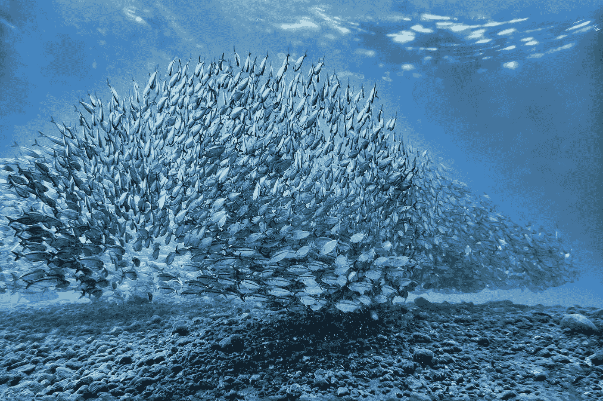

# 整体更多的是部分的总和。如何在保持小企业灵活性的同时做大企业

> 原文：<https://medium.datadriveninvestor.com/the-whole-is-more-of-the-sum-of-its-parts-how-to-grow-big-keeping-the-flexibility-of-the-small-486c99c9f11a?source=collection_archive---------34----------------------->

Photo by [Dorothea OLDANI](https://unsplash.com/@dorographie?utm_source=medium&utm_medium=referral) on [Unsplash](https://unsplash.com?utm_source=medium&utm_medium=referral)

# 循环数据经济为整个生态系统创造了企业优势。收购或撤资时要考虑什么，不管是资产(一家公司，一项专利，还是为自己进行的培训)？

作为对他的 [*5 种力量竞争模型*](https://hbr.org/2008/01/the-five-competitive-forces-that-shape-strategy) 的不同领域 30 年观察的结果，Michel Porter 强调，当追求由**正和竞争**产生的可持续优势时，市场领导者更成功:公司在不同的属性、服务和特征上竞争:这样做，他们满足不同客户群的需求，扩大行业的整体利润池。

> 当组织为他们所有的服务创建一个共同的平台(而不是纯粹的价格竞争)时，他们有助于发现新的即将到来的需求，并提高客户对新产品的接受度。

一个最具启发性的例子是，尽管亚马逊和阿里巴巴存在差异，但它们共同创造了一个全球市场，2019 年的零售电子商务销售额为 3.53 万亿美元，预计到 2022 年将增长到 6.54 万亿美元。

> 通过联盟的力量，亚马逊和阿里巴巴跨越他们的服务并在新的领域扩张，打破并改变现有的生态系统或创建新的生态系统。

毫无疑问，贝佐斯和马将“以客户为中心”营销得很好。当被问及此事时，马建议忘掉竞争，专注于客户。"复制你的竞争对手，你会死"，他曾经说过。

贝佐斯说得更加强烈:“要以客户为中心！”，一个在管理圈子里不断流传的口头禅，虽然负面的内涵。
事实是，跟踪顾客通常不会把他们变成会重复的粉丝

## 他们成功的关键是什么？为什么别人失败了，他们却赢了？

在生命科学、保险、系统集成商、咨询、零售、能源和许多其他行业，在组织或个人层面，**收购和剥离资产**已经成为增长或生存的关键。

围绕财务方面制定 M&A 战略可能会在短期内产生利润，但从长期来看，组织最终可能会处于生存模式，努力保持资产紧缩。

M&A 战略如果注重文化方面，就会产生可持续增长。在开始之前，数字先锋需要问自己如何在差异化的同时保持自己的身份，如何在收购新资产的同时“有机”增长，以及如何在不失去专业知识和机会的情况下撤资。

> 这篇文章提供了一个解释的钥匙，超越了他们的创始人富有远见的传奇，它描述了一个在收购或撤资时要考虑的处方，无论资产是一家公司，一项专利，还是为你自己提供的培训。

 [## 塑造战略的五种竞争力量

### 1979 年，哈佛商学院的一位年轻副教授为 HBR 发表了他的第一篇文章《竞争多么激烈…

hbr.org](https://hbr.org/2008/01/the-five-competitive-forces-that-shape-strategy) 

# **一个品牌引领所有品牌**

从表面上看，亚马逊或阿里巴巴的成功来自于他们对商家而不是最终客户的关注，以及**他们将品牌嵌入其基础的能力:**他们越来越多地为小企业建立支付、现金、借贷、存储和运输领域的大量金融和物流服务、产品和工具。**在网上旅行中与商家携手**，这两家科技巨头获取领域信息，并不断塑造、注入和孵化服务，以解决他们的主要问题。

Photo by [John Adams](https://unsplash.com/@johnladams?utm_source=medium&utm_medium=referral) on [Unsplash](https://unsplash.com?utm_source=medium&utm_medium=referral)

没有这种帮助，小企业将无法独自抓住数字机遇，也无法适应全球化带来的快速文化变革。

各种各样的商人，他们的商业周期是根据兴衰模式形成的，有各种各样的表现，从优秀到生存，他们发现加入电子商务的行列是很方便的。

> 他们的品牌不在于卖给最终客户的是什么。他们的品牌深深植根于支持服务中，通过保持新老业务的紧密联系来维持整个生态系统的扩张模式。

## 外卖食品

> “一个品牌”提供了**高声誉、形象和身份**来定位在全球市场上奋力竞争的商家的服务和产品。
> 
> “一个品牌”的保护伞有助于信息共享，允许对服务进行持续有效的调整**并可以立即**提供给更广泛的客户群**。**
> 
> **分享就是关爱。**合作伙伴、员工、供应商、权威机构、客户将根据您提供服务的方式来衡量您。唯一的主导地位是倾听和服务，因为过程中的任何差距都是变得更强大的机会。
> 
> **用心分享。**数字先锋选择得很好，他们将自己与数字业务联系在一起的品牌是可扩展性，而不是低进入成本。数字先锋将数据投资于一个生态系统，该生态系统以数据作为回报，并帮助所有成员从中获取价值。

 [## 取代你的风投？企业家的 5 条原则|数据驱动的投资者

### 在 Tau Ventures，我们建议所有企业家将融资过程中的勤奋过程视为双向的…

www.datadriveninvestor.com](https://www.datadriveninvestor.com/2020/11/29/replacing-your-vc-5-principles-for-entrepreneurs/) 

# 一个声音代表他们所有人

如果有机体在一起离开时找到了共同的优势，一个生态系统就会成长:这转化为**战略愿景、组织文化和公司被认为将副作用最小化的方式之间的强大联系。**

Photo by [Matt Botsford](https://unsplash.com/@mattbotsford?utm_source=medium&utm_medium=referral) on [Unsplash](https://unsplash.com?utm_source=medium&utm_medium=referral)

在传统的合作或竞争范式之外，**生态系统有助于从**无处不在的**模糊关系**中创造价值，这种关系存在于新获得的资产、劳动力、国际投资者、当局和其他相关参与者之间。

**规模经济**、创新速度**的提高**、上市周期**的缩短**是在新市场扩张或跨越传统行业边界并催生新行业的使能因素。代表性的例子是阿里巴巴的[计划，帮助越南的公司上线，接触大量合格的全球买家](https://e.vnexpress.net/news/business/alibaba-com-initiative-helps-vietnamese-smes-venture-abroad-4155473.html)或[亚马逊的药房服务，使医疗保健向以病人为中心的健康护理发展](https://medium.com/illumination/wellcare-is-shaping-around-online-pharmacy-competition-this-is-how-effba812189)。

在新的生态系统和新兴市场中，用“一个声音”说话有助于设定硬标准，如互联网安全的法律规范(如数字签名、关于黑客的法律)。通过引发围绕仍需制定的规则的讨论，通过在合作伙伴和技术基础设施中建立信任的氛围，科技巨头将当局的注意力集中在涌现的范式上，而不是控制上。

## 外卖食品

> 规则和标准有助于刺激竞争和激励可持续竞争。数字先锋代表他们所有的合作伙伴发言**促进法律规范的改变，引领生态系统的形成，超越现有的控制范式**。
> 
> 通过合并被收购组织特定方面的既定实践，数字组织在员工中扮演着基本的桥梁和领导角色**为整个商业生态系统创造机会**。
> 
> “一条**链**的强度取决于**最薄弱的一环”:一个数字组织(链)通过**强化其资产(链)而变得更强。购房者要创造条件，迅速纳入新资产。各种规模的销售者都应该综合并存储他们正在抵消的知识，以备将来之需。
> 
> 数字先锋永远不会孤单。因此，在开始孤独的战斗之前，搜索一下，找到并支持代表她和她一起战斗的声音，可能会节省时间和金钱。**翻转漏斗，而不是大声哭出来**

# 一种文化来推动他们所有人

从生态系统的角度来看，创造企业优势与逐季增长关系不大，更多的是在丰年和干旱时创造机会。

Photo by [Chaitanya Tvs](https://unsplash.com/@tvschaitanya?utm_source=medium&utm_medium=referral) on [Unsplash](https://unsplash.com?utm_source=medium&utm_medium=referral)

亚马逊和阿里巴巴开发了一种独特的方式来解释文化、市场和经济的变化。在过去的十年里，亚马逊和阿里巴巴通过注入创新将更多的参与者纳入他们的生态系统，建立了服务，这些服务逐渐成为在西方世界、中国、亚洲经济体和新兴国家做生意的商品，这些国家占世界市场的 80%。他们是如何成功的呢？

> 他们在他们的生态系统中收集、处理和反馈数据，创造了一个**循环数据经济**，在每次迭代中为所有参与者释放价值。它们不与中小企业在价格上竞争:它们是有效开发服务的“实验室”,可以帮助它们扩大规模，在全球市场上竞争，尽管它们不具备虚拟竞争的条件。

由于文化是关于人的，他们有一套做法来促进生态系统所有参与者之间的融合，从员工到当局:他们促进集团公司员工之间的轮换，他们向小企业提供培训以支持他们的旅程，精英激励系统，以及围绕他们创新能力的组织自豪感，这种创新能力越来越受到设计的简单性和获得的客户体验的驱动。

推动创新有助于巩固他们在其他新兴经济体或市场的领导地位，逐步将获得的优势转化为业务成果。他们的创造力和灵活性没有限制: [AliGenie](https://en.wikipedia.org/wiki/AliGenie) ，一个基于中国的开放平台智能个人助理(目前用于[天猫精灵](https://en.wikipedia.org/wiki/Tmall_Genie)智能音箱)，或[人工智能加速器](https://en.wikipedia.org/wiki/AI_accelerator)称为汉光 800(170 亿个晶体管，每秒能够进行 78，563 幅图像(IPS)推理，并将在[阿里云](https://en.wikipedia.org/wiki/Alibaba_Cloud)上出租)是有利于阿里巴巴的很好例子，而在网上药店领域获得的份额，或在云中发挥的主导作用

## 外卖食品

> 数字组织从其“**文化中介”**的位置中获取价值，方法是解释围绕收购资产的需求，并扩展服务基础设施，以围绕其解释变化的方式赋予公司身份。
> 
> 他们专注于创造一种共同的文化，使他们能够释放和分享来自收购的知识；与此同时，他们不断地注入流程，将剥离业务的知识整合为他们身份的一部分。
> 
> 数字组织利用创新、规模经济和短生命周期来促进知识共享，投资于在客户、商家、权威机构和竞争对手之间创造一种共同的文化。虽然他们达到了巨大的规模，但他们投资于速度，而不是保护其领先地位的障碍。
> 
> 财务、物流、生产整合是收购的基本方面，但从长远来看，真正起作用的是整合人员和利用文化上的新资产的能力。文化整合也是一个**时间博弈**因为买家让被收购的业务变得舒适的时间越长，资产的最终价值就越低**因为让该业务变得排外的人会逐渐消失**
> 
> 创新是数字先锋身份的关键，因为他们有一个动态的平衡:除了规模之外，在快速增长的行业中获得的知识和地位向投资和工具及能力的持续升级开放，增加了对抗竞争的实力。

# 结论

借助联盟的力量，科技巨头们跨越他们的服务并在新的领域扩张，打破并改变现有的生态系统或创造新的生态系统。他们成功的秘诀是什么？他们如何才能做大，保持变化，向不同的方向发展，而不在第一眼就设置障碍？

它们促进了生态系统的扩张，这与逐季增长关系不大，更多的是为所有参与者创造丰富的 T2 机会和干旱。

**他们把长期战略的重点放在吸引和支持新老演员的文化和经济转型上，这些演员将无法利用规模经济来竞争。通过创造循环数据经济，他们提供信息、报告统计、论坛、培训、研究、支付服务、运输等。，帮助以创新和普遍的方式匹配供给和需求。这样，创新成为他们身份的关键，而在快速增长行业获得的知识和地位鼓励了投资和持续升级，增强了他们的实力。**

它们已经不仅仅是一群从事特定行业的公司，拥有庞大的多元化投资组合；它们是活生生的实体，能够在差异化的同时保持身份，在收购新公司的同时实现有机增长，在不丧失专业知识和机会的情况下进行撤资。他们的 M&A 和创新战略超越了他们的财务目标，创造了一个共同的文化和身份。

一个品牌。一个声音。一种文化。其余的是各种形状和形式的多样性。为了远离金融驱动的生态系统周期性生存的伤害，亚马逊和阿里巴巴等科技巨头已经成为基于循环数据经济的生态系统。

# 我关于创新的其他文章

[自然中的创新:改变你业务的生活史战略方法](https://medium.com/datadriveninvestor/innovation-in-nature-a-life-history-strategy-approach-to-change-your-business-61fba67242f7)

[超越冲突和变革塑造创新的三种力量](https://medium.com/datadriveninvestor/three-forces-that-shape-innovation-beyond-conflict-and-change-ed063519f25e)

[创新农场和先锋精神:所有组织(和你)都需要在未来拥有发言权](https://medium.com/datadriveninvestor/innovation-farm-and-a-pioneers-spirit-all-organization-and-you-need-to-still-have-a-say-in-the-df6dc9424967)

[成功创新者的三个基本特征](https://medium.com/datadriveninvestor/the-three-essential-traits-of-successful-innovators-692abeb47a19)

# 我关于健康护理的其他文章

[健康护理的诞生:医药和保险机构的长期数字战略](https://medium.com/datadriveninvestor/the-birth-of-wellcare-a-long-term-digital-strategy-for-pharma-and-insurance-organizations-b801e5210f49)

[“健康护理”新路径:探究亚马逊颠覆、引诱和征服医疗和保险机构的数字战略](https://medium.com/datadriveninvestor/the-wellcare-new-trail-8f354fd78c19)

[Wellcare 正在围绕网上药店竞争形成:这是怎么回事！](https://medium.com/illumination/wellcare-is-shaping-around-online-pharmacy-competition-this-is-how-effba812189)

**访问专家视图—** [**订阅 DDI 英特尔**](https://datadriveninvestor.com/ddi-intel)