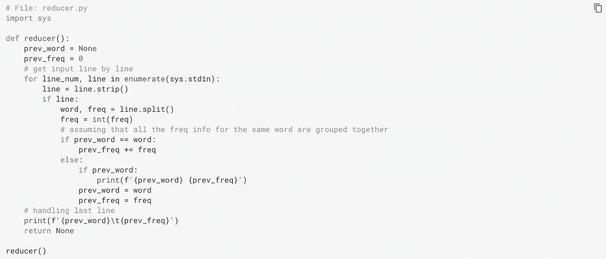

# 为什么和如何使用 MapReduce

> 原文：<https://medium.datadriveninvestor.com/the-why-and-how-of-mapreduce-17c3d99fa900?source=collection_archive---------0----------------------->

我什么时候需要使用 MapReduce？我如何将我的工作转换成贴图、合并器和缩减器？


Photo by [Brooke Lark](https://unsplash.com/@brookelark?utm_source=unsplash&utm_medium=referral&utm_content=creditCopyText) on [Unsplash](https://unsplash.com/?utm_source=unsplash&utm_medium=referral&utm_content=creditCopyText)

**MapReduce** 是一种操作大型数据集的编程技术，而 **Hadoop MapReduce** 是这种编程技术的具体实现。

以下是该过程的总体情况:

```
Map(s) (for individual chunk of input) ->
     - sorting individual map outputs -> 
Combiner(s) (for each individual map output) ->
     - shuffle and partition for distribution to reducers ->
     - sorting individual reducer input ->
Reducer(s) (for sorted data of group of partitions)
```

# Hadoop 的 MapReduce 总体来说

[Hadoop MapReduce](https://hadoop.apache.org/docs/stable/hadoop-mapreduce-client/hadoop-mapreduce-client-core/MapReduceTutorial.html) 是一个用于编写应用程序的框架，这些应用程序可以在大型商用硬件集群(数千个节点)上以可靠、容错的方式并行处理大量数据(多 TB)。

典型的 MapReduce 作业:

*   将输入数据集分割成独立的数据集
*   每个单独的数据集由**映射任务**并行处理
*   **然后框架**对地图的输出进行分类**，**
*   **该输出然后被用作**减少任务**的输入**

**通常，作业的输入和输出都存储在文件系统中。**

**Hadoop MapReduce 框架负责调度任务、监控任务以及重新执行失败的任务。**

**[](https://www.datadriveninvestor.com/2020/05/15/big-data-analytics-in-telemedicine-reshaping-the-healthcare-industry/) [## 远程医疗中的大数据分析重塑医疗保健行业|数据驱动的投资者

### 最近，在冠状病毒疫情的推动下，远程医疗的使用出现了大爆炸。越来越…

www.datadriveninvestor.com](https://www.datadriveninvestor.com/2020/05/15/big-data-analytics-in-telemedicine-reshaping-the-healthcare-industry/) 

通常，Hadoop 的 MapReduce 框架和 Hadoop 分布式文件系统(HDFS)运行在相同的节点上，这意味着**每个节点都用于计算和存储**。这种配置的**优势**是可以在数据所在的节点上调度任务，从而在整个集群中实现高聚合带宽。

MapReduce 框架包括:

*   单主`ResourceManager` (Hadoop YARN)，
*   每个集群节点一个工人`NodeManager`,以及
*   `MRAppMaster`每次申请

资源管理器跟踪计算资源，将它们分配给特定的任务，并跨集群调度作业。

为了**配置 MapReduce 作业**，应用程序至少要指定:

*   输入源和输出目的地
*   映射和减少功能

然后，Hadoop 的作业客户端将**作业及其配置提交**给 YARN，YARN 负责在集群中分发作业、调度任务、监控任务，并将任务状态反馈给作业客户端。

虽然 Hadoop 框架是用 Java 实现的，但是 MapReduce 应用不需要用 Java 编写。我们可以使用`[**mrjobs**](https://github.com/Yelp/mrjob)` Python 包来编写可以在 Hadoop 或 AWS 上运行的 MapReduce 作业。** 

# **MapReduce 作业的输入和输出**

**对于输入和输出，**数据存储在键值对**中。每个键和值类必须可以被 MapReduce 框架序列化，因此应该实现`[**Writable**](https://hadoop.apache.org/docs/stable/api/org/apache/hadoop/io/Writable.html)`接口。除此之外，key 类还需要实现排序机制所需的接口`[**WritableComparable**](https://hadoop.apache.org/docs/stable/api/org/apache/hadoop/io/WritableComparable.html)`。**

# **制图者**

**`[**Mapper**](https://hadoop.apache.org/docs/stable/api/org/apache/hadoop/mapreduce/Mapper.html)`是一个将键/值对输入到一组输出键/值对的任务(这些键/值对随后被进一步的步骤使用)。输出记录不需要与输入记录的类型相同，输入对也可以映射到零个或多个输出对。**

**与给定输出键相关联的所有值随后由框架进行分组，并传递给`Reducer`以确定最终输出。根据`Reducer`对`Mapper`输出进行分类，然后进行分割。分区总数与作业的 reduce 任务数相同。**

# **洗牌和排序阶段**

**单个映射器的输出由框架排序。**

**在将数据提供给 reducers 之前，来自所有映射器的数据都通过一些键分组进行了分区。每个**分区**包含来自一个或多个键的数据。每个分区的数据按键排序。然后将分区分配给 reducers。每个 reducer 的输入数据都是来自一个或多个分区的数据(一般是`1:1`比)。**

# **该减速器**

**`[**Reducer**](https://hadoop.apache.org/docs/stable/api/org/apache/hadoop/mapreduce/Reducer.html)`将共享一个关键字的一组中间值(混洗和分类阶段的输出)减少为一个更小的值组。**

**在 reducer 阶段，为分组输入中的每个`<key, (list of values)>`对调用 reduce 方法。注意`Reducer`的输出没有排序。**

**正确的减速器数量一般在`0.95`和`1.75`乘以`<no. of nodes> * <no. of maximum containers per node>`之间。**

# **组合器**

**我们可以选择指定一个`Combiner`(称为本地缩减器)来执行中间输出的本地聚合，这有助于减少从`Mapper`传输到`Reducer`的数据量。在许多情况下，相同的 reducer 代码也可以用作合并器。**

# **让我们看一个简单的例子**

**我们来看一个简单的统计词频的例子。考虑下面的`mapper.py`文件:**

****

**以及下面的`reducer.py`文件:**

****

**我们可以在本地测试它们:**

****

# **但是等等！以前的实现有一个问题…**

**之前的映射器代码是**内存密集型的**，因为它必须维护一个字典，该字典包含每个映射器的输入块中所有唯一单词的频率。如果内存是一个问题，甚至对于涉及单个输入块的`dict`，那么更好的方法是让它只打印我们遇到的每个单词(其频率为`1`)。举个例子，**

****

**现在，让我们使用具有相同输入数据的新映射器:**

****

**如果有帮助的话，我们还可以使用一个合并器(与 reducer 代码相同)对每个映射器输出进行本地聚合。**

****

# **关于`Partitioner`和`Comparator`的详细信息**

**一个`[**Partitioner**](https://hadoop.apache.org/docs/stable/api/org/apache/hadoop/mapreduce/Partitioner.html)`对数据进行分区，这实际上是通过对“密钥空间”进行分区来实现的。**

**Partitioner 控制中间映射输出的键的分区。密钥(或密钥的子集)通常通过**散列函数**用于导出分区。分区总数与作业的 reduce 任务数相同。因此，这控制了将中间键(以及记录)发送到哪个`m`归约任务进行归约。**

**`[HashPartitioner](https://hadoop.apache.org/docs/stable/api/org/apache/hadoop/mapreduce/lib/partition/HashPartitioner.html)`是默认的`Partitioner`。如果您需要通过多个键对数据进行分区，您将需要使用不同的分区器(或者您的自定义分区器)。**

**Hadoop 有一个库类，`[KeyFieldBasedPartitioner](https://hadoop.apache.org/docs/stable/api/org/apache/hadoop/mapred/lib/KeyFieldBasedPartitioner.html)`,它允许 MapReduce 框架基于某些关键字段而不是全部关键字段来划分地图输出。比如`[-D mapreduce.partition.keypartitioner.options=-k1,2](https://hadoop.apache.org/docs/stable/hadoop-streaming/HadoopStreaming.html#Hadoop_Partitioner_Class)`。**

**我们可以通过指定一个`[**Comparator**](https://hadoop.apache.org/docs/stable/api/org/apache/hadoop/mapreduce/Job.html#setGroupingComparatorClass-java.lang.Class)`来控制分组。**

**Hadoop 有一个库类`[KeyFieldBasedComparator](https://hadoop.apache.org/docs/stable/api/org/apache/hadoop/mapreduce/lib/partition/KeyFieldBasedComparator.html)`，它提供了 Unix/GNU `sort`函数所提供的特性子集。比如`[-D mapreduce.partition.keycomparator.options=-k2,2nr](https://hadoop.apache.org/docs/stable/hadoop-streaming/HadoopStreaming.html#Hadoop_Comparator_Class)`。**

# **分布式缓存**

**MapReduce 框架提供的`[DistributedCache](https://hadoop.apache.org/docs/stable/hadoop-mapreduce-client/hadoop-mapreduce-client-core/MapReduceTutorial.html#DistributedCache)`，高效地分发大型只读文件作为应用程序所需的缓存。**

# **配置参数**

**我们可以通过环境变量获得作业配置选项。当我们启动 MapReduce 应用程序时，框架会将数据分配给可用的工作人员。我们可以从脚本中访问这些数据。例如，如果我们正在运行一个映射器，那么我们可以访问关于我们正在处理的文件和幻灯片的信息。此外，我们可以获得关于我们是在运行映射器还是缩减器的信息，如果我们在映射和缩减阶段运行相同的脚本，这可能很重要。我们还可以使用以下环境变量在 map 或 reduce 阶段中访问任务 id:`mapreduce_task_id`、`mapreduce_task_partition`。**

**[配置的参数](https://hadoop.apache.org/docs/current/hadoop-mapreduce-client/hadoop-mapreduce-client-core/MapReduceTutorial.html#Configured_Parameters)在每个任务执行的作业配置中被本地化。在流作业的执行过程中，会转换“映射”参数的名称。圆点(`.`)变成了下划线(`_`)。比如`mapreduce.job.id`变成了`mapreduce_job_id`。在您的代码中，使用带下划线的参数名。**

****更新流媒体应用的状态:****

**一个[流进程](https://hadoop.apache.org/docs/current/hadoop-streaming/HadoopStreaming.html)可以使用`stderr`来发出状态信息。要设置状态，应将`reporter:status:<message>`发送至`stderr`。**

# **捆绑的映射器、缩减器和分区**

**Hadoop MapReduce 附带了一个 [**库**](https://hadoop.apache.org/docs/stable/api/org/apache/hadoop/mapreduce/package-summary.html) ，其中包含了常用的映射器、缩减器和分割器。**

**这里有一些相关的有趣故事，你可能会觉得有帮助**

*   **[用 Apache Spark 进行分布式数据处理](https://medium.com/@goyalmunish/distributed-data-processing-with-apache-spark-2a5e473b0cb1)**
*   **[Apache Cassandra —用于结构化和半结构化数据的分布式行分区数据库](https://medium.com/@goyalmunish/apache-cassandra-distributed-row-partitioned-database-for-structured-and-semi-structured-data-1dc37e72e67c)**

****进入专家视角—** [**订阅 DDI 英特尔**](https://datadriveninvestor.com/ddi-intel)**