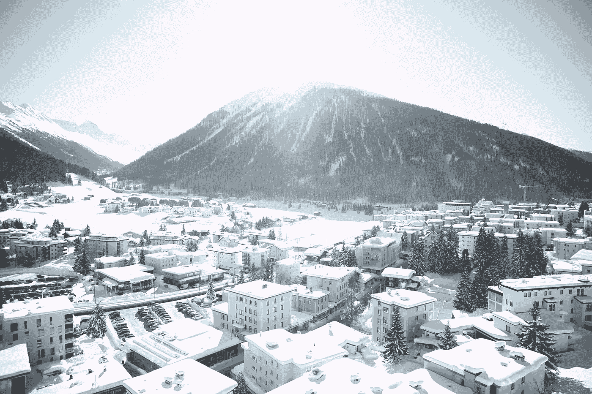

# 世界经济论坛运行良好——是时候结束它了

> 原文：<https://medium.datadriveninvestor.com/the-world-economic-forum-had-a-good-run-time-to-end-it-ece9046d831d?source=collection_archive---------21----------------------->

## 消灭一个小山村的生态系统不再是解决问题的必要手段

Photo by [Prateek Keshari](https://unsplash.com/@prateekkeshari?utm_source=unsplash&utm_medium=referral&utm_content=creditCopyText) on [Unsplash](https://unsplash.com/s/photos/davos?utm_source=unsplash&utm_medium=referral&utm_content=creditCopyText)

达沃斯又开始了。每年大约在这个时候，人们开始为一月的四天在小小的瑞士冬季仙境进入繁重的计划模式。这是你见过的最白的雪——看起来是这样。虽然，这可能是宿醉消退的效果与咖啡因的完美结合增加了它的亮度。

被称为世界经济论坛年会(World Economic Forum)或简称为“达沃斯”(Davos)的组织者应该认真考虑结束富人、有权者和一大批真正聪明的人努力成为这三种人的几乎强制性的朝圣。

抛开玩世不恭不谈，大多数去那里的人，尤其是那些不太富裕、没有权力和没有资格的人，确实在努力让世界变得更美好。然而，正如新冠肺炎向我们展示的那样，把它变成一个更好的地方并不需要在这样做的同时摧毁它。

别误会，我喜欢去达沃斯年会。从 2015 年到 2020 年，我只去过其中的六个，但有一种能量，除非你去过，否则无法真正描述出来——这是一种浮夸的说法，真的。看，达沃斯的心态已经占据了上风。

让我这么说吧:如果你曾经站在架空输电线旁边，那些覆盖着粗电缆的钢塔漏电，愤怒地嘶嘶作响，撕咬着周围的空气，那么你就知道达沃斯的感受。从你在苏黎世火车站登上火车，经由兰德夸特前往达沃斯广场的那一刻起，你应该做更多事情的焦虑就将大多数对话限制在十分钟内——但这些时间确实是信息密集的时间。

所有这些都是克劳斯·施瓦布创造的。在之前的一个[故事里，](https://medium.com/datadriveninvestor/a-conversation-with-klaus-schwab-about-the-fourth-industrial-revolution-5c040a8ad514)我表达了对他的感谢和敬意。这方面没有任何变化，但世界变了。去年 1 月，当 WEF 参与者挤满人行道、派对、火车和会议室时，几乎没有人谈论全球疫情的可能性。亲吻脸颊三次，握手，面对面聊天，一切都是那么平常，现在真的很陌生。

亚洲正经历着另一场流行病，许多人认为它会被控制住。中国与会者人数的减少是出了问题的唯一迹象。

在达沃斯，总会有这样一个时刻，通常发生在第一场鸡尾酒会上，在睡眠不足、食物过少和酒精过多让你在第四天疲惫不堪之前，一种温暖的自信感席卷了你。与你从未谋面的人聊天，一手拿着葡萄酒，一片非常美味的干驯鹿放在涂有栗子香蒜酱的瑞士坚果面包上，你会意识到此刻在那里是多么的棒——就好像通过潜移默化，未来的一年将会比以前更成功。

我称之为*泰坦尼克时刻*。作为一个对泰坦尼克号所有事情都感兴趣的历史爱好者，该船的沉没是对人类天真无邪的完美寓言。仅仅因为我们说一艘船是不会沉没的，因为它有最好的头等舱套房、令人惊叹的餐厅、手工制作的瓷器、美丽的游泳池等等，就认为它是不会沉没的，这表明了所谓的最优秀和最聪明的人对世界的真正了解是多么少。

我敢肯定，亿万富翁约翰·阿斯特认为他的才华和财富为人类战胜自然母亲铺平了道路。这是达沃斯的普遍情绪——团结起来，我们可以做任何事情。没有什么能超越我们的想法，超越我们的野心和财富——哦，达沃斯的财富，就像那艘船上的一样，到处都是。

我敢肯定，我们大多数人在达沃斯都会很容易融入泰坦尼克号头等舱餐厅的人群。毕竟，他们，我们，觉得自己是不可战胜的。

哦，我们多傻啊，对吧？

这让我认为 2020 年达沃斯论坛是最后一次。明年 3 月，克劳斯·施瓦布将年满 83 岁。他仍然充满活力，总是很高兴收到电子邮件，不知怎么的，他找到时间给予回复，他是一个八十多岁的人，他一生的工作重塑了我们的世界。老实说，似乎是时候让他把权力交给别人了，只是因为我想他的家人想花更多的时间陪他——也许有一本他在 1976 年放在一边的好小说，希望有机会时可以读一读。机会来了。

 [## 我是如何成为经济发展资金纠结网的独立研究员|数据…

### 我很少发现自己处于一种看似独立的自由形式的身体抑郁状态，这种状态使人…

www.datadriveninvestor.com](https://www.datadriveninvestor.com/2020/10/23/how-i-became-an-independent-researcher-of-the-tangled-net-of-economic-development-funding/) 

然而，问题就在这里，WEF 公司的上层管理人员，我对他们中的一些人很了解，足以提供判断，他们是野心家，对克劳斯的奇迹并不是最有利的。有一个人人尽皆知，特别毒，他把自己放在离克劳斯很近的地方。他治下的 WEF 活不过一年。我们会失去属于我们所有人的东西。

克劳斯的想法最初是在一次欧洲商业领袖会议上构思出来的。他和他的妻子参观了这个与世隔绝的村庄并爱上了它之后选择的地点。他的想法很简单:让事情变得更好——我明白这个想法。这是我每天都在努力做的事情——就像我们很多人一样。然而，WEF 将失去这种创意创造的承诺，除非一些真正聪明但也务实的人将这种承诺从为后克劳斯 WEF 时代定位的长期职业建设者手中夺走。WEF 将会解散，变得无关紧要，成为又一个向其排他性成员索要大量资金的聚会——WEF 现在做得相当好，没有增加愤怒的野心家的自我厌恶。

克劳斯有机会塑造他的遗产。如果这是他退休前做的最后一件事，他需要重新想象年会的角色——对大多数人来说，这是论坛的本质。WEF 实际上做了很多比大多数人知道的更酷的事情。

2017 年，达沃斯遭到特朗普主义者的攻击，一些人预测，随着民粹主义的崛起，WEF 的声音将永远被压制。克劳斯比大多数人都聪明，而且相关性仍然很好——非常好。2020 年是有史以来最大的一次；这是我个人最好的成绩！

今年的会议结束后，我立即给克劳斯写了封信，告诉他这次经历对我来说是多么神奇。年会已经从 2018 年的瘫痪中恢复过来。那一年目睹了一场雪灾，许多与会者要么因为道路封闭和雪崩而无法到达村庄；或者，他们来得太晚，一个接一个的活动都被取消了。它有那种巨大的效果——一座巨大的冰山在雾中若隐若现。

**2021 年 1 月将没有达沃斯——它将在 5 月转移到卢塞恩**。就像因为新冠肺炎，我心爱的慕尼黑啤酒节不可能在 9 月举行一样，达沃斯也不可能成功。这将是不负责任的缩影，甚至更糟糕的是，虚伪。

所以我问，我们还能回到达沃斯吗？Covid 向我们展示了一月份看似不可能的事情，现在已经成为可能。37%的全球办公空间将永远不会在 Covid 之后回归。我们不需要旅行来交谈。我们不需要爆炸我们的碳足迹，也不需要把气候浩劫装在过夜的袋子里拖到神奇的、依偎在原始雪毯下的村庄达沃斯——以前以治疗肺结核而闻名。

尽管我会怀念它，但让我们再次利用达沃斯的小气候来治愈我们的信念，即我们是不可战胜的。提醒我们应该足够聪明，知道什么时候该适可而止。

除非我们只想滑冰、漫步小径或在教堂钟声响起时醒来，否则不要重返达沃斯。然而，达沃斯精神必须继续激励我们，如果我们忠实于它——让我们在 2021 年虚拟相见，不管疫情是否强迫我们。

## 访问专家视图— [订阅 DDI 英特尔](https://datadriveninvestor.com/ddi-intel)