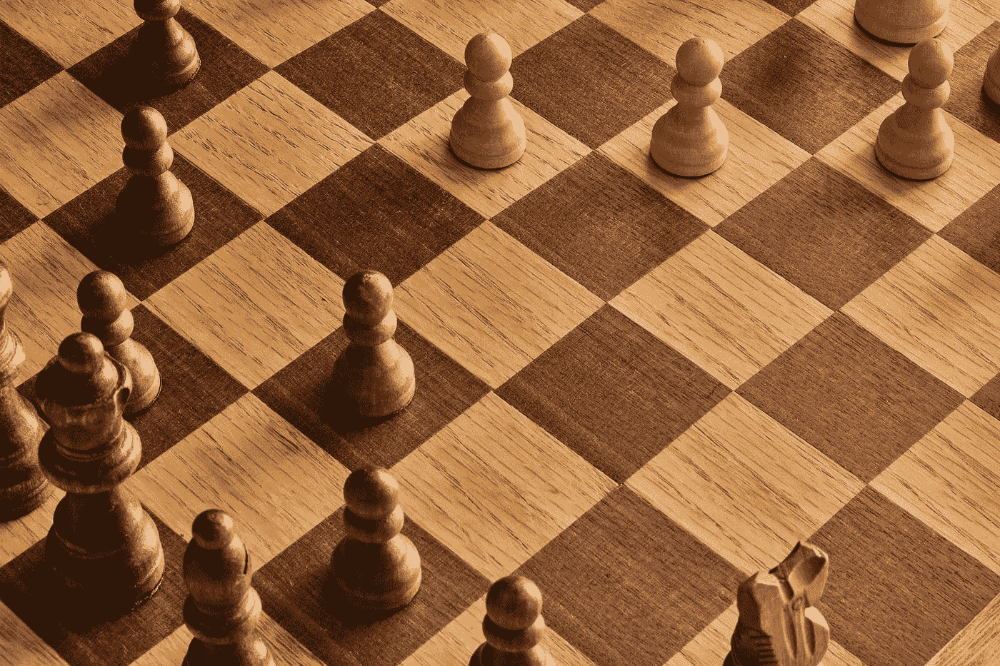
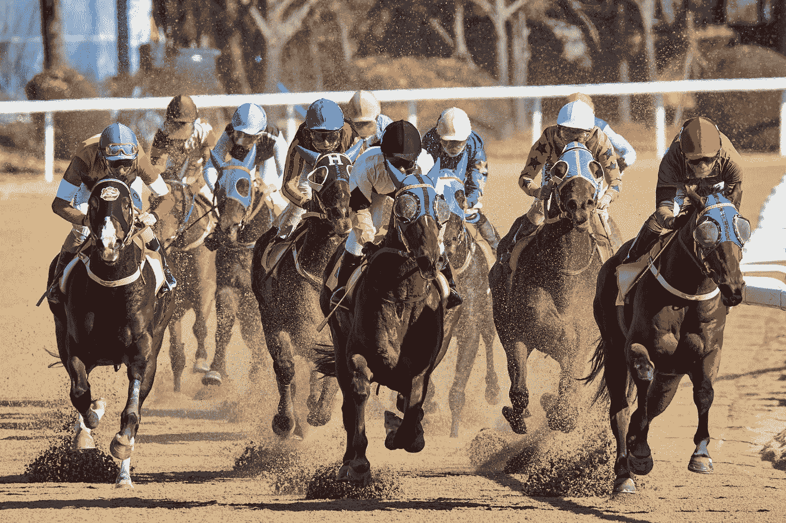

# 世界上最好的投资

> 原文：<https://medium.datadriveninvestor.com/the-worlds-best-investment-7ea8a6fdd412?source=collection_archive---------8----------------------->

为信息时代培养批判性元技能。

套用亚当·斯密 1968 年的投资书籍《金钱游戏》;如果你不知道自己是谁，股市是一个寻找答案的昂贵地方。

“行为阿尔法”在过去几年里已经成为一个流行的概念。随着最大的对冲基金利用指数计算能力垄断短期投资机会，许多积极的基金经理专注于最小化自己的偏见，并利用其余人类参与者的缺陷。玩另一个玩家，而不是房子。在某种程度上，这让我想起了一次飞机失事，幸存下来的幸存者为了生存而吃人。

在你自己的*个人*投资决策中变得更加理性绝对没有错。但是当与历史上一些最先进的计算能力竞争时，试图在它们自己的地盘上击败它们是一个长期失败的主张。正如 Kwame Anthony Appiah 所说:*‘生活中的挑战与其说是找出如何最好地玩游戏；挑战在于知道你在玩什么游戏。*

受到一本彻底改变视角的书《大师和他的使者》的启发，我最近一直在思考大脑半球以及智力和直觉之间相应的相互作用。许多左脑的“智力”边缘正在重新排列现有信息，以制作新的马赛克。据推测，这将永远由计算机主导。为了在每年翻倍的“理性”处理能力面前保持长期优势，投资者需要培养和强调他们更“非理性”的直觉天赋。因为显然对此有一个可爱的德语单词， *Fingerspitzengefühl* 字面翻译为*“指尖感觉”*，意思是直觉或本能。

Photo by [Dev Benjamin](https://unsplash.com/@dev_irl?utm_source=medium&utm_medium=referral) on [Unsplash](https://unsplash.com?utm_source=medium&utm_medium=referral)

尽管替代数据源的激增使得量化图像越来越类似于外部现实，但这些输入仍然在很大程度上由人类决定。此外，右半球比任何计算机都更好地整合了直觉未知。我们的持久优势是生活在世界中，而不是生活在模型中。我们也可以更有想象力地设想替代的潜在未来。这是一件大事。

越来越多的主流观点认为，主动管理阿尔法现在更多的是关于“时间套利”和采取多年观点的能力。这意味着你可以想象一个更有创造性和更准确的未来，因此持有一种市场尚未概念化的“不同看法”。一个与现在量化的未来有质的不同的未来。

有点讽刺的是，最近最好的例子之一是在线性思维和指数思维中发现的。让人类投资变得如此具有竞争力的计算能力的加速，本身就是过去几十年最有利可图的不同观点的来源。投资者的关键见解是，线性金融模型将始终无法解释指数增长。正如未来学家雷·库兹韦尔所说，“我们处在棋盘的后半部分”。这个表达来自于一个说明复利效应建模缺陷的传说。一个聪明人去见国王，国王答应给他一份礼物。他要棋盘上的一粒米，第二粒米，第三粒米，等等。这似乎是一个足够谦虚的要求，它被批准。但是到了第 64 个也是最后一个方块，所需的大米将覆盖印度一米的深度。我们现在正处于一个时间点，数字技术几乎可以以接近最低的边际成本在全球范围内即时传播。因此，方的股票多年来一直在上涨。现在他们几乎是城里唯一的游戏。

展望未来，公平竞争的一个关键武器是投资者接受具身认知。这个概念的模糊性，以及它是如何难以量化的，只会让我更加好奇。如果每个人都在谈论它，它就不会被区分。

这里至少有两种截然不同的右脑资产:凭“直觉”交易的能力和想象更有想象力的未来的能力。显然，这些技能是互补的，因为长期投资者仍然需要很好地把握好进场和出场的时机。[对对冲基金交易员的一项研究](https://www.nature.com/articles/srep32986#abstract)发现，他们的决策技能与他们感知内部身体信号的能力有关，这种现象被称为“内视知觉”。科学家们参观了一个交易大厅，并要求 18 名对冲基金交易员通过安静地计算他们的心跳来调整他们的身体系统，同时研究人员跟踪他们的实际心跳。交易者的感知心跳和实际心跳越接近，他们的内部感受准确性就越高。这是一个非常小的样本量，但研究声称，内部感受性准确性预测交易成功。

有史以来最好的交易者之一，乔治·索罗斯，声称他的背痛会在市场上给他准确的信号:这通常会表明他错过了画面的关键部分。如果你感到不和谐，你可能会错过一些关键的东西。这种见解也反映了一种细微差别；尽管在某些情况下直觉可能优于理智，但最好的方法是平衡两者。

McGilchrist 谈到现实世界的经验需要起源于右半球，移动到左半球进行处理，然后再回到右半球合成到全球环境中。音乐家听到一段优美的音乐，将其解构为音符并苦心学习，然后最终凭直觉演奏出来。

这就是为什么一个新的罗宾汉交易者可能不能只凭直觉登录自己的账户，用自己的方式和数百万人交易。大师级投资者知道自己需要多少信息才能做决定，然后依靠直觉、经验和模式识别。迈克尔·莫布森用[一项关于赛马障碍的著名研究](http://www.marramllc.com/blog/pmjar/category/Michael+Mauboussin)来说明这一点。他们首先要求残障人士用比赛中每匹马的 5 条信息进行比赛预测。然后，他们要求障碍者用 10 条、20 条和 40 条信息做出同样的预测。随着每一条额外的信息，助残者并没有得到更多的*准确*，但是他们确实得到了更多的*自信*。鉴于头寸规模需要与信心相匹配，这是一种危险的投资组合。

当今世界信息爆炸的问题在于，很容易找到更多数据来支持你可能已经无意识做出的决定。另一位传奇交易者保罗·都铎·琼斯[很好地描述了](https://25iq.com/2015/07/25/a-dozen-things-ive-learned-from-paul-tudor-jones-about-investing-and-trading/)这种动态:

> 如今，这个行业中有了更多有深度的知识分子，再加上互联网上信息的爆炸，造成了一种错觉，即一切都有一个解释，而首要任务就是找到那个解释。因此，对许多年轻一代来说，技术分析处于学习清单的底部，特别是因为这种技能通常要求他们闭上眼睛，相信价格走势。

“知识分子与信任”的二分法很有意思。正如我最近在《数据驱动的投资者》中所写的，对于成功的现代投资者来说，一个重要的工具就是适应不确定性。**这具体表现为学习将理性的左脑洞察力与看似非理性的右脑直觉结合起来，创造出一幅整体图景。**道家早在几千年前就知道这一点。

右脑思考的**注意力**很可能执行所有功能中最有用的功能。

麦克吉尔克里斯特认为，右半球负责更广泛的意识，这种意识决定了我们左脑关注的焦点指向哪里。他喜欢用一只鸟作为例子。一只鸟用它的左半球来辨别一粒谷物是食物还是沙子，同时用它的右半球来防备捕食者。窄聚焦和宽聚焦，同时且平衡。没有左边狭窄的焦点，你无法与世界互动，无法将事物分类；没有右边，你的焦点过于狭窄，会被猫吃掉。

如果这种微妙的右脑意识不断受到警报、电子邮件、电话和信息的轰炸，它将无法引导你集中注意力。我一直最喜欢的一句有先见之明的名言来自诺贝尔经济学家希尔伯特·西蒙，早在 1971 年:

> 在一个信息丰富的世界里，信息的丰富意味着其他东西的匮乏:信息所消耗的东西的匮乏。信息消耗的东西相当明显:它消耗了接收者的注意力。因此，大量的信息造成了注意力的匮乏，需要在可能消耗注意力的过多信息源中有效地分配注意力。

信息消耗注意力，这应该让我们停下来。我们拥有的唯一资源是我们选择把我们的注意力放在哪里。因此，信息有效地消耗了我们的生活，而且这种趋势还在加速。用金融术语来说:人类的注意力现在是世界上最稀缺的资产之一。供应总是有限的。人类注意力的货币化催生了世界前所未有的垄断。依赖于开发这种有限资产的资本和计算能力本身就是指数级的。

我们将越来越需要热情的未来学家凯文·凯利所说的“过滤器中的过滤器”，以便在我们创造的数据爆炸中运作。不是所有能数的都算数。我们需要无情地确定哪些信息对您的决策至关重要，哪些信息仅仅是支持性的。你的注意力周围的墙也需要随着注意力围攻武器的进化而迅速上升。

Photo by [Richard Clark](https://unsplash.com/@clarky_523?utm_source=medium&utm_medium=referral) on [Unsplash](https://unsplash.com?utm_source=medium&utm_medium=referral)

世界上最好的投资是设计如何利用你自己的注意力。

以一些实际的细节来结束，这里有一些关于清单的想法:

1.  积极筛选你的输入网络，只给最有洞察力的“过滤器”和人。挑选你认识的 10 个最有洞察力的人，向他们询问他们最喜欢的信息来源[在华尔街写了 15 年每周过滤邮件后，我个人保留了一份不断更新的清单]。
2.  尝试*量化*你自己每天对精神资源的使用。做一个注意力日记:你如何通过信息来源和过程来打破你的一天。例如:由于投资者通常会花更多时间考虑买入决定，而不是卖出决定，所以他们[卖出的股票平均比随机卖出的差](https://www.bloomberg.com/opinion/articles/2019-01-10/investors-have-to-sell-stocks-too)。
3.  一旦你完成了这个练习，为你自己的直觉留出足够的空间。这里有一个非常好的 6 步指南。但本质上，它是关于划出你一天中的一部分来培养你自己的直觉。做个现实检查:打开你 iPhone 上的设置，看看你每周的平均屏幕时间，然后看看你花时间最多的应用程序。这个数字几乎让我认识的所有人都感到震惊。【我在这里概述了一些如何保护自己免受手机攻击的实用步骤[。]](https://medium.com/an-idea/social-media-8-tools-for-a-revolution-from-within-707951edf21b)
4.  花尽可能多的时间确定你做决定所需的最少信息。要明白这也许是左脑智力的*和*决定性的性格缺陷，它认为它知道的比它实际知道的多。这就是为什么右脑输入会产生不和谐:矛盾的证据让人不舒服，甚至看起来不合理。
5.  尽快确定其他人的注意力集中在哪里，然后你就可以把你的时间投入到赚钱的争论的边缘。众包数据、搜索趋势和二重身搜索是看待这个问题的好方法。这也有助于让真正的逆向思维者参与进来。【我这里也有一些想法】。
6.  如果我管理一家投资机构，我会安装一个“注意力沙皇”。这个人将帮助管理公司的投入，培养新的资源，并帮助管理专业人员的工作流程。

今天我在*西方哲学史:*里看到了伯特兰·罗素的一段精彩语录

> 我发现，当我想写一本关于某个主题的书时，我必须首先沉浸在细节中，直到对主题的各个部分都熟悉为止；然后，有一天，如果我幸运的话，我会看到整体的所有部分都恰当地联系在一起。之后，我只需要写下我所看到的。最贴切的比喻是，先在雾霭中走遍一座山，直到每一条小路、每一座山脊和每一个山谷都是熟悉的，然后，从远处看，在明亮的阳光下，这座山完整而清晰。

半球思维两种特征的平衡综合是一个整体的结合，可能保持人类固有的优势。无论是生活还是工作。

关注我，我会尊重你的关注@tomowenmorgan 在 Twitter 上。