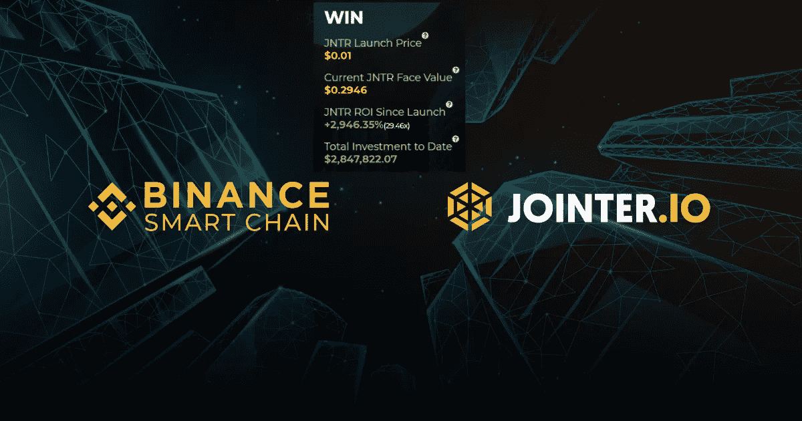

# 全球首个商业地产 DeFi 项目的博弈论拍卖

> 原文：<https://medium.datadriveninvestor.com/the-worlds-first-commercial-real-estate-defi-project-s-game-theoretic-auction-e892c5dd7353?source=collection_archive---------23----------------------->

## Jointer 的数学游戏在币安智能链上达到 3000%的增长

# 区块链的博弈论建模

拍卖是围绕博弈论模型设计的，其中投资者的总收益取决于他们的个人表现和共同的集体投资目标。个人和群体利益在投资者之间创造了独特的对称均衡。

当零投资和机会主义投资者可能投资尽可能少的金额以折扣率赢得整个发行，同时希望投资后的总投资不会显著增加时，游戏在每个拍卖日开始。如果出现这种情况，参与者将赢得不成比例的折扣。

例如，如果 JNTR 每日拍卖供应总额为 10，000 美元，投资者投资总额为 1 美元，则参与投资者的折扣将等于 99.99999%。

在这个阶段，投资者很可能认识到这个机会，并立即投资，以利用大折扣。当 1 美元累积到 1，000 美元时，总团体折扣开始下降到 90%，然后随着总投资不断增加。

这种策略造成了一个正面的两难境地，*“我应该投资尽可能少的金额，希望所有其他投资者都这样做吗？即使相对于所有其他投资者，我得到的份额更少，折扣对所有人来说是否仍然足够高？”—或者—“我是否应该与他人成比例地投入大量资金，希望增加我与所有其他投资者成比例的个人份额，并希望他们不会这么做？”*

这种困境可能导致投资者之间的全球竞争，这些投资者通过增加投资比例来从总供给中获得更大份额，从而为自己的个人利益服务。更重要的是，Jointer 创造了一个额外的激励作为个人奖金。该奖金为前五(5)名每日投资者提供了他们所收到的所有 JNTR 的高达 50%的额外奖金。

 [## 区块链投票和美国选举|数据驱动的投资者

### 在不到 70 天的时间里，这个世界上最古老的民主国家将以前所未有的方式面临最大的摊牌…

www.datadriveninvestor.com](https://www.datadriveninvestor.com/2020/08/26/blockchain-voting-and-the-american-elections/) 

诱惑和人类对“超过”的无序欲望的结合，以及作为激励人类行动的利己主义，创造了每天的总投资朝着每日目标增加的高度可能性，导致所有人的折扣减少。事实上，一旦达到昨天的确切总投资额，达到的每日目标和所有折扣将为 0%。

# 下一个困境

由于总折扣随着每一笔额外投资而减少，在某一点上，群体和个人利益可能会变得更加一致，避免额外投资，以防止折扣消失。在这一点上，博弈论拍卖给参与者创造了一个新的困境，提供了一个新的选择，继续投资，直到达到 0%的折扣。这将提供一个机会，只需再投资 0.01 美元，即可超过昨天的总投资额，触发团体折扣，并重新获得 50%的折扣。

一旦团体折扣触发，所有人都有 50%的折扣保证，新类型的投资者可能会被鼓励参与(持怀疑态度的人坐在板凳上等待首先看到最终的折扣结果)，结果可能会导致行为经济学的最后阶段，以避免损失厌恶。这意味着，引发集体折扣的投资者群体可能会觉得，新的投资正在以他们为代价，并减少他们的比例供应，这种想法可能会导致他们通过投资更多来保持他们的比例地位。

此外，我们认为，一旦对所有人的 50%折扣得到保证，投资者可能会在第二市场以溢价购买 JNTR。(阅读溢价购买订单了解更多信息)

# 每日拍卖激励

Jointer 为投资者提供激励，使他们在优化个人利益的同时，整体受益于集团。团队被鼓励超越前一天，而个人则被激励领导日常投资，并投资当天拍卖分配的最大额度。双重奖金结构为大投资者和小投资者都提供了一个机会，让他们从集体和个人的日常成功中获益。

**团体折扣**

一旦拍卖超过昨天的总投资，每个人都可以享受 50%的 JNTR 折扣。

**个人奖金**

通过提供激励每日领先投资者的乘数，使该轮的前五(5)名最大贡献者受益。

这两种奖金都没有上限，但不能超过每日投资上限。

[Jointer.io 拍卖](https://jointer.io)目前正在币安智能连锁 Mainnet 上直播。

## 访问专家视图— [订阅 DDI 英特尔](https://datadriveninvestor.com/ddi-intel)