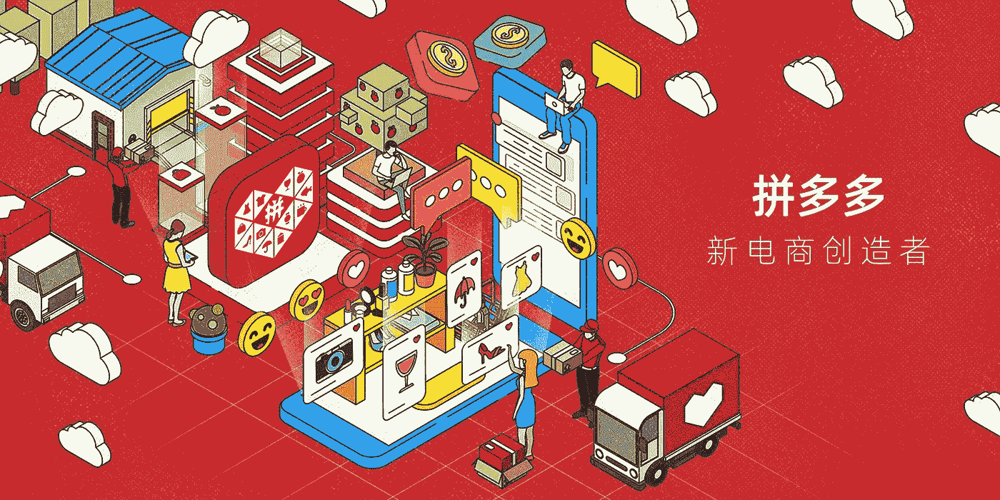
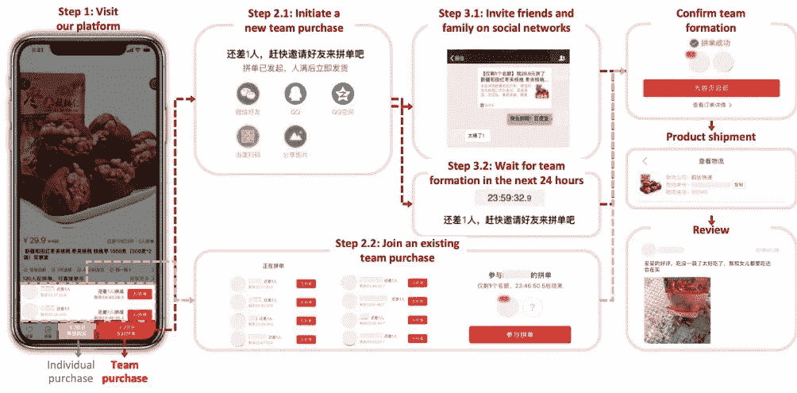

# “全球最大的社交商务平台”:与拼多多的对话

> 原文：<https://medium.datadriveninvestor.com/the-worlds-largest-social-e-commerce-platform-a-conversation-with-pinduoduo-ca9f09413451?source=collection_archive---------2----------------------->

Pinduoduo

[拼多多](https://www.linkedin.com/company/pinduoduoinc/)是中国电子商务巨头之一。在短短 5 年的时间里，它已与阿里巴巴和 JD.com 并列第一。

拼多多为“社交商务”提供了不同的视角，它为在线购物带来了一些其他电子商务平台所缺乏的元素。

因此，这是一个恰当的时间来仔细看看是什么让他们与众不同。

但是，你不需要听我猜这是怎么回事。

相反，我和 [Ada Yang](https://www.linkedin.com/in/yiyangada/) 就拼多多(或 PDD)进行了一次很好的聊天，他们的独特之处以及未来会如何。

## 你好！首先，你能告诉我们一些关于你在拼多多的角色吗？

我来自拼多多国际企业事务部，带领 PDD 与行业思想领袖、专家、学术界以及国际技术界有影响力的人士进行社交交流，旨在帮助国际社会更好地了解拼多多。

## 我们的许多读者可能听说过这个网站，但是你能简要介绍一下拼多多是什么以及它是如何工作的吗？

我们是世界上发展最快的科技公司之一，也是最大的社交商务平台。去年，我们的商品总额突破了 1 万亿元人民币(略高于 1400 亿美元)，为超过 6 亿用户提供服务，这距离我们 2015 年成立还不到五年。

# “与传统电子商务平台基于搜索的模式不同，拼多多的用户体验是基于推荐源的。”

品多多中文意思是“在一起，越来越多”。

“一起”，因为作为团队的一部分购买的我们平台上的每个产品的价格都将比个人购买的价格低得多。

“越来越多”是“更多储蓄，更多乐趣”的简称

“更多节省”，因为我们在平台上提供物有所值的商品。

“更有趣”,因为用户通过整合游戏和社交互动，在我们的应用上享受互动和愉快的购物体验。

与传统的基于搜索的电子商务平台不同，拼多多的用户体验是基于推荐源的。所以它非常随意，非常适合探索，有点像你浏览 Instagram feed 的时候。

*How the Pinduoduo ‘team buying’ concept works.*

你注意到中国消费者行为的任何重大变化了吗？

新冠肺炎加快了电子商务的采用，并强调了在封锁期间人类互动和社会联系的必要性。

# “例如，直播电子商务正日益成为中国购物的首选方式，因为它更具互动性和社会性。”

我们在中国看到的最重要的消费者行为转变是，从传统电子商务平台的“搜索、支付和离开”模式转向拼多多等社交商务模式，这种模式更接近于模仿线下购物体验，整合了找到好东西的意外之喜和一起购物带来的社交互动。

 [## 将爱好展示变成赚钱机器|数据驱动的投资者

### 这是造梦者奥斯卡·冈萨雷斯响应号召的地方。他是一名独立的在家工作的顾问，担任…

www.datadriveninvestor.com](https://www.datadriveninvestor.com/2020/02/14/turn-hobby-showcase-into-money-maker/) 

例如，直播电子商务正日益成为中国购物的首选方式，因为它更具互动性和社会性。我们发现，通过直播，消费者更愿意购买传统上在电子商务平台上表现不佳的类别。这是因为能够通过直播看到卖家并与之互动，建立了对产品的信任和信心。

当人们无法在物理世界中连接时，他们会在数字世界中找到连接的方法。

## 拼多多只在国内有吗？有计划在全球范围内推出吗？

是的，它目前仅在中国可用。我们对新的地域和探索海外机会持开放态度。用户需要我们在哪里，我们就在哪里。

## 在 Y Combinator 最近一篇关于拼多多的文章中，他们说，“社交商务不仅仅意味着将用户账户与脸书联系起来，它还意味着为买家和卖家创造新的在线购物体验。”

## 拼多多给这个正在成长的‘社交商务’领域带来了什么？

拼多多是互动电子商务或社交商务的先驱，其用户体验旨在更接近地模仿人们在现实生活中购物时的互动、交流反馈和建议。

# “这种深思熟虑的、基于意图的过程……越来越不是大多数人喜欢的购物方式，无论是在线还是离线。”

想象一下，你去购物中心，路过橱窗时发现了一双漂亮的鞋子。

你的朋友和家人给你他们的意见，销售助理根据你的资料推荐产品。PDD 将离线购物的这些社交方面——过程的交互性、朋友之间、购物者和销售助理之间——整合到在线用户体验中。另一方面，传统的电子商务是建立在传统的基于搜索的交易模式上的。消费者在购物时会清楚地知道要买什么，输入关键词，做出选择，然后付款。这种深思熟虑、基于意图的过程虽然是电子商务平台记录销售的有效方式，但越来越不是大多数人喜欢的购物方式，无论是在线还是离线。

## 拼多多模式被称为消费者对制造商，或 C2M。拼多多直接和厂家合作吗？

众所周知，中国是世界工厂。

然而，我们认为供应链中仍然存在效率低下的地方，我们可以进一步优化。拼多多是 C2M(消费者对制造商)模式的先驱，通过电子商务整合消费者需求和偏好，帮助制造商在制造阶段之前定制产品设计，以适应不同的人口统计数据和客户群。

这种消费者主导的制造模式通过绕过中间商缩短了供应链，以实时、数据驱动的方式将消费者反馈导向制造商。

我们帮助制造商根据我们在平台上收集的消费者偏好确定他们的目标市场和消费者。我们告诉他们可以卖什么，以及合适的价位。通过生产消费者想要的东西、他们想要的方式和他们想要的时间，制造商能够通过减少需求的不匹配来削减成本，并更好地规划他们的库存和物流。

## 疫情如何影响了拼多多的计划？

像中国乃至世界上的大多数企业一样，拼多多在今年早些时候新冠肺炎疫情爆发的高峰期也面临着挑战。也是在这个时候，我们意识到，在艰难的环境下，人们是多么依赖我们来满足他们的基本需求。

在此期间，我们加紧努力，帮助用户、商家和我们的业务合作伙伴的整个生态系统，以确保我们的用户的日常需求得到及时和安全的满足。自 5 月份以来，我们已经看到日均订单达到 6500 万份，高于 3 月中旬的 5000 万份。

## 平台上哪些产品最受欢迎？

服装、家庭用品、农产品是最受欢迎的商品。

## 你认为国际市场会如何接受同样的模式？例如，是否有文化或经济因素使你的方法更适合/不适合特定的环境？

中国电子商务行业的某些方面与世界其他地区不同，这使得拼多多模式在如此短的时间内得以发展壮大。

首先，中国拥有接近 9 亿的移动设备用户，这为移动电子商务的激增创造了必不可少的基础。

其次，与西方不同，大多数中国消费者没有信用卡，而是使用微信支付和支付宝等移动支付应用。

第三，随着电子商务的兴起，中国的物流基础设施在过去十年中得到了发展，而且可以广泛使用，价格低廉，速度快。

第四，中国作为“世界工厂”的角色，也为电子商务行业提供了广泛选择的物超所值的产品，以满足和刺激消费者的需求。

也就是说，我们相信购物时想要更多的钱和乐趣是普遍的。大家都想有更多的积蓄，更多的乐趣，在一起！

## 拼多多的未来会怎样？

我们将继续带来更多有趣和互动的功能，以更好地吸引我们生态系统中的每个人，包括用户、商家、农民等。为每个人带来快乐和价值。

**进入专家视角—** [**订阅 DDI 英特尔**](https://datadriveninvestor.com/ddi-intel)