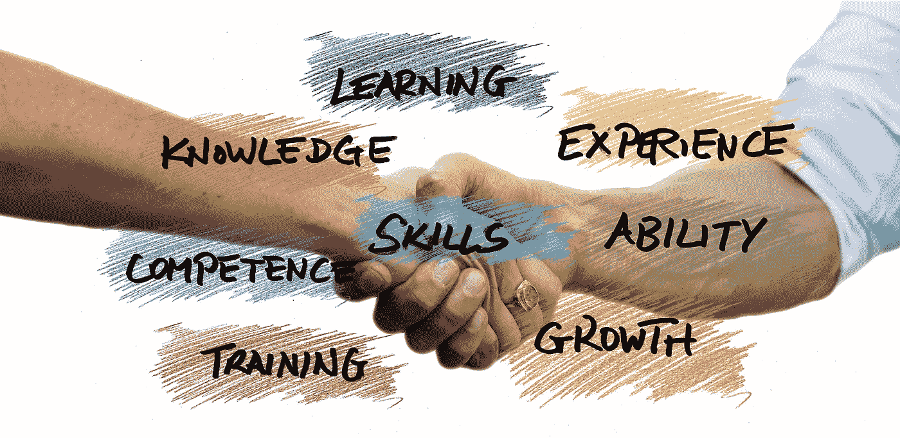

# 我收到的最糟糕的面试建议

> 原文：<https://medium.datadriveninvestor.com/the-worst-interview-advice-ive-ever-received-3b0196b41655?source=collection_archive---------4----------------------->

## 提醒你，你的直觉永远是你最信任的顾问。

Image by [Gerd Altmann](https://pixabay.com/users/geralt-9301/?utm_source=link-attribution&utm_medium=referral&utm_campaign=image&utm_content=3371153) from [Pixabay](https://pixabay.com/?utm_source=link-attribution&utm_medium=referral&utm_campaign=image&utm_content=3371153)

我坐在停在公司停车场的车里。我只想把头撞在方向盘上。

我刚刚在一次我期望能得 a 的面试中失败了，这不是任何人的错，而是我的错。

# 背景故事…

我曾在一家初创公司工作，专门从事员工背景筛选。金融危机爆发时，招聘枯竭，这意味着筛查订单也枯竭了。我意外地发现自己失业了。

我联系了我的头号 IT 招聘人员唐娜，她向我保证，以我的技能，我不会失业很久。“给我几天时间联系一些公司，”她告诉我。"我敢打赌，我们可以在本周末之前给你安排一次面试."

她完全正确。第二天，她给我回了电话，告诉我我参加了一个网站开发员的面试，这个职位是镇上一家大型服务公司的。她让我提前 30 分钟在她的办公室见她，她会仔细了解一些关于公司的事情，以及一些面试建议。

 [## 从新冠肺炎学到的 8 个教训，但它们不会持久|数据驱动的投资者

### 由于新冠肺炎，生活在 2020 年 3 月初几乎一夜之间发生了巨大的变化，越来越多的人认为…

www.datadriveninvestor.com](https://www.datadriveninvestor.com/2020/05/20/the-8-lessons-learned-from-covid-19-but-they-wont-last/) 

# 准备工作

我在唐娜的办公室见到了她，她说她有一些知识要分享。“我知道你的简历很不错，”她告诉我。“如你所知，在面试的后半部分，他们会转而问，‘你有什么问题要问我们？’"

唐娜给了我一些关于公司历史的见解，比他们网站上的营销材料更深入。“这些问题会让他们大吃一惊，让他们知道你真的做了功课，”她告诉我。

接下来，唐娜给了我一个一般性的、非特定公司的问题，这是她建议所有客户在面试结束时问的问题。然后她打电话给招聘经理，告诉他我已经在路上了。

# 面试

我见到了招聘经理，他向我介绍了首席开发人员 Rupal 以及我将与之共事的团队。Rupal 主持了面试的第一部分，询问我对各种技术的熟悉程度。(如果你不熟悉下面的技术术语，不要担心——这里的建议适用于任何职业领域。)

*   C#？“哦，是的，这是我在上一份工作中使用的语言，以及我过去担任的其他职位，”我告诉他们。
*   Javascript？“我从事这方面的编程已经超过 10 年了，”我说，并主动拿出我创建的一个网站作为例子。
*   XML？“嗯，我当然熟悉这个标准，而且我已经学习了很多教程，”我回答道。"我只是还没有机会专业地应用这些知识。"
*   SQL Server？“我从开发人员和管理员的角度了解它，”我回答，“我也了解 SQL 的其他变体。”

# 到目前为止一切顺利。现在是时候让他们大吃一惊了。

“你有什么问题要问我们？”我想给人留下深刻印象。我询问了公司的历史。我要求看看我未来潜在的工作空间。

然后我告诉他们，“一只小鸟告诉我你们这里有很棒的万圣节派对。有图片吗？”

招聘经理回应道，“在这里等着”，然后跑向他的办公室。他得意洋洋地回来了，手里拿着一个装满照片的信封。“去年的主题是名人&狗仔队，”他解释道。“团队一半人打扮成名人走红毯，另一半人带相机当狗仔队。”

在我看完照片后，招聘经理问我，“你还有其他问题要问我们吗？”，脸上露出了笑容。

# …这是我搞砸的地方

我想到了唐娜建议所有客户在面试时问的最后一个问题。只是感觉不太对。事实上，我内心的声音在尖叫，“不要这样做！”

但是唐娜以前从未误导过我。此外，我知道在采访后的电话中，她想知道我是否在最后问了那个问题。

所以，违背我自己更好的判断，我问，

> 在我走之前，你对我在这里的工作能力有什么担心吗？在我离开之前有什么不足之处需要我解决吗？

鲁帕尔脸上的表情变了。“嗯……..”她思索了这个问题后说道。" XML。"

我能说什么呢？我知道 XML，但是在我职业生涯的那个阶段，我还没有机会专业地使用它。所以我在面试中做的最后一件事是提醒她和她的团队，我没有 XML 方面的相关工作经验，而其他候选人可能有。

# 哪里出了问题

心理学的峰端理论指出，不可能记住你们互动的每一个细节。因此，这种体验是积极的还是消极的取决于两件事:

*   互动过程中发生的巅峰体验
*   最后发生的最后经历

我给了团队两次巅峰体验:我在他们期望的三项能力中展示了强大的技能。过了一会儿，我和整个团队在万圣节的照片上建立了联系。我能感觉到他们开始把我视为同事。他们开始想象我在下一次万圣节庆典上的装扮。

然而，在我介绍的最后一次经历中，我提醒了 Rupal 她认为我缺乏的一项技能。毫无疑问，在我离开后，这在团队中引起了讨论，让他们怀疑我是否还有很长的路要走。

# 我应该做的是

对于我的最后一个问题，我应该说，**“我们已经确定，我在 C#、Javascript 和 SQL Server 方面有很强的背景。你能告诉我，你如何看待我将这些技能应用到你正在进行的一个项目中吗？”**

他们已经开始认为我是一个适合团队的优秀人才。这个问题应该建立在这个愿景上，邀请他们把我也看作是一个合适的技能。

# 结果和总结

我没有得到那份工作。但是你已经知道了。

我从这次采访中学到的主要东西是:

*   让团队认为你是合适的人选，无论是在性格方面还是你将带来的技能方面
*   让他们对你的最后记忆强化这种契合。不要提出任何弱点，不管是真实的还是感觉到的
*   每个人都受益于教练、顾问或导师，但当你的感觉与他们的建议不一致时，让你的感觉成为最终的仲裁者

祝你找工作好运！如果你想从我这里收到更多关于直觉及其应用的故事，一定要注册我的[电子邮件简讯](https://paul-ryburn.ck.page/bead225d0c)。

**访问专家视图—** [**订阅 DDI 英特尔**](https://datadriveninvestor.com/ddi-intel)