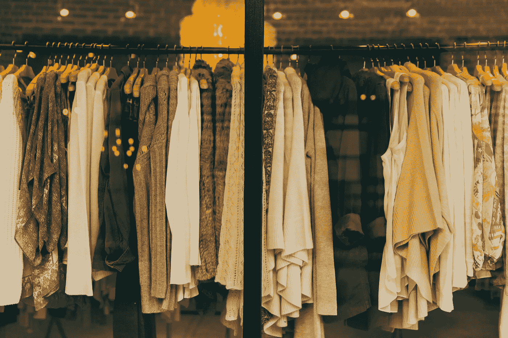
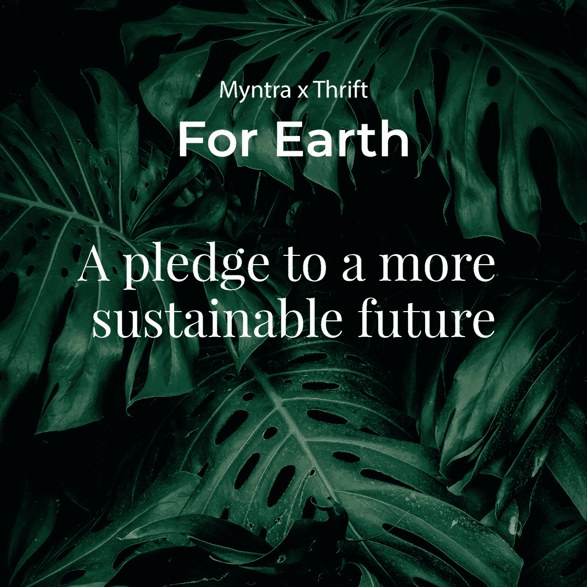
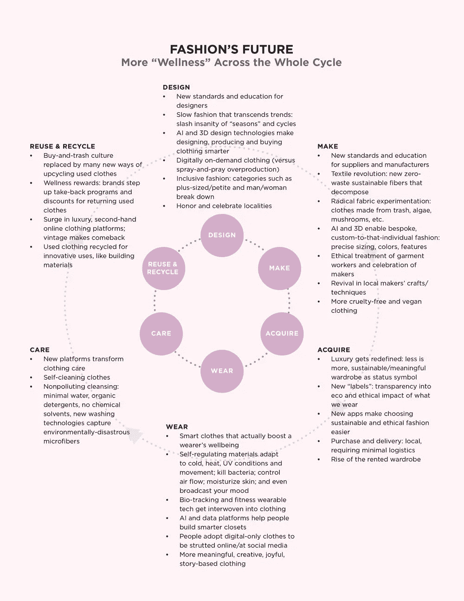
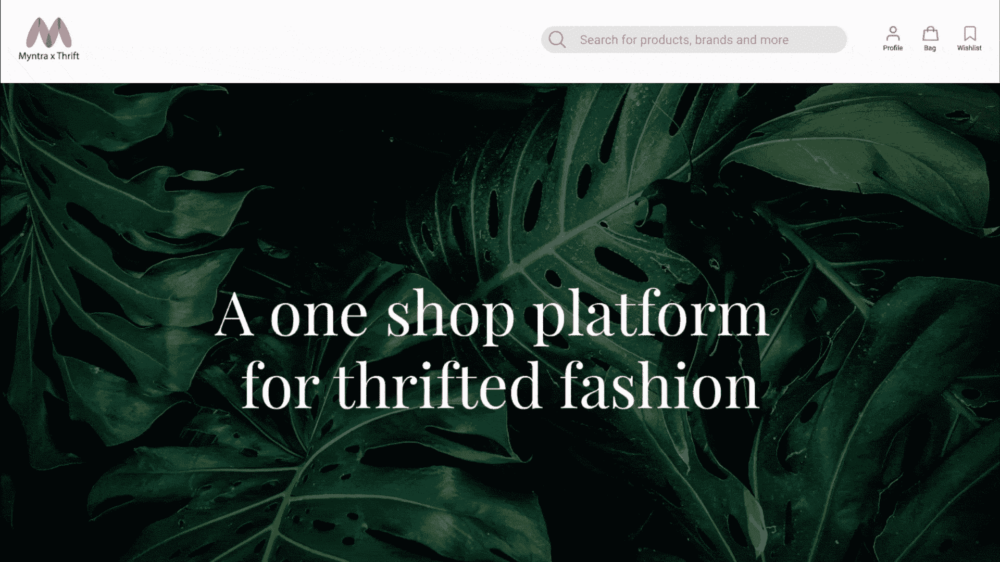

# “X”因素

> 原文：<https://medium.datadriveninvestor.com/the-x-factor-a2698185be94?source=collection_archive---------18----------------------->

人工智能会预测你的衣柜未来会是什么样子！



Picture Credit:hannah-morgan-ycVFts5Ma4s-unsplash

在处理像**‘出售’这样的头条新闻时，我们没有太多选择！**随着我们的衣柜里塞满了*‘只能穿一次’在社交媒体上被所有人看到！}* 服装，我们只是被我们的时尚选择淹没了。

服装和成衣业产生相当于 500 亿个塑料水瓶的塑料微纤维，消耗大量的水和有毒化学物质。这也是一个供应链充满不安全条件、童工和其他剥削做法的行业，相当于现代奴役，特别是对女孩和妇女而言。如果我们需要看到时尚产业发展成一个完全可持续的版本，我们需要现在就开始。

我们被告知要循环利用(却被告知这是无用的，因为大部分垃圾都将被填埋)，并且“可持续地”购物。但是当谈到时尚的可持续性时，我们得到的是完全不同的信号。是指本地生产，新兴设计师，租来的衣服，有机棉，还是用回收的瓶子做的衣服？

> 这一切看起来势不可挡，而且，作为一个人，我们真的能有什么影响？
> 
> **坦维·卡普尔**-[ISDI·帕森斯](https://www.isdi.in/communication-design/)**(AIML |一个全新的世界)**提议 **Myntra x ThriftStores —** 印度最大的在线时尚商店，可以与印度各地的许多旧货店合作，帮助购物者向可持续的生活方式迈进。

节俭服装或购买二手服装的概念真正包含了可持续发展的理念。因此，随着对环境问题的日益关注，印度消费者开始接受旧货店。当可以再次被爱时，为什么要扔掉处于最佳状态的物品？



**Myntra x ThriftStores** — Embracing sustainability with thrift stores — **Tanvi Kapur**

节俭在印度越来越被接受，因为许多有影响力的人也在推动这一运动。很多单品都是复古的，背后都有历史，知道会穿不止一次的感觉真好！最后，我们可能会有一个选择——**使用人工智能来解决希望转向可持续时尚的消费者所面临的问题！**

> 根据 Tractica 的数据，到 2025 年，全球人工智能收入将达到 368 亿美元。

为顾客提供建议，人工智能倾向于收集所有被搜索和寻找的数据。然后，算法获取信息、历史记录、第三方数据、内容数据和其他信息，为用户提供必要的参考。


**Myntra x ThriftStores** — Embracing sustainability with thrift stores — **Tanvi Kapur**

[“一些人工智能用例——如图像识别、算法证券交易和医疗保健患者数据管理——具有巨大的规模潜力，而其他则是利基应用。”](https://www.businesswire.com/news/home/20160825006052/en/Artificial-Intelligence-Revenue-to-Reach-36.8-Billion-Worldwide-by-2025-According-to-Tractica)

创造以客户为中心的**视觉搜索** **AI** 使用倾向于匹配产品的视觉搜索能力。让我们有可能购买我们正在寻找和喜爱的东西。使用 **Emotion AI** 进一步过滤偏好，它会记录您在查看产品时的心情和反应，有助于进一步过滤您的偏好，从而减少浏览一页又一页产品所需的时间和精力。

> [**一个可持续、伦理、智能、疗愈、更包容、更有意义的服装新时代正在崛起。**](https://www.globalwellnesssummit.com/2019-global-wellness-trends/wellness-fashion-beyond-athleisure/)



[https://www.globalwellnesssummit.com/2019](https://www.globalwellnesssummit.com/2019-global-wellness-trends/wellness-fashion-beyond-athleisure/)

> 一项针对年龄在 18-30 岁之间的消费者的调查显示，他们希望转向可持续的时尚旧货店，但又不想牺牲购物体验！

我们不能等到 2030 年才看到时尚行业是否已经着手实现其雄心勃勃的目标，我们需要看到今天有意义的行动，因为影响者将扮演一个新角色 **' *负责任的影响者。***



ApplyingAI to enhance your thrifting experience on Myntra— **Tanvi Kapur**

> [让我们摆脱有毒的快速时尚关系](https://www.cosmopolitan.com/uk/fashion/style/a30243970/fast-fashion-toxic-relationship/)随着新时代的到来，我们可以通过为行业做出贡献来实现可持续目标，从而沉浸在对时尚的热情中。


**Myntra x ThriftStores** — Embracing sustainability with thrift stores — **Tanvi Kapur**

主要驱动力包括对破坏环境行为的认识，以及做出环保选择的强烈愿望。此外，千禧一代和 Z 世代的消费者具有生态意识，推动了可持续时尚运动的发展。新一代追求可持续、公平和循环的时尚，而不局限于对最新潮流的偏好。可持续发展和负责任的消费者鼓励品牌在其供应链中展示透明度和可持续性。 ***随着消费者越来越意识到他们所购买的品牌对地球的影响，品牌正在加快努力吸引不断增长和演变的市场。***

> 基于人工智能的解决方案渗透到我们生活和做生意的方式中，关于道德、隐私和安全的问题也将出现。学生们进行了各种猜测和预测。 ***免责声明:*** *所有创意均为假设课堂项目。* ***保留所有权利— I S D I 2 0 2 0***

*创作导师:* [***乌卡沙·马尔卡尔***](https://www.linkedin.com/in/utkarsha20/)

***ISDI 校区*** *印度设计学院&创新
ISDI 大厦，One Indiabulls Centre，
Senapati Bapat Marg，Lower Parel，
孟买 400013。一般查询:* [*查询@isdi.in*](mailto:enquiries@isdi.in) *布点&行业连接:* [*布点@isdi.in*](mailto:placements@isdi.in)

```
**UTKARSHA M. |** Author | Design Thinker | Creator  - A desire to understand the world and to improve it always remains at the core. Design is a managed process and my quest for knowledge is subject to an inquiry of the apparent, the imagined and the recalled. As I speculate and design, my liberty of self-expression is in direct correlation to my existence and knowledge.
```