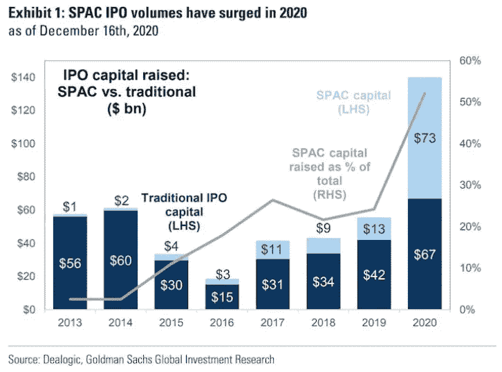
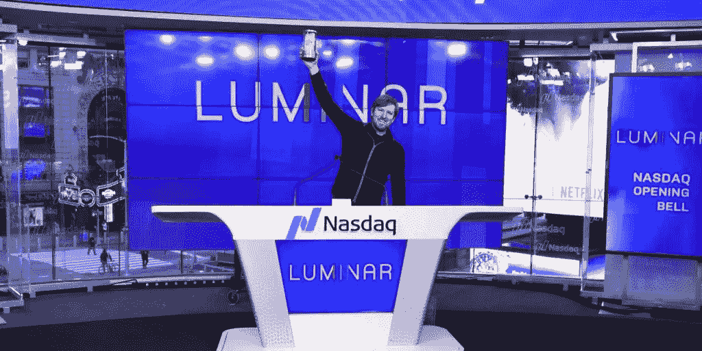
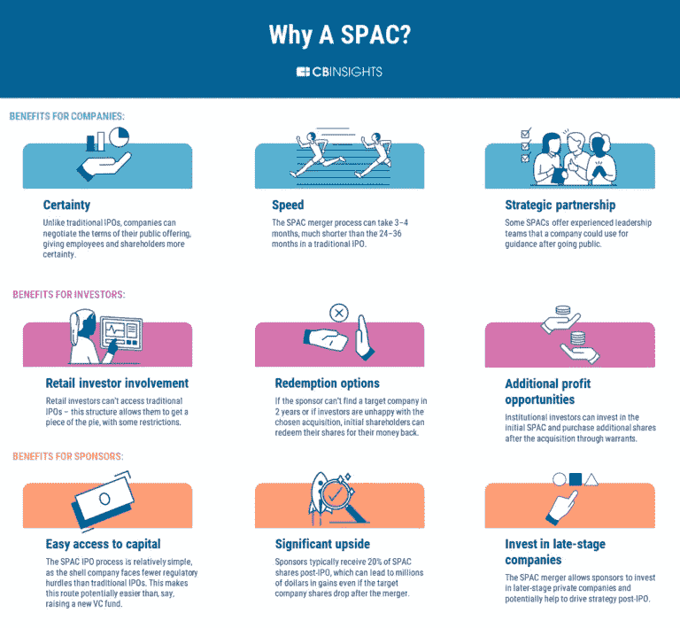
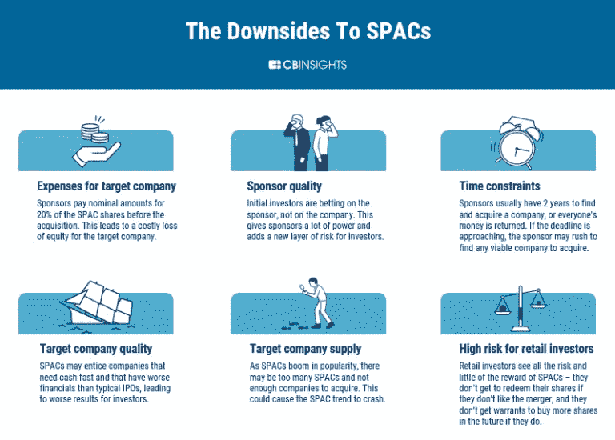

# 特殊目的收购公司年及其对硬件的意义

> 原文：<https://medium.datadriveninvestor.com/the-year-of-the-spac-and-what-it-means-for-hardware-7888b6c07960?source=collection_archive---------33----------------------->

CBS MarketWatch [宣布](https://www.marketwatch.com/story/2020-is-the-year-of-the-spac-yet-traditional-ipos-offer-better-returns-report-finds-2020-09-04) 2020 年:特殊目的收购公司(特殊目的收购公司)年。创纪录的 219 家公司通过这种融资工具上市，这种融资工具利用与现有私营企业的反向合并创建一个公开上市的实体。这占了超过 730 亿美元的投资，为私募股权创业公司提供了一个筹集资本和提供股东流动性的新渠道。根据[高盛](https://markets.businessinsider.com/news/stocks/spacs-raised-73-billion-more-than-traditional-ipos-blank-checks-2020-12-1029906693#:~:text=2020%20has%20been%20the%20year,billion%20year%2Dto%2Ddate.)的说法，目前的趋势代表着“同比增长 462%，超过传统 IPO 60 亿美元。”作为对 SPACs 兴趣的回应，[证券交易委员会](https://www.sec.gov/rules/other/2020/34-90768.pdf))上周同意允许私人公司通过直接上市筹集资金，提供了更多进入华尔街传统机构看门人之外的公开市场的途径。

在过去的几个月里，特殊目的收购公司热已经蔓延到机器人和遥感行业。就在上周，软银[宣布](https://nypost.com/2020/12/22/softbank-launches-525m-spac-to-invest-in-robot-revolution/)将在盲池特殊目的收购公司筹集 5.25 亿美元用于人工智能投资。在提交给 SEC 的文件中，软银表示，“在过去的 40 年里，软银在重大技术变革之前进行投资。现在，我们相信人工智能革命已经到来。”2017 年，软银首席执行官孙正义(绰号 Masa)预测，到 2047 年，机器人将超过地球上的人类，有 100 亿个小型人形机器人(像它自己的 Pepper 机器人)在街上滚动。作为一个直言不讳地相信[奇点](https://en.wikipedia.org/wiki/Technological_singularity#:~:text=The%20technological%20singularity%E2%80%94also%2C%20simply,unforeseeable%20changes%20to%20human%20civilization.)的人，马萨并不羞于投资机器人领域，拥有[奇才](https://us.softbankrobotics.com/)、[佩珀](https://www.softbankrobotics.com/corp/robots/)、[小熊](https://bearrobotics.ai/)和[大脑公司](https://www.braincorp.com/)的股份。本月早些时候，该公司以 10 亿美元的价格将波士顿动力公司的股份卖给了现代公司。Masa 在 2018 年推出自己的风险投资基金时宣布，“我将 97%的时间和精力投入到人工智能上。”过去一个月，Masa 的 1000 亿美元愿景基金凭借 DoorDash 的首次公开募股获得了巨大的投资组合胜利，抹去了之前在 WeWork 和 OneWeb 投资失败的损失。本着这种精神，毫不奇怪，特殊目的收购公司的申请文件称:“新冠肺炎通过大幅加快数字服务的采用，推动了未来的发展。在此期间，我们与许多引人注目的公司有交集，这些公司希望我们在 IPO 时及之后提供支持，但我们缺乏与他们合作的工具。随着越来越多的公司决定公开上市，这一趋势在过去一年里有增无减。”

软银的乐观被 SPACs 收购硬件传感器公司的成功进一步验证。本月早些时候，[罢黜](https://siliconangle.com/2020/12/22/lidar-startup-ouster-go-public-1-9b-spac-merger/)成为今年第五家通过特殊目的收购公司上市的激光雷达初创公司。已经上市交易的有[威力登](https://velodynelidar.com/blog/velodyne-lidar-goes-public/)、[卢米纳尔](https://siliconangle.com/2020/08/24/lidar-startup-luminar-going-public-via-unusual-3-4b-reverse-merger/)、 [Innoviz、](https://siliconangle.com/2020/12/11/solid-state-lidar-maker-innoviz-go-public-1-4b-spac-merger/)和 [Aeva](https://siliconangle.com/2020/11/02/aeva-makes-lidar-sensors-autonomous-cars-plans-go-public-via-spac-merger/) 。这些公司都以超过 10 亿美元的估值筹集了数亿美元。一些公司在公开市场表现良好，比如 Luminar 的估值在几周内就翻了一番。其他国家，如威力登，有更多的困难。自 9 月份上市以来，威力登的股价下跌了一半(目前交易价格略高于其发行价)。由于硬件条件艰苦，保持私有化的代价是创始人股权稀释和估值过高。SPACs 为创业公司及其投资者提供了更快的资本获取途径和更大的流动性，使投资者能够将他们的回报再投资于自主行业，并最终在更大程度的采用之前推动创新。

最近，我采访了 Mobility Impact Partners 的普通合伙人 Andrew Flett，他为新的特殊目的收购公司——T2 运动收购公司(T3)筹集了 1 . 15 亿美元。弗莱特的投资工具仍在寻找收购“全球联网汽车行业的目标企业，包括为车队管理、货运和物流以及移动资产管理应用提供运输软件和云解决方案的公司。”在与 Flett 交谈时，他描述了他在该领域的就职经历如下:“这是我直接参与的第一个特殊目的收购公司，但该机制在过去几十年中已经发展成熟。它们现在之所以受欢迎，是因为同样的收益率稀缺性和巨大的流动性一直在推动公众股票投机。在任何一波兴趣中，既有投机性很强的公司，也有基本面扎实的公司。这波也不例外。”他敏锐地指出了之前由可疑的承销商领导的特殊目的收购公司上涨(自 20 世纪 80 年代以来),这些承销商利用这种机制作为通过“[泵送转储](https://dailyvoice.com/new-york/clarkstown/news/westchester-native-indicted-in-17m-pump-and-dump-scheme/648681/)计划快速获利的一种方式。这些市场操纵者(许多人仍在服刑)迅速在交易所推销股票，以便在其他投资者能够合法交易股票之前迅速出售自己在公司的股份，最终摧毁了初创公司及其股东的价值。公开上市增加的费用和透明度加剧了这一问题，让初创企业创始人对自己在纳斯达克或纽约证券交易所的新角色准备不足。

与过去不同的是，许多新成立的 SPACs 由品牌投资者管理，如理查德·布兰森([维珍银河](https://www.virgingalactic.com/))、比尔·阿克曼([潘兴广场](https://pershingsquareholdings.com/))和彼得·泰尔([布里奇顿](https://www.bloomberg.com/news/articles/2020-12-15/thiel-backed-spac-said-to-weigh-up-to-10-billion-tokopedia-deal))。新上市的特殊目的收购公司 2020 作物的表现非常令人印象深刻，超过了标准普尔，选秀国王和尼古拉以三位数的回报领先。在征求弗莱特对这些经理的看法时，他提醒道，“聪明的家伙。这只是一次品牌推广活动，还是他们将参与资产评估和最终的去空间化公司？最终，资产需要独立存在，不管它是如何实现的(首次公开募股、直接上市、特殊目的收购公司)，一旦上市，它就是一个纯粹的同类业绩比较，取决于战略、管理和执行。如果公众公司没有从他们的智慧中受益，那么前端附加什么品牌都无所谓。”

弗莱特建议创始人不要太容易被公共资本诱惑，而是“专注于你的公司”。如果你的公司无法承担上市公司的责任和开销，那就不是你的正确选择。”在评估他对软银最新公告的看法时，“像大多数私人股本或机构投资者一样，这只是一个现金抓取工具，也是展示他们投资敏锐度的替代工具。弗莱特乐观地认为:“我更愿意看到软银建立规模合理的 SPACs，而不是募集另一只被误导的愿景基金。”。然而，在一天结束时，特殊目的收购公司先锋提醒我们，市场是周期性的，机会之窗最终会关闭，“随着一些投机性押注让投资者焦头烂额，收益率替代品出现，特殊目的收购公司市场将放缓。”

 [## 去公关还是不去公关？初创公司的 5 个关键问题|数据驱动的投资者

### 在 2015 年发表了一篇发人深省的观点文章，将围绕创业公司的新闻周期比作 12 小时的时钟…

www.datadriveninvestor.com](https://www.datadriveninvestor.com/2020/12/21/to-pr-or-not-to-pr-5-key-questions-for-startups/) 

## 访问专家视图— [订阅 DDI 英特尔](https://datadriveninvestor.com/ddi-intel)