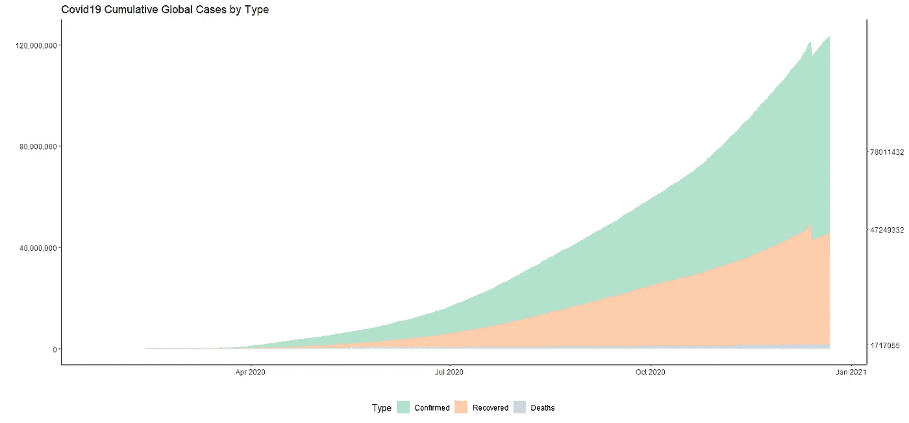
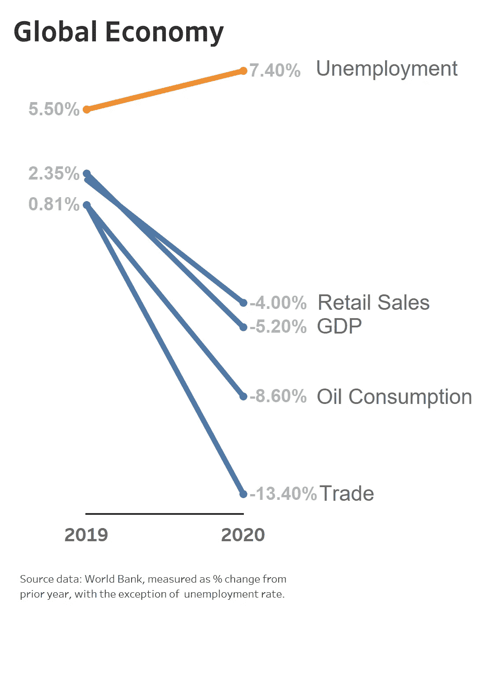
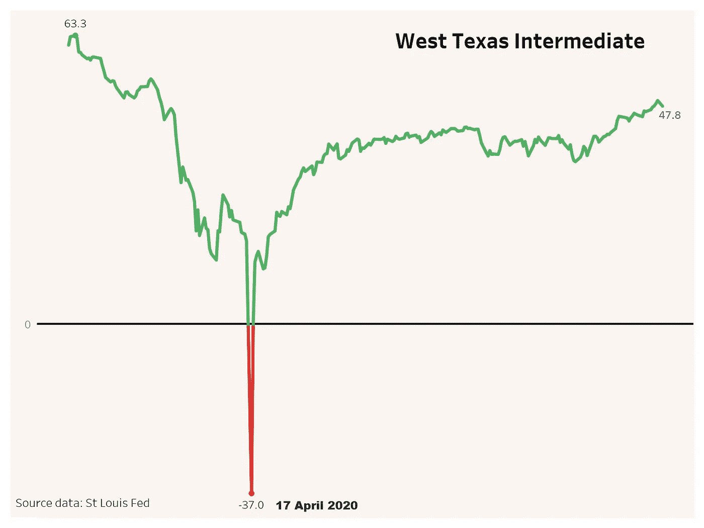
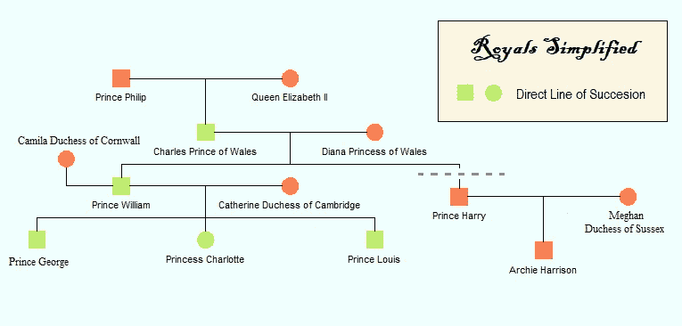
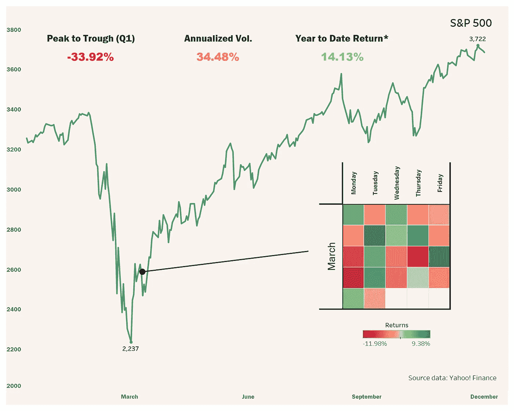

# 那是 2020 年，视觉化

> 原文：<https://medium.datadriveninvestor.com/the-year-that-was-2020-in-visualizations-9b20629eeb8c?source=collection_archive---------31----------------------->

## 回顾

Photo by [Igor Kasalovic](https://unsplash.com/@ikasalovic?utm_source=medium&utm_medium=referral) on [Unsplash](https://unsplash.com?utm_source=medium&utm_medium=referral)

随着每一年接近尾声，在展望下一年之前，人们通常会花时间反思一些已经过去的更难忘的时刻。虽然 2020 年将被许多人视为被遗忘的一年，但它无疑将被历史铭记。从 COVID19 和黑人的命也是命运动，到 Megxit，这篇文章旨在简要总结和想象(没有特定的顺序)一些关键的社会，经济和文化事件，这些事件决定了 2020 年。

# 新冠肺炎（新型冠状病毒肺炎）

Data source: JHU CSSE (fall in cases on 14 Dec due to nullification of US recovery data)

2020 年将作为疫情年被人们铭记。冠状病毒迫使世界大部分地区进入封锁状态，包括大范围的边境关闭、强制隔离和疫苗竞赛。“社会距离”进入了日常用语，戴口罩超越了礼节成为了一种必须。就目前情况而言，对世界造成的损失是毁灭性的，即使我们进入 2021 年，进一步扩散的威胁仍然是一个非常现实的风险。

# 黑人的命也是命

在社交媒体和其他平台上，一块黑色的画布开始象征着与黑人的命也是命的团结。乔治·弗洛伊德死后，这一运动受到了国际社会的关注和采纳，代表了对不公正和种族不平等的抗议。

# 逆转的世界经济

根据世界银行的数据，2020 年世界经济萎缩，超过 90%的国家进入衰退，几乎所有衡量实体经济活动的指标都在下降。尽管如此，据预测，随着许多与 COVID 相关的限制被取消以及经济开始复苏，2021 年将出现快速反弹。

# 神户（日本城市）；科比（科比·比恩·布莱恩特）

Source data: Wikipedia

篮球运动员科比·布莱恩特和他的女儿吉安娜在一次直升机事故中不幸遇难，这代表着这一代人失去了一位最具标志性和最受喜爱的运动员。当许多人试图哀悼可能是有史以来最伟大的损失时，悲伤的流露是普遍的。

 [## 一瞬间学会数据科学！？数据驱动的投资者

### 在我之前的职业生涯中，我是一名训练有素的古典钢琴家。还记得那些声称你可以…

www.datadriveninvestor.com](https://www.datadriveninvestor.com/2020/07/23/learn-data-science-in-a-flash/) 

# 石油价格下跌

end price as at 21 Dec

4 月 17 日，石油进入了前所未有的领域。由于全球封锁和现货交割的相关成本导致需求预期减弱，这意味着油价在回升至远低于年内高点的水平之前短暂转为负值。

# 梅根脱离皇室

另一个第一，哈里王子和梅根宣布他们打算远离皇室和相关职责，在经济上独立。自那以后，这对夫妇继续签署了演讲安排协议，网飞和 Spotify。

# 选举年

尽管围绕蓝色浪潮发表了言论，但美国总统选举变成了一场比许多人预期的激烈得多的竞赛。乔·拜登(Joe Biden)击败现任总统唐纳德·特朗普(Donald Trump)，成为美国第 46 任总统，这一结果最终将对外交、贸易和财政政策产生广泛影响。这一事件并非没有意外，因为选民欺诈的指控和旷日持久的法律战的威胁很快浮出水面。

# 市场的一次小挫折

end price as at 22 Dec

在一个可以与 1987 年的崩盘和大萧条相提并论的动荡月份，标准普尔 500 股市指数从最高点到最低点下跌了 30%以上。然而，它在不到 6 个月的时间里收复了所有失地，并以接近创纪录的水平结束了这一年。经济基本面和金融市场表现之间的脱节仍然是许多评论者关注的焦点。

# **资源**

看到的可视化是使用 Tableau、Python 和 R 从引用的源数据创建的。

**免责声明** : **任何观点均属个人性质，仅代表个人观点。无论如何，这都不应被理解为建议。**

**访问专家视图—** [**订阅 DDI 英特尔**](https://datadriveninvestor.com/ddi-intel)