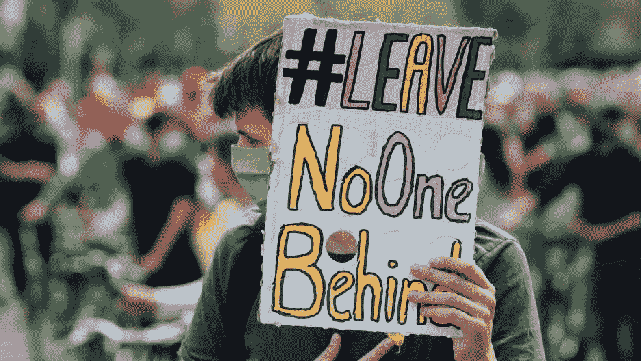

# 我们与经济决裂的那一年

> 原文：<https://medium.datadriveninvestor.com/the-year-we-broke-up-with-the-economy-7a34c78a71df?source=collection_archive---------32----------------------->

## 我们的经济体系已经崩溃；让我们与它分道扬镳，建立一个更加公平的经济

Credit: Leonhard Foeger | Reuters

事实上，经济已经不再运转了。当然，它正在推动一些幸运的人前进，尤其是在疫情之后诞生的新亿万富翁。但是，让我们面对现实吧，我们与它的关系已经变得越来越恶劣。

一场风暴已经酝酿了几年，甚至几十年。当冠状病毒撕裂这个世界时，我们被迫看清了我们恋情的真实面目:一种缺乏任何形式支持的虐待关系，充满了竞争和持续的沮丧。

2020 年是令人沮丧、毁灭性的一年，这一点也不夸张。但这也是一种转变，驱散了迷雾，让我们意识到是时候结束这场盲目的爱情了。有些东西必须放弃。

今天，绝望的人们和他们贪婪的市场之间的纠葛最能说明这个社会。虽然我们愿意相信这两个实体是完全独立的有机体，但可悲的现实是，我们已经完全依赖于不可阻挡的经济，绝望地乞求我们的生计。

作为一个研究领域，经济学是对地球上人类生活的悲剧性的不准确的描述。它一点也不关心人民。可以理解，考虑到其本质毕竟是对市场的研究。

对我们来说不幸的是，世界是由经济塑造的——就像我们生活中最亲密的方面一样。这两者没有区别。只要看看你的周围；我们淹没在政府政策和企业项目的海洋中，这些政策和项目的核心是经济的最大利益，而不是别的。在这个体系中，人类是可支配的，而市场是万能的。

 [## 印度经济的诅咒|数据驱动的投资者

### 当我们看到自己的国家处于领先地位时，总会有一种自豪感。让它成为运动，金钱，资源，经济…

www.datadriveninvestor.com](https://www.datadriveninvestor.com/2020/12/16/a-curse-to-the-indian-economy/) 

但是专家和外行都忽略了一个重要的脱节。在其核心，整个结构是由人组成的。这是一个完全相互依赖的有机体，只有双方都在场时才能发挥作用。人构成了经济，那么为什么不设想一个让我们都能过上有尊严的生活的系统呢？

这些正是我在大学时的想法。我攻读经济学学位，因为我始终相信它有改变世界的潜在力量。老土，我知道。最糟糕的是，我甚至没有这方面的头脑。我对内容的理解总是滞后，因为我一直试图在脑海中灌输无法回答的“为什么”，试图在人类在战壕中的经历和所有理论上的胡言乱语之间建立联系。也许我应该选另一门课。但至少现在我可以尝试改变经济的进程。

是的，2020 年无疑在历史上给我们的集体存在留下了印记。这也迫使我们认识到接受现状就等于承认失败。我们迫切需要一个更加人性化、以人为本的系统，它不会降低我们的生活水平，代表我们所有人，将机会平等作为一种权利，而不是一种特权。

一个民有、民治、民享的经济是可能的。我绝不是林肯，也不是专家。我是一位母亲，也是一名刚毕业的大学生，和你一样，我知道我们的社会结构早该崩溃了。

通过改变包含我们传统社会制度的经济领域，我们可以朝着创造一个更加公平的世界迈出急需的一步。我们经济的某些改变最终可以改善每个人的福祉，让我们所有人都能分享地球的繁荣。

明年，我将开始分享我的一些想法，我也邀请你分享你的想法。把它看作是正在进行的新一轮经济思维的头脑风暴，它激励着社会的重塑。

那么，接下来是什么？在这种新经济下，一个可持续发展的世界会是什么样子？我有几个提议可以帮助回应这种改变的呼声。记住:下一个经济是以人民为中心的，而不是相反。谁和我在一起？

**进入专家视图—** [**订阅 DDI 英特尔**](https://datadriveninvestor.com/ddi-intel)