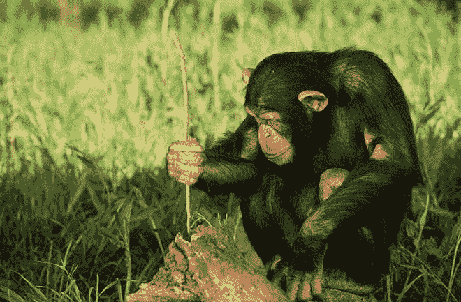

# 物质可编程性理论

> 原文：<https://medium.datadriveninvestor.com/theory-on-the-programmability-of-matter-ec9337963319?source=collection_archive---------12----------------------->

The ultimate computer program is found at the heart of each cell in our bodies.

# 介绍

物质是可编程的并不是一个新的想法。早在 20 世纪 50 年代，沃森和克里克就已经证明了一组复杂的分子和原子是如何形成令人惊讶的复杂的 DNA 双螺旋结构的，这种结构存在于我们身体的每个细胞中。最特别的是，在单个精子和卵子结合开始“运行”程序的那一刻，这两个副本就开始构建我们了。一旦程序开始执行，我们可以目睹其重复的“循环”方法，因为它们导致细胞分裂，然后分化，然后特化，分支，最终形成一个完全独立的新功能体，从最简单的变形虫到雄伟的狮子到人类！这是一个非常酷的程序。

但是这个程序并不是一出生就停止运行的。随着它继续执行，有机体以惊人的方式生长并继续进化，甚至开始学习和保留新信息，就像我们学习走路、说话和思考时一样，以至于我自己可以写出这个证据——所有这些都是从我最初的两个细胞中产生的，而这两个细胞本身是由我父母的“程序”创建的，这些程序在我的开始之前运行了许多年。

最明显的是，我们都知道计算机和机器人可以运行程序，并且也是由物质构成的，因此这本身就证明了物质是可编程的。但是在这篇文章中，我打算将编程的概念扩展到人类直接控制之外，扩展到自然领域，我们是自然领域的延伸。这也不是一个新的想法，许多哲学家和数学家已经阐述了“宇宙是计算机”的概念，或者我们的生活在某种模拟中运行。但即便如此，我也不是这个意思。最后，我想让我们学会的是如何利用物质固有的可编程性来改善生活，并帮助我们为子孙后代妥善管理地球。

不仅仅是不可思议、令人震惊和令人敬畏，这些 DNA 和计算机程序向我们展示了一条通向光明未来的道路，以及我将要展示的古代命运的实现。关于谁或什么写了“原始程序”产生了这个看似永恒的过程，我们将永远有一个缺口，这个缺口甚至被数学家库尔特·哥德尔用数学方法证明了，他发展了他的不完全性证明，证明了任何公理证明都不可能不依赖于外部不可证明的公理而存在。我们自己的肚脐眼是这种证明的一种物理表现——是创造我们，我们的母亲的外部性的连接端口。但即使是在一个由有丝分裂而非性产生的细菌的情况下，它也有外部影响和熵，可以表现为不属于原始“程序”的突变。

只要我们是自然过程的一部分，也是自然过程的结果，那么我们所做的事情都是同一过程的表现，都受制于同样的限制和数学。我将在下面试着展示我们如何将物质注入我们自己的程序，就像我们自己的 DNA 程序一样，这些程序同样可以产生独立的实体，这些实体可以执行类似的循环和复制来构建自己，学习，然后创造我们想要的东西来服务于我们自己的 DNA 程序和我们的生活。当然，这样的事情也可以被编程来摧毁我们和我们的敌人的生活，他们*目前是*。这就是我们这个时代的生存斗争——我们将如何选择对物质进行编程以达到什么目的？这个问题花了数十亿年才得到答案，而我们剩下的时间已经很少了。

最后，虽然我没有计算机科学学位，但我从 16 岁开始就一直在编程，并创建和出售了几家软件公司，以开发医疗软件为生，因此我觉得自己有资格以编程为主题进行写作。

# 定义

**操作**编程的最小元素，通过算法将单一输入转换为基于简单规则的预测输出

**程序**一个或多个操作的逻辑序列，可以按特定顺序执行，并作用于任意数量的输入，以产生物质和/或能量方向的预测输出

程序员创造和/或执行程序的人或实体

**符号**在编程上下文和语法中对意义或事物的表示或编码

**语法**一组给定的表示程序和操作的符号和风格

**编程语言**一组约定的语法和符号，程序可以用它们来编码

**算法**应用于输入以产生结果输出的规则或规则集

**当施加能量以初始化程序并支持程序控制的步骤进程时，执行**或**运行**

子程序在约束条件下执行的程序，或者是更大的封装程序的结果

物质任何占据物理空间并遵循物理定律的有形物体，可以说是可以观察到的，尽管有时只能通过它的效应来观察

任何能影响物质或其他场的无形物体，在远处都遵守物理定律，不一定能被直接观察到，只能观察到它的影响

一个缺陷，不管是已知的还是未知的，不管是大的还是小的，都会导致一个程序停止或者改变它的预期输出

能量:转化物质或物质转化状态的推动力

**计算机**包含并能执行程序的系统

# **公设**

1.  没有物质，符号就无法存在。
2.  没有能量，程序就无法执行。
3.  没有至少一个符号，任何程序或操作都无法执行。
4.  程序在执行时，通过*引导*能量，产生位置物质的变化。
5.  程序可以产生程序。换句话说，可以创建程序来创建其他程序或其自身的副本。

> 第 1 部分:基础编程

# 定理 1:一个操作必须使用至少一个算法。

如果一个操作没有与之相关的算法，那么它就不能完成操作的角色，因为它没有能力处理它的输入，因为它没有规则可以应用。因此，一个操作必须包含不少于一个算法，无论多么简单或复杂。没有 and 算法的运算称为空运算。

**推论 1:** 一个算法可以认为是一个操作。

**推论二:**自然界的任何定律都是基于数学和物理的完美算法——比如万有引力定律和其他力的定律。

**引理:**不能及时产生结果的算法是无效的。因为这样的操作会停止任何操作并使程序无用。(即暂停算法)。尽管如下所示，可以设想一种算法，它将永远执行一次。

神盾局。

# 定理 2:最小可能的程序是一个操作。

为了被定义为一个程序，它必须首先包含至少一个操作来完成它的作用，对输入起作用，产生输出。一个没有操作的程序被称为空程序，既没有输入也没有输出，不能被执行。根据定义，一个操作有一个输入和一个输出，根据定理 1，它必须包含一个算法，它也可以作为一个程序来执行。因此，一个程序可以包含的最少操作数是 1。

**推论:**任何操作都是简单的程序。

神盾局。

# 定理 3:程序不能没有符号。

符号是程序上下文中意义的表示，是程序存在的必要条件。因为如果有可能创造一个没有符号的程序，那么它的各个部分就没有任何意义，没有任何关系可以建立或用来执行程序，没有任何东西可以被解释成规则或动作。因此，一个程序必须至少包含一个符号。

神盾局。

# 定理 4:编程符号必须与程序员存在于同一个宇宙中。

不管是想象的、虚拟的还是有形的，一个符号不可能存在于程序员的物质世界之外，因为即使是想象也需要一个先验存在来想象这个符号。同样，如果一个符号以电子形式存在，它仍然必须占据设备内部的物理空间。同样，如果打印在纸张或其他介质上，它会以墨水或墨粉分子的形式存在于纸张上。

如果一个符号存在于程序员权限之外的世界，那么程序员将不会连接到该符号，不会对其产生任何影响，也不会使用它，即使其他世界或维度中的其他程序员可以使用它，如果他们存在的话。因此，由于公设 1，一个符号需要物质存在，它必须存在于物质世界。另一方面，如果一个程序员仍然可以在另一个世界中影响程序或符号，那么他们也会在那个世界中，因为他们参与了它的操作。

**推论:**一个在一个宇宙中创建的程序理论上可以转移到另一个宇宙，但与程序员的联系丢失了，尽管*是全知全能的程序员*。

神盾局。

# 定理 5:任何物质都可以是程序中的符号。

虽然把编程语言看作是输入计算机的文本命令是正常的，但这实际上是一个抽象层次，远远高于通过电路、二极管、逻辑门等运行的电子执行的实际程序。—即物理程序。因此，如果电子是被引导产生结果的最小物理符号，那么它们就是程序的主要符号，而不是输入的单词。

由于只要施加足够的能量，任何物质都可以改变位置，所以在*的所有参照系*中，没有任何物质是不动的。同样，任何物质都可以在特定的时间内以一定的量运动，不管它是无限小，还是无限大，一个非零的量。如果不是，这将违背物理定律。人们可以很容易地把太阳系的运行看作是一系列循环程序和子程序，其中重力和其他力引导物质以给定的质量、角速度等输入产生可预测的结果。这种情况下的程序员可以认为是古老的宇宙和物理学的规则，但我们不需要知道。

如果程序员通过在特定时间施加能量而使物质在该时间移动，那么该物质履行了符号的角色，并且凭借公设 1、其自身的给定存在、公设 2、能量的施加和公设 4，位置已经改变，程序员已经执行了至少一个操作，因此凭借公设 3，没有任何物质可以存在，可以对抗所有这些编程努力的可能性。

既然任何物质都不可能受制于某种程度的程序设计，不管它有多么无穷小，所有物质都可以受制于朝向一个目标的符号操纵。因为如果有某种物质不受定向能的影响，它将会挑战物理学，而这是不可能的。

**推论 1:** 符号的大小或质量没有物理限制，除了受物理学支配。

神盾局。

# 定理 6:如果物理学允许，一个程序可以包含任意数量的子程序，或者一个也不包含。

因为程序以给定的顺序执行一组操作，如果任何这样的操作是执行子程序的规则，则该顺序将按照子程序的操作集执行。如果一个程序没有子程序，它仍然可以扮演程序的角色。因此，不需要子程序。如果子程序的数量有限制，那么这将是一个物理限制，没有足够的能量和/或符号来执行程序。

**推论 1:** 一个子程序同样可以包含任意数量的子程序。

**推论 2:** 一个程序或子程序可以递归调用自身(即在自身内部运行自身)。

**推论 3:** 执行一个程序及其子程序的时间可以是有限的、未定义的或无限的。

神盾局。

# 定理 7:给定程序的程序员不必是已知的或可知的。

由于自然界中以特定顺序发生的许多过程可以根据公设 4 和定理 5 执行从给定输入产生输出结果的运算，因此这些过程可以被认为是自然程序或*隐式程序*。然而，简单地说自然是程序员是没有意义的，因为我们没有办法知道最初的规则是如何被创建的，并且根据公设 5 和定理 6，我们没有办法辨别在一长串进程和程序中有多少程序或子程序产生了哪些进程。

例如，如果进化被认为是一种程序，我们只能猜测和推测最初的输入和规则，这些输入和规则允许它完美地执行数十亿年，并创造出如此丰富多样和能力如此强大的动植物(尽管正在迅速减少)。

同样，如果 DNA 的双螺旋是一种编码类型，当执行时，它的输出产生一种能够思考和内省的复杂生物，我们不能肯定地说它不是进化的子程序，或者说进化不是大爆炸的子程序。我们只知道改变这种编码会改变输出。因此，我们正处于进化的一个转折点，在这个转折点上，我们自己可以改变自己的程序，这与公设 5 是一致的。

因此，程序的存在和运行是完美的，而不需要知道它们的起源或所涉及的程序员。

**推论:**一个程序不需要被人类理解。

神盾局。

# 定理 8:一个程序的输出和输入不需要完全可预测。

尽管程序被组织成基于其输入来执行某些操作，并因此使算法基于这些输入来执行动作，但是输入可能具有*变量*的性质，并可能产生在操作的*范围*之外的异常，或者通过传递任意输入来影响算法的运行。因此，对于给定操作的*理想*或非变量输入的可用性，不能做出任何假设。

同样，可以应用算法，使得它生成伪随机结果或基于量子的完全随机结果，并因此改变输出的可预测性，即使这种随机性是操作的期望结果，因此仅预测其随机性。

因此，必须得出这样的结论:程序可以(并且经常)产生意想不到的结果，并且可以对意想不到的输入采取行动。

**推论:**子程序不需要知道任何关于其父程序或其目的的信息，就可以完美地执行。

神盾局。

> 第 2 部分:显式编程

# 定理 9:程序员可以是已知的，但他们自己是未知程序员和程序的子程序。

根据定理 7，一个人可以通过进化和 DNA 产生，并且这个人可以创建一个程序，例如计算机程序或机器人。这样的程序可以被认为是显式的，因为它们被预先计划、规划、设计并完全封装为一个编程单元。这样，隐式自然编程可以产生显式编程。

这样的显式程序员可以被识别为特定的个人或个人的组，并被记录，因此可以在不知道创建它们的隐式程序员的情况下被知道。

**推论:**一个程序可以包含一个自己不知道的程序员。

神盾局。

 [## 要避免的 5 个机器人流程自动化陷阱|数据驱动型投资者

### 在一些大公司的机器人流程自动化(RPA)之旅中，我从一开始就在这些公司工作…

www.datadriveninvestor.com](https://www.datadriveninvestor.com/2020/09/29/5-robotic-process-automation-traps-to-avoid/) 

# 定理 10:显式程序是任何隐式程序的子程序，它导致了显式程序员的产生。

因为，根据公设 5 和定理 9，一个显式程序的创建者/程序员，由这样的程序员创建的任何程序必须被认为是一个更大的、更难理解的程序的子程序。如果一个程序员有可能在没有外部依赖的情况下自己创建程序，那么就有可能从头开始创建一个独立的显式程序。因此，由于这是不可能的，程序员仅仅创建了创建它们的程序的一个子程序。

**推论:**程序员可以执行不是由程序员创建的程序，而是为程序员创建的程序服务。例如，要移动一个人的手，一个人执行一个不是他创建的程序，但是编程了这种移动的时间和方向。

神盾局。

# **定理 11:一个显式程序的任何输出也是一个更大的隐式程序的输出。**

这就是说，我们不在自然之外运作，我们创造和做的事情是亿万年来执行*操作序列*的结果，无论是有缺陷的还是完美的。就像一只鸟创造一个巢，我们创造一个家，或者一个珊瑚在自己周围创造一个硬壳，无论活动多么复杂，即使是最复杂的计算机程序，它也依赖于之前发生的事情。任何这样的生产都是在更大的程序中的执行点上*必须*发生的事情的结果，因为基于操作的规则和顺序，物质被*导向*新的位置。

因此，必须同意，凭借定理 10，这样的结果不能被任意分离出来，完全独立于所有之前的步骤，因为通过移除这些步骤，没有这样的输出可能存在。

因此，显式程序的任何这样的结果和输出也必须被认为是更大的隐式程序的结果和输出，不管是否被理解。

**推论:**这只是扩展了计算机编程中的继承原则，以包括一个更大的隐式程序封闭类，从而导致生命本身。

神盾局。

# 定理 12:隐式程序可以产生显式程序，反之亦然。

根据定理 9 和定理 11，我们已经证明了显式程序的输出也继承了更大的隐式程序，这些程序可能被很好地理解，也可能不被很好地理解，就像定理 7 一样，并且程序员本身就是子程序。因此，我们还必须断定，为创建程序员而执行的隐式程序本身就是一个子程序。因此，由这样的程序员创建的任何程序都是从隐式程序的子程序中创建的。

例如，如果这样的程序员要创造一个火箭，它被编程为将生命形式传送到其他星球，并通过执行其 DNA 的隐含程序，在没有来自传送火箭的输入(这是一个显式程序)的情况下，给这些星球播种能够或单独进化的新生命，那么这样的生命在理论上也可以在某个时候产生另一个程序员，该程序员同样可以通过进化到火箭学和计算机科学的水平来重复这个过程。

给定已知的科学，这些场景中的每一个都是可能的和合理的，证明隐式和显式程序可以产生显式和隐式程序。

**推论 1:** 一个程序的输出可以是另一个程序。

**推论 2:** 一个隐式程序也可以产生一个隐式程序。

**推论 3:** 一个显式程序也可以产生一个显式程序。

神盾局。

# 定理 13:机器或工具执行的任何动作都是程序的输出，无论是隐式的还是显式的。

因为在以期望的顺序将物质的位置改变到期望的位置的服务中，工具的使用，无论是特定的还是可变的，都符合程序的描述，由此通过施加能量以及时的方式执行某些操作，以便产生期望的输出，这样的活动可以根据公设 4 和定理 9 被认为是程序。

如果能量没有被引导产生基于算法的预期输出，工具或机器就不会被使用。例如，使用石器的人必须先吃东西以获得足够的化学能，然后举起他或她的手臂，然后在所需的时间，以一定的速度发射石头并击中目标以达到所需的效果，例如敲开骨头或椰子。在这种情况下，输入可以被认为是整个椰子，输出是破碎的椰子和程序:吃，找到石头，这可以被认为是程序中的一个符号，举起石头并准确地敲打石头，每个动作都有许多子程序。

在工程机器的情况下，行动变得更加明确地计划，甚至更加程序化，它以非常具体的工程顺序执行非常具体的物理操作，但本质仍然是一样的——物质发生了变化，无论电子被移动还是整座山被移动。

如果一个工具或机器的使用可以在任何程序之外进行，并且启动时没有符号或预先冥想，这将违反上面列出的太多原则，这将是荒谬的。

**推论:**根据定理 6，除了自然法则之外，对于工具或机器需要多少操作或步骤来产生其期望的输出是没有限制的。

神盾局。

Our Chimpanzee relatives also use tools as do other animals.

> 第三部分:机器人和人工智能

# 定理 14:机器人既是程序的输出，也是程序的输出。

根据定理 13，使用一个工具，甚至制造另一个工具，就是执行一个程序。在机器人被创造的情况下，它需要一个产生机器人作为其输出的程序，即使它可能是一个复杂的多步骤程序，除了物理之外，它在复杂性上没有限制。

同样，机器人是一种特殊类型的机器，它本身可以将能量施加到它的电路、传感器、马达、致动器等。然后，它将根据给定的输入执行一系列动作，并产生所需的物理结果。因此，根据假设 4，它完成了程序的角色。

因此，机器人既可以是程序的输出，也可以是物理程序。

神盾局。

# **定理 15:机器人可以组装机器人。**

凭借定理 13 和 14，一个机器人*可以被编程*来建造任何复杂程度的其他机器人，这是物理学允许的，并且取决于其编程的复杂程度。给定所需的部件、子部件、电路和任何所需的材料输入，完全有理由制造一个机器人来改变这些部件的位置，从而输出一个功能机器人。我们在现代自动化中看到许多例子，机器装配是由机器人完成的，因为机器人也是机器，所以它们也可以这样装配。

如果机器人不能组装一个机器人，那么这将造成一个荒谬的局面，在这种情况下，显然能够被组装的东西有一种物理限制，而这种限制在机器人本身被组装时是不存在的，因此，任何机器人，无论多么复杂、精密和有能力，都不可能不能组装另一个机器人，无论它多么琐碎或复杂。

**定义:**一个能够自我复制的机器人被称为*生长素*。

**推论 1:** 一个机器人可以维护和修理另一个机器人，因为这些活动不亚于机器人的创造。

**推论二:**一个人也可以组装、维护、修理一个机器人。

神盾局。

# **定理 16:机器人可以在没有人类干预的情况下运行。**

由于根据定理 15，机器人可以组装、维护和修理机器人，因此必须得出结论，一类机器人可以在没有人类帮助的情况下自主操作，即使人类将位于初始化显式程序的*操作金字塔*的顶端，并且可以随意重定向程序。这种机器人可能会代表人类行动，为人类服务，执行所需的劳动，并提供各种服务和输出。

如果机器人在没有人类直接参与的情况下无法运行，那么像远程火星任务，甚至卫星操作这样的事情都是不可能的，但我们清楚地看到它们不是，因此断言一种能力被清楚地证明为一种能力是荒谬的。

神盾局。

# 定理 17:机器人和人工智能(AI)只会在复杂性和能力上增加。

由于机器学习和人工智能本身是由显式程序管理的，所以上述所有编程原则都适用。因为人类的隐性编程是不断进化和改进我们的工具，完善我们的方法并学习更多，我们同样将这些特征传授给人工智能。尽管机器学习和人工智能的应用值得一篇完全独立的论文，但它们已经在社会中产生了巨大的变化，事实上，显式程序现在可以由其他程序创建，如定理 12 和 13 所证明的。

此外，程序可以被其他程序(或它们自己)改进到人类可能无法完全理解最终结果的程度，尽管它按照设计的那样工作。这是因为这种程序可以利用电子和机器学习的速度来整合大量的知识、例子和数据，以得出单个人的大脑无法直接获得的结论。因此，随着知识主体的增加，这样的系统将不可避免地使我们的编程能力黯然失色。

同样，由这些系统生产的机器人将不可避免地使用我们可能不完全理解的工程来操作，但它们将执行人类、动物和植物所需的功能。

神盾局。

> 第 4 节:生产链

# 定理 18:能源生产可以自动化。

因为能量的产生需要从诸如太阳能电池板、聚变反应堆、风力涡轮机等设备和机器中收集电子或其他形式的能量。根据定理 13、14 和 15，没有理由为什么机器人不能执行组装、放置和维护能量生产系统的必要功能。

能源生产周期的任何部分都不可能实现自动化，因为如果过程中的某个步骤机器人无法完成，那么就可以创造出更专业的机器人来执行该功能，直到整个周期完全自动化。根据定理 15 的推论，这样的系统也可以由机器人维护和修理。

**推论:**任何这样的能源系统最初都依赖于外部能源，直到它可以利用自动能源供应。

神盾局。

# 定理 19:资源的提取可以自动化。

矿物、矿石、水等资源的开采。需要劳动力来挖掘、钻孔和运输材料，根据定理 13、14 和 15，没有理由为什么机器人不能执行必要的功能来执行这些功能，因为这些是引导能量将物质的位置改变到期望的位置或其附近的程序的权限。此外，由于机器人在某种程度上不受生物限制，它们可以在外星环境中工作，并从小行星和其他行星上回收和提取资源。

提取周期的任何部分都不可能自动化处理，因为如果过程中的某个步骤对于机器人来说是不可能的，那么就可以创造出更专业的机器人来执行该功能，直到整个周期完全自动化。根据定理 15 的推论，这样的系统也可以由机器人维护和修理。

神盾局。

# 定理 20:资源的处理可以自动化。

同样，如同定理 18 和 19 一样，提取的资源可以被运输和加工成可用的材料，因为人类劳动、机器人和机器已经执行了这些功能。此外，由于机器人在某种程度上不受生物限制，它们可以在地球外的环境中工作，并处理地球外的资源。

加工周期的任何部分都不可能自动化处理，因为如果加工过程中的某个步骤对机器人来说是不可能的，那么就可以创造出更专业的机器人来执行该功能，直到整个周期完全自动化。根据定理 15 的推论，这样的系统也可以由机器人维护和修理。

神盾局。

# **定理 21:所有装配和制造方式都可以自动化。**

同样，如同定理 18、19 和 20 一样，加工过的材料可以被运输和加工成可用的产品，因为人类劳动、机器人和机器已经执行了这些功能。此外，由于机器人在某种程度上不受生物限制，它们可以在地球外的环境中工作，并在地球外制造产品。

制造周期中没有哪一部分是不可能自动化处理的，因为如果过程中的某个步骤是机器人无法完成的，那么就可以创造出更专业的机器人来执行该功能，直到整个周期完全自动化。根据定理 15 的推论，这样的系统也可以由机器人维护和修理。

**推论:**手工制品，如艺术品或工艺品或其他类似的东西将通过 DNA 的隐性编程来创造，但不会被认为是自动化。

神盾局。

# 定理 22:可用产品的交付和分发可以自动化。

由于所有上述过程都需要一定量的自动化运输，显然成品可以通过自动化运输来交付。这一点也不荒谬，因为已经存在功能齐全的自主运输系统。

如果这个简单的功能不能自动化，那将是荒谬的，因为它已经包含在生产链的其他部分中。

神盾局。

# 定理 22:整个生产链都可以自动化。

根据定理 18-22，生产链的所有方面都可以无缝自动化，从能源采集，到资源提取和加工，再到制造和分配。

神盾局。

# 定理 23:大型自动化系统是处理或创建它们的较小程序的类似物。

即使在定理 22 中提到的不朽的、包罗万象的系统中，它在许多方面仅仅是自身相似部分的一个更大的版本，也是我们自己的一个产品，执行我们作为人类固有的和隐含的程序。换句话说，这样的系统不存在于自然之外，就像我们不存在于自然之外一样，因为我们创造了它和/或它创造和维持自身的能力，自然允许我们这样做，就像它允许我们建造房屋或火箭等一样。这种系统仍然根据输入的原理运行，由能量引导，并通过编程以期望的方式改变物质的位置。这就是它正在做的一切，也是我们正在做的一切。

所以，凭借定理 6，既然一个程序可以包含无限的子程序，那么这样的大规模汇编还是程序。

神盾局。

# 定理 24:大型自动化系统是物质固有可编程性的结果。

一群人建造一所房子并不比一群人让一个机器人系统建造一所奇妙的房子更自然。我们，通过我们的*意志*和*欲望*来自动化这个过程，找到了在自然界中帮助我们自己的方法，使用不断改进的工具，甚至是全自动的工具。从这个意义上说，随着我们身体中的 DNA 构建细胞和大脑，以及我们吃的食物和呼吸的空气中的能量转化为使用工具的行动，物质的先天可编程性变得更加明显——我们赋予的这些东西也是如此。这都是完全相同的过程的一部分，受相同的法律管辖。

如果我们说这是不自然的，那么我们将不得不承认任何工具的使用都是不自然的，这将与我们是由自然过程创造的事实相矛盾，因此我们在自然的范围内运作，使用自然赋予我们的能力，这将是荒谬的。

**推论 1:** 所有程序，无论大小，都证明物质是可编程的。

推论 2: 所有的物质财富最终都可以免费提供，也不需要人类劳动，只需要将我们自己的免费内部程序扩展到我们周围的事物。

神盾局。

# 结束注释

请记住，上面提到的程序涉及物质的东西，因为我们并不完全了解我们自己，我们的自我意识，我们表面上的自由意志，它们并不排除更多的神秘力量作用在我们身上和我们内部。诸如灵魂、形而上学或内次元生命等无形的东西并非不可能，然而，如果允许的话，将会导致一个奇怪的结论，即无形的力量事实上可以改变我们隐含程序的结果。这是一个古老的哲学问题，关于一个想法从哪里产生，比如举起一块石头，微小的，最初的“内在命令”从哪里产生，为什么？因此，尽管这篇论文表明我们能够并且确实通过编程实现了物质世界的部分自动化，但它并没有说明我们为什么会存在，或者为什么会想做这样的事情。任何好的理论都会引发更多的问题。

我没有通过*纳米技术*进入显式编程，但是所有相同的原则都适用于可伸缩性和物理定律。关于这个话题我会写得更深入。DNA 已经是一种纳米技术，对我们来说，在分子水平上掌握显式编程将彻底改变(并可能摧毁)我们所知的世界。事实上，不明智和肆无忌惮地使用宏观、微观或特别是纳米机器人(因为它们可以侵入我们的内在生物学)所构成的生存威胁是非常真实的，我们应该让我们的领导人和捍卫者对这些方法的道德应用负责。

请访问:[财富和金钱的终结](http://www.wealthandtheendofmoney.com/)，了解更多关于我们共有的全部含义和潜力。

## 访问专家视图— [订阅 DDI 英特尔](https://datadriveninvestor.com/ddi-intel)