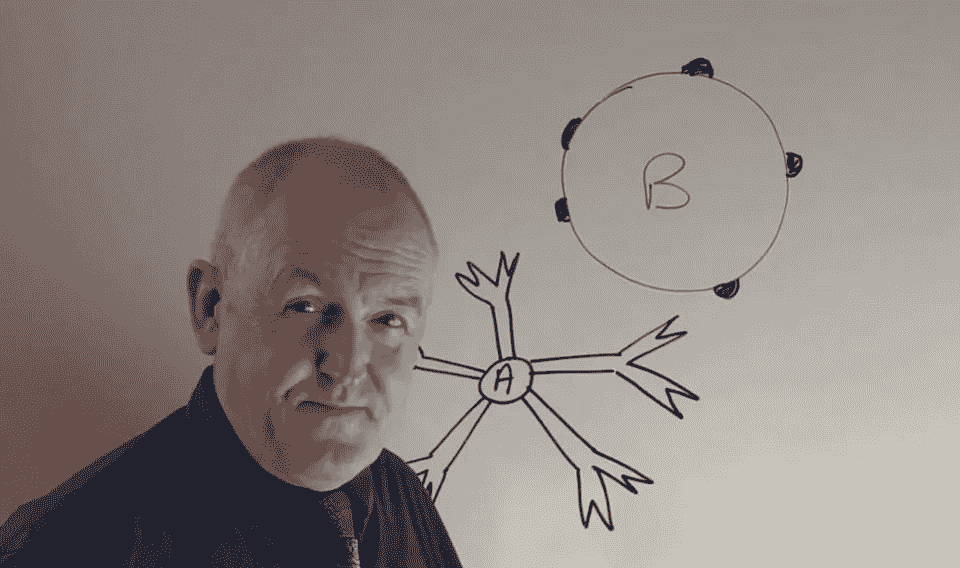

# 伤害疗法(新冠肺炎冠状病毒疫情的故事)

> 原文：<https://medium.datadriveninvestor.com/therapeutics-that-harm-a-covid-19-story-323f0a1813b9?source=collection_archive---------7----------------------->

## 我依赖约翰·坎贝尔博士作为我的新冠肺炎新闻的馆长

## 鉴于我们在遏制和社区传播方面的失败，我们必须为照顾病人做好准备(即使我们使曲线变平)。

Dr. John Campbell publishes YouTube videos to educate the public on the Coronavirus. FORBES UK

我们都在学习疫情的术语(冠状病毒、系统性感染、新冠肺炎、社区传播等)。)，“治疗学”对我来说就是一个。当然，我们都知道生病时使用的治疗方法(从止咳糖到阿司匹林)。这些不能治愈疾病(像疫苗一样)，但可以帮助缓解症状。有时治疗性治疗会使病情恶化(我祖母过去常常在晒伤处涂黄油)。

 [## EndCoronavirus.org

### 我们的团队由 4000 多名志愿者组成，包括科学家、工程师、医生和无数积极的…

www.endcoronavirus.org](https://www.endcoronavirus.org/home) 

> *法国卫生部长 Olivier Véran 是一名合格的医生和神经学家，* [*在周六发推文*](https://twitter.com/olivierveran/status/1238776545398923264) *:“服用消炎药(布洛芬、可的松……)可能是加重感染的一个因素。* [***守护者***](https://www.theguardian.com/world/2020/mar/14/anti-inflammatory-drugs-may-aggravate-coronavirus-infection\)

鉴于我们在遏制和社区传播方面的失败，我们必须为照顾病人做好准备(即使我们使曲线变平)。当然，这意味着我/你/我们，因为没有足够的病床来照顾那些即将生病的人(阅读[时间转移(新冠肺炎·疫情的故事](https://medium.com/age-of-awareness/time-shift-a-covid-19-pandemic-story-9f35e1f22e2e))。本着医学界指导原则第一，不伤害的精神，不要试图退烧。

 [## 大笔资金和尖端技术:人工智能/人工智能投资将如何革新医疗保健…

### 在过去几年人工智能(AI)和机器学习(ML)的显著发展中…

www.datadriveninvestor.com](https://www.datadriveninvestor.com/2018/03/22/big-money-and-cutting-edge-technology-how-investment-in-ai-ml-will-revolutionize-the-healthcare-industry/) 

我是一名医生还是一名学者，可以被信任提供医疗建议吗？否

> 坎贝尔每天发布一到两个大约 30 分钟的视频，记录当天的医学新闻报道，并仅引用主要的、经认可的学术出版物(如《新英格兰医学杂志》)来支持他的观点。 [**英国教育家利用 YouTube 治疗恐慌冠状病毒迷思**](https://www.forbes.com/sites/johnscottlewinski/2020/02/07/uk-doctor-uses-youtube-to-treat-panic-of-coronavirus-myths/#1a6976ec2c51) **英国福布斯**

 [## 英国教育家使用 YouTube 治疗冠状病毒神话的恐慌

### 只有一种可能性比冠状病毒成为世界范围的健康危机更糟糕:神话和…

www.forbes.com](https://www.forbes.com/sites/johnscottlewinski/2020/02/07/uk-doctor-uses-youtube-to-treat-panic-of-coronavirus-myths/#1a6976ec2c51) 

在未来的疫情，我们中的许多人将不得不照顾病人，即使如此，这也是我在照顾病人时将遵循的建议(或者如果新冠肺炎来找我，也是为我自己)。我依赖约翰·坎贝尔博士作为我的新冠肺炎新闻的馆长。

[Dr. John Campbell of UK YouTube star with 500k subscribers](https://www.youtube.com/channel/UCF9IOB2TExg3QIBupFtBDxg)

> *该国(法国)卫生部长奥利维耶·弗兰(Olivier Véran)是一名合格的医生和神经学家，* [*周六在推特上发布*](https://twitter.com/olivierveran/status/1238776545398923264) *:“服用消炎药(布洛芬、可的松……)可能是加重感染的一个因素。* [***守护者***](https://www.theguardian.com/world/2020/mar/14/anti-inflammatory-drugs-may-aggravate-coronavirus-infection\)

 [## 法国建议，消炎药可能会加重新冠肺炎

### 法国当局警告说，广泛使用的非处方消炎药可能会恶化冠状病毒…

www.theguardian.com](https://www.theguardian.com/world/2020/mar/14/anti-inflammatory-drugs-may-aggravate-coronavirus-infection) 

我该怎么办？

How we can work together on COVID-19

*   认出谁得了新冠肺炎病。
*   即使我感觉不舒服，我也不会去做测试(除非是免下车测试或在家测试套件)。为什么？机构传播的风险太大了。
*   我只会在症状严重的时候打电话给医生。为什么？10–20%的患者症状严重，通常需要住院治疗([预计死亡率约为患病者的 1%](https://samharris.org/podcasts/191-early-thoughts-pandemic/)，但可能[更高](https://samharris.org/podcasts/190-respond-coronavirus/))。

[**感染的临床特征**](https://www.youtube.com/watch?v=fUir2Q1uxxs&t=1049s)

One of a daily video from my favorite COVID-19 Curator

我已经找到了一个值得信任的关于新冠肺炎的大数据仓库的馆长，这个馆长是约翰·坎贝尔博士。建议你看他的视频，或者找自己信任的大数据策展人。新冠肺炎·疫情在这里。

 [## 约翰·坎贝尔博士

### 大家好，我的名字是约翰·坎贝尔，我是一名退休的护士老师，也是英国的一名急救护士。我也做…

www.youtube.com](https://www.youtube.com/channel/UCF9IOB2TExg3QIBupFtBDxg) 

这是我关于新冠肺炎的第五篇文章。

 [## 实验室制造的？从功能增益研究的角度看 CoV2 谱系

### 在过去的 20 年里，病毒学家已经在实验室里制造了几十种嵌合冠状病毒。

medium.com](https://medium.com/@yurideigin/lab-made-cov2-genealogy-through-the-lens-of-gain-of-function-research-f96dd7413748)  [## 安全港(新冠肺炎·疫情战胜恐惧的故事)

### 随着大数据的出现，我们正在进入一个新的理解领域——可预测性(人工智能机器驱动)和…

medium.com](https://medium.com/datadriveninvestor/safe-haven-a-covid-19-pandemic-story-to-combat-fear-d8e18fcb784d) 

如果你喜欢这篇文章，并想不受任何限制地阅读更多这样的文章，为什么不考虑通过使用下面我的推荐链接成为一个中等会员(如果你还不是一个)？

 [## 通过我的推荐链接加入 Medium-Wayne boat Wright

### 作为一个媒体会员，你的会员费的一部分会给你阅读的作家，你可以完全接触到每一个故事…

wayneboatwright.medium.com](https://wayneboatwright.medium.com/membership) 

我从你的月费中得到一部分，不需要额外的费用，这将对我作为一个作家起到很大的支持作用。