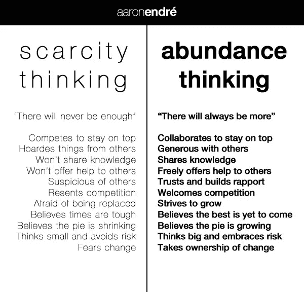

# 成功只有两种方式

> 原文：<https://medium.datadriveninvestor.com/there-are-only-two-ways-to-be-successful-2166080a41e0?source=collection_archive---------17----------------------->

## 不幸的是，大多数人选择了第二种

Photo by [bruce mars](https://unsplash.com/@brucemars?utm_source=medium&utm_medium=referral) on [Unsplash](https://unsplash.com?utm_source=medium&utm_medium=referral)

要取得成功，您可以:

*   尽你所能做到最好
*   通过把别人拉低到你的水平来努力成为最好的

不幸的是，大多数人认为成功是生活中只有少数精英才能获得的稀有职位。

一旦你意识到这个基本事实:

***如果你给别人提供了足够的价值，宇宙就得用成功来奖励你。***

你会意识到没有竞争。如果*你*提供足够的价值，宇宙会奖励*你*。别人在做什么并不重要。

> “人类必须从竞争性的头脑过渡到创造性的头脑；否则，他就无法与无形的智慧和谐相处，无形的智慧在精神上永远是创造性的，永远不会竞争—华莱士·沃特斯，《致富的科学》

如果你相信竞争，你会在开始之前就气馁。这就是稀缺和富足心态的区别。

*   **稀缺心态:关注你没有的东西&你可能会失去的东西**
*   **富足心态:关注可获得的东西**

注意稀缺和富足心态的第一个区别:

稀缺思维包含竞争，丰富思维包含合作。

Photo By: [Aaron Endré](https://aaronendre.files.wordpress.com/2013/04/abundance-thinking-and-scarcity-thinking.jpg)

这两种心态的主要区别之一是快乐和怨恨。

那些试图通过降低别人的水平来获得成功的人不会庆祝别人的成功，他们害怕别人的成功。当他们成功时，他们不是为他们鼓掌，而是在他们失败时松了一口气。这是因为他们认为成功存在于有限的供给中。

 [## 开发人员提高工作效率的三位一体|数据驱动的投资者

### 在这个被大量工作负载轰炸的世界里，每个人都在寻找新的方法来提高工作效率…

www.datadriveninvestor.com](https://www.datadriveninvestor.com/2019/08/29/triad-for-developers-to-increase-productivity/) 

如果你怨恨别人的成功，你可能是好胜心强。虽然竞争往往被视为一种积极的动力，但它往往是一种有害的、自我强加的限制。

当我们有一个成功的愿景时，它通常是如此的具体和个性化，以至于没有人会朝着完全相同的目标努力。

有时候，忽视所有的竞争似乎是愚蠢的。当然，企业有竞争者，企业家必须竞争成为行业中的佼佼者。

你可以承认竞争，但仍然要以富足的心态经营。

即使你在为一个特定的最终目标而竞争，你对成功的个人愿景也是如此明确，没有人能从你那里夺走。所以，即使你的竞争对手抢在你之前到达终点并“赢”了，这并不意味着他们偷了你的东西，因为没有人会去追求你想要的东西。

> 更重要的是，成功不存在于有限的供应中。如果你一次都没有实现，你还有无限的尝试机会。

生活中会有竞争的时刻，但这只是暂时的。提醒自己你所创造的成功的宏伟愿景，你会意识到这与其他人无关。

> 成功人士尝试他们知之甚少的事情，而 T2 相信他们自己会在这个过程中找到答案。不成功的**人**回避他们知之甚少的事情，因为他们不信任自己舒适区之外的自己。不同之处在于相信你自己。—史蒂文·巴特利特

如果你还在考虑竞争，或者你认为成功的供给是有限的，你永远不会相信自己开始。

*想和我保持联系并获得更多写作技巧，请点击这里* *加入我的简讯* [*！*](https://mailchi.mp/387776a3b7da/join-my-newsletter)

**访问专家视图—** [**订阅 DDI 英特尔**](https://datadriveninvestor.com/ddi-intel)